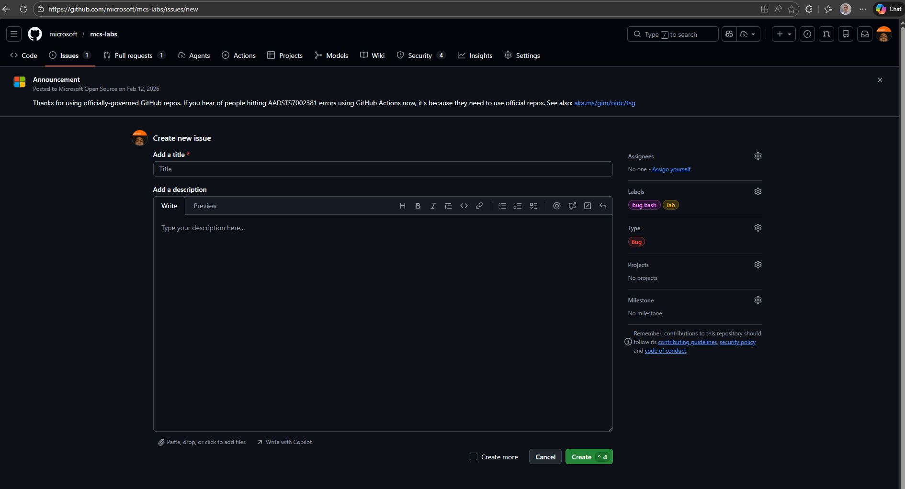

# Bug Bash - MCS Labs

Welcome to the MCS Labs Bug Bash! Your goal is to work through the labs and report any issues you find — broken steps, unclear instructions, missing images, incorrect information, or anything else that doesn't work as expected.

## How to Report a Bug

All bugs should be reported as GitHub Issues on the [microsoft/mcs-labs](https://github.com/microsoft/mcs-labs) repository.

### Step 1: Open a New Issue

Navigate to the **Issues** tab in the repository and click **New issue**, or use this direct link:

> [Create a New Bug Report](https://github.com/microsoft/mcs-labs/issues/new?labels=bug+bash,lab&type=Bug)

### Step 2: Fill in the Issue Details

**Title** — Write a clear, concise title that describes the problem. Include the lab name for easy identification.

Examples:
- `[mcs-multi-agent] Step 12 screenshot does not match current UI`
- `[core-concepts-agent-knowledge-tools] Broken link in Use Case #2`
- `[agent-builder-m365] Missing image after "Create new agent" step`

**Description** — Include as much detail as possible:

- **Lab name** — Which lab were you working on?
- **Use case / step number** — Where exactly did you encounter the issue?
- **What happened** — Describe what went wrong or what was confusing.
- **What you expected** — Describe what you think should have happened.
- **Screenshots** — Attach screenshots if applicable (drag and drop into the description field).
- **Browser / environment** — Note your browser and any relevant environment details if the issue is technical.

### Step 3: Set the Required Labels and Type

Before submitting, make sure the following are set on the right-hand side of the issue form:

| Field | Required Value |
|-------|---------------|
| **Labels** | `bug bash` and `lab` |
| **Type** | `Bug` |

> **Important:** Issues without the `bug bash` and `lab` labels and `Bug` type will not be reviewed by the team during the bug bash.

If you used the [direct link](https://github.com/microsoft/mcs-labs/issues/new?labels=bug+bash,lab&type=Bug) above, these will be pre-filled for you.

### Step 4: Submit

Click the green **Create** button to submit your issue.

## What Makes a Good Bug Report

- **Specific** — Point to the exact lab, use case, and step number.
- **Reproducible** — Include the steps you followed so the team can reproduce the issue.
- **Visual** — Attach screenshots or screen recordings when possible.
- **One issue per report** — File separate issues for separate problems so each can be tracked independently.

## Questions?

If you have questions about the bug bash process or need help filing an issue, reach out to your event facilitator.

Thank you for helping us improve MCS Labs!
