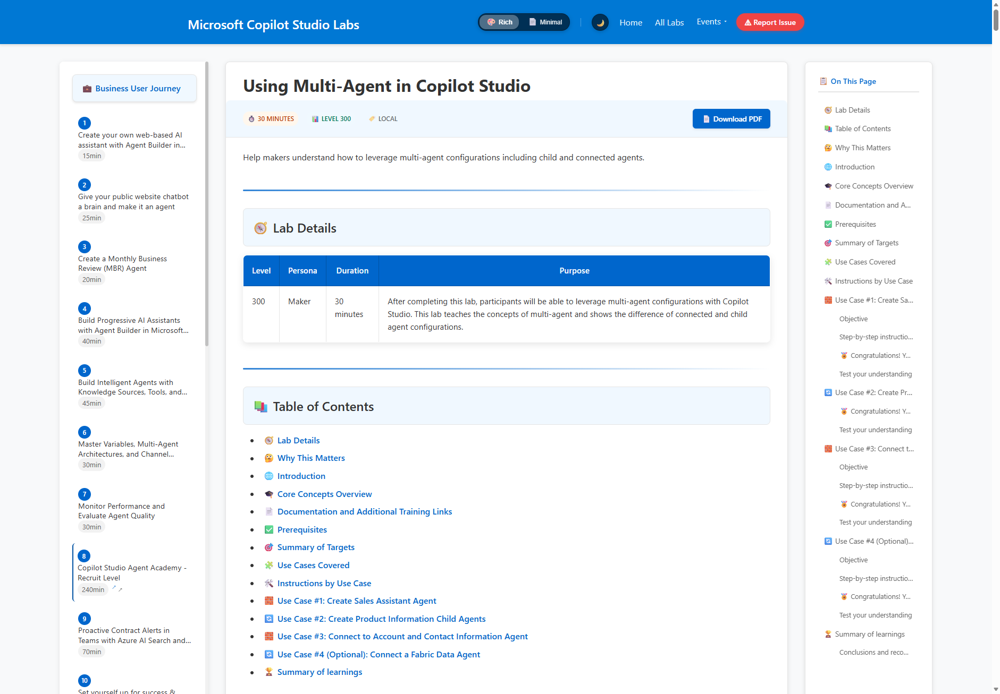

# Bug Bash - MCS Labs

Welcome to the MCS Labs Bug Bash! Your goal is to work through the labs and report any issues you find — broken steps, unclear instructions, missing images, incorrect information, or anything else that doesn't work as expected.

## How to Report a Bug

### Step 1: Navigate to a Lab

Open the [MCS Labs Portal](https://microsoft.github.io/mcs-labs/) and navigate to the lab you are testing. Each lab page has a red **Report Issue** button in the top navigation bar.

### Step 2: Click the Report Issue Button

While you are on the lab page where you found the issue, click the **Report Issue** button in the navigation bar.

This will open a new GitHub Issue with the **lab name** and a **bug report template** automatically pre-filled for you — including the title format and description fields.

### Step 3: Complete the Issue

The issue title will be pre-filled with the lab name in brackets (e.g., `[mcs-multi-agent]`). Type a short description of the issue after the lab name.

**Title examples:**
- `[mcs-multi-agent] Step 12 screenshot does not match current UI`
- `[core-concepts-agent-knowledge-tools] Broken link in Use Case #2`
- `[agent-builder-m365] Missing image after "Create new agent" step`

The description will be pre-filled with a template. Fill in each field:

- **Use case / step number** — Where exactly did you encounter the issue?
- **What happened** — Describe what went wrong or what was confusing.
- **What I expected** — Describe what you think should have happened.
- **Screenshots** — Attach screenshots if applicable (drag and drop into the description field).
- **Browser / environment** — Note your browser and any relevant environment details if the issue is technical.

### Step 4: Add the "bug bash" Label

The Report Issue button pre-fills the `lab` label and `Bug` type for you. For the bug bash event, you must also add the **`bug bash`** label manually:

1. On the right-hand side of the issue form, find **Labels**
2. Click the gear icon next to Labels
3. Search for and select **`bug bash`**

Your issue should have the following set:

| Field | Required Value |
|-------|---------------|
| **Labels** | `bug bash` and `lab` |
| **Type** | `Bug` |

> **Important:** Issues without both the `bug bash` and `lab` labels and `Bug` type will not be reviewed by the team during the bug bash.

### Step 5: Submit

Click the green **Create** button to submit your issue.

## What Makes a Good Bug Report

- **Specific** — Point to the exact lab, use case, and step number.
- **Reproducible** — Include the steps you followed so the team can reproduce the issue.
- **Visual** — Attach screenshots or screen recordings when possible.
- **One issue per report** — File separate issues for separate problems so each can be tracked independently.

## Questions?

If you have questions about the bug bash process or need help filing an issue, reach out to your event facilitator.

Thank you for helping us improve MCS Labs!
