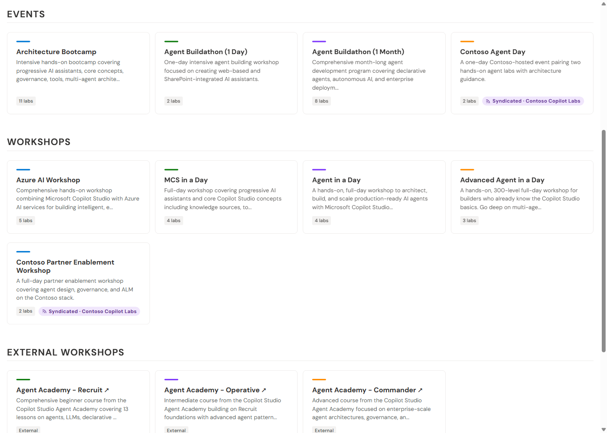
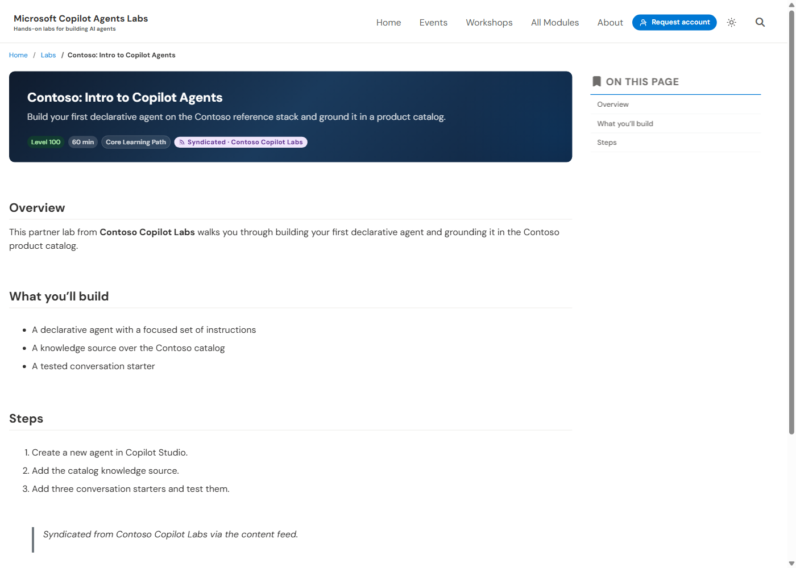

# Consuming feeds (syndicating others' content)

How to make this portal **ingest** content from another mcs-labs-style feed and
render it as native pages — and how an external (non-Jekyll) system can consume
the feed too. To publish your own feed see [PUBLISHING_FEEDS.md](PUBLISHING_FEEDS.md);
for the wire format see [feed/FEED_FORMAT.md](feed/FEED_FORMAT.md).

- **Consumer script:** [`scripts/consume-feed.js`](../scripts/consume-feed.js)
- **Consumer config:** [`_data/feed_subscriptions.yml`](../_data/feed_subscriptions.yml)
- **Runnable demo:** [`examples/feed-syndication/`](../examples/feed-syndication/) —
  two containers, this portal pulling a partner feed over HTTP. The screenshots
  below come from it.

## The model in one paragraph

This portal can render its pages **from a feed** instead of straight from its
collection folders. The feed it renders from is the **merge** of its own content
plus any external feeds it subscribes to. Your own content always wins on a
conflict, external content is filtered by your rules, and the committed
`_<collection>/*.md` files are never touched. With no subscriptions configured the
result is byte-for-byte identical to a normal build.

## Quick start — subscribe to a partner

Edit [`_data/feed_subscriptions.yml`](../_data/feed_subscriptions.yml):

```yaml
subscriptions:
  - name: self            # THIS portal's own content (no HTTP). Keep this.
    self: true
    enabled: true

  - name: contoso         # an external instance
    label: "Contoso Copilot Labs"     # display name for the "Syndicated" pill
    url: https://contoso.github.io/copilot-labs/feed   # dir containing index.json
    feed: all             # which named feed to pull (default: all)
    enabled: true
    exclude:              # optional local filter (see FILTERING.md)
      collections: [modules]
      slugs: [some-slug]
```

Then build the feed-sourced site:

```bash
node scripts/build-feed.js   --out .feed-build/published
node scripts/consume-feed.js --out .feed-build --feed-dir .feed-build/published
bundle exec jekyll build --config _config.yml,_config.feed.yml   # collections_dir: .feed-build
```

| Subscription key | Meaning |
| --- | --- |
| `name` | Local identifier (also the collision/merge tag). |
| `label` | Friendly name shown on the **Syndicated** pill. Defaults to `name`. |
| `self: true` | Consume this portal's **own** produced feed (read from disk, no HTTP). |
| `url` | Base feed URL of an external instance — the directory that contains `index.json`. |
| `feed` | Which named feed to pull from that instance. Default `all`. |
| `enabled` | Set `false` to keep the entry but skip it. Default `true`. |
| `exclude` | Subtractive local filter: `{ slugs: [...], collections: [...] }`. |

## What it looks like in the portal

Once a feed is consumed, its items are **first-class pages** — same theme, same
layouts, same navigation as your own content. The only difference is a
**"Syndicated" pill** that marks where each item came from (added so visitors and
maintainers can tell at a glance; see [`_includes/syndicated-pill.html`](../_includes/syndicated-pill.html)).

**Merged into the home page.** The partner's event and workshop appear in the
normal grids alongside the portal's own, each tagged with its source:



**A syndicated page renders natively.** A partner lab gets the full lab layout —
hero, "On this page", breadcrumbs — plus the Syndicated pill. Note the **"Report
an issue" action is intentionally hidden** on syndicated content, because the
issue belongs to the source repo, not this one:



The pill shows up everywhere a syndicated item appears: home-page cards and the
hero counts (which now include syndicated items), lab/event/workshop/module page
heroes.

## Refreshing when the source changes

A consumed feed is a **snapshot taken at build time**, not a live mirror. The
partner's edits do **not** appear on your site until *you* rebuild and consume
again. There are three ways that happens:

1. **On your next deploy (default).** Every run of the deploy workflow re-runs
   `build-feed` → `consume-feed` → Jekyll, so any of your own commits also pulls
   the partner's latest. No extra action needed.
2. **On a schedule (recommended if you syndicate actively).** Add a `schedule:`
   (cron) trigger to the deploy workflow so the site rebuilds — and re-pulls every
   subscription — even on days you don't commit. Without this, a quiet consumer can
   lag the source by however long it's been since its last deploy.
3. **On demand.** Re-run the deploy workflow manually (`workflow_dispatch`) when
   you know a partner just shipped something you want immediately.

> **Stale-item note.** `consume-feed.js` writes the current items but does not by
> itself delete a page for an item the source later **removed**; a fresh build dir
> does. CI always starts from a clean checkout, so deployed sites self-heal. For
> repeated *local* runs, delete `.feed-build/` between runs (the demo's
> entrypoint does this for you).

### Incremental refresh for external (non-Jekyll) consumers

If you're writing your own consumer in another stack, don't re-download everything
each time — use the manifest + `content_hash`:

1. `GET …/feed/index.json` → find the feed and its `manifest_url`.
2. `GET …/feed/<name>/manifest.json` → the light list, each entry carrying
   `content_hash` + `content_url`.
3. For each item, compare `content_hash` to what you stored last time.
4. `GET content_url` **only** for items whose hash changed (or are new). Delete
   locally any item that vanished from the manifest.

`content_hash` is stable across builds (it hashes only the markdown body, never the
`generated` timestamp), so an unchanged item always compares equal. Simple
one-shot consumers can instead just `GET …/feed/<name>.json` (the bundle) every
time. Details: [FEED_FORMAT.md](feed/FEED_FORMAT.md#content_hash-semantics).

## Merge & precedence rules

- Subscriptions are evaluated with **`self` first**, so your own item always wins a
  `collection/slug` collision; the external duplicate is dropped (and logged).
- Filters are **subtractive only** — a subscriber can drop items but can never add
  ones the source withheld.
- A failed **external** subscription is logged and skipped; the build continues
  with whatever else succeeded. A failed **own** feed is fatal (it's your content).

Full precedence walkthrough: [FILTERING.md](FILTERING.md).

## Trust before you subscribe

A consumed item becomes a rendered page on your domain. Only subscribe to sources
you trust the way you'd trust a guest author — their markdown renders as-is.
`collection`/`slug` are validated (`^[A-Za-z0-9_-]+$`) so a feed can't escape
`_<collection>/`, but content itself is not sanitized beyond Jekyll's normal
rendering. See [FEED_FORMAT.md → Trust model](feed/FEED_FORMAT.md#trust-model-read-before-consuming-third-party-feeds).

## Failure modes & troubleshooting

| Symptom | Cause / fix |
| --- | --- |
| Partner items don't appear | Subscription `enabled: false`, wrong `url` (must be the dir with `index.json`), or wrong `feed` name. Check the consume log for `subscription "…" failed`. |
| A partner item is missing but others show | It's filtered: producer didn't include it in that feed, or your `exclude` drops it. See [FILTERING.md](FILTERING.md). |
| Your own page shows instead of the partner's | Expected — `self` wins `collection/slug` collisions. Look for a `collision …` warning. |
| Removed partner item still on your site (local) | Stale `.feed-build/`. Delete it and rebuild. |
| Build fails on "own feed could not be read" | `--feed-dir` doesn't point at your produced feed; run `build-feed.js` first. |
| Images 404 on a syndicated page | The source's `base_url` was wrong when it built, so image URLs aren't absolute. That's a producer-side fix on their end. |

## Try the runnable example

[`examples/feed-syndication/`](../examples/feed-syndication/) brings up this portal
plus a second "Contoso" feed container and lets you flip between the full-merge,
producer-filtered, and consumer-filtered scenarios shown above. Start there to see
the whole loop end to end.
