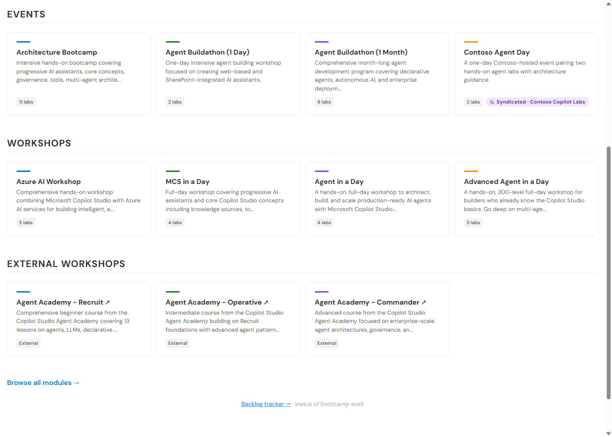
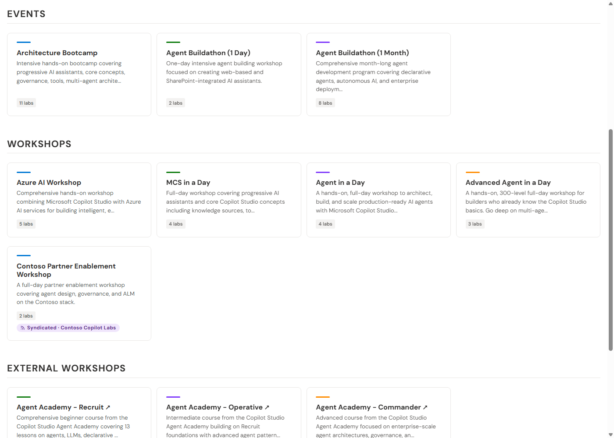

# Filtering feeds

There are **two independent places** you can narrow what flows between portals, and
they answer different questions:

| Layer | Question | Configured in | Who controls it |
| --- | --- | --- | --- |
| **Producer** | "What am I willing to send **out**?" | [`_data/feeds.yml`](../_data/feeds.yml) | The source portal |
| **Consumer** | "What am I willing to take **in**?" | [`_data/feed_subscriptions.yml`](../_data/feed_subscriptions.yml) | The subscribing portal |

The golden rule that ties them together:

> **Filtering is subtractive on both sides.** A producer decides the maximum set a
> feed can ever contain; a consumer can only shrink that set further. **No consumer
> can ever obtain an item the producer withheld.**

## Producer-side filtering — limiting what goes out

In `_data/feeds.yml`, each feed's membership is built from three keys:

```yaml
feeds:
  partners:
    collections: [labs, events]    # bulk include whole collections
    include: [special-module]      # add specific items by slug (any collection)
    exclude: [internal-draft]      # remove specific items by slug
```

Resolution for a given item (see [`itemInFeed`](../scripts/build-feed.js)):

1. If its slug is in `include` → **in** (highest priority).
2. Else if its collection is in `collections` **and** its slug is not in
   `exclude` → **in**.
3. Otherwise → **out**.

Whatever lands "out" is simply **not written** to that feed's manifest, bundle, or
per-item docs. A consumer literally cannot request it — there is no URL for it.

You can also publish several feeds at different breadths from the same content — a
public `all` feed and a narrower `partners` feed, for instance — and hand each
audience a different feed name.

## Consumer-side filtering — limiting what comes in

In `_data/feed_subscriptions.yml`, each subscription may carry an `exclude`:

```yaml
  - name: contoso
    url: https://contoso.example/feed
    feed: all
    exclude:
      collections: [modules]              # drop ALL items in these collections
      slugs: [contoso-agent-governance]   # drop these specific items
```

Resolution per item (see [`itemPassesFilter`](../scripts/consume-feed.js)):

- Drop if its slug is in `exclude.slugs`.
- Drop if its collection is in `exclude.collections`.
- Otherwise keep.

There is deliberately **no `include`** on the consumer side: you cannot pull in
something the producer didn't publish. If you want *only* a subset, ask the producer
for a narrower named `feed`, or subscribe and `exclude` the rest.

## Merge precedence (when sources overlap)

After each subscription is filtered, the surviving items are merged into one set
keyed by `collection/slug` (see [`mergeItems`](../scripts/consume-feed.js)):

1. **`self` is evaluated first**, so your own item always wins a collision; the
   external duplicate is dropped and a `collision …` warning is logged.
2. Among external sources, the first one listed wins a collision.
3. External items that survive are stamped with provenance (`syndicated: true`,
   `source`) so the portal can show the **Syndicated** pill.

## Seeing it work

These three states come from the same two containers in
[`examples/feed-syndication/`](../examples/feed-syndication/) — only the filtering
config changes. Watch the **Contoso** cards in the Events and Workshops rows.

**1 — No filtering (full merge).** The partner's `all` feed; everything it
publishes is rendered. Contoso appears in **both** Events and Workshops:


**2 — Producer-side filtering.** The portal subscribes to the partner's narrower
`labs-events` feed. The partner's workshop (and module) were **never put in that
feed**, so they're unreachable. Contoso is in Events but **gone from Workshops**:



**3 — Consumer-side filtering.** The portal subscribes to the partner's full `all`
feed but sets `exclude: { collections: [events, modules] }`. The workshop the
partner offered is **kept**; the event is dropped **by the subscriber's choice**:



Compare 2 and 3: the Workshops row differs depending on **which** side filtered,
even though both are "narrowing." That's the whole point of having two layers —
the producer sets the outer boundary, the consumer tailors within it.

## Quick reference

| You want to… | Do this |
| --- | --- |
| Never share an item with anyone | `exclude` it in `_data/feeds.yml` (or don't put its collection in any feed). |
| Share a curated subset with partners | A named feed with `collections: []` + `include: [...]`. |
| Pull a partner feed but skip a collection | `exclude.collections` on the subscription. |
| Pull a partner feed but skip a few items | `exclude.slugs` on the subscription. |
| Pull only a slice a partner offers | Ask them for a narrower named `feed`; set `feed:` accordingly. |
| Guarantee your version wins a name clash | Nothing — `self` always wins. |
