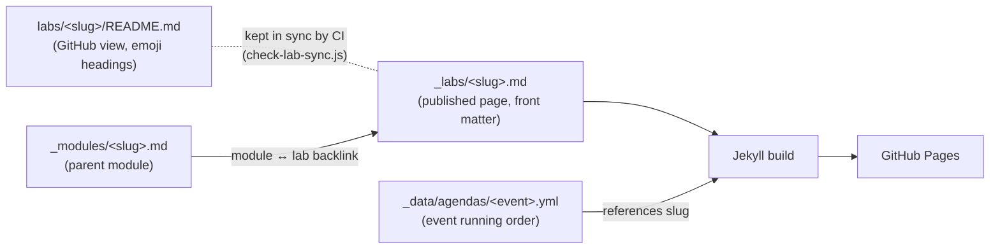

# New Lab Checklist

Quick reference for adding a new lab to the MCS Labs repository.

## ✅ Quick Checklist

A lab is **two markdown files plus images**. There is no generation script — both files are written and committed by hand, and CI fails a PR that changes one without the other.

### Step 1: Create the lab folder (GitHub view)

```bash
mkdir -p labs/your-lab-name/images
# write labs/your-lab-name/README.md
```

`labs/*/README.md` is the copy people read on GitHub. House style here uses emoji section headings (`## 🧭 Lab Details`).

### Step 2: Create the published page

Write `_labs/your-lab-name.md` — same content, plus Jekyll front matter, and **plain headings with no emoji**:

```yaml
---
layout: lab
module: agent-skills
title: "Deep Dive: Skills"
order: 295
duration: 30
difficulty: 300
lab_type: local
section: intermediate_labs
journeys: ["developer"]
description: "One-sentence summary used on cards and in search results."
---
```

> Emoji in `_labs/*.md` headings render on the live page and change the anchor ids kramdown generates (`## 🧭 Lab Details` → `#-lab-details` instead of `#lab-details`), which silently breaks the hand-written in-page Table of Contents. Keep them in the README only.

### Step 3: Serve and verify

```bash
bash tools/run.sh
# then open http://localhost:4000/mcs-labs/labs/your-lab-name/
```

Check: the page renders, images resolve, the "Part of: <module>" link works, the lab appears on the All Labs page and in each journey you listed, and every in-page TOC link scrolls somewhere.

---

## 📋 Front Matter Reference

| Property | Required | Description | Example |
|----------|----------|-------------|---------|
| `title` | ✅ | Full lab title | `"Build a Support Agent"` |
| `description` | ✅ | One-sentence summary for cards/SEO | `"Package a procedure as a Skill…"` |
| `difficulty` | ✅ | Numeric level — `100`, `200`, or `300` | `200` |
| `duration` | ✅ | Minutes to complete | `30` |
| `section` | ✅ | Grouping on the All Labs page | `intermediate_labs` |
| `order` | ✅ | Global sort key (`site.labs \| sort: "order"`) | `295` |
| `journeys` | ✅ | Learning paths that surface the lab | `["business-user", "developer"]` |
| `module` | ⚠️ Recommended | Slug of the parent module | `agent-skills` |
| `lab_type` | ⚠️ Optional | `local` or `external` | `local` |
| `layout` | ⚠️ Optional | Defaulted to `lab` by `_config.yml` | `lab` |

**Valid `section` values** (from the label map in `_layouts/lab.html`):

`core_learning_path`, `intermediate_labs`, `advanced_labs`, `specialized_labs`, `optional_labs`, `external_labs`

Anything else falls through and renders the raw string as the section label.

**Valid `journeys` values**: `quick-start`, `business-user`, `developer`, `autonomous-ai`

## 🔢 Order Numbers

`order` is a **single global sort** across all labs — it is not scoped per section. Two numbering schemes currently coexist:

- A compact per-group scheme (`1, 3, 4` … `11, 12, 13` … `21, 22, 23`)
- The legacy three-digit scheme (`105`–`295`, plus one at `800`)
- `999` on six labs, which parks them at the end

There is no clean range table to follow. Pick a number adjacent to the labs you want to sit beside, and check what is already taken:

```bash
grep -H '^order:' _labs/*.md | sort -t: -k3 -n
```

## 🧩 Linking a Lab to its Module

Labs belong to a module in the `_modules` collection. `_layouts/lab.html` resolves `page.module` against module slugs (the `_modules/<slug>.md` filename), so:

1. `module: agent-skills` in the lab front matter requires `_modules/agent-skills.md` to exist
2. The module points back with `lab: "your-lab-name"` in its own front matter

Both directions are needed for the "← Part of: …" header and the module page's lab link to render.

## 🎪 Adding a Lab to an Event

Event running order lives in `_data/agendas/<event_id>.yml`, read by `_layouts/event.html`. Add a `lab` row at the right position in the schedule:

```yaml
schedule:
  - type: lab
    slug: your-lab-name
    label: "Lab 5"
    time: "13:30"
    duration: 45
```

See `_data/agendas/README.md` for the full schema (`day`, `session`, `module`, `lab`, `break` row types) and the per-event conventions.

> **Legacy**: `bootcamp_order`, `azure_ai_workshop_order`, and `mcs_in_a_day_order` still appear in some lab front matter. No template reads them — agenda files replaced them. Don't add new ones.

## 🌐 External Labs (Hosted Elsewhere)

```yaml
---
layout: lab
title: "Copilot Studio Agent Academy - Recruit Level"
order: 160
duration: 240
difficulty: 200
lab_type: external
section: external_labs
external: true
external_url: "https://microsoft.github.io/agent-academy/recruit/"
repository: "microsoft/agent-academy"
journeys: ["quick-start", "business-user"]
description: "Comprehensive 13-lesson curriculum…"
---
```

External labs still need an `_labs/<slug>.md` stub — that file is what puts the card on the site — but no `labs/<slug>/` folder.

## 🔍 Troubleshooting

| Symptom | Cause / Fix |
|---------|-------------|
| Lab doesn't appear on the site at all | You created the README but not `_labs/<slug>.md`. The README alone publishes nothing. |
| CI job "Lab Doc Sync" failed | `labs/<slug>/README.md` and `_labs/<slug>.md` must change in the **same PR** (`scripts/check-lab-sync.js`). |
| Lab is in the wrong position | Check `order` against the sorted list above. |
| Section header shows a raw string like `advanced` | `section` value isn't in the map — use one of the six listed values. |
| No "Part of: …" link in the header | `module:` has no matching `_modules/<slug>.md`. |
| In-page TOC links go nowhere | Heading text changed; the TOC bullets are hand-written. Emoji in headings are the usual culprit. |
| Images 404 on the site but work on GitHub | Reference them from `labs/<slug>/images/` with a path that resolves for both files. |

## 🔄 How It Works



Both markdown files are source. Jekyll reads `_labs/*.md` front matter directly — there is no intermediate config file and no generation step.

> **Legacy note**: `_data/lab-config.yml` is still committed but no layout, include, or script reads it. Adding an entry there does nothing. There is no root `lab-config.yml`.
