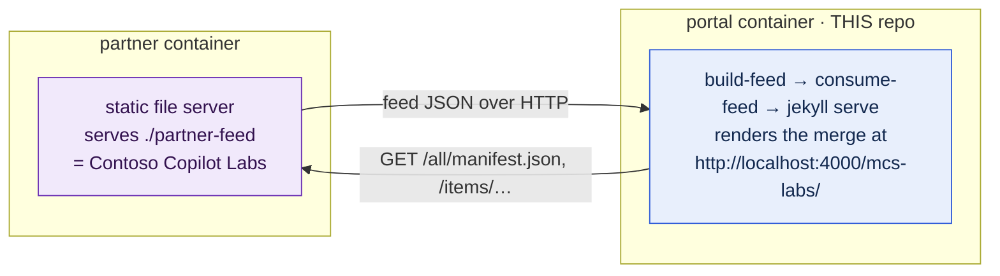

# Feed syndication — runnable two-container demo

This example shows the [content feed](../../docs/CONTENT_FEED.md) working end to
end across **two containers**:



- **`partner`** stands in for a *second* mcs-labs-style portal. It's just a static
  file server publishing a pre-generated feed (labs, events, workshops, modules)
  branded as **Contoso Copilot Labs**.
- **`portal`** is this repository. On startup it produces its own feed, consumes
  **its own + the partner's** over the Docker network, materializes the merged
  content, and serves the rendered site. Syndicated items show a **Syndicated**
  pill.

## Run it

Requires Docker. From this directory:

```bash
# Scenario 1 — full merge (default)
docker compose up --build
```

Wait for `Server running...` in the logs (the first build is 1–3 minutes), then
open **http://localhost:4000/mcs-labs/**. You'll see Contoso labs, an event, a
workshop, and a module merged into the portal, each tagged *Syndicated · Contoso
Copilot Labs*.

Switch scenarios with `SUBSCRIPTIONS_FILE` (recreates the portal container):

```bash
# Scenario 2 — PRODUCER-side filtering (the partner only publishes labs + events)
SUBSCRIPTIONS_FILE=examples/feed-syndication/subscriptions/producer-filtered.yml \
  docker compose up -d --force-recreate portal

# Scenario 3 — CONSUMER-side filtering (we drop the partner's events + modules)
SUBSCRIPTIONS_FILE=examples/feed-syndication/subscriptions/consumer-filtered.yml \
  docker compose up -d --force-recreate portal
```

Tear down with `docker compose down`.

### What each scenario demonstrates

| Scenario | Config | Contoso in **Events** | Contoso in **Workshops** | Why |
| --- | --- | :---: | :---: | --- |
| 1 Full merge | [`full.yml`](subscriptions/full.yml) | ✅ | ✅ | nothing filtered |
| 2 Producer-filtered | [`producer-filtered.yml`](subscriptions/producer-filtered.yml) | ✅ | ❌ | the workshop isn't in the partner's `labs-events` feed |
| 3 Consumer-filtered | [`consumer-filtered.yml`](subscriptions/consumer-filtered.yml) | ❌ | ✅ | we `exclude` the partner's events |

That contrast is the key lesson: **producers** set the outer boundary of what can
be syndicated; **consumers** tailor within it. See
[docs/FILTERING.md](../../docs/FILTERING.md) for the full rules (and the matching
screenshots).

## Files

| Path | Role |
| --- | --- |
| [`docker-compose.yml`](docker-compose.yml) | The two services + a shared network. |
| [`portal.Dockerfile`](portal.Dockerfile) | Ruby/Jekyll + Node 20 image for the portal. |
| [`portal-entrypoint.sh`](portal-entrypoint.sh) | Clean → build-feed → consume-feed → serve. |
| [`build-partner-feed.js`](build-partner-feed.js) | Regenerates `partner-feed/` from the sample items. |
| [`partner-feed/`](partner-feed/) | The static feed the `partner` container serves (committed). |
| [`subscriptions/*.yml`](subscriptions/) | The three demo consumer configs. |

## Notes

- The partner feed is generated by `node build-partner-feed.js`; the committed
  `partner-feed/` is its output. Edit the `SOURCE` array in that script and re-run
  to change the sample content.
- `partner-feed/` uses the exact schema-1.1 wire format from
  [docs/feed/FEED_FORMAT.md](../../docs/feed/FEED_FORMAT.md), so the real
  `scripts/consume-feed.js` ingests it unmodified.
- The portal container bind-mounts the repo, so your local edits to scripts,
  layouts, or content are picked up on the next `--force-recreate`.
- This example mutates nothing in the repo: all build output goes to the
  git-ignored `.feed-build/`, and the partner runs read-only.
