# Copilot Harness — Agent Builder

Build declarative agents in the Copilot harness with Agent Builder — grounding them in web content and in your own SharePoint, without leaving Microsoft 365.

---

## 🧭 Lab Details

| Level | Persona | Duration | Purpose |
| ----- | ------- | -------- | ------- |
| 200 | Business User / Maker | 30 minutes | After completing this lab, participants will be able to build a declarative agent in Agent Builder grounded in public web sources, extend a second agent with SharePoint knowledge, code interpreter and image generation, and describe where the Copilot harness sits against the Standard and GitHub Copilot harnesses. |

---

## 📚 Table of Contents

- [Why This Matters](#-why-this-matters)
- [Introduction](#-introduction)
- [Core Concepts Overview](#-core-concepts-overview)
- [Documentation and Additional Training Links](#-documentation-and-additional-training-links)
- [Prerequisites](#-prerequisites)
- [Summary of Targets](#-summary-of-targets)
- [Use Cases Covered](#-use-cases-covered)
- [Instructions by Use Case](#️-instructions-by-use-case)
  - [Use Case #1: Create a web-based learning assistant](#-use-case-1-create-a-web-based-learning-assistant)
  - [Use Case #2: Build an advanced SharePoint-integrated sales assistant](#-use-case-2-build-an-advanced-sharepoint-integrated-sales-assistant)
  - [Extra Credit: Add and test a SharePoint list as a knowledge source](#-extra-credit-add-and-test-a-sharepoint-list-as-a-knowledge-source)

---

## 🤔 Why This Matters

**This is the harness most of your users will actually meet first.**

Agent Builder lives inside Microsoft 365 Copilot. There is no environment to provision, no solution to manage, and no publishing pipeline — a business user describes what they want in natural language and has a working declarative agent minutes later.

That accessibility is the point and also the boundary. Knowing what the Copilot harness does well, and precisely where it runs out, is what stops a team building the wrong thing in the wrong place.

---

## 🌐 Introduction

The Copilot harness covers declarative agents built and run inside Microsoft 365 Copilot: Agent Builder for makers working in natural language, pro-code declarative agents for developers, and declarative agents authored in Copilot Studio.

This lab takes the maker path. You build two agents — one grounded in public documentation, one grounded in your own SharePoint and extended with code interpreter and image generation — and in doing so cover the harness's full range from simplest to most capable.

---

## 🎓 Core Concepts Overview

| Concept | Why it matters |
| ------- | -------------- |
| **Declarative agent** | Defined by instructions and knowledge rather than authored logic — no topics, no flows. |
| **Agent Builder** | The natural-language authoring surface inside Microsoft 365 Copilot. |
| **Grounding** | Web sources or SharePoint content the agent answers from, with citations. |
| **Code interpreter** | Lets the agent compute over uploaded data instead of describing it. |
| **The harness boundary** | Declarative gets you a long way; process, state and system-of-record actions need the Standard or GitHub Copilot harness. |

---

## 📄 Documentation and Additional Training Links

* [Microsoft 365 Copilot extensibility](https://learn.microsoft.com/microsoft-365-copilot/extensibility/)
* [Declarative agents overview](https://learn.microsoft.com/microsoft-365-copilot/extensibility/overview-declarative-agent)
* [Choose your harness before you build](https://learn.microsoft.com/microsoft-copilot-studio/harnesses-overview)

---

## ✅ Prerequisites

- A Microsoft 365 account with a Microsoft 365 Copilot licence
- Access to Agent Builder in Microsoft 365 Copilot
- Access to the SharePoint Sales folder with the sample files used in Use Case #2
- (Extra Credit) Access to the Sales Opportunities SharePoint list
- Basic understanding of Excel data structures (for Use Case #2)

---

## 🎯 Summary of Targets

In this lab you'll build declarative agents in the Copilot harness from the simplest case to the most capable. By the end you will be able to:

- Create a web-grounded agent in Agent Builder using natural language alone
- Ground an agent in SharePoint files, then verify cited answers from each source
- Explain how **Auto** balances speed and depth and, as an optional extension, compare a more complex reasoning trace and configure the agent's default response mode
- (Extra Credit) Add a SharePoint list and combine historical sales, current opportunities, and policy guidance in a multi-source response
- Use code interpreter and image generation to turn source data into analysis, workbooks, charts, and visuals
- State where the Copilot harness stops and another harness has to take over

---

## 🧩 Use Cases Covered

| Step | Use Case | Value added | Effort |
| ---- | -------- | ----------- | ------ |
| 1 | [Create a web-based learning assistant](#-use-case-1-create-a-web-based-learning-assistant) | Build foundational skills by creating an instructional agent grounded in trusted documentation | 15 min |
| 2 | [Build an advanced SharePoint-integrated sales assistant](#-use-case-2-build-an-advanced-sharepoint-integrated-sales-assistant) | Master advanced features including SharePoint integration, code interpretation, and image generation for business intelligence | 15 min |
| EC | [Add and test a SharePoint list as a knowledge source](#-extra-credit-add-and-test-a-sharepoint-list-as-a-knowledge-source) | Ground the agent in structured list data and test direct, cross-source, and three-source reasoning | 10 min |

---

## 🛠️ Instructions by Use Case

---


## 🤖 Use Case #1: Create a web-based learning assistant

Build your first Copilot agent that helps users learn about Microsoft Copilot capabilities, grounded in official documentation.

| Use case                              | Value added                                                                                    | Estimated effort |
| ------------------------------------- | ---------------------------------------------------------------------------------------------- | ---------------- |
| Create a web-based learning assistant | Build foundational skills by creating an instructional agent grounded in trusted documentation | 15 minutes       |

**Summary of tasks**

In this section, you'll test basic Copilot functionality, then create a teacher-style agent that explains Copilot concepts using grounded knowledge sources. You'll learn to configure agent behavior, tone, and knowledge sources.

**Scenario:** Your organization is rolling out Microsoft Copilot and needs a learning resource. Build a teacher-style agent that can answer questions about Copilot capabilities, clarify key distinctions (like Microsoft 365 Copilot vs. Copilot Chat, or Declarative vs. Custom Engine agents), and guide users with accurate, contextual responses grounded in Microsoft documentation.

### Objective

Create, configure, and test a web-based Copilot agent that serves as a knowledgeable guide for learning about Microsoft Copilot.

---

### Step-by-step instructions

#### Navigate to Microsoft 365 Copilot

1. Navigate to [Microsoft 365 Copilot home page](https://m365.cloud.microsoft/chat/?auth=2&home=1)

<!--

> [!IMPORTANT]
> - If the Microsoft 365 Copilot URL is `https://copilot.cloud.microsoft/` or if the Copilot pane is on the right-hand side, this means you're on the **wrong** page.
>
>   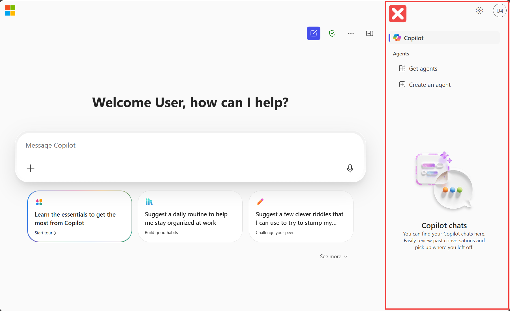
>
> - To fix this, **close** the tab, then **go back to the SharePoint** page. Select the app launcher, and choose **Microsoft 365 Copilot** from there.
>
>   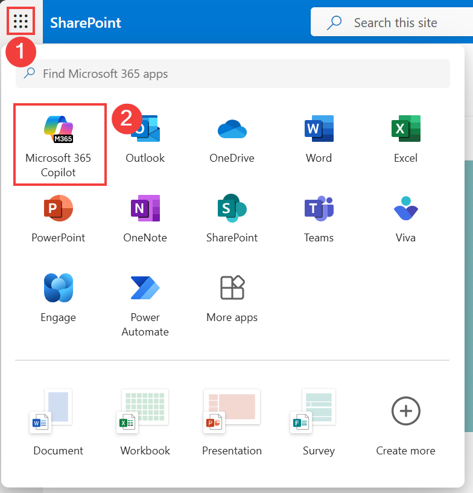
>
> - The Copilot pane should be on the left-hand side of the page, and the URL should be `https://m365.cloud.microsoft/`. If you see this, you're on the right page:
>
>   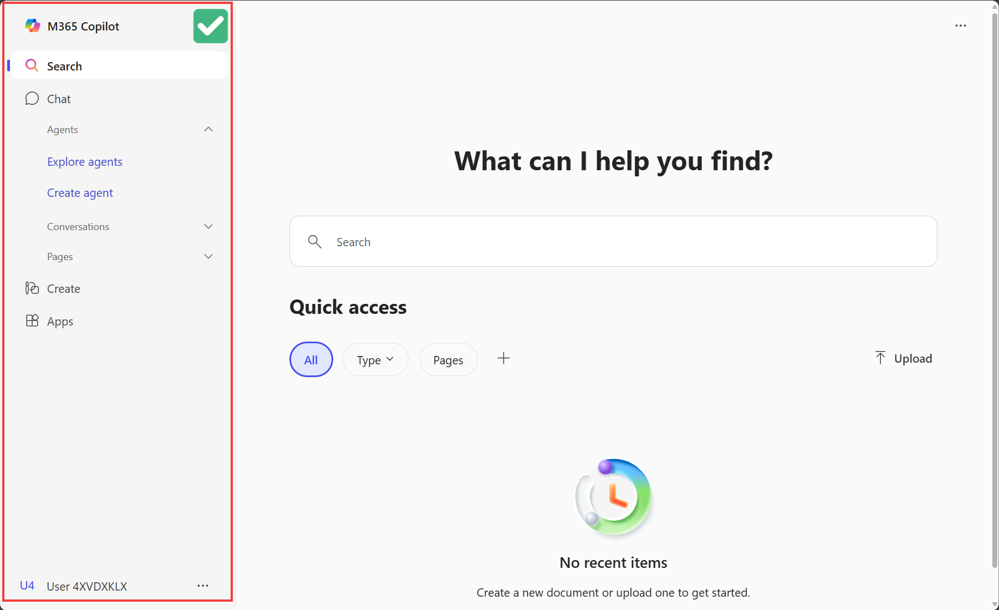
>
> - Make sure the **logged in user** is the fictitious one used in the lab. If you need your normal work user account, **select** the name and toggle to the fictitious user account.
>
>   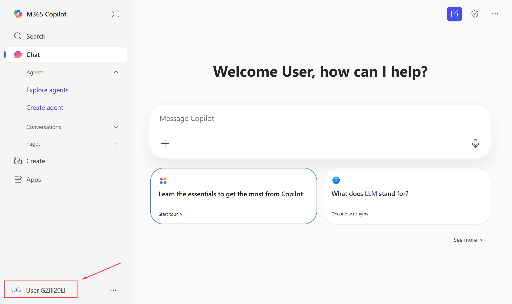

 -->

> [!TIP]  
> Both Microsoft 365 Copilot and Copilot Chat are designed for internal, employee-facing (B2E) experiences.
>
> - Users who have **only Copilot Chat** will **not see any toggle** in the interface – this is expected.
> - Users who have **both** Microsoft 365 Copilot and Copilot Chat will see a **toggle** that lets them switch between the **Work** (Microsoft 365 Copilot) and **Web** (Copilot Chat) experiences.
>
> 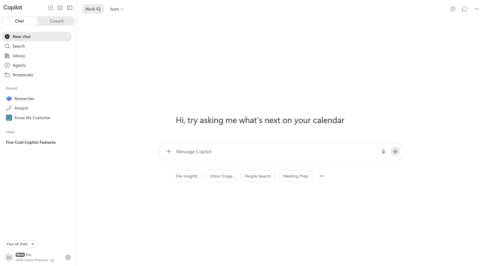
>
> **Microsoft 365 Copilot** is a per-user license with premium features:
>
> - Advanced agents like the research and analysts Frontier ones, grounded on enterprise data and using the latest reasoning models
> - Knowledge sources (e.g., your enterprise data from Outlook, Teams, SharePoint, or Copilot connectors)
>
> **Copilot Chat** is the enterprise version of ChatGPT included with many Microsoft 365 licenses at no extra cost. It uses the same underlying models and can access web data to generate answers.
>
> - Copilot Chat can leverage premium capabilities like organization-tenant grounding for answers when tied to a pay-as-you-go Azure subscription.
>
> Two types of agents can appear in Microsoft 365 Copilot or Copilot Chat:
>
> - **Declarative agents**: These rely on Copilot’s built-in orchestration, search, and reasoning. They define their behavior through instructions, pre-defined prompts, knowledge sources, and actions. Ideal for scoped knowledge retrieval or task-specific use cases.
> - **Custom engine agents**: These do **not** use Copilot as their core engine. They include their own orchestration, knowledge, and skills, and may run on a different platform than Microsoft Copilot. Ideal for advanced or complex scenarios.

#### Test the Microsoft 365 Copilot experience

1. Select **New chat** in the left navigation pane if not already selected.

> [!IMPORTANT]
> **Optional:** If you have an account in the CopilotStudioTraining tenant with a Microsoft 365 Copilot license, try the following steps to experience the Work tab firsthand.

   - 2a. Make sure you are on the **Work** tab.

   - 2b. Type the following prompt and select **Send**:
   
     ```text
     Tell me about labs that my organization has available to learn about Copilot Studio
     ```
   
   - 2c. Observe the results:
      - The response is **grounded in SharePoint** content from your organization
      - Citations reference documents in the organization's SharePoint site.
      - This demonstrates how the **Work** tab provides an intelligent experience that automatically searches your organization's SharePoint data

#### Test the Copilot Chat experience

1. If you have Microsoft 365 Copilot license, make sure you are in the **Web** tab (if you don't see any tab for Work/Web, this means you only have access to Copilot Chat).

2. Test the basic experience by typing the following into the Message Copilot input area and then selecting send:

```
What are new features in the Microsoft Copilot Studio roadmap?
```

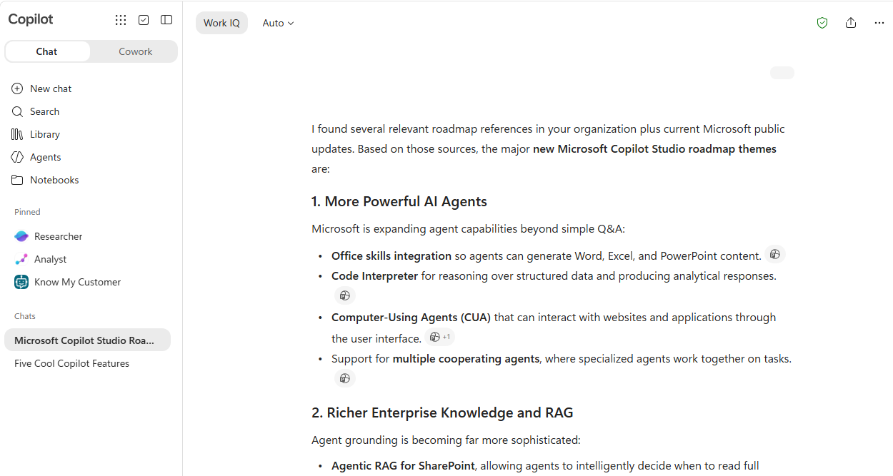

3. Select **Start a new chat** (top right icon) to reset. Notice how your history of converations is saved on the left side navigation pane.

#### Create your learning assistant agent

1. On the left side navigation pane, select **Agents** to open the **Agent Store**, then select **Create agent** (or the **New agent** card)

2. Notice that you can explore existing available templates. But for this lab, paste the following prompt into the **Message Agent Builder** input area on the initial screen, and then select Send. (The **Describe**, **Configure**, and **Preview** tabs appear once the conversation begins.)

```
I want to build a teacher-style agent that helps users learn about Copilot, including the differences between Microsoft 365 Copilot and Copilot Chat, Declarative Agents vs. Custom Engine Agents, and how to use Agent Builder in Microsoft 365. The agent should ask questions to validate and reinforce user understanding, encourage exploration, and act as a knowledgeable guide grounded in Microsoft documentation.
```

> [!TIP]  
> From here, you will find that the conversational creation experience might differ from the below step-by-step instructions, as it's using generative AI and it is by nature non-deterministic. The core concepts remain the same, but the UI may change slightly. Just adjust to the questions and options presented to you.

3. _If_ the proposed agent has a name other than Copilot Teacher input the following prompt to adjust the name and other details and press send:

```
The name of the agent should be Copilot Teacher. Your tone should be friendly, personal, and emphatic. You can make jokes, use subtle irony and emojis when appropriate.
```

4. _If_ asked about how the agent should handle **questions that are directly related to Copilot**, or how the agent should handle **situations where the user provides incorrect information or demonstrates a misunderstanding**, reply with:

```
It shouldn't answer questions that are not related to Microsoft 365 Copilot, Copilot Chat, or Copilot Studio. Always guide users towards the correct solution based on your knowledge.
```

5. Agent Builder will attempt to identify knowledge sources but may attempt to use too specific of a URL for Learn. Input the following prompt to provide specific URLs:

```
Use https://learn.microsoft.com/en-us/microsoft-365-copilot/ and https://learn.microsoft.com/en-us/microsoft-copilot-studio/ as knowledge sources
```

> [!TIP]  
> You can set URLs with up to 2 levels of depth for grounding. E.g., https://www.domain.com/level1/level2. Just like folders in a file system. That way, all pages under that URL will be used as grounding sources. E.g., https://www.domain.com/level1/level2/page1.html, https://www.domain.com/level1/level2/page2.html, etc.

#### Finalize configuration

1. Now let's head over to the **Configure** tab. Notice how all of your previous interactions have built the configuration of your agent, its name, description, instructions, knowledge sources and starter prompts. Feel free to tweak them!

2. In the **Knowledge** section, after adding knowledge sources, turn **Only use specified sources** **on** (it is not enabled automatically) so that the agent uses the configured websites when providing answers, and not its own large language model knowledge.

3. Fix any issue like max character limit for starter prompt titles.

4. You can test your agent in the test pane. When ready, select **Create** in the upper right corner to finish creating your agent.

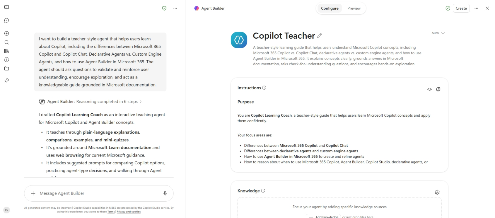

#### Share and test your agent

1. You can use the generated link to share your agents with other users.

2. Select **Start chat** to open and test your agent.

3. Try your agent by selecting one of the prompts or by pasting the following prompt and selecting Send:

```
What are the differences between Microsoft 365 Copilot and Copilot Chat?
```

<!--

> [!TIP]
> If your training tenant is getting throttled because of lack of AI capacity (to prioritize production workloads), you may see a message like this: `Sorry, I wasn't able to respond to that. Is there something else I can help with?`. It's OK, **just test your agent while configuring it**, and not after you created it. You may try again later.
>
> 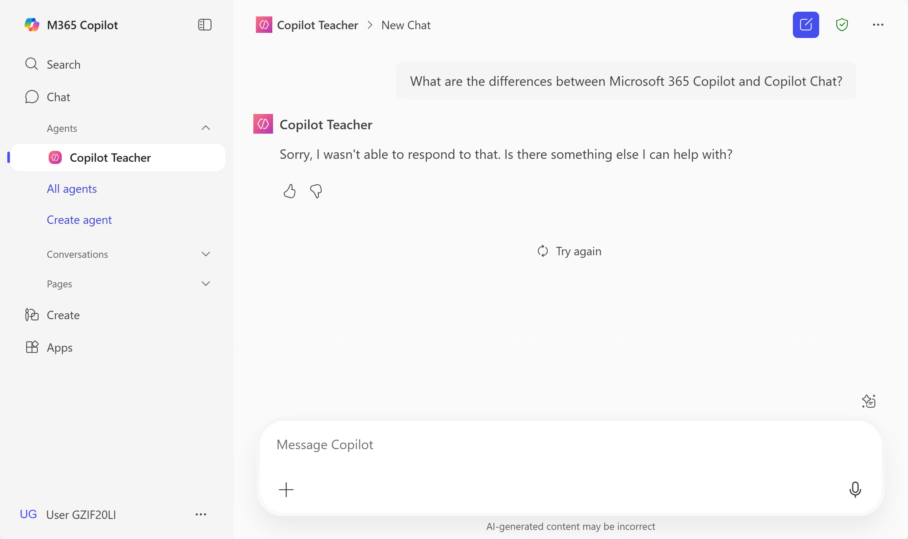

 -->

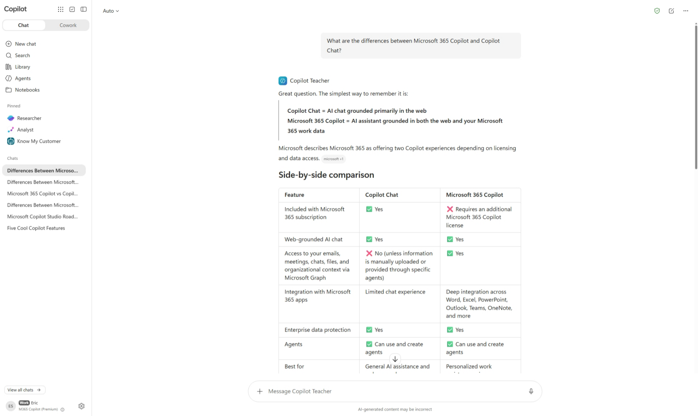

> [!IMPORTANT]  
> If you need to update a declarative agent, select `...` next to the agent name and select **Edit**, or go to **New agent** then select **Agent Builder** in the breadcrumbs and then Copilot Teacher from the list of your agents.

---

### 🏅 Congratulations! You've created your first web-based Copilot agent!

---

### Test your understanding

**Key takeaways:**

- **Natural-language authoring** – Agent Builder turns a described business outcome into a declarative agent without requiring code or a provisioned environment.
- **Copilot experiences provide different grounding** – Microsoft 365 Copilot can use permitted work data and apps, while Copilot Chat provides a chat-first experience whose available grounding depends on licensing and configured sources.
- **Instructions and knowledge have different roles** – Instructions shape the agent's purpose, tone, scope, and behavior; knowledge sources provide the evidence used to answer.
- **Grounding still requires validation** – Trusted sources and visible citations make answers easier to verify, but makers remain responsible for testing accuracy and scope.
- **Conversational creation is non-deterministic** – Agent Builder may draft or refine the agent differently between runs, even when the same intent is supplied.

**Lessons learned & troubleshooting tips:**

- State the agent's purpose, intended audience, boundaries, and expected behavior explicitly in its instructions.
- Use trusted, accessible knowledge sources and verify that test responses cite the expected source.
- If responses are too generic, confirm the intended sources are configured and that **Only use specified sources** is enabled when the scenario requires source-only grounding.
- Create starter prompts that exercise the agent's most important behaviors rather than merely describing them.
- Test both in-scope and out-of-scope questions, then refine the instructions when the agent is too broad or too restrictive.
- Use **Start a new chat** between test scenarios so prior conversation context does not affect the result.

**Challenge: Apply this to your own use case**

- Define one audience and business outcome for a declarative agent.
- Identify the instructions that should control its behavior and the sources that should ground its answers.
- Write one starter prompt, one grounding test, and one out-of-scope test you would use before sharing it.

---

---


## 📊 Use Case #2: Build an advanced SharePoint-integrated sales assistant

Take your skills to the next level by creating an agent that integrates SharePoint data and uses advanced AI capabilities like code interpretation and image generation.

| Use case                                                | Value added                                                                                                                    | Estimated effort |
| ------------------------------------------------------- | ------------------------------------------------------------------------------------------------------------------------------ | ---------------- |
| Build an advanced SharePoint-integrated sales assistant | Master advanced features including SharePoint integration, code interpretation, and image generation for business intelligence | 15 minutes       |

**Summary of tasks**

In this section, you'll prepare SharePoint data sources, create a Sales Revenue Analyst with advanced capabilities, and test code interpretation for data analysis and image generation for visual content.

**Scenario:** Your sales operations team needs an intelligent assistant that can analyze sales data from SharePoint Excel files, answer questions about sales policies, generate dynamic charts and visualizations, and create professional visual content for presentations—all through natural language requests.

### Objective

Build a sophisticated Sales Revenue Analyst that integrates organizational data and advanced AI capabilities to transform sales operations.

---

### Step-by-step instructions

#### Access and prepare SharePoint documents

1. Navigate to the SharePoint site used for this lab
   - Go to the **Documents** tab
   - Open the **Sales** folder

**SharePoint Sales folder:**

```
https://copilotstudiotraining.sharepoint.com/Shared%20Documents/Forms/AllItems.aspx?id=%2FShared%20Documents%2FSales&viewid=80e5d223%2Dbb2c%2D4c6a%2D8f86%2D6854957a257d
```

> [!NOTE]
> If your training uses a different tenant, use the Sales folder URL provided in [Lab Resources](https://copilotstudiotraining.sharepoint.com/sites/Workshop/SitePages/Lab-Assets.aspx).

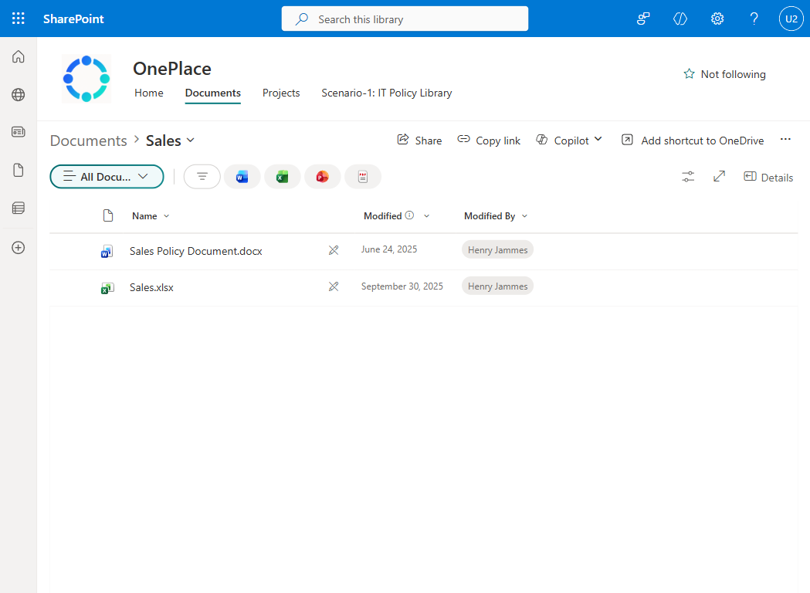

2. Locate the following sample files:

   - **Sales Excel file**: A spreadsheet containing sales data with columns for dates, product lines, regions, units sold, revenue, and quarters
   - **Sales policy document**: A Word document containing sales policies, procedures, and guidelines

3. Open the **Excel file** and review the data structure:

   - Ensure it contains sales data across multiple quarters/years
   - Verify product line categorization
   - Note the column headers and data format
   - On the list of files in Documents, with the file Selected, Select Copy link in the toolboar, save the link in notepad for use later in the lab

4. Open the **Word policy document** and review:
   - Sales procedures and guidelines
   - Policy information that might inform sales decisions
   - Any specific requirements or compliance information
   - On the list of files in Documents, with the file Selected, Select Copy link in the toolboar, save the link in notepad for use later in the lab

#### Create the Sales Revenue Analyst agent

1. Return to [Microsoft 365 Copilot Chat](https://m365.cloud.microsoft/chat/?auth=2&home=1).

2. On the left side pane, select **Agents** to open the **Agent Store**, then select **Create agent** (or the **New agent** card).

3. Paste the following prompt into the **Message Agent Builder** input area and select Send (the **Describe** tab appears after your first message):

```
You are a Sales Revenue Analyst. Your job is to help sales managers track revenue and identify trends across product lines. You understand product hierarchies, time periods (e.g. quarters, fiscal years), and sales metrics. Users can ask questions like 'Graph the sales for the last 2 years with a breakdown per product line and quarter'. You always respond in a friendly and professional tone, aiming to be helpful and insightful.
```

4. **Confirm** the suggested agent name if prompted.

#### Configure knowledge sources

1. Select the **Configure** tab.

2. Scroll down to the **Knowledge** section:
    - Under **Knowledge**, Paste the Sales.xlsx URL that you copied earlier in the lab and then select Enter to add the file as knowledge to your agent
    - Repeat that for the Sales Policy Document.docx
    - You will see them being added as SharePoint documents in the knowledge section of the agent

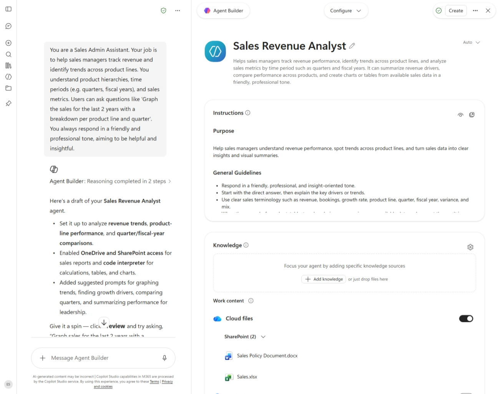


#### Configure advanced knowledge settings

1. In the upper-right corner of the **Knowledge** section, select the **Settings** (gear) icon.

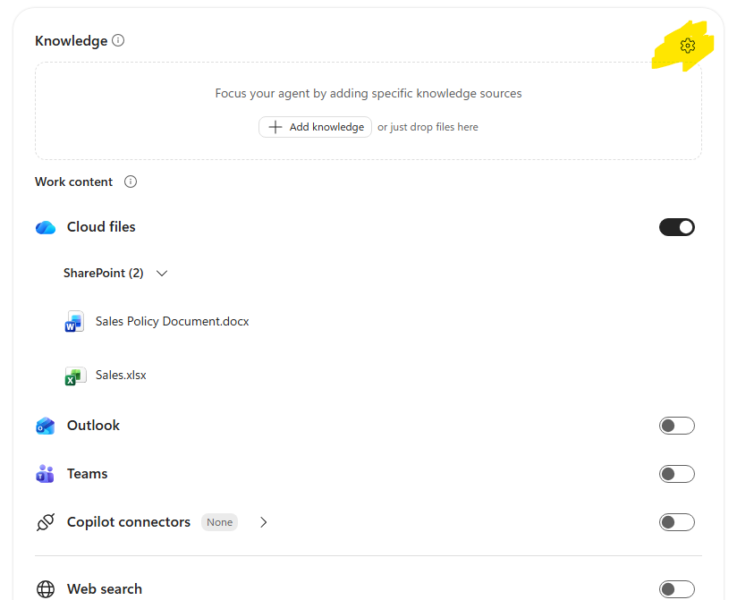

> [!IMPORTANT]
> In the current Agent Builder experience, most advanced capabilities are configured from this **Knowledge settings** panel. If your tenant still shows a separate **Capabilities** section, enable the same options there.

2. In **Knowledge settings**, review and configure the capabilities for your agent:
    - Turn on **Create documents, charts and code** so the agent can analyze data, create charts, perform calculations, generate code snippets, and create Word, Excel, or PowerPoint files.
    - Turn on **Create images** so the agent can generate visual content from user prompts.
    - Optionally, turn on **Discourage model knowledge** when you want the agent to prioritize its configured knowledge sources instead of relying on general model knowledge. This can help keep responses grounded in the sources available to the agent.

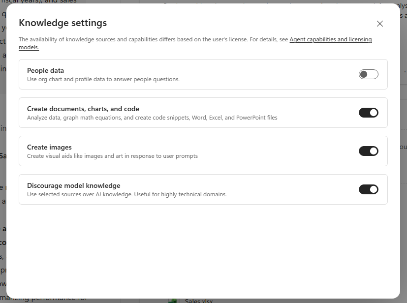

> [!TIP]  
> You can explore additional **knowledge** capabilities:
>
> - All **websites** (or specific ones)
> - All **SharePoint** data (or specific files or sites)
> - Organization-wide knowledge sources enabled through **Copilot Connectors** (e.g., ServiceNow)
>
> If your account has a **Microsoft 365 Copilot** license, you can also access:
>
> - **My Teams chats and meetings**
> - **My emails**

#### Finalize and create

1. Review the **Configure** tab to refine:

    - Agent name and description
    - Instructions
    - Starter prompts

2. When satisfied with the configuration, select **Create** in the upper right corner.

#### Test policy knowledge

1. Select **Start chat** to open the agent and start testing.

2. First, test the agent's **knowledge** of your sales policy, copy/paste the following prompt in the Message Copilot area and select Send:

```
What are the key guidelines in our sales policy regarding customer discounts?
```

3. Verify the agent references your SharePoint policy document and provides accurate information.

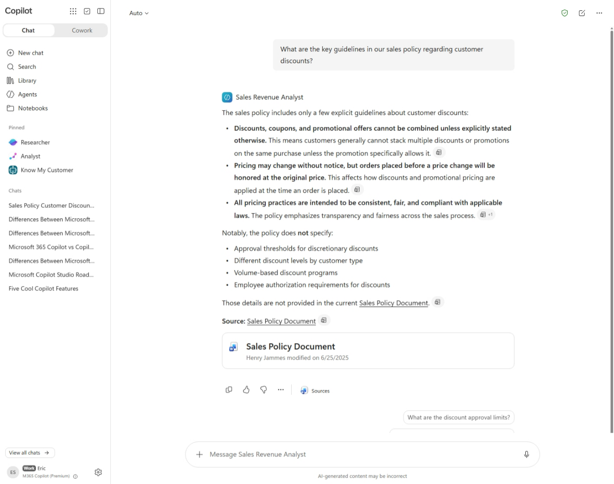

#### Test image generation

1. Select **Start a new chat** icon in the upper right corner of the screen and test the **image generation** capability with a relevant request:

   ```
   Design a professional badge for the first place winner of our sales contest. It should look modern and premium, with gold colors, the text '1st Place – Sales Contest', and a ribbon or trophy element.
   ```

   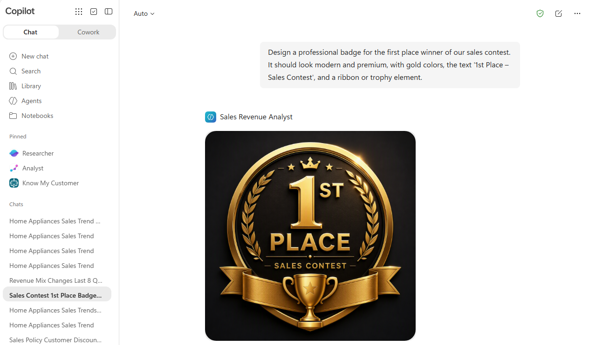

#### Test code interpreter with data analysis

> [!NOTE]
> **Auto** is the default response mode. Based on the prompt and task complexity, Agent Builder selects an approach that balances speed and depth:
>
> - **Quick response** answers straightforward requests quickly.
> - **Think deeper** takes more time to reason through complex, multi-step requests and create a more detailed plan.
>
> The response doesn't label which approach **Auto** selected. Compare response time and the depth of the expanded reasoning trace as practical indicators, not proof of a specific mode.

1. In the chat header, set the model selector to **Auto**, select **Start a new chat**, and enter this simple trend question:

   ```
   How are sales trending for home appliances?
   ```

2. Review the response and expand **Reasoning completed**. Because this is a straightforward, single-part question, expect a concise answer and a relatively short reasoning trace.

3. In the same chat, enter this direct follow-up request:

   ```
   Show a sales graph for Home Appliances
   ```

   The agent can generate the chart directly in the chat. Chart creation is a capability of the agent and is separate from the response mode used for a request.

   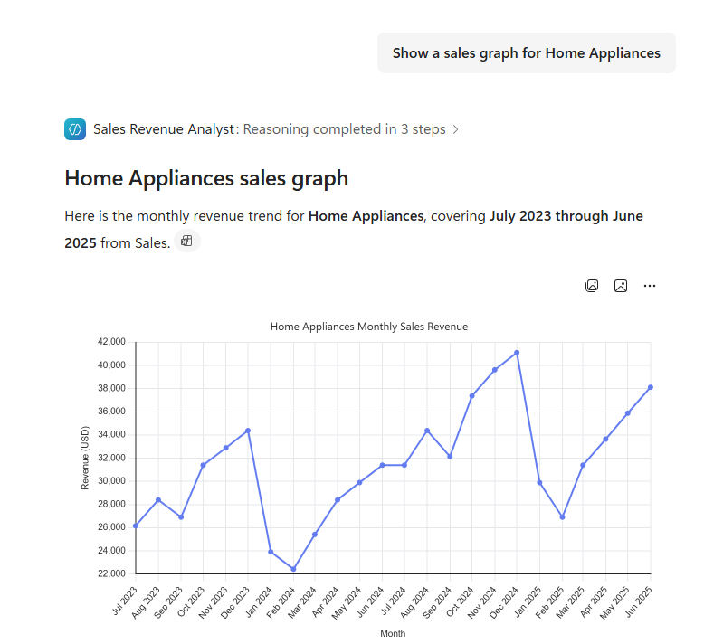

   > [!NOTE]
   > In a 30-minute bootcamp delivery, continue with the remaining steps in this subsection only if time permits.

4. Select **Start a new chat** again, then enter this more complex, multi-part request:

   ```
   How are sales trending for home appliances? Also generate charts to highlight the numbers.
   ```

   > [!IMPORTANT]
   > Large language models are non-deterministic. The user prompt and the declarative agent's instructions guide execution, but they do not prescribe an exact analysis or output format. The reasoning path, response, charts, and generated workbook may therefore vary between runs.

5. Expand **Reasoning completed** and compare it with the earlier trace. This multi-part request gives **Auto** a stronger signal to use a more involved approach, so expect a longer, more iterative plan that can include locating files, writing and running code, analyzing results, and creating an output workbook.

   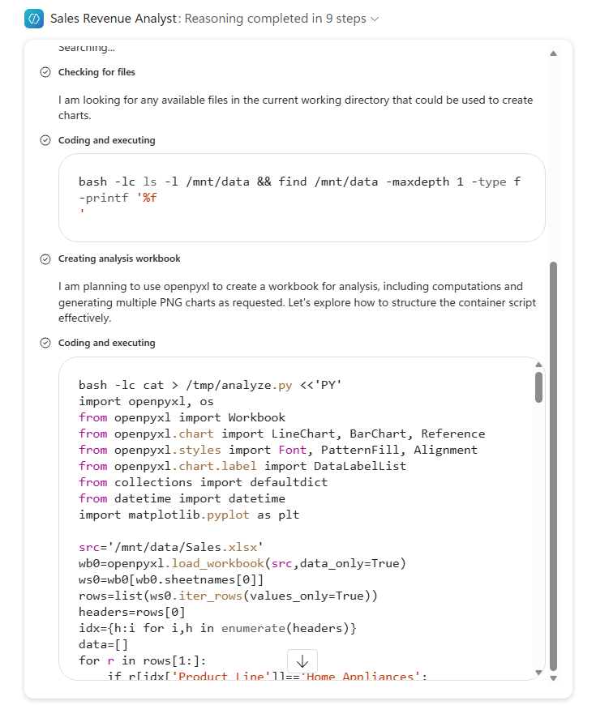

6. Review the completed analysis. The response can include trend findings, sales implications, and a link to download a newly generated Excel workbook.

   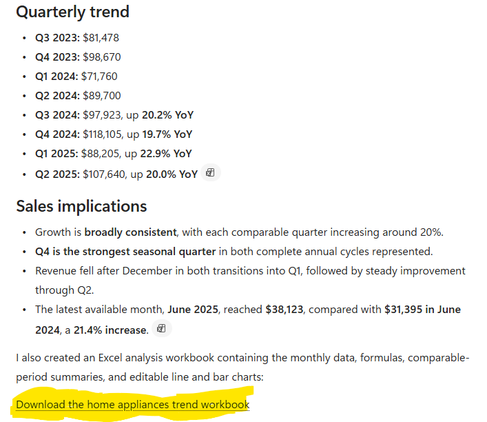

7. Download and open the workbook. Review the detailed data, calculations, summaries, and editable charts created by the agent.

   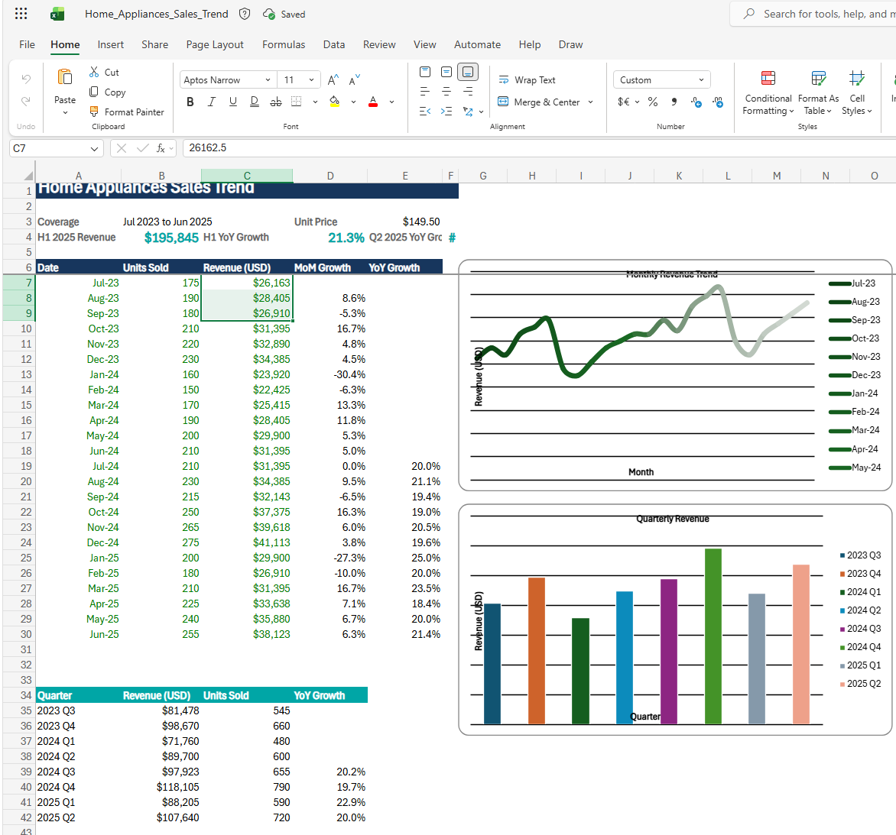

8. Open the agent's **More options** (`...`) menu and select **Edit** to reopen Agent Builder. On the **Configure** tab, open the model selector near the top of the page to set the agent's default response mode:
   - Select **Auto** to let Agent Builder balance speed and depth for each prompt.
   - Select **Quick response** to prefer faster, concise answers by default.
   - Select **Think deeper** to prefer more detailed reasoning by default.
   - Users can override this default with the model selector in the chat header.
   - Before continuing, restore **Auto** and select **Update** to save the agent configuration.

   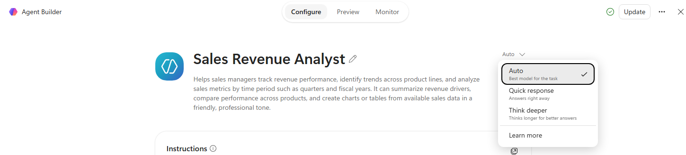

   For details, see [Set the default response mode in Agent Builder](https://learn.microsoft.com/microsoft-365/copilot/extensibility/agent-builder-build-agents#set-the-default-response-mode).

---

### 🏅 Congratulations! You've created an advanced SharePoint-integrated Copilot agent!

---

### Test your understanding

**Key takeaways:**

- **Knowledge settings centralize advanced capabilities** – The Knowledge settings panel controls document, chart, code, and image creation, as well as whether the agent should discourage general model knowledge.
- **Reasoning depth is task-sensitive** – In **Auto**, straightforward and complex prompts can produce different levels of planning. In the optional extension, makers set the agent's default response mode while users retain the ability to override it.
- **Agents can create usable artifacts** – Beyond answering questions, the agent can generate in-chat charts, downloadable analysis workbooks, and images from natural-language requests.
- **Declarative agent outputs remain non-deterministic** – Prompts and instructions guide execution, but the reasoning path, calculations, narrative, and generated artifacts can vary between runs.

**Lessons learned & troubleshooting tips:**

- Add and validate each knowledge source independently before testing prompts that combine multiple sources.
- Confirm that the required files appear under **Work content**, then select **Update** after changing the agent configuration.
- Begin with direct prompts that isolate one source before attempting broader analysis.
- Inspect citations, source records, calculations, and generated files rather than accepting a polished response at face value.
- Use **Start a new chat** between tests to prevent earlier prompts from influencing the next result.
- Keep **Auto** when prompt complexity should influence reasoning depth; choose **Quick response** or **Think deeper** as the preferred default when speed or depth should be emphasized.
- If a source cannot be added or queried, verify the URL, permissions, and file structure.

**Challenge: Apply this to your own use case**

- Identify one document and one structured data file that together support a real business decision.
- Design a simple prompt for a quick answer and a multi-step prompt that should benefit from deeper reasoning.
- Define the evidence and citations required to trust the response.
- Decide whether the desired outcome is an answer, chart, workbook, image, or a combination of artifacts.
- Determine whether the scenario remains a good fit for a declarative agent or requires deterministic workflow, state, or system actions from another harness.

---

---

## 🧪 Extra Credit: Add and test a SharePoint list as a knowledge source

> [!NOTE]
> **Optional - Extra Credit (~10 minutes):** Add a structured SharePoint list and test direct and multi-source grounding. This section isn't included in the core lab time.

### Objective

Add the Sales Opportunities SharePoint list as structured knowledge, validate direct list retrieval, and combine list records with the files configured in Use Case #2.

### Step-by-step instructions

> [!IMPORTANT]
> As of August 2026, Agent Builder supports up to one SharePoint list per agent. See [Add knowledge sources to your declarative agent](https://learn.microsoft.com/microsoft-365/copilot/extensibility/agent-builder-add-knowledge#sharepoint-and-onedrive-content) for current limits.

> [!NOTE]
> This lab uses the training tenant URL below. If your training uses a different tenant, use the Sales Opportunities list URL provided in [Lab Resources](https://copilotstudiotraining.sharepoint.com/sites/Workshop/SitePages/Lab-Assets.aspx).

#### Add the Sales Opportunities list as knowledge

1. Open the agent for editing if needed, select the **Configure** tab, and scroll to the **Knowledge** section.

2. Select **Add knowledge**.

3. Copy the URL of the **Sales Opportunities** SharePoint list:

   ```
   https://copilotstudiotraining.sharepoint.com/Lists/Sales%20Opportunities/AllItems.aspx
   ```

4. Paste the URL into the knowledge source field, press **Enter**, and wait for the list to be processed.

   If the URL isn't accepted, select the cloud file picker, choose **Recent lists**, and then select **Sales Opportunities**. If the list isn't shown, open it once in SharePoint or use **More places**, then retry.

5. Confirm that **Sales Opportunities** appears under **SharePoint** in the **Work content** section.

   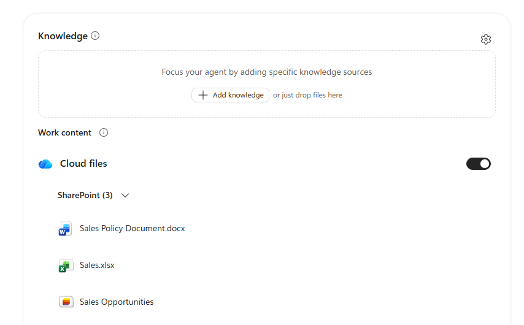

6. Select **Update** to save the agent configuration.

#### Test the SharePoint list knowledge

1. Select **Start a new chat**, then enter this prompt to validate that the agent can search the SharePoint list:

   ```
   Which open opportunities have overdue next actions?
   ```

2. Verify that the response evaluates the **Next Action Due** values and cites the **Sales Opportunities** list as its source. Results depend on the current date and list contents, so the number of overdue opportunities can differ from the example or be zero.

   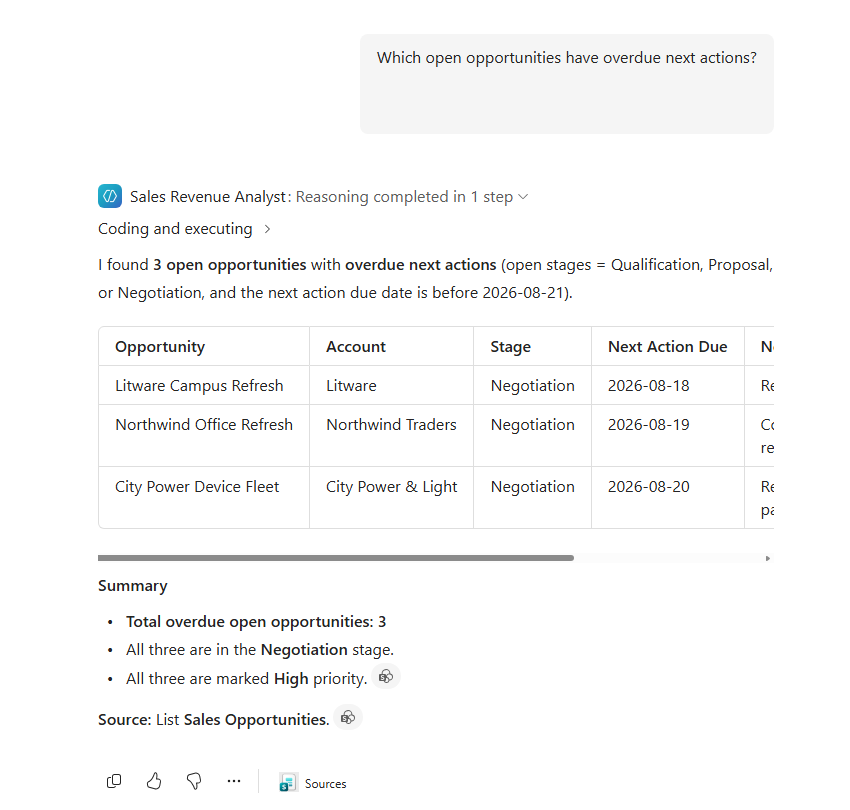

3. Select **Start a new chat** again, then enter this prompt to test reasoning across two knowledge sources:

   ```
   For Electronics, compare historical sales performance with the current open opportunities by region.
   ```

4. Verify that the response combines historical sales data from **Sales.xlsx** with current opportunity data from the **Sales Opportunities** SharePoint list and compares the results by region.

   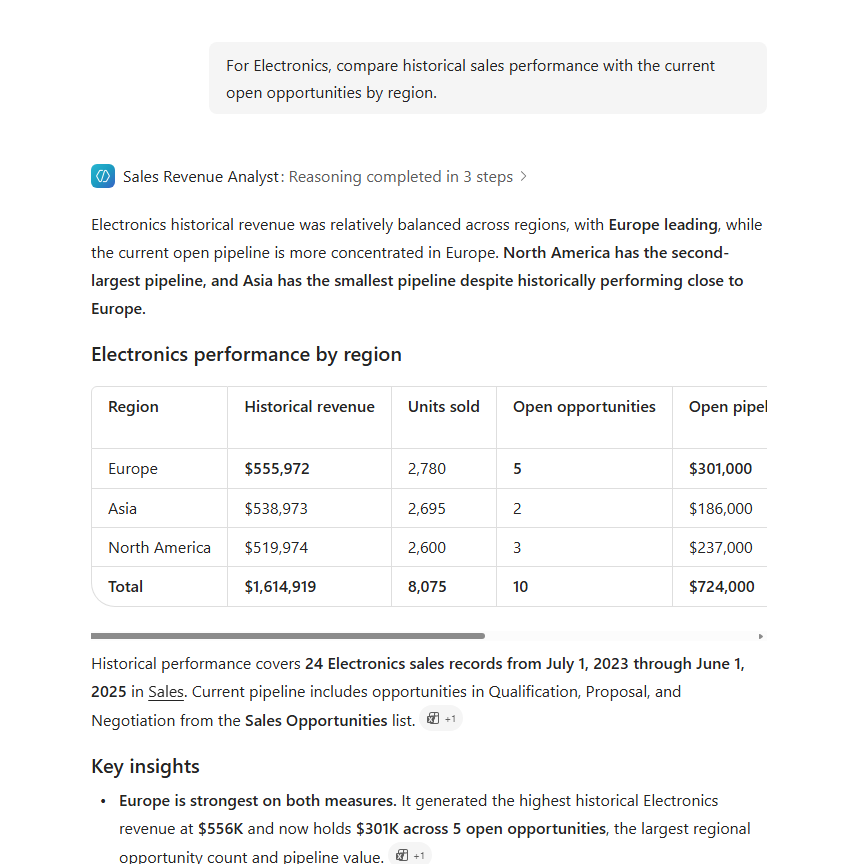

5. Select **Start a new chat** again, then enter this prompt to test all three configured knowledge sources together:

   ```
   Prepare a sales manager briefing using historical sales, current opportunities, and the sales policy. Identify three priority opportunities, cite the evidence, explain the risks, and recommend compliant next actions.
   ```

6. Verify that the response combines historical data from **Sales.xlsx**, current opportunities from the **Sales Opportunities** SharePoint list, and guidance from the **Sales Policy Document**. Confirm that it identifies three priority opportunities, cites supporting evidence, explains the risks, and recommends policy-compliant next actions.

---

### 🏅 Congratulations! You've completed the SharePoint List Extra Credit section!

---

### Test your understanding

**Key takeaways:**

- **Structured list grounding complements document grounding** – The agent can retrieve current records from a SharePoint list while continuing to use files configured as knowledge.
- **Multi-source grounding enables business synthesis** – The agent can combine historical data from Excel, current opportunities from a list, and policy guidance from a document in one cited response.
- **Current limits shape the design** – Agent Builder currently supports one SharePoint list per agent, so choose the list that provides the greatest value for the scenario.

**Lessons learned & troubleshooting tips:**

- Validate the list independently before testing prompts that combine it with other sources.
- Confirm the list appears under **Work content**, select **Update**, and inspect citations in every test response.
- Date-dependent results can change as list records and due dates change.
- If the list can't be added, verify the URL and permissions or use the SharePoint picker.

**Challenge: Apply this to your own use case**

- Identify one SharePoint list that adds current structured records to an existing document-grounded scenario.
- Design a direct-list prompt and a multi-source prompt that require evidence from both the list and a file.

---

## 🏆 Summary of learnings

**Declarative does not mean simplistic.** Agent Builder provides a short, natural-language path from an idea to a working agent, while still allowing makers to define instructions, ground answers, choose reasoning behavior, and enable artifact creation.

**Grounding is an architecture decision.** Files, lists, websites, and organizational content each contribute different evidence. Reliable agents start with accessible, well-structured sources and prompts that make the expected evidence clear.

**Reasoning depth and capabilities solve different problems.** **Quick response** and **Think deeper** affect how the agent approaches a task; knowledge sources and capabilities determine what evidence it can use and what artifacts it can create.

**Outputs must be evaluated.** Prompts and declarative agent instructions guide execution but do not make it deterministic. Validate citations, calculations, recommendations, and generated files before using them in a business process.

**The harness still has a boundary.** Declarative agents can synthesize knowledge and create rich outputs, but scenarios requiring deterministic process control, persistent state, connectors, approvals, or system-of-record actions may require another harness.

---

## 📌 Conclusions & Recommendations

**Start simple and add capability deliberately.** Begin with a focused purpose and one trusted source, validate the behavior, then add more knowledge, reasoning depth, and output capabilities only when the use case requires them.

**Design the evidence path.** Decide which source should answer each type of question, how users will verify citations, and what should happen when the available knowledge is insufficient.

**Choose reasoning intentionally.** Use **Auto** for prompt-sensitive behavior, or set **Quick response** or **Think deeper** as the preferred default. Users can still override that default in the chat model selector.

**Escalate deliberately.** When a scenario needs a defined process, variables, connectors, approvals, persistent state, or autonomous execution, treat that as a harness decision rather than forcing the declarative agent beyond its intended boundary.
