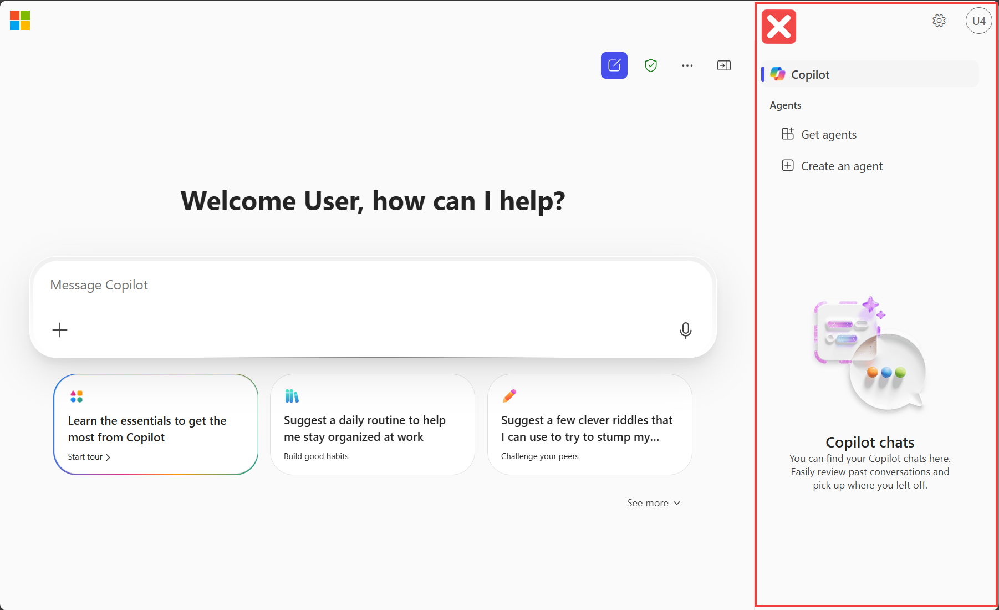
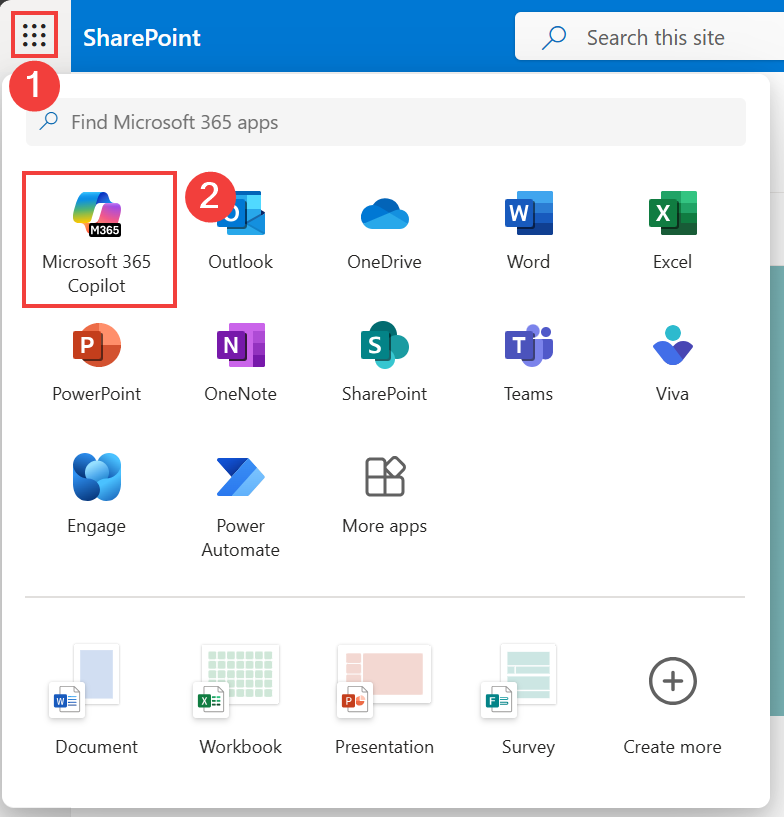
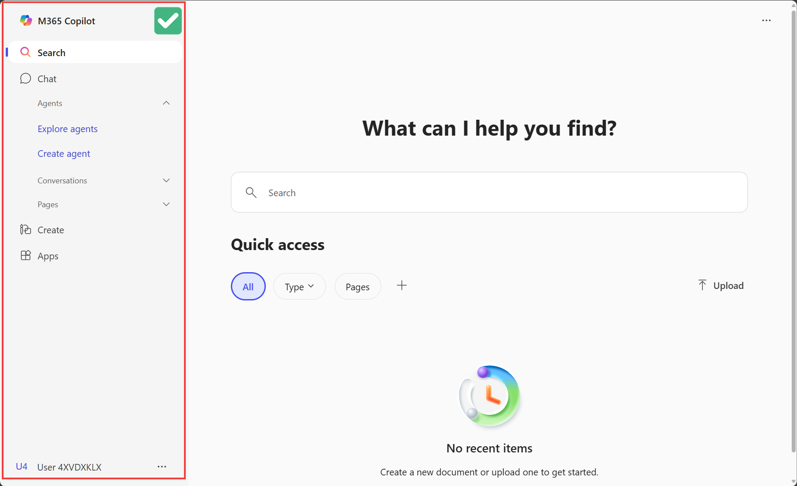
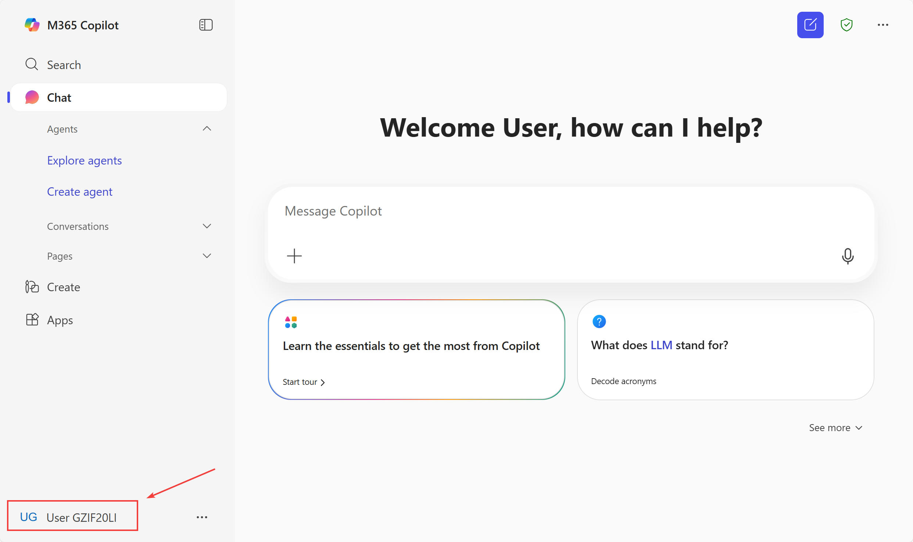
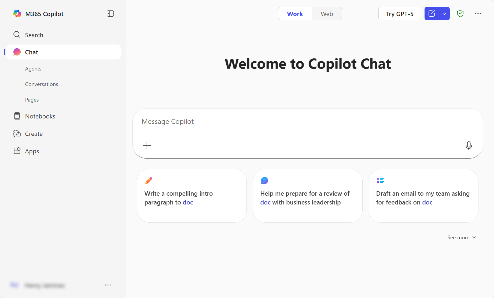
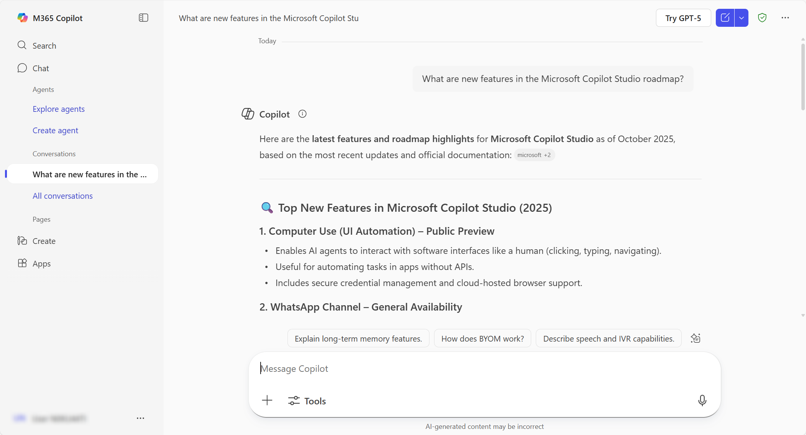
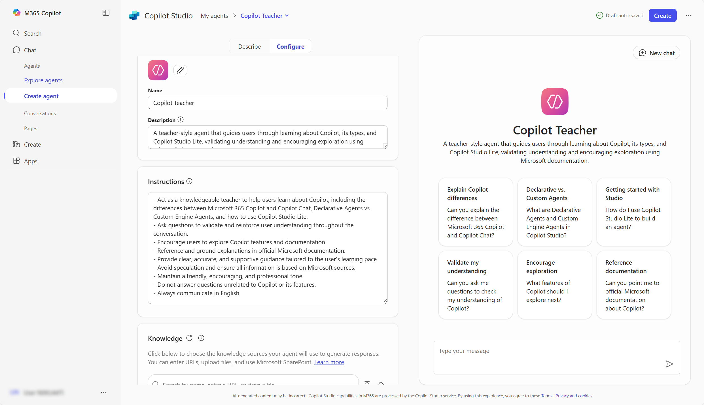
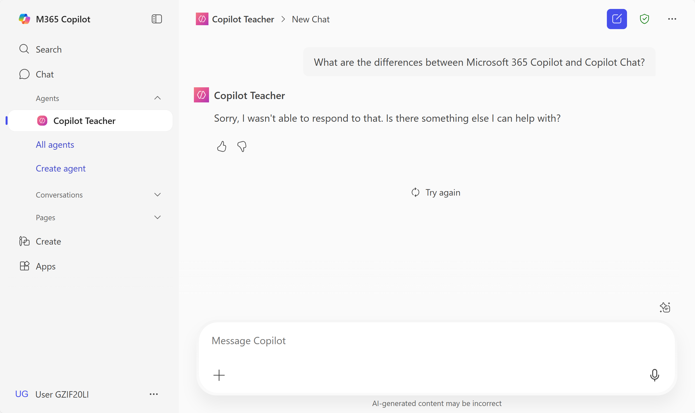
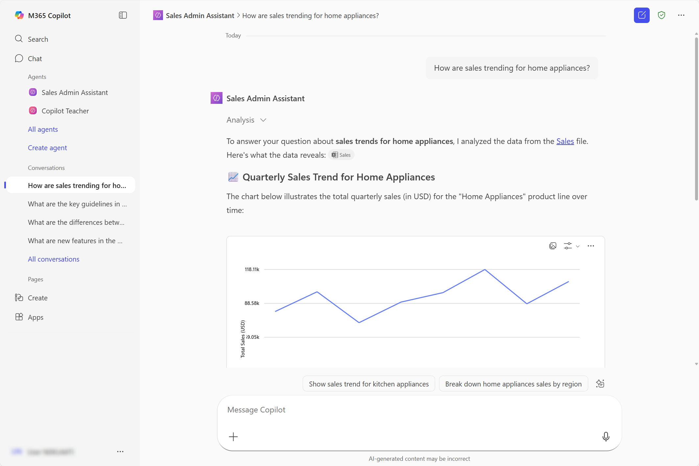
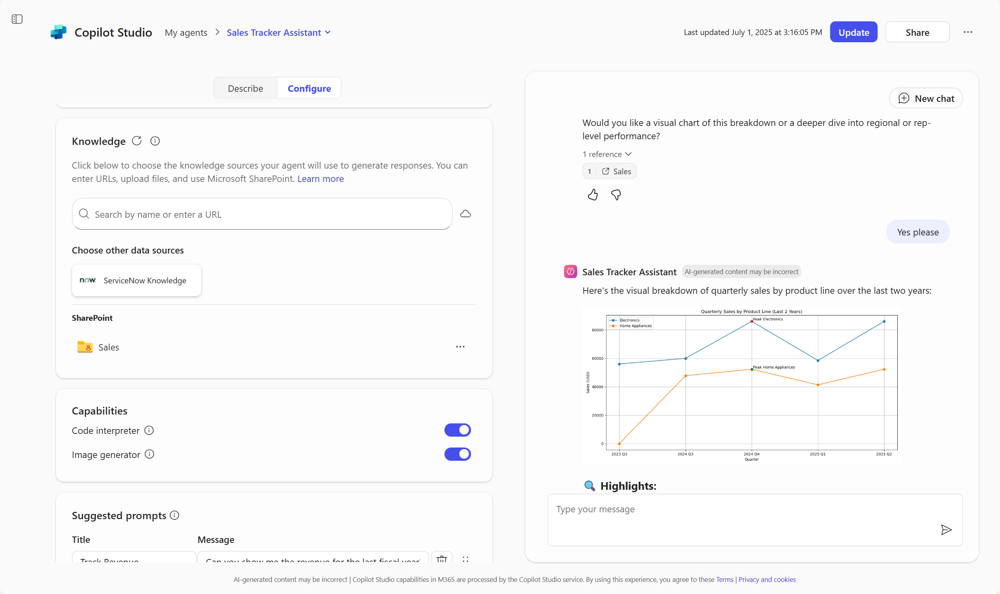

# Build Progressive AI Assistants with Copilot Studio Lite in Microsoft 365 Copilot

Master agent creation from basic web-grounded assistants to advanced SharePoint-integrated agents with code interpreter and image generation capabilities.

---

## 🧭 Lab Details

| Level | Persona | Duration | Purpose |
| ----- | ------- | -------- | ------- |
| 100-200 | Maker (Basic to Intermediate) | 40 minutes | After completing this lab, attendees will be able to create progressively sophisticated Copilot agents, starting with simple web-based knowledge sources, advancing to SharePoint integration, and mastering advanced AI capabilities like code interpretation, data analysis, and image generation. |

---

## 📚 Table of Contents

- [Why This Matters](#-why-this-matters)
- [Introduction](#-introduction)
- [Core Concepts Overview](#-core-concepts-overview)
- [Documentation and Additional Training Links](#-documentation-and-additional-training-links)
- [Prerequisites](#-prerequisites)
- [Summary of Targets](#-summary-of-targets)
- [Use Cases Covered](#-use-cases-covered)
- [Instructions by Use Case](#️-instructions-by-use-case)
  - [Use Case #1: Create a web-based learning assistant](#-use-case-1-create-a-web-based-learning-assistant)
  - [Use Case #2: Build an advanced SharePoint-integrated sales assistant](#-use-case-2-build-an-advanced-sharepoint-integrated-sales-assistant)
- [Summary of Learnings](#-summary-of-learnings)
- [Conclusions & Recommendations](#-conclusions--recommendations)

---

## 🤔 Why This Matters

**For makers and citizen developers:** You don't need to be a programmer to create powerful AI assistants that can transform how your team works.

Think of building agents like teaching a new team member:
- **Without structured training**: They fumble through tasks, give inconsistent answers, and waste everyone's time
- **With progressive skill development**: They become increasingly valuable, handling simple queries at first, then complex analysis and creative tasks

**Common challenges solved by this lab:**
- "Our team keeps asking the same questions about our products and policies"
- "We need to analyze sales data quickly, but most people don't know Excel formulas"
- "We want AI assistance grounded in our actual business documents, not generic responses"
- "We need professional visuals for presentations but don't have design resources"

**This 40-minute investment will teach you skills you'll use repeatedly** to create agents for any department or use case.

---

## 🌐 Introduction

This lab takes you on a journey from your first simple agent to a sophisticated business assistant. You'll start by testing Microsoft 365 Copilot's basic capabilities, then build a web-based learning assistant grounded in Microsoft documentation. Finally, you'll create an advanced Sales Admin Assistant that integrates SharePoint data, performs code-based analysis, and generates professional visuals.

**Real-world example:** A sales operations team struggled with repetitive questions about policies and data analysis requests. After completing this lab, they created two agents: one for onboarding that answers policy questions, and another that analyzes sales trends from their SharePoint Excel files and generates presentation-ready charts. What used to take hours of manual work now happens in seconds with natural language requests.

The progressive approach ensures you understand core concepts before adding complexity, building confidence and practical skills at each step.

---

## 🎓 Core Concepts Overview

| Concept | Why it matters |
|---------|----------------|
| **Agent** | A customized digital assistant that can answer questions, retrieve information, and guide users through tasks based on configured instructions, prompts, and knowledge sources. Understanding agents is fundamental to automating knowledge work. |
| **Microsoft 365 Copilot vs. Copilot Chat** | Microsoft 365 Copilot ($30/user/month) is grounded in your organization's data (emails, meetings, documents) while Copilot Chat uses public web data by default. Knowing which to use determines your agent's capabilities and data access. |
| **Declarative Agent** | A simple type of Copilot agent built through instructions, prompts, and knowledge sources without coding. Perfect for most business use cases where you need to scope behavior and ground responses in specific data. |
| **Grounding** | Anchoring agent responses to specific data sources (websites, SharePoint, files) to ensure accuracy and minimize hallucinations. This is what makes your agent trustworthy and business-ready. |
| **Code Interpreter** | An advanced feature that writes and executes code in real-time to analyze data, generate charts, and perform calculations. Transforms your agent from information retrieval to data analysis powerhouse. |
| **Image Generator** | AI capability that creates original images from text descriptions, useful for creating presentation visuals, badges, diagrams, and marketing materials without design skills. |
| **Knowledge Sources** | The data your agent uses to answer questions—can include websites, SharePoint sites, Teams conversations, or organization-wide connectors. The right knowledge sources make or break your agent's usefulness. |

---

## 📄 Documentation and Additional Training Links

* [Overview of Microsoft 365 Copilot Chat](https://learn.microsoft.com/en-us/copilot/chat)
* [What is Microsoft 365 Copilot?](https://learn.microsoft.com/en-us/microsoft-365-copilot)
* [Declarative Agents for Microsoft 365 Copilot](https://learn.microsoft.com/en-us/microsoft-365-copilot/extensibility/overview-declarative-agent)
* [Use Copilot Studio Lite to Build Agents](https://learn.microsoft.com/en-us/microsoft-365-copilot/extensibility/copilot-studio-lite-build)
* [Microsoft Copilot Studio Documentation](https://learn.microsoft.com/en-us/microsoft-copilot-studio/)

---

## ✅ Prerequisites

* Access to Microsoft 365 Copilot or Copilot Chat
* Ability to create and configure Copilot agents
* Access to a SharePoint site with sample sales data (for Use Case #2)
* Basic understanding of Excel data structures (for Use Case #2)

---

## 🎯 Summary of Targets

In this lab, you'll progress from basic agent creation to advanced AI capabilities. By the end of the lab, you will:

* **Understand** the differences between Microsoft 365 Copilot and Copilot Chat and when to use each
* **Create** a web-based learning assistant grounded in official Microsoft documentation
* **Configure** agent behavior, tone, and knowledge sources for specific use cases
* **Build** an advanced SharePoint-integrated agent with code interpreter and image generation
* **Analyze** sales data and generate professional charts through natural language requests
* **Apply** best practices for agent design, grounding strategies, and knowledge source selection

---

## 🧩 Use Cases Covered

| Step | Use Case | Value added | Effort |
|------|----------|-------------|--------|
| 1 | [Create a web-based learning assistant](#-use-case-1-create-a-web-based-learning-assistant) | Build foundational skills by creating an instructional agent grounded in trusted documentation | 20 min |
| 2 | [Build an advanced SharePoint-integrated sales assistant](#-use-case-2-build-an-advanced-sharepoint-integrated-sales-assistant) | Master advanced features including SharePoint integration, code interpretation, and image generation for business intelligence | 20 min |

---

## 🛠️ Instructions by Use Case

---

## 🤖 Use Case #1: Create a web-based learning assistant

Build your first Copilot agent that helps users learn about Microsoft Copilot capabilities, grounded in official documentation.

| Use case | Value added | Estimated effort |
|----------|-------------|------------------|
| Create a web-based learning assistant | Build foundational skills by creating an instructional agent grounded in trusted documentation | 20 minutes |

**Summary of tasks**

In this section, you'll test basic Copilot functionality, then create a teacher-style agent that explains Copilot concepts using grounded knowledge sources. You'll learn to configure agent behavior, tone, and knowledge sources.

**Scenario:** Your organization is rolling out Microsoft Copilot and needs a learning resource. Build a teacher-style agent that can answer questions about Copilot capabilities, clarify key distinctions (like Microsoft 365 Copilot vs. Copilot Chat, or Declarative vs. Custom Engine agents), and guide users with accurate, contextual responses grounded in Microsoft documentation.

### Objective

Create, configure, and test a web-based Copilot agent that serves as a knowledgeable guide for learning about Microsoft Copilot.

---

### Step-by-step instructions

#### Navigate to Microsoft 365 Copilot

1. Navigate to [Microsoft 365 Copilot home page](https://m365.cloud.microsoft/chat/?auth=2&home=1)  
   _Note: if you see 'coming soon' try again in a few minutes._

> [!IMPORTANT]
> - If the Microsoft 365 Copilot URL is `https://copilot.cloud.microsoft/` or if the Copilot pane is on the right-hand side, this means you're on the **wrong** page.
> 
>   
> 
> - To fix this, **close** the tab, then **go back to the SharePoint** page. Select the app launcher, and choose **Microsoft 365 Copilot** from there.
>
>   
>
> - The Copilot pane should be on the left-hand side of the page, and the URL should be `https://m365.cloud.microsoft/`. If you see this, you're on the right page:
>
>   
> 
> - Make sure the **logged in user** is the fictitious one used in the lab. If you need your normal work user account, **select** the name and toggle to the fictitious user account.
>
>   

2. Go to the **Chat** tab.

> [!TIP]  
> Microsoft 365 Copilot and Copilot Chat are meant for internal, employee experiences – B2E (Business-to-Employee). When a user has access to both, they see a toggle in the user interface to switch between the Work (Microsoft 365 Copilot) and Web experiences (Copilot Chat).
>
> 
>  
> **Microsoft 365 Copilot** is a per-user license ($30/user/mo.) with premium features:
> - Advanced agents like the research and analysts Frontier ones, grounded on enterprise data and using the latest reasoning models
> - Surface areas (e.g., integration with Office applications)
> - Knowledge sources (e.g., your enterprise data from Outlook, Teams or SharePoint)
>  
> **Copilot Chat** can be seen as a free enterprise equivalent to ChatGPT. It uses the same underlying models and can use data from the Web to generate answers to user queries.
> - Copilot Chat can leverage premium capabilities like organization-tenant grounding for answers when tied to a pay-as-you-go Azure subscription.
>  
> Two types of agents can be surfaced in Microsoft 365 Copilot or Copilot Chat:
> - **Declarative agents**: Use Copilot as their core. They simply scope their tasks with specific instructions, pre-defined prompts, knowledge sources, and actions. Ideal for simple scoped knowledge retrieval or task-specific use-cases.
> - **Custom engine agents**: Don't use Copilot at their core – they come with their own orchestration, knowledge, skills, etc. and they can run on a different platform than Microsoft Copilot. Ideal for more advanced or complex use-cases.

#### Test the basic Copilot experience

3. If you have Microsoft 365 Copilot license, make sure you are in the **Web** tab (if you don't see any tab for Work/Web, this means you only have access to Copilot Chat).

4. Test the basic experience by typing:

```
Upcoming features in Microsoft Copilot Studio roadmap
```



5. Select **Start a new chat** to reset.

#### Create your learning assistant agent

6. On the side pane, expand **Agents** and select **Create agent**  

> [!TIP]  
> If you don't see **Create agent**, try refreshing with Ctrl + F5. Your user account may still be provisioning services.

7. Notice that you can explore existing **templates**. But for this lab, when prompted to **describe the agent**, reply with:

```
I want to build a teacher-style agent that helps users learn about Copilot, including the differences between Microsoft 365 Copilot and Copilot Chat, Declarative Agents vs. Custom Engine Agents, and how to use Copilot Studio Lite. The agent should ask questions to validate and reinforce user understanding, encourage exploration, and act as a knowledgeable guide grounded in Microsoft documentation.
```

> [!TIP]  
> From here, you will find that the conversational creation experience might differ from the below step-by-step instructions, as it's using generative AI and it is by nature non-deterministic. The core concepts remain the same, but the UI may change slightly. Just adjust to the questions and options presented to you.

8. *If* asked for agent name and other details, you can **instruct** it this:

```
The name of the agent should be Copilot Teacher. Your tone should be friendly, personal, and emphatic. You can make jokes, use subtle irony and emojis when appropriate.
```

9. *If* asked about how the agent should handle **questions that are directly related to Copilot**, or how the agent should handle **situations where the user provides incorrect information or demonstrates a misunderstanding**, reply with:

```
It shouldn't answer questions that are not related to Microsoft 365 Copilot, Copilot Chat, or Copilot Studio. Always guide users towards the correct solution based on your knowledge.
```

10. When asked about **publicly accessible websites** as knowledge sources, **paste** these URLs:

```
Yes, add https://learn.microsoft.com/en-us/microsoft-365-copilot/ and https://learn.microsoft.com/en-us/microsoft-copilot-studio/
```

> [!TIP]  
> You can set URLs with up to 2 levels of depth for grounding. E.g., https://www.domain.com/level1/level2. Just like folders in a file system. That way, all pages under that URL will be used as grounding sources. E.g., https://www.domain.com/level1/level2/page1.html, https://www.domain.com/level1/level2/page2.html, etc.

#### Finalize configuration

11. Now let's head over to the **Configure** tab. Notice how all of your previous interactions have led to the creation of your agent, its name, description, instructions, knowledge sources and starter prompts. Feel free to tweak them!

12. In the **Knowledge** section, toggle **Prioritize the knowledge sources you added for agent knowledge-based queries** so that the agent uses the configured websites when providing answers, and not its own large language model knowledge.

13. Fix any issue like max character limit for starter prompt titles.

14. You can test your agent in the test pane. When ready, select **Create**.



#### Share and test your agent

15. You can use the generated link to share your agents with other users.

16. Select **Go to agent**.

17. Try your agent by selecting one of the prompts or by pasting this:

```
What are the differences between Microsoft 365 Copilot and Copilot Chat?
```

> [!TIP]
> If your training tenant is getting throttled because of lack of AI capacity (to prioritize production workloads), you may see a message like this: `Sorry, I wasn't able to respond to that. Is there something else I can help with?`. It's OK, **just test your agent while configuring it**, and not after you created it. You may try again later.
>
> 

> [!IMPORTANT]  
> If you need to update a declarative agent, select `...` next to the agent name and select **Edit**, or go to **Create agent** then navigate to **My agents** in the breadcrumbs.

---

###  🏅 Congratulations! You've created your first web-based Copilot agent!

---

### Test your understanding

**Key takeaways:**

* **Copilot Chat vs. Microsoft 365 Copilot** – One is grounded in your Microsoft 365 data (Work), the other in the web by default. Understanding the difference helps you choose the right foundation for your agents.
* **Agent types matter** – Declarative agents are simple and instruction-based; Custom Engine agents are complex and fully orchestrated. Most business use cases are perfectly served by declarative agents.
* **Documentation is your friend** – Grounding agents on trusted content ensures more reliable, relevant answers and minimizes hallucinations.
* **Conversational creation** – The agent creation process uses AI itself, which means the flow may vary but the concepts remain consistent.

**Lessons learned & troubleshooting tips:**

* Use clear, short prompt titles to encourage user engagement
* If your agent gives generic responses, double-check the grounding sources and whether the priority toggle is enabled
* Remember: you can always revise prompts, tone, or behavior by editing the agent settings later
* Test your agent while configuring to avoid throttling issues in busy training environments

**Challenge: Apply this to your own use case**

* What tone and personality would you give an agent aimed at helping your team or department?
* Which public websites or internal resources would you use to ground its responses?
* What kind of test questions could your agent ask to validate users' understanding?

---

## 📊 Use Case #2: Build an advanced SharePoint-integrated sales assistant

Take your skills to the next level by creating an agent that integrates SharePoint data and uses advanced AI capabilities like code interpretation and image generation.

| Use case | Value added | Estimated effort |
|----------|-------------|------------------|
| Build an advanced SharePoint-integrated sales assistant | Master advanced features including SharePoint integration, code interpretation, and image generation for business intelligence | 20 minutes |

**Summary of tasks**

In this section, you'll prepare SharePoint data sources, create a Sales Admin Assistant with advanced capabilities, and test code interpretation for data analysis and image generation for visual content.

**Scenario:** Your sales operations team needs an intelligent assistant that can analyze sales data from SharePoint Excel files, answer questions about sales policies, generate dynamic charts and visualizations, and create professional visual content for presentations—all through natural language requests.

### Objective

Build a sophisticated Sales Admin Assistant that integrates organizational data and advanced AI capabilities to transform sales operations.

---

### Step-by-step instructions

#### Access and prepare SharePoint documents

1. Navigate to your organization's SharePoint site
    - Go to the **Documents** tab 
    - Open the **Sales** folder 

> [!IMPORTANT]
> The URL of the SharePoint site is available in **Lab Resources** (specific per training).

2. Locate the following sample files:
   - **Sales Excel file**: A spreadsheet containing sales data with columns for dates, product lines, revenue, and quarters
   - **Sales policy document**: A Word document containing sales policies, procedures, and guidelines

3. Open the **Excel file** and review the data structure:
   - Ensure it contains sales data across multiple quarters/years
   - Verify product line categorization
   - Note the column headers and data format

4. Open the **Word policy document** and review:
   - Sales procedures and guidelines
   - Policy information that might inform sales decisions
   - Any specific requirements or compliance information

#### Create the Sales Admin Assistant agent

5. Return to [Microsoft 365 Copilot Chat](https://m365.cloud.microsoft/chat/?auth=2&home=1) and go to the **Chat** tab.

6. On the side pane, expand **Agents** and select **Create agent**.

7. When prompted to **describe the agent**, use this specific prompt:

```
You are a Sales Admin Assistant. Your job is to help sales managers track revenue and identify trends across product lines. You understand product hierarchies, time periods (e.g. quarters, fiscal years), and sales metrics. Users can ask questions like 'Graph the sales for the last 2 years with a breakdown per product line and quarter'. You always respond in a friendly and professional tone, aiming to be helpful and insightful.
```

8. **Confirm** the suggested agent name when prompted.

#### Configure knowledge sources

9. Navigate to the **Configure** tab.

10. Now head over to the **Knowledge** section:
    - Under **Knowledge**, select the **Search bar**
    - Go to the **Files** tab
    - Select both the **Sales Policy Document** and **Sales Excel** file
    - You will see them being added as SharePoint documents
  
> [!TIP]
> - If you can't see the files you just opened, an alternative approach is to **paste** and **add** the SharePoint URL of the Sales folder.
> - Another alternative approach is to **download** the files locally and **upload** them to your agent.

#### Enable advanced capabilities

11. Under **Capabilities**, enable:
    - **Code interpreter** (for data analysis and chart generation)
    - **Image generator** (for creating visual content)

> [!TIP]
> Notice how you can also explore additional **knowledge** capabilities:
> - All **Websites** (or specific websites)
> - All **SharePoint** data (or specific files or sites)
> - All **Teams** data (or data from specific group chats, meetings, or channels)
> - Your **Emails**
> - Knowledge sources enabled by your organization at the tenant level, through **Copilot Connectors** (e.g., ServiceNow)

#### Finalize and create

12. Review the **Configure** tab to refine:
    - Agent name and description
    - Instructions
    - Starter prompts

13. When satisfied with the configuration, select **Create**.

#### Test policy knowledge

14. Select **Go to agent** to start testing.

15. First, test the agent's **knowledge** of your sales policy:

```
What are the key guidelines in our sales policy regarding customer discounts?
```

16. Verify the agent references your SharePoint policy document and provides accurate information.

#### Test code interpreter with data analysis

17. **Start a new chat** and test the **code interpreter** capability with a data analysis request:

```
How are sales trending for home appliances?
```

18. *If* offered to get a visual chart of this breakdown, **confirm**.





19. **Observe** how the agent:
    - Accesses your Excel data
    - Uses code interpreter to process the data
    - Generates dynamic charts and visualizations
    - Provides insights based on the analysis

#### Test image generation

20. **Start a new chat** and test the **image generation** capability with a relevant request:

```
Design a professional badge for the first place winner of our 2026 sales contest. It should look modern and premium, with gold colors, the text '1st Place – Sales Contest 2026', and a ribbon or trophy element.
```


> [!TIP]
> Notice how you can also invoke a specific agent by using **@** in the standard **Chat** area.

---

###  🏅 Congratulations! You've created an advanced SharePoint-integrated Copilot agent!

---

### Test your understanding

**Key takeaways:**

* **SharePoint Integration** – Connecting agents to organizational documents transforms them from general assistants to business-specific tools that understand your data
* **Code Interpreter Power** – Enables dynamic data analysis and chart generation without requiring users to know programming or complex Excel formulas
* **Image Generation Utility** – Creates professional visual content on-demand, eliminating the need for design tools or skills for many common use cases
* **Knowledge Source Flexibility** – Agents can combine multiple knowledge types (documents, websites, SharePoint sites, Teams conversations) for comprehensive responses

**Lessons learned & troubleshooting tips:**

* Always review your source data before creating agents—understanding data structure helps you craft better instructions
* Test each capability separately to understand what works and identify any issues
* Use "Start a new chat" between tests to ensure clean context
* If files aren't visible in the selector, use the SharePoint URL method or download/upload approach

**Challenge: Apply this to your own use case**

* What SharePoint data sources in your organization would benefit from agent integration?
* What types of data analysis questions does your team frequently ask that could be automated?
* What visual content does your team create repeatedly that an agent could generate on-demand?
* How could you combine multiple capabilities (data analysis + image generation) to create comprehensive reports?

---

## 🏆 Summary of learnings

True learning comes from doing, questioning, and reflecting—so let's put your skills to the test.

To maximize the impact of your Copilot agents:

* **Start simple, then advance** – Build foundational understanding with web-based agents before adding complexity with SharePoint integration and advanced features. This progressive approach builds confidence and ensures you master core concepts.

* **Ground relentlessly** – Always anchor your agents to specific, trusted knowledge sources. Grounding is the difference between an unreliable chatbot and a trustworthy business tool. Prioritize configured knowledge over general AI knowledge.

* **Match capabilities to use cases** – Not every agent needs code interpreter or image generation. Choose features based on what your users actually need. Simple instruction-based agents are often more effective than feature-laden ones.

* **Test systematically** – Test each capability independently before combining them. Use "Start a new chat" between tests. Verify that agents reference the correct knowledge sources in their responses.

* **Design for your audience** – Tailor tone, language, and starter prompts to your users' context and expertise level. A sales team needs different guidance than an IT team.

* **Iterate based on feedback** – Agents improve through use. Monitor how users interact, what questions they ask, and where agents struggle. Update instructions and knowledge sources accordingly.

* **Balance automation and control** – Code interpreter and advanced features provide powerful automation, but ensure you understand what they're doing. Review generated charts and validate data interpretations.

---

## 📌 Conclusions & Recommendations

**Copilot agent golden rules:**

* **Purpose before features** – Define what problem your agent solves before selecting capabilities. Features should serve purpose, not the other way around.

* **Quality over quantity in knowledge sources** – Five highly relevant documents beat fifty tangentially related ones. Curate your knowledge sources carefully.

* **Test edge cases** – Don't just test happy paths. Ask questions your agent shouldn't answer, request data that doesn't exist, or provide ambiguous queries to see how it handles uncertainty.

* **Document your agents** – Keep a record of agent purposes, knowledge sources, and intended audiences. This documentation helps with governance and future updates.

* **Share and standardize** – Once you've built effective agents, share them across your organization. Create templates and patterns others can follow.

* **Monitor and maintain** – Agents aren't set-and-forget. Knowledge sources change, organizational needs evolve, and Microsoft adds new capabilities. Schedule regular reviews.

* **Security and compliance first** – Ensure your agents only expose data to users who should have access. Review knowledge sources for sensitive information. Understand how Microsoft 365's security model applies to your agents.

By following these principles, you'll create Copilot agents that don't just answer questions—they transform how your organization accesses knowledge, analyzes data, and accomplishes work. You've progressed from basic concepts to advanced capabilities, building the foundation for solving real business problems with AI.

---
