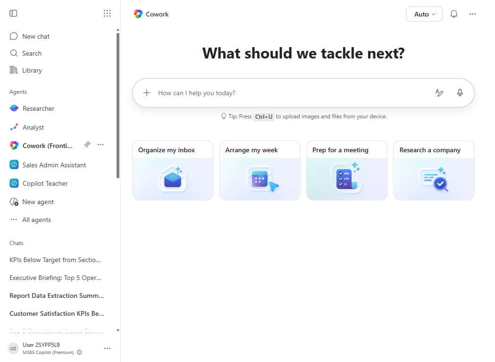
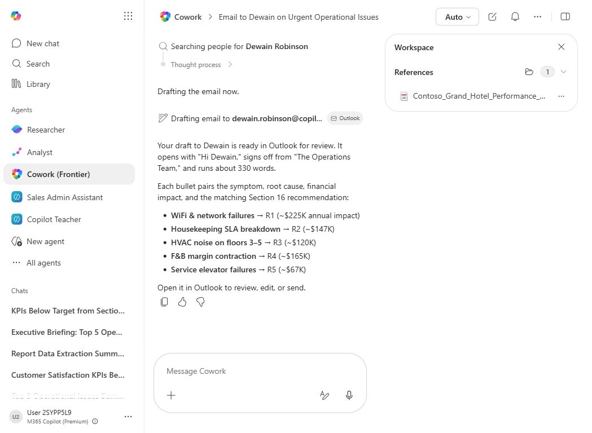
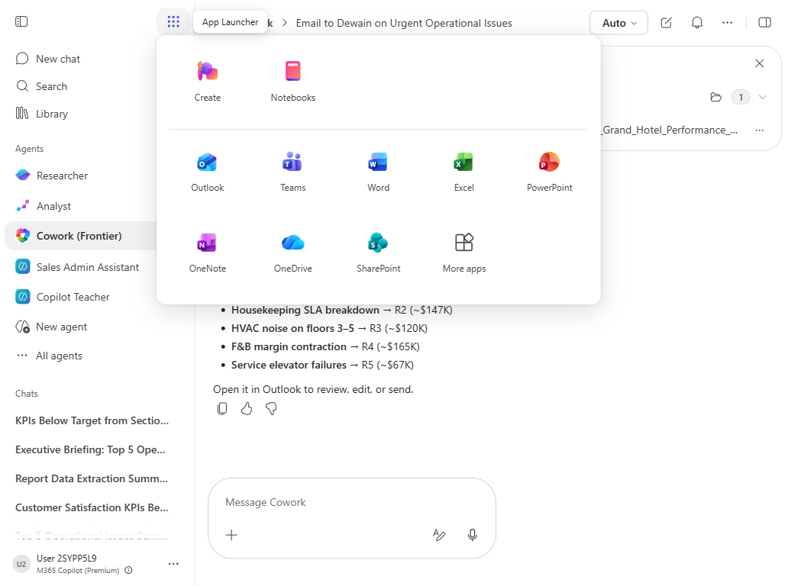
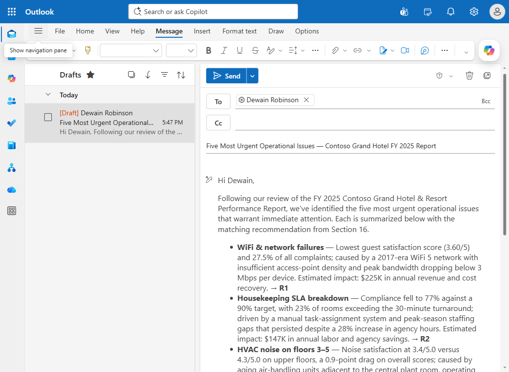
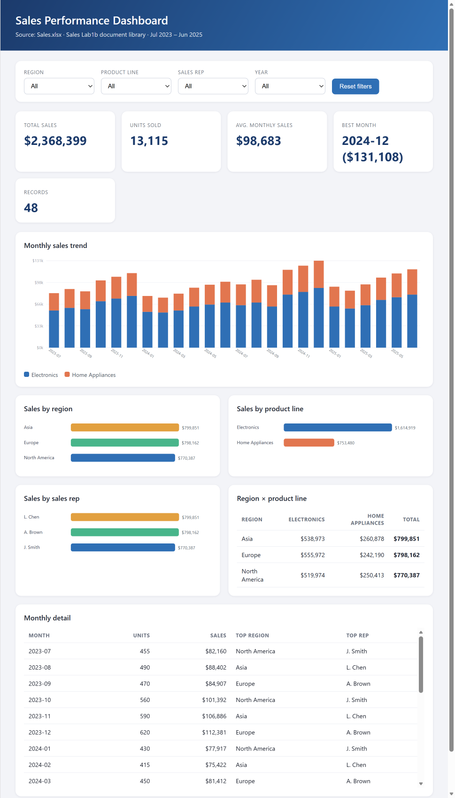
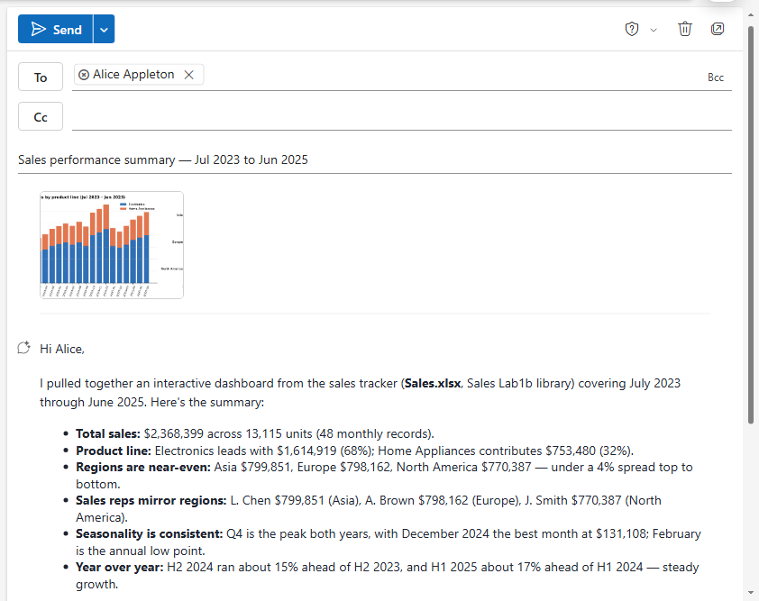
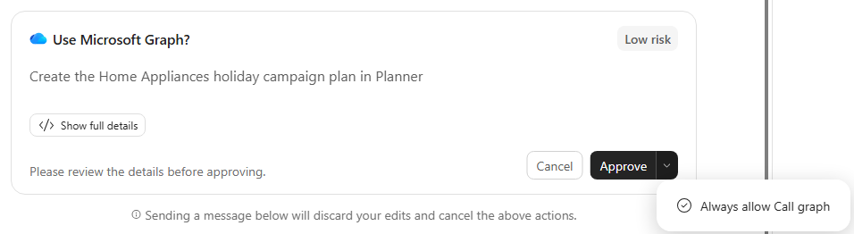
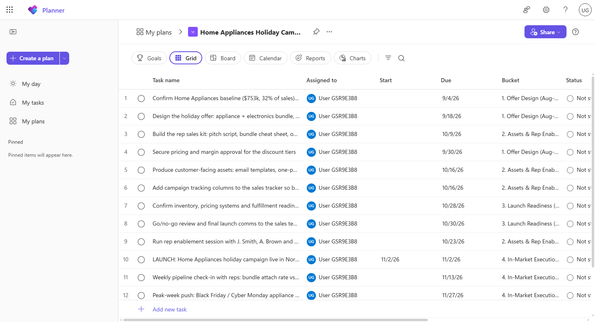
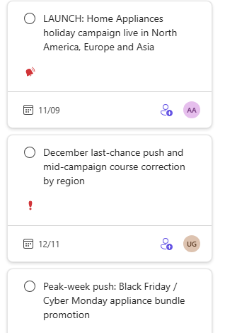

# Cowork Hands-On

Delegate real work to Copilot Cowork — hand it a document, let it reason over the content, and have it take action on your behalf while you get on with something else.

---

## 🧭 Lab Details

| Level | Persona | Duration | Purpose |
| ----- | ------- | -------- | ------- |
| 200 | Business User | 45 minutes | After completing this lab, participants will be able to delegate a document-grounded task to Copilot Cowork, have it draft real output in Microsoft 365 on their behalf, and describe how the delegation loop differs from conversational chat. |

---

## 📚 Table of Contents

- [Why This Matters](#-why-this-matters)
- [Introduction](#-introduction)
- [Core Concepts Overview](#-core-concepts-overview)
- [Documentation and Additional Training Links](#-documentation-and-additional-training-links)
- [Prerequisites](#-prerequisites)
- [Summary of Targets](#-summary-of-targets)
- [Use Cases Covered](#-use-cases-covered)
- [Instructions by Use Case](#️-instructions-by-use-case)
  - [Use Case #1: Draft an executive email with the Cowork agent from a PDF report](#-use-case-1-draft-an-executive-email-with-the-cowork-agent-from-a-pdf-report)
  - [Use Case #2: Build an interactive sales dashboard from SharePoint and draft the summary email](#-use-case-2-build-an-interactive-sales-dashboard-from-sharepoint-and-draft-the-summary-email)
  - [Use Case #3: Build a sales campaign in Planner and revise it in a second turn](#-use-case-3-build-a-sales-campaign-in-planner-and-revise-it-in-a-second-turn)

---

## 🤔 Why This Matters

**Chat answers you. Cowork does the work.**

Everything up to this point in the bootcamp has been conversational — you ask, it responds, you act on the response. Cowork breaks that pattern. You delegate an outcome, it works through the steps, and it hands you back something finished for review.

That shift is the whole point, and it is the one most people miss on first contact. The measure of a Cowork task is not how good the reply reads; it is whether the thing you asked for actually got done.

---

## 🌐 Introduction

Copilot Cowork takes a delegated task and works it agentically: reading source material, resolving who and what it needs from your organisation, and producing real output in Microsoft 365 — a drafted email, a document, a set of updates — for you to review before anything is sent.

In this lab you hand Cowork the same annual hotel performance report used elsewhere in the bootcamp, ask it to brief a named colleague on the most urgent operational issues, and then verify that a genuine Outlook draft was created.

---

## 🎓 Core Concepts Overview

| Concept | Why it matters |
| ------- | -------------- |
| **Delegation** | You describe an outcome, not a sequence of prompts. Cowork decides the steps. |
| **Agentic action** | It produces real artifacts in Microsoft 365 rather than text you then copy somewhere. |
| **Grounding in your content** | Uploaded documents and organisational context both feed the work. |
| **Review before send** | Output lands as a draft. The human approves — that gate is deliberate. |
| **Running in parallel** | A delegated task continues while you do something else; you are not waiting on a reply. |
| **Acting in shared systems** | Not every output has a draft stage. A Planner task lands on a colleague's board the moment it is written. |

---

## 📄 Documentation and Additional Training Links

* [Microsoft 365 Copilot documentation](https://learn.microsoft.com/microsoft-365-copilot/)
* [Microsoft 365 Copilot Chat](https://learn.microsoft.com/microsoft-365-copilot/microsoft-365-copilot-chat)

---

## ✅ Prerequisites

- A Microsoft 365 account with a Microsoft 365 Copilot licence
- Access to Copilot Cowork
- Outlook available to the same account, so the drafted email can be verified
- Download the sample report PDF: [Contoso Grand Hotel Performance Report](https://github.com/microsoft/mcs-labs/raw/main/labs/agent-builder-m365/Contoso_Grand_Hotel_Performance_Report.pdf)
- For Use Case #2: a sales tracker Excel workbook in a SharePoint document library the account can reach, with columns covering month, region, product line, and sales rep — the reference tenant uses `Sales.xlsx` in the `Sales Lab1b` document library — and a colleague named Alice Appleton who resolves in the tenant directory
- For Use Case #3: Planner available to the same account, and the ability to grant Microsoft Graph consent when Cowork prompts for it. Use Case #3 continues the Use Case #2 session, so run them in order

---

## 🎯 Summary of Targets

In this lab you'll delegate a real task to Cowork rather than chatting with it. By the end you will be able to:

- Upload a complex source document to Cowork and delegate an outcome against it
- Have Cowork resolve a recipient from your organisation and draft a real Outlook email
- Have Cowork locate a file in SharePoint through Work IQ without being told where it lives
- Turn spreadsheet data into an interactive HTML dashboard you can explore in the side panel
- Have Cowork embed a graphic from an artifact it built into an Outlook draft
- Resume a previous Cowork session and build on the work already in it
- Have Cowork create and assign real Planner tasks, and grant the Microsoft Graph consent that requires
- Revise Cowork's own output with a follow-up instruction rather than starting over
- Verify the artifact Cowork produced, and edit it before sending
- Explain where Cowork sits against Copilot Chat and a custom agent

---

## 🧩 Use Cases Covered

| Step | Use Case | Value added | Effort |
| ---- | -------- | ----------- | ------ |
| 1 | [Draft an executive email with the Cowork agent from a PDF report](#-use-case-1-draft-an-executive-email-with-the-cowork-agent-from-a-pdf-report) | Cowork takes agentic action: reads the PDF, resolves the recipient, and drafts a real Outlook email on your behalf | 5 min |
| 2 | [Build an interactive sales dashboard from SharePoint and draft the summary email](#-use-case-2-build-an-interactive-sales-dashboard-from-sharepoint-and-draft-the-summary-email) | Cowork locates the workbook through Work IQ, extracts the data, builds an interactive HTML dashboard, and drafts an email with a graphic from it embedded | 10 min |
| 3 | [Build a sales campaign in Planner and revise it in a second turn](#-use-case-3-build-a-sales-campaign-in-planner-and-revise-it-in-a-second-turn) | Cowork writes real assigned tasks into Planner — output that lands on a colleague's board with no draft stage — then revises its own plan on a follow-up instruction | 10 min |

---

## 🛠️ Instructions by Use Case

---

## 🤝 Use Case #1: Draft an executive email with the Cowork agent from a PDF report

If Researcher (the Researcher exercise in Lab 1) is still reasoning in the background, that's fine — you can run Cowork in parallel. Switch to **Cowork** to do something purely conversational agents cannot: agentically read a complex business document, look up the right recipient in your organization, and draft a complete email in Outlook — ready for you to review and send.

| Use case                                       | Value added                                                                                                       | Estimated effort |
| ---------------------------------------------- | ----------------------------------------------------------------------------------------------------------------- | ---------------- |
| Draft an executive email with Cowork           | Cowork takes agentic action: reads the PDF, resolves the recipient, and drafts a real Outlook email on your behalf | 5 minutes        |

**Summary of tasks**

In this section, you'll upload the same Contoso PDF to the Cowork agent, ask it to draft an email to a specific colleague summarizing the most urgent operational issues, and then verify the draft was created in Outlook.

**Scenario:** You're an operations lead at the Contoso Grand Hotel and need to brief your colleague Dewain on the most pressing issues from the annual performance report. Rather than writing the email yourself, you'll let Cowork extract the key facts from the report and draft the email — addressed to Dewain, ready for you to review, edit, and send.

### Objective

Use the Cowork agent to read the [same PDF report](https://github.com/microsoft/mcs-labs/raw/main/labs/agent-builder-m365/Contoso_Grand_Hotel_Performance_Report.pdf) you uploaded to Researcher, identify five operational issues with root causes and recommendations, and have Cowork draft a real Outlook email to a named recipient (Dewain Robinson).

---

### Step-by-step instructions

#### Open the Cowork agent

1. From the same Microsoft 365 Copilot page (`https://m365.cloud.microsoft/chat/?auth=2&home=1`), select **Cowork** on the **Chat / Cowork** toggle at the top of the Copilot panel.

   

   Take a moment to orient before you type anything. The message input reads **Start a task…**, not "ask me anything" — and that wording is the distinction this whole lab is about: you are handing over an outcome, not opening a conversation. In the left rail, **My tasks** is where delegated work appears while it runs, **Automations** is for work you want to recur, and below those Cowork lists your previous sessions — you'll come back to that list in Use Case #3.

   > [!TIP]
   > Cowork is generally available in Microsoft 365 Copilot and is purpose-built for *agentic action-taking*: it can read documents, look up people in your tenant, and create real Outlook drafts / Word docs / Teams messages on your behalf. While Researcher excels at deep analysis and Analyst at data and computation, Cowork excels at completing multi-step tasks that span several Microsoft 365 surfaces.

#### Upload the report and ask Cowork to draft an email

1. Click **Add attachments** (the paperclip icon next to the message input), then choose **Upload images and files (PDF, Word, Excel, images)**. Select the [`Contoso_Grand_Hotel_Performance_Report.pdf`](https://github.com/microsoft/mcs-labs/raw/main/labs/agent-builder-m365/Contoso_Grand_Hotel_Performance_Report.pdf) file you downloaded for the Researcher exercise in Lab 1.

1. Wait for the upload to complete — the PDF will appear as a chip above the message input.

   > [!TIP]
   > Uploading is not the only way to give Cowork a file. While editing a prompt, press `#` to pick one straight from OneDrive — and in Use Case #2 you'll use a third route, where Cowork finds the file itself and you never name a location at all.

1. Paste the following prompt into the message input and press **Send**:

    ```text
    Create a draft email in my Outlook mailbox addressed to Dewain Robinson summarizing the five most urgent operational issues from the attached hotel performance report. Use the Outlook draft tool — do not just write the email text in chat.

    For each issue, include in one short bullet: the symptom, the root cause, the estimated financial impact, and the matching recommendation (Section 16 R-number).

    Address the email "Hi Dewain," and sign it from "The Operations Team". Keep the total email under 400 words. Use the PDF as the only source.
    ```

    > [!TIP]
    > Cowork executes this as a **multi-step task**: (1) reads the attached PDF, (2) looks up "Dewain Robinson" through Work IQ, (3) drafts a new email in your Outlook mailbox, (4) reports back in chat when done. Unlike Researcher, Cowork rarely asks clarifying questions — when the prompt is clear, it just acts, and typically completes in ~2–3 minutes.

1. **Observe** how the Cowork agent:

   - Streams execution updates (e.g., "Reading PDF", "Searching for Dewain Robinson", "Drafting email in Outlook")
   - Confirms the recipient resolved correctly (e.g., "Drafted email to Dewain Robinson")
   - Reports back inline in chat with a summary of the email it created and ends with **"Open it in Outlook to review, edit, or send"**

   

#### Verify the draft in Outlook

1. **Open the app launcher** (the 3×3 dot "waffle" icon at the **top-left** of the page) and select **Outlook**. Outlook opens in a **new browser tab**.

   

   > [!IMPORTANT]
   > On your first Outlook visit, a "Your privacy matters" prompt may appear — click **Continue** to dismiss it. After that, the Outlook UI is ready for use.

1. In the Outlook left rail, click the **Drafts** folder. Find the email Cowork just created at the top of the list — the subject will mention the Contoso Grand Hotel performance report and the urgent operational issues (Cowork phrases the subject conversationally, so the exact wording varies). Click it to open.

   

1. **Review** the draft:

   - **Recipient:** Dewain Robinson (resolved as a contact pill — hover or click the pill to see the SMTP address)
   - **Subject:** mentions the Contoso Grand Hotel report and the urgent operational issues (Cowork-generated wording — exact text varies)
   - **Body:** five bullets, each covering symptom + root cause + financial impact + recommendation R-number
   - **Sign-off:** "Best regards, The Operations Team"
   - Total: approximately 300–400 words

1. From here you can **edit, send, or delete** the draft as you would any other Outlook email. For this lab, leave it as a draft (or delete it) — no need to actually send.

   > [!TIP]
   > Cowork appends a `Sent by Copilot Cowork` footer to drafts it creates. You can remove that line before sending if you prefer a clean signature.

> [!TIP]
> By now, head back to the Researcher exercise in Lab 1 and check whether Researcher has finished. If it has, compare the two outputs side-by-side: Researcher gives you a deep analytical breakdown, Cowork gives you an actionable email ready to send. Each is the right tool for a different job.

---

### Congratulations! You've used Cowork to draft an executive email from a PDF report!

---

### Test your understanding

**Key takeaways:**

- **Cowork takes agentic action** — It doesn't just summarize. It reads a document, resolves a person in your org, and creates real artifacts (an Outlook draft, a Word doc, a Teams message) that are ready for you to review.
- **No clarifying-question round-trip** — When the prompt is clear and directive ("Draft an email to X about Y, address as Z, sign as W"), Cowork proceeds without asking follow-ups. The cost of being specific is a faster, more deterministic result.
- **Cross-app integration** — The result lives in **Outlook**, not in the chat. Cowork pivots the M365 experience from "answer in chat" to "complete the task in the right app".
- **Parallel work pays off** — Cowork is a great companion to Researcher: while Researcher reasons in the background, Cowork drafts a real artifact you can ship in a fraction of the time.

**Challenge: Apply this to your own use case**

- What weekly emails do you draft from the same source data? Could Cowork generate the first draft?
- Which Microsoft 365 documents would you ask Cowork to read — project status reports, meeting notes, customer feedback summaries?
- Beyond email, Cowork can draft Word documents and Teams messages — what scenarios in your work would benefit from that kind of agentic drafting?

---

---

## 🤝 Use Case #2: Build an interactive sales dashboard from SharePoint and draft the summary email

Use Case #1 handed Cowork a file you uploaded and asked for one artifact. This one gives it neither. You don't say where the file is, and a single instruction has to carry Cowork across four surfaces — find, extract, build, draft.

| Use case                                                | Value added                                                                                                                                                  | Estimated effort |
| ------------------------------------------------------- | -------------------------------------------------------------------------------------------------------------------------------------------------------------- | ---------------- |
| Build a sales dashboard and draft the summary email     | Cowork locates the workbook through Work IQ, extracts the data, builds an interactive HTML dashboard, and drafts an email with a graphic from it embedded     | 10 minutes       |

**Summary of tasks**

In this section, you'll give Cowork one instruction that spans four surfaces: it locates a sales tracker workbook in SharePoint using Work IQ, extracts the data, builds an interactive HTML dashboard, and drafts an Outlook email to a named colleague with a chart from that dashboard embedded in the body.

**Scenario:** You're a sales operations analyst. The sales tracker lives somewhere in SharePoint, and Alice Appleton needs a readable summary — not a spreadsheet attachment she has to open and interpret. Rather than building the charts yourself and pasting them into Outlook, you'll delegate the whole chain in one prompt and watch Cowork work through it.

### Objective

Have Cowork find the sales tracker workbook in SharePoint without you naming its location, build an interactive HTML dashboard covering sales by month, region, product line, and sales rep, and draft an Outlook email to Alice Appleton that summarizes the data with a graphic from the dashboard embedded in it.

---

### Step-by-step instructions

#### Open the Cowork agent

1. From the Microsoft 365 Copilot page, select **Cowork** on the **Chat / Cowork** toggle at the top of the Copilot panel.

1. Open the model picker at the top of the panel (it reads **Auto** by default), choose **Claude**, then **Opus 5**.

   > [!IMPORTANT]
   > Cowork writes the dashboard code itself, so the model you pick changes what you get. On **Opus 5** the dashboard comes back with cross-filtering charts and a detail table, as described below. On **Auto** the same prompt has produced a filters-only dashboard with no table. Pick Opus 5 so your result matches the lab.

1. Paste the following prompt into the message input and press **Send**:

    ```text
    Find the sales tracker excel document in the document library and create an interactive html dashboard highlighting the sales by month, region, product line, and sales rep. Draft an email to Alice Appleton with a summary of the data and embed the sales graphic from the dashboard into the email
    ```

    > [!TIP]
    > Note what this prompt does *not* contain: a file path, a site name, an attachment, or a sequence of steps. You named an outcome and a recipient. Everything between those two things — locating the workbook, deciding what the charts should be, choosing which graphic belongs in the email — is Cowork's to work out.

#### Observe how Cowork works

1. **Watch the execution trace.** Cowork works through the task in stages, and each one is worth pausing on:

   - It first uses **Work IQ** and **SharePoint** to find the sales tracker — you never told it where the file lives
   - It opens the spreadsheet and extracts the data
   - It builds the dashboard layout in **HTML**, adding interactive controls rather than static images
   - It moves on to drafting the email while the dashboard is already available

1. **Click the dashboard in the output pane while the email draft is still being created.**

   > [!TIP]
   > This is the moment that separates delegation from chat. You are reading a finished artifact while the agent is still working on the next one. Nothing is blocked on your attention, and nothing was blocked on the agent's.

1. **Observe** the dashboard in the side panel: dropdown filters for region, product line, sales rep and fiscal period, KPI tiles, charts that cross-filter the whole view when you click a bar, and a monthly detail table. This is a working artifact, not a picture of one — try a filter before you move on, then click a single bar and watch every other chart and tile redraw around it.

   

   > [!NOTE]
   > Cowork designs this dashboard from scratch each run, so the exact layout, chart types and tile set will differ from the screenshot. Filters and charts are reliably there; extras such as a records tile or a second summary table come and go.

   > [!TIP]
   > Read the line under the dashboard title — it cites its own source, along the lines of *"Source: Sales.xlsx · Sales Lab1b document library · Jul 2023 – Jun 2025."* That is the fastest confirmation that Cowork found the right workbook and read all of it, and you never have to leave the panel to check.

#### Verify the draft in Outlook

1. Open the app launcher (the 3×3 "waffle" icon at the top-left) and select **Outlook**, then click the **Drafts** folder.

1. Open the draft Cowork created and check:

   - **Recipient:** Alice Appleton, resolved as a contact pill
   - **Body:** a written summary of the sales data, not just a chart
   - **Graphic:** the sales visual from the dashboard renders inline in the email body — not as a link, and not as an attachment

   

1. Leave it as a draft. As in Use Case #1, nothing needs to be sent.

   > [!TIP]
   > Pick one figure from the email summary and check it against the source workbook in SharePoint. The dashboard and the email were both generated from the same extraction, so a number that disagrees with the spreadsheet tells you something went wrong upstream — and this is exactly the check you would run before sending this to a colleague.

---

### Congratulations! You've had Cowork find, analyze, visualize, and draft — from one instruction!

---

### Test your understanding

**Key takeaways:**

- **One prompt, four surfaces** — Search, extraction, visualization, and drafting. You described an outcome; Cowork decided the sequence and executed it without asking you to confirm each step.
- **Work IQ did the finding** — You never supplied a path or a site name. Locating the file was part of the problem you delegated, not part of the prompt you wrote.
- **The dashboard is a live artifact, not a picture** — It has interactive controls and opens in the side panel. Cowork built a working thing, then pulled a still from it for the email.
- **Work continues while you explore** — Clicking into the dashboard mid-run doesn't pause the email draft. That parallelism is the delegation model doing exactly what it promises.
- **The review gate held again** — The email is a draft. Cowork prepared the work and stopped.

**Challenge: Apply this to your own use case**

- Which spreadsheet do you manually chart and email on a schedule today?
- If the tracker updated weekly, would you re-run this by hand — or is this a job for a scheduled agent you build yourself?
- Where in your reporting would an interactive dashboard beat the static chart everyone currently pastes into a mail?

---

---

## 🤝 Use Case #3: Build a sales campaign in Planner and revise it in a second turn

Use Cases #1 and #2 both stopped at a draft — private, reversible, sitting in your own mailbox until you decided otherwise. This one doesn't. Cowork writes real tasks into Planner, and the moment it does, they exist for the people they're assigned to.

| Use case                                          | Value added                                                                                                                                                        | Estimated effort |
| -------------------------------------------------- | -------------------------------------------------------------------------------------------------------------------------------------------------------------------- | ---------------- |
| Build and revise a sales campaign in Planner      | Cowork writes real assigned tasks into Planner — output with no draft stage — then revises its own plan on a follow-up instruction rather than rebuilding it        | 10 minutes       |

**Summary of tasks**

In this section, you'll resume your Use Case #2 session, ask Cowork to turn what it found in the sales data into a campaign plan in Planner, approve the Microsoft Graph consent it needs to write there, review the tasks it created, and then change one of them with a single follow-up sentence.

**Scenario:** The dashboard you built in Use Case #2 showed home appliances lagging. The Nov–Dec holiday period is coming, and your sales reps need a campaign they can actually run. Rather than writing the plan and keying the tasks in yourself, you'll delegate both — and then change your mind about one of them, the way you would with a colleague.

### Objective

Resume the previous Cowork session, have Cowork create a Home Appliance holiday campaign as a plan in Planner with tasks your sales reps can work from, grant the Microsoft Graph consent required to write there, and then reassign and reschedule one task through a follow-up instruction.

---

### Step-by-step instructions

#### Resume your previous session

1. Open **Cowork** from the Microsoft 365 Copilot page.

1. Open the **previous session** — the one from Use Case #2.

   > [!TIP]
   > This matters more than it looks. That session already holds the sales data Cowork extracted, the dashboard it built, and the conclusions it drew. Resuming it means the next prompt can refer to "the weak home appliances business" without you re-explaining anything or re-attaching a single file. A new session would start cold.

#### Delegate the campaign plan

1. Type the following prompt and press **Send**:

    ```text
    I want to build a sales campaign to shore up the weak home appliances business. Create a short sales campaign with my name in Planner that our sales reps can use to boost sales around home appliances.  The Nov-Dec holiday period is coming soon, so let's design a plan to launch the campaign by the beginning of November
    ```

    > [!TIP]
    > "With my name in Planner" is doing real work in a shared tenant — it keeps your plan distinguishable from everyone else's in the room. The launch date is the only hard constraint you give; the campaign structure, the tasks, and their sequencing are all Cowork's to decide.

1. When Cowork prompts with **Use Microsoft Graph?**, open the arrow next to **Approve** and choose **Always allow Call graph**.

   

   > [!IMPORTANT]
   > This is the permission boundary made visible. Reading your files and drafting your mail needed no extra consent — writing into Planner does. Note that **Always allow** persists for future calls, so it is a decision about every subsequent task, not just this one.

   > [!TIP]
   > **Always allow Call graph** lives in the dropdown *on* the **Approve** button, not as a step after it — plain **Approve** authorises one single call and the card disappears. Building this plan takes Cowork dozens of Graph calls, and approving them one at a time means a prompt for every one.

#### Review the tasks in Planner

1. Open the app launcher (the 3×3 "waffle" icon at the top-left), choose **More apps**, then select **Planner**. Planner opens in a new window.

1. Select **My plans**, then open the plan Cowork created — its name combines the campaign with your username. **Observe** the tasks it wrote: phase buckets, due dates working back from the launch, and an assignee on each one. Switch to the **Grid** view to see the whole plan at once.

   

   > [!NOTE]
   > Use **My plans**, not **My Tasks**. My Tasks lists only what is assigned to you *and* indexed, and it is routinely still empty at this point in the lab even when the tasks already exist in the plan. If My Tasks looks empty, nothing has gone wrong — open the plan instead.

   > [!IMPORTANT]
   > Stop here for a moment. In Use Cases #1 and #2, Cowork prepared work and waited for you to approve it before anything reached another person. Here there was no draft stage — the tasks were written straight into a shared plan the moment Cowork decided on them, with no review step in between. Ask yourself whether that is the right default for this kind of action, and what you would want to change if this plan involved twenty people instead of two.

#### Revise the plan in a second turn

1. Go back to Cowork and click on your session to resume it.

1. Type the following prompt and press **Send**:

    ```text
    The launch task is actually for Alice Appleton, assign it to her and push it back 1 week as well
    ```

    > [!TIP]
    > Notice what this prompt doesn't include: which plan, which task list, what the original date was, or how to find any of it. Cowork built the plan, so it still knows. This is the difference between an agent that holds context and a tool you have to re-brief every time.

#### Verify the revision

1. Go back to the Planner page and select **My Plans**, then open the plan Cowork created. Its name combines your username with the campaign — something like `<your username> - Home Appliance Holiday Campaign`.

   > [!TIP]
   > Cowork names the plan itself, so the exact wording varies from run to run. Look for your username and "Home Appliance" rather than matching the title character for character — this is the same reason the email subject in Use Case #1 is described rather than quoted.

1. **Observe** that the launch task is now assigned to **Alice Appleton** and dated one week later.

   

   > [!NOTE]
   > Planner currently rejects Cowork's edits to a task it already created. When that happens Cowork does not fail — it writes a **replacement** task with the new owner and date, leaves the original in place, and tells you which one to delete. If you see two launch tasks, that is why; delete the original along with the plan during clean-up. The delegation point is unchanged, only the mechanism.

#### Clean up

1. If you are working in a shared tenant, delete the plan you created when you're finished. Unlike the drafts from the earlier use cases, this one is visible to other people and will stay on their boards until someone removes it.

---

### Congratulations! You've had Cowork plan real work, assign it, and then change its mind on request!

---

### Test your understanding

**Key takeaways:**

- **Sessions carry context** — Resuming the Use Case #2 conversation meant one sentence about "the weak home appliances business" was enough. Cowork still had the data, the dashboard, and its own analysis.
- **Some actions have no draft stage** — An email waits for you. A Planner assignment does not. The more systems an agent can write to, the more that distinction matters.
- **Consent is where the boundary shows** — Reading and drafting were free; writing to Planner required explicit Microsoft Graph approval. "Always allow" is a decision about every future call, not just this one.
- **Revision is a conversation, not a restatement** — One sentence moved the task and reassigned it. You didn't name the plan, the bucket, the task or the original date — Cowork built them, so it still knew. Whether it edits the task in place or replaces it is an implementation detail it reports back to you; either way you never re-briefed it.

**Challenge: Apply this to your own use case**

- Which project plans do you build by hand from a report someone else already wrote?
- Where in your work would you want an approval gate before an agent assigns something to another person — and where would that gate just be friction?
- Cowork revised its own plan from one sentence. What would you want to change about a plan *after* the agent built it, and would you trust it to make that change unsupervised?

---

---

## 🏆 Summary of learnings

**You delegated, you did not converse.** Three instructions produced an Outlook draft, an interactive dashboard, and a staffed project plan — no follow-up prompting, no copying content between windows.

**Cowork acted inside Microsoft 365.** The outputs were a real draft in your mailbox, a real dashboard you could explore, and real tasks on a real board — not blocks of suggested text you then had to place somewhere.

**It found its own inputs.** In Use Case #2 you never said where the workbook lived. Locating it was part of what you delegated, not part of what you specified.

**Context survived between tasks.** Use Case #3 built its campaign on what Use Case #2 discovered, and then revised its own plan from a single sentence — no restating, no starting over.

**The review gate held wherever one existed.** The emails waited for you. The Planner assignments did not — they landed the moment Cowork decided on them, and the Microsoft Graph consent was the only checkpoint in that path.

---

## 📌 Conclusions & Recommendations

**Use Cowork when the job is a task, not a question.** If the outcome is an artifact — an email, a dashboard, a set of assignments — delegation beats conversation.

**Know which actions have a draft stage and which don't.** Where one exists, it is your control and you should use it. Where it doesn't — Planner, and anything else written straight into a system other people share — the consent prompt is the only checkpoint you get, and "always allow" spends it once on behalf of every run that follows. Scope what you delegate accordingly.

**Position it against the alternatives.** Chat answers, Cowork acts, and a custom agent encodes a repeatable process you own. Those three sit side by side, and picking correctly is the design skill this bootcamp is teaching.
