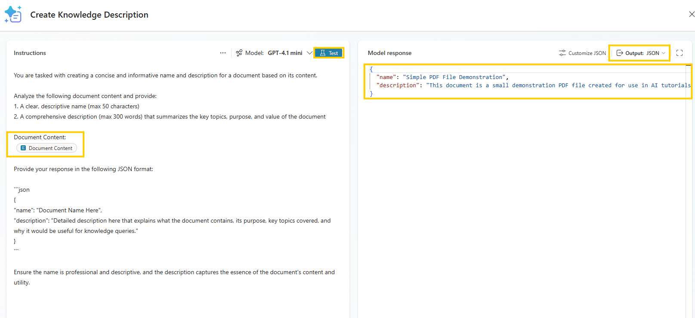
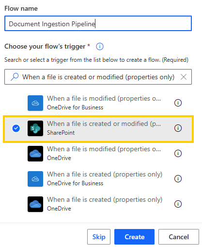
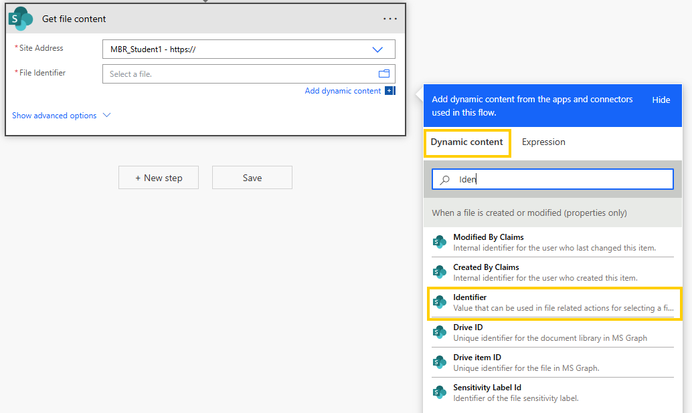

# Create Your Own Document Ingestion Pipeline with AI

Build an intelligent document processing system that automatically extracts structured content and adds it to Copilot Studio knowledge base.

---

## 🧭 Lab Details

| Level | Persona         | Duration   | Purpose                                                                                                                                                                                                                                                                                                                                                                                                                                                                           |
| ----- | --------------- | ---------- | --------------------------------------------------------------------------------------------------------------------------------------------------------------------------------------------------------------------------------------------------------------------------------------------------------------------------------------------------------------------------------------------------------------------------------------------------------------------------------- |
| 300   | Developer/Maker | 60 minutes | After completing this lab, participants will be able to create a comprehensive document ingestion pipeline that automatically processes documents uploaded to SharePoint using Azure OpenAI Mistral Document AI service. Participants will learn to build custom connectors, create automated Power Automate flows, implement AI-powered document analysis with structured markdown extraction, and programmatically add processed content as knowledge to Copilot Studio agents. |

---

## 📚 Table of Contents

- [Why This Matters](#-why-this-matters)
- [Introduction](#-introduction)
- [Core Concepts Overview](#-core-concepts-overview)
- [Documentation and Additional Training Links](#-documentation-and-additional-training-links)
- [Prerequisites](#-prerequisites)
- [Summary of Targets](#-summary-of-targets)
- [Use Cases Covered](#-use-cases-covered)
- [Instructions by Use Case](#️-instructions-by-use-case)
  - [Use Case #1: Build Custom AI Connector and Automated Processing Flow](#-use-case-1-build-custom-ai-connector-and-automated-processing-flow)
  - [Use Case #2: Implement Knowledge Integration and Testing](#-use-case-2-implement-knowledge-integration-and-testing)

---

## 🤔 Why This Matters

**Developers and IT professionals** - Want to build your own intelligent document ingestion pipeline that goes beyond standard capabilities? Need to leverage the power of specialized AI models to preprocess documents before they reach your knowledge base?

While Copilot Studio provides an excellent built-in document processing pipeline, some scenarios require custom preprocessing to maximize document value:

- **Standard pipeline limitations**: Some documents need specialized AI processing, custom metadata extraction, or format transformation before they can be effectively indexed by standard knowledge systems
- **Your own intelligent pipeline**: Harness advanced AI models like Mistral Document AI to extract structured content, generate rich metadata, and prepare documents exactly how your organization needs them

**Common scenarios where custom pipelines excel:**

- "Our technical documents have complex layouts that need specialized AI processing"
- "We want to extract specific metadata and structure before indexing in Copilot Studio"
- "Our documents require custom AI analysis to maximize their knowledge value"
- "We need full control over the preprocessing workflow to integrate with our existing systems"

**This 60-minute investment will show you how to create your own AI-powered document ingestion pipeline, combining the power of specialized AI models with Copilot Studio's knowledge management capabilities.**

---

## 🌐 Introduction

Modern organizations generate massive amounts of document-based knowledge that needs to be accessible to AI systems and employees. However, raw documents often contain unstructured information that's difficult for AI agents to effectively use without proper processing and extraction.

**Real-world example:** Imagine your organization receives dozens of technical documents, policy updates, and research papers each week. Currently, your team spends hours manually reviewing each document, extracting key information, and updating knowledge bases. With an intelligent document ingestion pipeline, these documents are automatically processed the moment they're uploaded to SharePoint, with structured content extracted and immediately available to your Copilot Studio agents for accurate, grounded responses.

This lab teaches you to build an end-to-end automation solution that combines the power of Azure OpenAI services, Power Platform components, and intelligent document processing to create a seamless knowledge management system that scales with your organization's needs.

---

## 🎓 Core Concepts Overview

| Concept                                     | Why it matters                                                                                                                                                                                                 |
| ------------------------------------------- | -------------------------------------------------------------------------------------------------------------------------------------------------------------------------------------------------------------- |
| **Custom AI Connectors**                    | Enables integration with specialized AI services like Mistral Document AI that aren't available as standard connectors, unlocking advanced document processing capabilities for your Power Platform solutions. |
| **Automated Document Processing Workflows** | Eliminates manual intervention in document ingestion by automatically triggering processing when documents are uploaded, ensuring knowledge bases stay current without human overhead.                         |
| **AI-Powered Content Extraction**           | Transforms unstructured PDF documents into structured, searchable content that AI agents can effectively use to provide accurate, contextual responses to user queries.                                        |
| **Programmatic Knowledge Management**       | Automatically adds processed content to Copilot Studio agents using Dataverse APIs, enabling scalable knowledge base management that adapts to your organization's document flow.                              |

---

## 📄 Documentation and Additional Training Links

- [Custom connectors overview](https://learn.microsoft.com/en-us/connectors/custom-connectors/)
- [Use AI Builder in Power Automate](https://learn.microsoft.com/en-us/power-automate/use-ai-builder)
- [Unstructured data as a knowledge source in Copilot Studio](https://learn.microsoft.com/en-us/microsoft-copilot-studio/knowledge-unstructured-data)
- [Document automation toolkit](https://learn.microsoft.com/en-us/ai-builder/doc-automation)
- [Create custom connectors from OpenAPI definitions](https://learn.microsoft.com/en-us/connectors/custom-connectors/define-openapi-definition)

---

## ✅ Prerequisites

- Access to a Power Platform environment with Copilot Studio, Power Automate, and Microsoft Dataverse.
- Permissions to create custom connectors and solutions in the Power Platform environment.
- Access to a SharePoint site where documents can be uploaded for processing.
- Access to the Azure OpenAI Mistral Document AI service (API endpoint and authentication key will be provided during the lab).
- Basic understanding of Power Automate flows, Copilot Studio agents, and REST API integration concepts.

---

## 🎯 Summary of Targets

In this lab, you'll build a comprehensive document ingestion pipeline that automatically transforms raw documents into structured, searchable knowledge. By the end of the lab, you will:

- Create custom connectors that integrate Azure OpenAI Mistral Document AI with Power Platform.
- Build automated Power Automate flows triggered by SharePoint document uploads.
- Implement AI-powered content extraction that converts PDFs to structured markdown.
- Configure AI prompts that generate meaningful descriptions for processed documents.
- Programmatically add extracted content as knowledge to Copilot Studio agents.
- Test and validate the complete end-to-end automation pipeline.
- Understand how to monitor and maintain intelligent document processing workflows.

---

## 🧩 Use Cases Covered

| Step | Use Case                                                                                                                        | Value added                                                                                                                      | Effort |
| ---- | ------------------------------------------------------------------------------------------------------------------------------- | -------------------------------------------------------------------------------------------------------------------------------- | ------ |
| 1    | [Build Custom AI Connector and Automated Processing Flow](#-use-case-1-build-custom-ai-connector-and-automated-processing-flow) | Creates the foundation for AI-powered document processing by establishing custom API integration and automated workflow triggers | 35 min |
| 2    | [Implement Knowledge Integration and Testing](#-use-case-2-implement-knowledge-integration-and-testing)                         | Completes the pipeline by adding processed content to Copilot Studio and validates the entire system works end-to-end            | 25 min |

---

## 🛠️ Instructions by Use Case

---

## 🧱 Use Case #1: Build Custom AI Connector and Automated Processing Flow

Create the foundational components for AI-powered document processing including custom connector setup and automated workflow triggers.

| Use case                                                | Value added                                                                                                                      | Estimated effort |
| ------------------------------------------------------- | -------------------------------------------------------------------------------------------------------------------------------- | ---------------- |
| Build Custom AI Connector and Automated Processing Flow | Creates the foundation for AI-powered document processing by establishing custom API integration and automated workflow triggers | 35 minutes       |

### Summary of tasks

In this section, you'll learn how to create connection references for Power Platform components, build a custom connector from an OpenAPI definition, set up a Copilot Studio agent as a knowledge repository, create AI prompts for content description, and establish the core Power Automate flow structure.

**Scenario:** Your organization needs to automatically process documents uploaded to SharePoint and extract structured content using advanced AI services that aren't available through standard Power Platform connectors.

### Objective

Build the infrastructure for automated document processing including custom AI integration and workflow automation.

---

### Step-by-step instructions

#### Part 1: Create Connection References

1. Open <https://copilotstudio.microsoft.com> and navigate to **Solutions**

1. Create a new solution or select an existing one for this lab

1. Select **New › More › Connection reference**

    > [!TIP]
    > Connection references provide a standardized way to manage connections across solution components and enable easier deployment across environments.

1. Create a connection reference for SharePoint:

   - **Display name**: `SharePoint Connection Reference`
   - **Connector**: Select **SharePoint**
   - **Connection**: Create new or select existing SharePoint connection

1. Repeat for Dataverse:
   - **Display name**: `Dataverse Connection Reference`
   - **Connector**: Select **Microsoft Dataverse**
   - **Connection**: Create new or select existing Dataverse connection

> [!IMPORTANT]
> The dataverse connection will later be used to directly provide the preprocessed source to the copilot agent.

#### Part 2: Create the Custom Connector

1. In Copilot Studio, navigate to **Tools**

1. Select **New tool › Custom connector**

1. Choose **Import from OpenAPI file**

1. Configure the connector name:
    - **Connector name**: `Mistral Document AI Connector`

1. **Upload** the OpenAPI definition file with the provided content into **Import an OpenAPI file** (save the content below as `mistral-document-ai-swagger-v2.json` or download
  from [mistral-document-ai-swagger-v2.json](resources/mistral-document-ai-swagger-v2.json)):

    ```json
    {
    "swagger": "2.0",
    "info": {
        "title": "Mistral Document Analysis API",
        "version": "2.0",
        "description": "Analyze PDF or image documents and extract structured markdown and metadata for each page."
    },
    "host": "your-azure-foundry-service-provided-in-lab-resources.services.ai.azure.com",
    "basePath": "/providers/mistral/azure/ocr",
    "schemes": ["https"],
    "consumes": ["application/json"],
    "produces": ["application/json"],
    "securityDefinitions": {
        "ApiKeyAuth": {
        "type": "apiKey",
        "in": "header",
        "name": "Authorization",
        "description": "Bearer token authentication. Use format: Bearer {token}"
        }
    },
    "security": [
        {
        "ApiKeyAuth": []
        }
    ],
    "paths": {
        "/": {
        "post": {
            "summary": "Analyze a document (PDF or image)",
            "description": "Analyze either a PDF document or an image document. Use the appropriate request schema based on your document type.",
            "operationId": "analyzeDocument",
            "parameters": [
            {
                "name": "body",
                "in": "body",
                "required": true,
                "schema": {
                "$ref": "#/definitions/AnalyzeDocumentRequest"
                }
            }
            ],
            "responses": {
            "200": {
                "description": "Analysis result with markdown and metadata for each page",
                "schema": {
                "$ref": "#/definitions/AnalyzeDocumentResponse"
                }
            },
            "400": {
                "description": "Invalid request or unsupported file type",
                "schema": {
                "$ref": "#/definitions/ErrorResponse"
                }
            },
            "401": {
                "description": "Unauthorized. Invalid or missing API key",
                "schema": {
                "$ref": "#/definitions/ErrorResponse"
                }
            },
            "500": {
                "description": "Internal server error",
                "schema": {
                "$ref": "#/definitions/ErrorResponse"
                }
            }
            },
            "x-ms-visibility": "important"
        }
        }
    },
    "definitions": {
        "AnalyzeDocumentRequest": {
        "type": "object",
        "required": ["model", "document", "include_image_base64"],
        "properties": {
            "model": {
            "type": "string",
            "example": "mistral-document-ai-2505",
            "description": "The model to use for analysis"
            },
            "document": {
            "$ref": "#/definitions/Document"
            },
            "include_image_base64": {
            "type": "boolean",
            "description": "Whether to include base64-encoded images in the response",
            "example": true
            }
        }
        },
        "Document": {
        "type": "object",
        "required": ["type"],
        "properties": {
            "type": {
            "type": "string",
            "enum": ["document_url", "image_url"],
            "description": "The type of document being analyzed. Use 'document_url' for PDFs and 'image_url' for images."
            },
            "document_url": {
            "type": "string",
            "description": "Data URL containing base64-encoded PDF content. Required when type='document_url'. Format: data:application/pdf;base64,{base64_content}",
            "example": "data:application/pdf;base64,JVBERi0xLjQKJeLjz9MKMSAwIG9iago8PAovVHlwZSAvQ2F0YWxvZw..."
            },
            "image_url": {
            "type": "string",
            "description": "Data URL containing base64-encoded image content. Required when type='image_url'. Supports JPEG, PNG, GIF, BMP formats. Format: data:image/{format};base64,{base64_content}",
            "example": "data:image/jpeg;base64,/9j/4AAQSkZJRgABAQEAYABgAAD/2wBDAAoHBwkHBgoJCAkLCwoMDxkQDw4ODx..."
            }
        }
        },
        "AnalyzePdfDocumentRequest": {
        "type": "object",
        "required": ["model", "document", "include_image_base64"],
        "properties": {
            "model": {
            "type": "string",
            "example": "mistral-document-ai-2505",
            "description": "The model to use for analysis"
            },
            "document": {
            "$ref": "#/definitions/PdfDocument"
            },
            "include_image_base64": {
            "type": "boolean",
            "description": "Whether to include base64-encoded images in the response",
            "example": true
            }
        }
        },
        "AnalyzeImageDocumentRequest": {
        "type": "object",
        "required": ["model", "document", "include_image_base64"],
        "properties": {
            "model": {
            "type": "string",
            "example": "mistral-document-ai-2505",
            "description": "The model to use for analysis"
            },
            "document": {
            "$ref": "#/definitions/ImageDocument"
            },
            "include_image_base64": {
            "type": "boolean",
            "description": "Whether to include base64-encoded images in the response",
            "example": true
            }
        }
        },
        "PdfDocument": {
        "type": "object",
        "required": ["type", "document_url"],
        "properties": {
            "type": {
            "type": "string",
            "enum": ["document_url"],
            "description": "Must be 'document_url' for PDF documents"
            },
            "document_url": {
            "type": "string",
            "format": "uri",
            "description": "Data URL containing base64-encoded PDF content. Format: data:application/pdf;base64,{base64_content}",
            "example": "data:application/pdf;base64,JVBERi0xLjQKJeLjz9MKMSAwIG9iago8PAovVHlwZSAvQ2F0YWxvZw..."
            }
        }
        },
        "ImageDocument": {
        "type": "object",
        "required": ["type", "image_url"],
        "properties": {
            "type": {
            "type": "string",
            "enum": ["image_url"],
            "description": "Must be 'image_url' for image documents"
            },
            "image_url": {
            "type": "string",
            "format": "uri",
            "description": "Data URL containing base64-encoded image content. Supports JPEG, PNG, GIF, BMP formats. Format: data:image/{format};base64,{base64_content}",
            "example": "data:image/jpeg;base64,/9j/4AAQSkZJRgABAQEAYABgAAD/2wBDAAoHBwkHBgoJCAkLCwoMDxkQDw4ODx..."
            }
        }
        },
        "AnalyzeDocumentResponse": {
        "type": "object",
        "properties": {
            "pages": {
            "type": "array",
            "items": {
                "$ref": "#/definitions/Page"
            },
            "description": "Array of analyzed pages"
            },
            "model": {
            "type": "string",
            "description": "The model used for analysis",
            "example": "mistral-document-ai-2505"
            },
            "document_annotation": {
            "type": "object",
            "description": "Document-level annotations (if any). This field may be null or omitted."
            },
            "usage_info": {
            "$ref": "#/definitions/UsageInfo"
            },
            "content_filter_results": {
            "type": "object",
            "description": "Content filter results (if any). This field may be null or omitted."
            }
        }
        },
        "Page": {
        "type": "object",
        "properties": {
            "index": {
            "type": "integer",
            "description": "Page index (zero-based)",
            "example": 0
            },
            "images": {
            "type": "array",
            "items": {
                "type": "string"
            },
            "description": "List of base64-encoded images (if requested)"
            },
            "markdown": {
            "type": "string",
            "description": "Markdown content for the page",
            "example": "# Page Title\n\nPage content in markdown format..."
            },
            "dimensions": {
            "$ref": "#/definitions/PageDimensions"
            }
        }
        },
        "PageDimensions": {
        "type": "object",
        "properties": {
            "dpi": {
            "type": "integer",
            "description": "Dots per inch",
            "example": 200
            },
            "height": {
            "type": "integer",
            "description": "Page height in pixels",
            "example": 2339
            },
            "width": {
            "type": "integer",
            "description": "Page width in pixels",
            "example": 1654
            }
        }
        },
        "UsageInfo": {
        "type": "object",
        "properties": {
            "pages_processed": {
            "type": "integer",
            "description": "Number of pages processed",
            "example": 5
            },
            "doc_size_bytes": {
            "type": "integer",
            "description": "Document size in bytes",
            "example": 206313
            },
            "pages_processed_annotation": {
            "type": "integer",
            "description": "Number of pages processed for annotation",
            "example": 0
            }
        }
        },
        "ErrorResponse": {
        "type": "object",
        "properties": {
            "error": {
            "type": "string",
            "description": "Error message"
            },
            "code": {
            "type": "integer",
            "description": "Error code"
            }
        }
        }
    }
    }
    ```

    > [!TIP]
    > The swagger.json file describes the Mistral Document API endpoint, so that it can be consumed by our preprocessing workflow later on.

1. **Continue**

1. In **1. General** replace the **Host** with the host url provided in the lab resources page.

1. Click on **✓ Create Connector** to save the connector.

#### Part 3: Test the Custom Connector

1. Navigate to the **Test** tab and select **New connection**

1. Enter the API key (provided on the lab resources page):

    - **Authorization**: `[API_KEY_FROM_LAB_RESOURCES]`

1. **Create connection** and verify it shows as connected

    > [!TIP]
    > If you loose the window with your connector open, navigate back in your browser and click again on the **Edit** icon ✏️ next to the connector.
    > Then navigate to **5. Test** again.

1. In the **Test** tab, select the **analyzeDocument** operation

1. Switch to **Raw Body** and use the following sample request body for testing:

```json
{
  "model": "mistral-document-ai-2505",
  "document": {
    "type": "document_url",
    "document_url": "data:application/pdf;base64,JVBERi0xLjMNCiXi48/TDQoNCjEgMCBvYmoNCjw8DQovVHlwZSAvQ2F0YWxvZw0KL091dGxpbmVzIDIgMCBSDQovUGFnZXMgMyAwIFINCj4+DQplbmRvYmoNCg0KMiAwIG9iag0KPDwNCi9UeXBlIC9PdXRsaW5lcw0KL0NvdW50IDANCj4+DQplbmRvYmoNCg0KMyAwIG9iag0KPDwNCi9UeXBlIC9QYWdlcw0KL0NvdW50IDINCi9LaWRzIFsgNCAwIFIgNiAwIFIgXSANCj4+DQplbmRvYmoNCg0KNCAwIG9iag0KPDwNCi9UeXBlIC9QYWdlDQovUGFyZW50IDMgMCBSDQovUmVzb3VyY2VzIDw8DQovRm9udCA8PA0KL0YxIDkgMCBSIA0KPj4NCi9Qcm9jU2V0IDggMCBSDQo+Pg0KL01lZGlhQm94IFswIDAgNjEyLjAwMDAgNzkyLjAwMDBdDQovQ29udGVudHMgNSAwIFINCj4+DQplbmRvYmoNCg0KNSAwIG9iag0KPDwgL0xlbmd0aCAxMDc0ID4+DQpzdHJlYW0NCjIgSg0KQlQNCjAgMCAwIHJnDQovRjEgMDAyNyBUZg0KNTcuMzc1MCA3MjIuMjgwMCBUZA0KKCBBIFNpbXBsZSBQREYgRmlsZSApIFRqDQpFVA0KQlQNCi9GMSAwMDEwIFRmDQo2OS4yNTAwIDY4OC42MDgwIFRkDQooIFRoaXMgaXMgYSBzbWFsbCBkZW1vbnN0cmF0aW9uIC5wZGYgZmlsZSAtICkgVGoNCkVUDQpCVA0KL0YxIDAwMTAgVGYNCjY5LjI1MDAgNjY0LjcwNDAgVGQNCigganVzdCBmb3IgdXNlIGluIHRoZSBWaXJ0dWFsIE1lY2hhbmljcyB0dXRvcmlhbHMuIE1vcmUgdGV4dC4gQW5kIG1vcmUgKSBUag0KRVQNCkJUDQovRjEgMDAxMCBUZg0KNjkuMjUwMCA2NTIuNzUyMCBUZA0KKCB0ZXh0LiBBbmQgbW9yZSB0ZXh0LiBBbmQgbW9yZSB0ZXh0LiBBbmQgbW9yZSB0ZXh0LiApIFRqDQpFVA0KQlQNCi9GMSAwMDEwIFRmDQo2OS4yNTAwIDYyOC44NDgwIFRkDQooIEFuZCBtb3JlIHRleHQuIEFuZCBtb3JlIHRleHQuIEFuZCBtb3JlIHRleHQuIEFuZCBtb3JlIHRleHQuIEFuZCBtb3JlICkgVGoNCkVUDQpCVA0KL0YxIDAwMTAgVGYNCjY5LjI1MDAgNjE2Ljg5NjAgVGQNCiggdGV4dC4gQW5kIG1vcmUgdGV4dC4gQm9yaW5nLCB6enp6ei4gQW5kIG1vcmUgdGV4dC4gQW5kIG1vcmUgdGV4dC4gQW5kICkgVGoNCkVUDQpCVA0KL0YxIDAwMTAgVGYNCjY5LjI1MDAgNjA0Ljk0NDAgVGQNCiggbW9yZSB0ZXh0LiBBbmQgbW9yZSB0ZXh0LiBBbmQgbW9yZSB0ZXh0LiBBbmQgbW9yZSB0ZXh0LiBBbmQgbW9yZSB0ZXh0LiApIFRqDQpFVA0KQlQNCi9GMSAwMDEwIFRmDQo2OS4yNTAwIDU5Mi45OTIwIFRkDQooIEFuZCBtb3JlIHRleHQuIEFuZCBtb3JlIHRleHQuICkgVGoNCkVUDQpCVA0KL0YxIDAwMTAgVGYNCjY5LjI1MDAgNTY5LjA4ODAgVGQNCiggQW5kIG1vcmUgdGV4dC4gQW5kIG1vcmUgdGV4dC4gQW5kIG1vcmUgdGV4dC4gQW5kIG1vcmUgdGV4dC4gQW5kIG1vcmUgKSBUag0KRVQNCkJUDQovRjEgMDAxMCBUZg0KNjkuMjUwMCA1NTcuMTM2MCBUZA0KKCB0ZXh0LiBBbmQgbW9yZSB0ZXh0LiBBbmQgbW9yZSB0ZXh0LiBFdmVuIG1vcmUuIENvbnRpbnVlZCBvbiBwYWdlIDIgLi4uKSBUag0KRVQNCmVuZHN0cmVhbQ0KZW5kb2JqDQoNCjYgMCBvYmoNCjw8DQovVHlwZSAvUGFnZQ0KL1BhcmVudCAzIDAgUg0KL1Jlc291cmNlcyA8PA0KL0ZvbnQgPDwNCi9GMSA5IDAgUiANCj4+DQovUHJvY1NldCA4IDAgUg0KPj4NCi9NZWRpYUJveCBbMCAwIDYxMi4wMDAwIDc5Mi4wMDAwXQ0KL0NvbnRlbnRzIDcgMCBSDQo+Pg0KZW5kb2JqDQoNCjcgMCBvYmoNCjw8IC9MZW5ndGggNjc2ID4+DQpzdHJlYW0NCjIgSg0KQlQNCjAgMCAwIHJnDQovRjEgMDAyNyBUZg0KNTcuMzc1MCA3MjIuMjgwMCBUZA0KKCBTaW1wbGUgUERGIEZpbGUgMiApIFRqDQpFVA0KQlQNCi9GMSAwMDEwIFRmDQo2OS4yNTAwIDY4OC42MDgwIFRkDQooIC4uLmNvbnRpbnVlZCBmcm9tIHBhZ2UgMS4gWWV0IG1vcmUgdGV4dC4gQW5kIG1vcmUgdGV4dC4gQW5kIG1vcmUgdGV4dC4gKSBUag0KRVQNCkJUDQovRjEgMDAxMCBUZg0KNjkuMjUwMCA2NzYuNjU2MCBUZA0KKCBBbmQgbW9yZSB0ZXh0LiBBbmQgbW9yZSB0ZXh0LiBBbmQgbW9yZSB0ZXh0LiBBbmQgbW9yZSB0ZXh0LiBBbmQgbW9yZSApIFRqDQpFVA0KQlQNCi9GMSAwMDEwIFRmDQo2OS4yNTAwIDY2NC43MDQwIFRkDQooIHRleHQuIE9oLCBob3cgYm9yaW5nIHR5cGluZyB0aGlzIHN0dWZmLiBCdXQgbm90IGFzIGJvcmluZyBhcyB3YXRjaGluZyApIFRqDQpFVA0KQlQNCi9GMSAwMDEwIFRmDQo2OS4yNTAwIDY1Mi43NTIwIFRkDQooIHBhaW50IGRyeS4gQW5kIG1vcmUgdGV4dC4gQW5kIG1vcmUgdGV4dC4gQW5kIG1vcmUgdGV4dC4gQW5kIG1vcmUgdGV4dC4gKSBUag0KRVQNCkJUDQovRjEgMDAxMCBUZg0KNjkuMjUwMCA2NDAuODAwMCBUZA0KKCBCb3JpbmcuICBNb3JlLCBhIGxpdHRsZSBtb3JlIHRleHQuIFRoZSBlbmQsIGFuZCBqdXN0IGFzIHdlbGwuICkgVGoNCkVUDQplbmRzdHJlYW0NCmVuZG9iag0KDQo4IDAgb2JqDQpbL1BERiAvVGV4dF0NCmVuZG9iag0KDQo5IDAgb2JqDQo8PA0KL1R5cGUgL0ZvbnQNCi9TdWJ0eXBlIC9UeXBlMQ0KL05hbWUgL0YxDQovQmFzZUZvbnQgL0hlbHZldGljYQ0KL0VuY29kaW5nIC9XaW5BbnNpRW5jb2RpbmcNCj4+DQplbmRvYmoNCg0KMTAgMCBvYmoNCjw8DQovQ3JlYXRvciAoUmF2ZSBcKGh0dHA6Ly93d3cubmV2cm9uYS5jb20vcmF2ZVwpKQ0KL1Byb2R1Y2VyIChOZXZyb25hIERlc2lnbnMpDQovQ3JlYXRpb25EYXRlIChEOjIwMDYwMzAxMDcyODI2KQ0KPj4NCmVuZG9iag0KDQp4cmVmDQowIDExDQowMDAwMDAwMDAwIDY1NTM1IGYNCjAwMDAwMDAwMTkgMDAwMDAgbg0KMDAwMDAwMDA5MyAwMDAwMCBuDQowMDAwMDAwMTQ3IDAwMDAwIG4NCjAwMDAwMDAyMjIgMDAwMDAgbg0KMDAwMDAwMDM5MCAwMDAwMCBuDQowMDAwMDAxNTIyIDAwMDAwIG4NCjAwMDAwMDE2OTAgMDAwMDAgbg0KMDAwMDAwMjQyMyAwMDAwMCBuDQowMDAwMDAyNDU2IDAwMDAwIG4NCjAwMDAwMDI1NzQgMDAwMDAgbg0KDQp0cmFpbGVyDQo8PA0KL1NpemUgMTENCi9Sb290IDEgMCBSDQovSW5mbyAxMCAwIFINCj4+DQoNCnN0YXJ0eHJlZg0KMjcxNA0KJSVFT0YNCg=="
  },
  "include_image_base64": true
}
```

1. Click **Test operation** to send the request

1. Verify you receive a successful response (200 status code) with:

    - **pages**: Array containing page objects with markdown content
    - **model**: Confirmation of the model used
    - **usage_info**: Processing statistics

1. Click **Update connector** once testing is successful.

> [!IMPORTANT]
> Testing with a real request validates that the authentication and API integration work properly before using it in the automation flow.

#### Part 4: Prepare Your Copilot Studio Agent

1. Open <https://copilotstudio.microsoft.com> and select your environment

1. Navigate to **Agents** and select **New agent**

1. Configure the agent:

    - **Name**: `Mistral Document AI Agent`
    - **Description**: `RAG Agent grounded on documents preprocessed with Mistral Document AI`
    - **Instructions**: `Answer questions truthfully based on your knowledge. Use the uploaded documents to provide accurate and contextual responses about the content within them.`

1. In the knowledge section, **disable** **Web search** to ensure responses are grounded only in uploaded knowledge

1. Add the agent to your solution by selecting the **...** next to Create and select **Update advanced settings**.

    - Note the **Schema Name** to a notebook for further use.
      It will have the a value like `prefix_mistralDocumentAiAgent`.

1. **Create** the agent

1. Copy the agent ID from the URL for later use:
    - URL format: `https://copilotstudio.microsoft.com/environments/<environment-id>/bots/<bot-id>/overview`
    - Save the `<bot-id>` portion

#### Part 5: Create a Knowledge Description Prompt

1. In Copilot Studio, navigate to **Tools**

1. Select **New tool › Prompt**

1. Configure the prompt:

    - **Name**: `Create Knowledge Description`

1. In the prompt instructions, paste:

    ````text
    You are tasked with creating a concise and informative name and description for a document based on its content.

    Analyze the following document content and provide:
    1. A clear, descriptive name (max 50 characters)
    2. A comprehensive description (max 300 words) that summarizes the key topics, purpose, and value of the document

    Document Content:
    [Document Content]

    Provide your response in the following JSON format:

    ```json
    {
    "name": "Document Name Here",
    "description": "Detailed description here that explains what the document contains, its purpose, key topics covered, and why it would be useful for knowledge queries."
    }
    ```

    Ensure the name is professional and descriptive, and the description captures the essence of the document's content and utility.
    ````

    > [!TIP]
    > Paste the text using `Ctrl + Shift + V`, so that line breaks will not be lost.

1. Replace `[Document Content]` with an **Input** variable:

    - **Type**: **Text**
    - **Name**: `Document Content`
    - **Sample data**: `A Simple PDF File: This is a small demonstration .pdf file -  just for use in the AI tutorials.`

1. Set **Output format** to **JSON**

1. **Test** the prompt with sample content to verify it generates proper JSON responses

    

1. **Save** the prompt

#### Part 6: Build the Automated Ingestion Flow (Core Structure)

1. In your solution, select **New › Automation › Cloud flow › Automated**

1. Configure the flow:

    - **Flow name**: `Document Ingestion Pipeline`
    - **Trigger**: **When a file is created or modified (properties only)** (SharePoint)

    

1. Configure the trigger:

    - **Site Address**: Select your designated SharePoint site
    - **Library Name**: Choose the document library for uploads
    - **Folder**: Specify the target folder (if applicable)

    > [!TIP]
    > Consult the lab resources page or consult your instructure, which site and folder to use.

1. Add **Initialize variable** action:

    - **Name**: `varCopilotId`
    - **Type**: **String**
    - **Value**: Paste the bot ID you copied earlier

    > [!TIP]
    > This and some following steps, add Power Automate actions to your flow. Click on the **+** sign
    > or on **+ New Step** below the last step. Then search for the action and click on it. After it 
    > has been added, you can configure it.

1. Add **Get file content** (SharePoint) action:

    - **Site Address**: Select the same as in the trigger
    - **File Identifier**: Dynamic content **Identifier** from trigger

    

1. **Save** the flow

> [!TIP]
> This establishes the core structure for document monitoring and content retrieval. The next use case will complete the AI processing and knowledge integration.

---

### 🏅 Congratulations! You've completed Use Case #1!

---

### Test your understanding

**Key takeaways:**

- **Custom Connector Architecture** – OpenAPI definitions enable integration with specialized AI services not available through standard connectors
- **Solution-Based Development** – Using Power Platform solutions ensures proper component organization and deployment capabilities
- **Connection References** – Standardized connection management enables easier environment promotion and maintenance

**Lessons learned & troubleshooting tips:**

- Always test custom connectors with real API calls before integrating into flows
- Keep agent IDs and connection references organized for easy reference during development
- Use descriptive naming conventions for all components to maintain clarity in complex solutions

**Challenge: Apply this to your own use case:**

- What other AI services could benefit from custom connector integration in your organization?
- How would you modify the agent configuration for different types of documents?
- How would you use environment variables to make the ingestion pipeline configurable?

---

## 🔄 Use Case #2: Implement Knowledge Integration and Testing

Complete the document processing pipeline by integrating AI processing, knowledge creation, and end-to-end testing.

| Use case                                    | Value added                                                                                                           | Estimated effort |
| ------------------------------------------- | --------------------------------------------------------------------------------------------------------------------- | ---------------- |
| Implement Knowledge Integration and Testing | Completes the pipeline by adding processed content to Copilot Studio and validates the entire system works end-to-end | 25 minutes       |

### Summary of integration tasks

In this section, you'll learn how to integrate AI document processing, implement knowledge creation workflows, programmatically add content to Copilot Studio agents, and test the complete automation pipeline.

**Scenario:** Complete your document processing automation by adding AI-powered content extraction, structured knowledge creation, and automated publishing to your Copilot Studio agent.

### Step-by-step instructions

#### Part 1: Complete the AI Processing Flow

1. Open your **Document Ingestion Pipeline** flow from Use Case #1

1. Add your custom connector action **Analyze document** after the **Get file content** action:

   - **model**: `mistral-document-ai-2505`
   - **type**: `document_url`
   - **include_image_base64**: **Yes**
   - **document_url**:
     - Static text: `data:application/pdf;base64,`
     - Expression: `base64(body('Get_file_content'))`

   > [!TIP]
   > For the `document_url`, first paste the static text into the field. Then click on **Add dynamic content** > **Expression** and 
   > paste the expression. Click **OK**.

1. Add **Apply to each** control:

   - **Select an output**: Dynamic content **pages** from AI connector.

1. Inside the **Apply to each**, add **Run a prompt** (AI Builder):
   - **Prompt**: Select **Create Knowledge Description**
   - **Document Content**: Dynamic content **markdown** from AI connector

    > [!TIP]
    > The Apply to each loop processes each page or section of the document individually, allowing for granular knowledge creation.

#### Part 2: Create Knowledge Entries

1. Add **Add a new row** (Dataverse) inside the **Apply to each**:

   - **Table name**: **Copilot Components**
   - **Component Type**: `Bot File Attachment`
   - **Schema Name**: Expression: `concat('prefix_mistralDocumentAiAgent.file.', triggerOutputs()?['body/FilenameWithExtension'], '_', items('Apply_to_each')?['index'], '.md')`
   - **Name**: Dynamic content **Name** from prompt response
   - **Content**: Dynamic content **description** from prompt response
   - **parentbotid**: Expression: `concat('/bots(', variables('varCopilotId'), ')')`

   > [!TIP]
   > - Replace the `prefix_mistralDocumentAiAgent` with the schema name of the bot, that you noted earlier.
   > - If you don't see all the fields you need, click on **Show advanced options**.

1. Add **Upload File or Image** (Dataverse) inside the **Apply to each**:
   - **Table name**: **Copilot Components**
   - **Row ID**: Dynamic content **BotComponent** from previous action
   - **Column Name**: `filedata`
   - **Content**: Dynamic content **markdown** from AI connector
   - **Content Name**: Dynamic content **name** from prompt response

#### Part 3: Publish Agent Updates

1. Outside the **Apply to each**, add **Bound Action** (Dataverse):

   - **Table name**: **Copilots**
   - **Action Name**: `PvaPublish`
   - **Row ID**: Variable **varCopilotId**

1. **Save** the flow

> [!IMPORTANT]
> The publish action ensures that newly added knowledge becomes immediately available to users interacting with your agent.

#### Part 4: Test the Complete Pipeline

1. Upload a test PDF document to your configured SharePoint library

1. Monitor the flow execution in <https://make.powerautomate.com>:

    - Check **Run history** for your flow
    - Verify each step completes successfully
    - Review any error messages if steps fail

1. In Copilot Studio, verify the knowledge was added:

    - Navigate to your agent
    - Check the **Knowledge** tab for new entries
    - Verify the **Status** shows as **Ready**

1. Test the agent with questions about the uploaded document:

    - Use the **Test** panel in Copilot Studio
    - Ask specific questions about the document content
    - Verify the agent provides accurate responses based on the processed content

1. Upload additional documents with different formats and content types to validate robustness

> [!TIP]
> Testing with various document types helps ensure your pipeline handles different content structures effectively.

---

### 🏅 Congratulations! You've completed Use Case #2!

---

### Test your understanding

- How does the AI prompt ensure consistent metadata generation across different documents?
- What advantages does programmatic knowledge addition provide over manual uploads?
- How would you monitor and troubleshoot issues in a production document processing pipeline?

**Challenge: Apply this to your own use case**

- What additional document formats could you support with modifications to the custom connector?
- How would you implement approval workflows for sensitive documents before they're added to the knowledge base?
- What monitoring and alerting capabilities would you add for a production deployment?

---

## 🏆 Summary of learnings

True learning comes from doing, questioning, and reflecting—so let's put your skills to the test.

To maximize the impact of intelligent document processing:

- **Custom Integration Architecture** – Leverage custom connectors to access specialized AI services that extend beyond standard Power Platform capabilities
- **Automated Knowledge Management** – Implement workflows that eliminate manual intervention in document processing and knowledge base maintenance
- **AI-Powered Content Extraction** – Use advanced AI models to transform unstructured documents into structured, searchable content that enhances agent responses
- **End-to-End Testing** – Validate complete pipelines with real documents to ensure reliability and accuracy in production environments
- **Scalable Solution Design** – Build solutions using Power Platform best practices that support growth and easy deployment across environments

---

### Conclusions and recommendations

**Document processing automation golden rules:**

- Always test custom connectors with real API calls before production deployment
- Implement proper error handling and monitoring for automated workflows
- Use connection references and solutions for proper environment management
- Design AI prompts that generate consistent, structured metadata
- Validate knowledge integration with comprehensive end-to-end testing
- Monitor AI Builder credit consumption for cost-effective operations

By following these principles, you'll create robust, scalable document processing solutions that transform how your organization manages knowledge, enabling AI agents to provide more accurate, timely, and comprehensive responses to user queries.

---

This lab is provided by courtesy of [Markus Tobler](https://github.com/mtob128).
