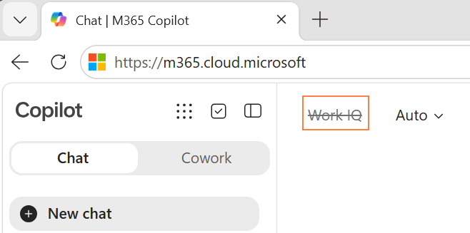
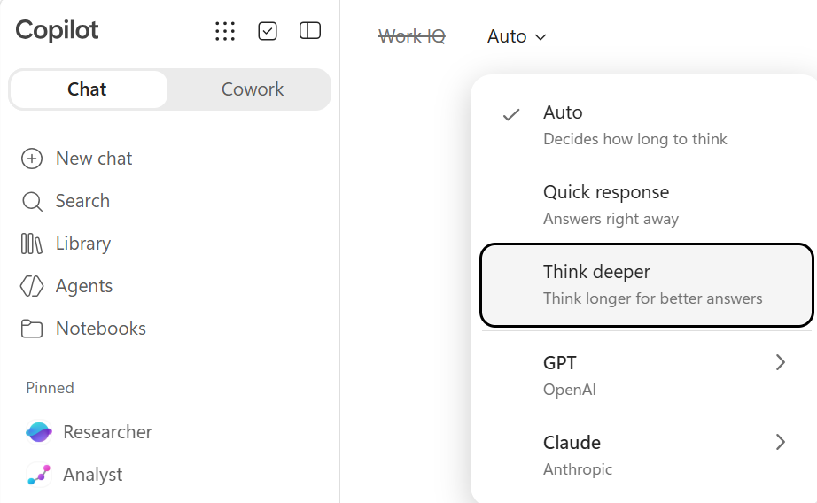
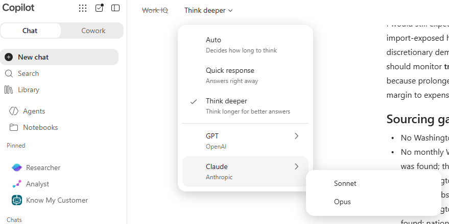
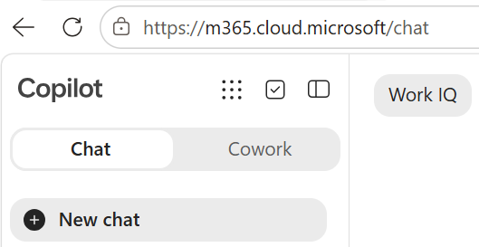
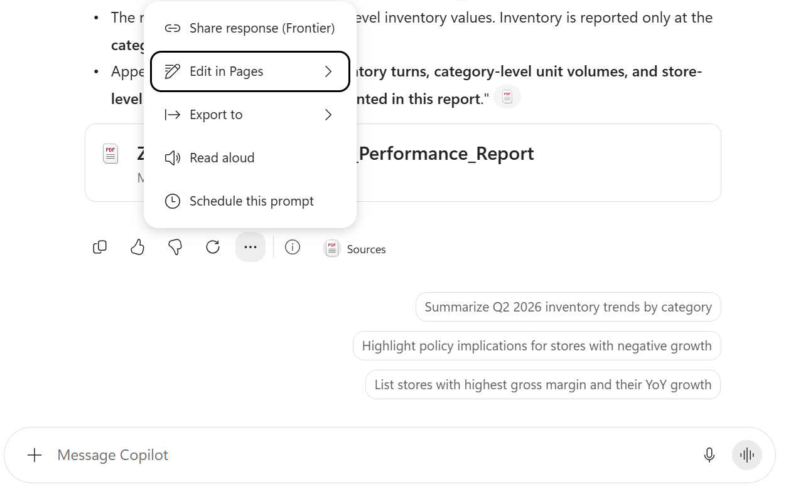

# M365 Copilot and Frontier Agents

Use Microsoft 365 Copilot and Frontier agents (Researcher and Analyst) to turn information into decision-ready work. Start with the capabilities already available, and build only when the scenario requires something more.

## Lab Details

| Level | Persona | Duration | Purpose |
| ----- | ------- | -------- | ------- |
| 100 | Business User | 30 minutes | After completing this lab, participants will be able to use Microsoft 365 Copilot with deliberate grounding, response-mode, and model choices, then use the Researcher and Analyst frontier agents for deeper synthesis and financial modelling. |

## Table of Contents

- [Introduction](#introduction)
- [Core Concepts Overview](#core-concepts-overview)
- [Documentation and Additional Training Links](#documentation-and-additional-training-links)
- [Prerequisites](#prerequisites)
- [Use Cases Covered](#use-cases-covered)
- [Instructions by Use Case](#instructions-by-use-case)
  - [Use Case #1: Getting started with Microsoft 365 Copilot](#use-case-1-getting-started-with-microsoft-365-copilot)
  - [Use Case #2: Grounding Copilot with Work IQ](#use-case-2-grounding-copilot-with-work-iq)
  - [Use Case #3: Deep analysis with the Researcher agent](#use-case-3-deep-analysis-with-the-researcher-agent)
  - [Use Case #4: Financial modeling with the Analyst agent](#use-case-4-financial-modeling-with-the-analyst-agent)

## Introduction

Microsoft 365 Copilot combines public web grounding with organizational context through Work IQ.

Microsoft 365 Copilot also provides access to frontier agents: **Researcher** performs multi-step research and synthesis, while **Analyst** extracts data and performs quantitative analysis. In this lab, you will use Microsoft 365 Copilot chat with public-web and Work IQ grounding, then use both frontier agents to extract intelligent insights from the same document.

## Core Concepts Overview

| Concept | Why it matters |
| ------- | -------------- |
| **Microsoft 365 Copilot** | Leverages frontier AI models to help information workers search, summarize, reason over, and act on organizational and web information. |
| **Work IQ** | Grounds Copilot in the files, mail, meetings and chats the signed-in user already has permission to access. |
| **Researcher** | Multi-step research and synthesis across long or complex source material, with its reasoning visible. |
| **Analyst** | Quantitative analysis — extracts data and computes new results such as NPV and IRR that the source does not contain. |

## Documentation and Additional Training Links

* [Microsoft 365 Copilot documentation](https://learn.microsoft.com/microsoft-365-copilot/)
* [Researcher agent](https://learn.microsoft.com/en-us/microsoft-365/copilot/researcher-agent)

## Prerequisites

- A Microsoft 365 account with a Microsoft 365 Copilot licence
- Access to Microsoft 365 Copilot with the Researcher and Analyst agents enabled
- Use Case #2 resources:
  - **Instructor-led bootcamp:** Files are already preloaded to the SharePoint location, so you can skip this prerequisite
  - **Independent use:** Upload the following files to a OneDrive or SharePoint location that Microsoft 365 Copilot can access:
    - [Zava DIY Markdown and Clearance Policy](assets/sample-files/Zava_DIY_Markdown_and_Clearance_Policy.docx)
    - [Zava DIY Q2 2026 Store Performance Report](assets/sample-files/Zava_DIY_Q2_2026_Store_Performance_Report.pdf)
- Download the sample report PDF used in Use Cases #3 and #4: [Contoso Grand Hotel Performance Report](https://github.com/microsoft/mcs-labs/raw/main/labs/agent-builder-m365/Contoso_Grand_Hotel_Performance_Report.pdf)

## Use Cases Covered

| Step | Use Case | Value added | Effort |
| ---- | -------- | ----------- | ------ |
| 1 | [Getting started with Microsoft 365 Copilot](#use-case-1-getting-started-with-microsoft-365-copilot) | Learn how Work IQ, response modes and AI model choice shape an answer | 7 min |
| 2 | [Grounding Copilot with Work IQ](#use-case-2-grounding-copilot-with-work-iq) | Reference a file directly, apply it to a real decision, then let Work IQ find what you never named | 13 min |
| 3 | [Deep analysis with the Researcher agent](#use-case-3-deep-analysis-with-the-researcher-agent) | Use the Researcher frontier agent to synthesize insights across a complex multi-section business report | 5 min |
| 4 | [Financial modeling with the Analyst agent](#use-case-4-financial-modeling-with-the-analyst-agent) | Use the Analyst frontier agent to perform NPV/IRR financial modeling and investment prioritization from document data | 5 min |

## Instructions by Use Case

**Running scenario for Use Cases #1 and #2:** You've just joined **Zava DIY**, a home improvement retailer with seven stores across Washington State plus Zava Retail Online, as a retail operations analyst. The quarterly business review is in two days. You need the market context, the company's own numbers, and the merchandising rules that govern both.

## Use Case #1: Getting started with Microsoft 365 Copilot

| Use case | Value added | Estimated effort |
|---|---|---|
| Getting started with Microsoft 365 Copilot | Learn how Work IQ, response modes and AI model choice shape an answer | 7 minutes |

**Summary of tasks:** You'll switch Work IQ off, research the home improvement market on the public web, compare response modes, and try another supported AI model.

**Scenario:** Before you look at a single Zava DIY number, you need the market context. Is a 7.5% quarter good?

### Objective

Understand what Microsoft 365 Copilot does on its own, grounded in public web content, and learn to choose grounding, response mode, and AI model.

### Step-by-step instructions

#### 1.1 Orientation & Work IQ

1. Navigate to the Microsoft 365 Copilot home page: <https://m365.cloud.microsoft/>.

2. Find the **Work IQ control at the top left of the chat**. Market data lives on the public web, so select **Work IQ** to cross it off. With Work IQ off, nothing from your files, mail, meetings or chats is in scope, and every fact in the answers that follow has to come from a public source Copilot can cite and you can open.



#### 1.2 Ask a broad market question

Paste the following into the prompt box and hit **Send**:

```text
I've just joined a home improvement retailer as an operations analyst.
Give me the state of the US home improvement retail market right now:
demand, consumer behaviour, and the pressures on retail margin.
Under 150 words, with a link for anything you state as a fact.
```

It went and looked. You gave it no file, no site, no URL, just a generic industry question, and Copilot searched public web content and came back with references you can click.

References are critical, since an answer with no reference is an answer you can't verify.

#### 1.3 Ask for deeper reasoning

Look to the right of **Work IQ** for the **response mode selector**:

- **Auto** — Copilot decides how much thinking the question deserves.
- **Quick response** — optimized for speed, recall, rewriting, formatting and short lookups.
- **Think deeper** — spends longer reasoning through multi-step analysis, trade-offs, ranking and "why."

1. Switch the response mode to **Think deeper**.

   

2. Paste the following into the prompt box and hit **Send**:

```text
I'm preparing a market briefing on the US home improvement retail sector
for the quarter just ended.

Research and cite, with a source and date for each:
- Comparable-store sales at the large national home improvement retailers
- US housing starts and existing home sales
- The prevailing 30-year mortgage rate
- Producer prices for lumber and building materials

Prefer Washington State or Pacific Northwest figures where they exist,
and say when you substituted national data.

Then answer, showing your working:
1. Is this market growing or shrinking in real terms once inflation is stripped out?
   Show the arithmetic and say which inflation figure you applied.
2. Which two indicators best predict next quarter's DIY demand,
   and what are they saying right now? Say how far ahead each one leads.
3. Where would you expect margin pressure to show up first, and why?
   Argue against your own answer before you commit to it.

Flag anything you could not source. Do not present an estimate as a fact.
```

This one will run a bit longer than the first.

**Scroll up to see the responses from 1.2.** It was on **Auto**, and Auto decided the question deserved a **Quick response**. In 1.3, you selected **Think deeper** because this question has complexities that a quick answer cannot address.

Compare the two responses:

| | 1.3 on Quick response | 1.4 on Think deeper |
|---|---|---|
| **References** | A handful, lightly used | Many, tied to specific figures |
| **Numbers** | Described | Retrieved, then calculated with |
| **Uncertainty** | Smoothed over | Named, with a "could not source" list |
| **Conclusion** | A summary | A position, argued against itself |

A simple prompt gets a fast answer no matter what you select. A complex prompt thinks deeply even on Auto.

> [!TIP]
> When in doubt, use Auto in Response mode.

#### 1.4 Change the model

Click **Think deeper** and look at the AI models offered. Alongside the default GPT models, Claude is also available for most tenants (subject to what your admin has enabled).

Select a Claude model.



Carry on with the lab. Optionally, try a question or two of your own to see how the models differ.

Models vary in their responses, their voice, and how they structure an answer. Analysts often settle on one model for reasoning and a different one for drafting. Notice which you prefer as you work through the rest of the lab. Evaluating responses is a critical part of monitoring AI workloads.

### Test your understanding

**Key takeaways:**

- **Grounding is a choice you make before you prompt.** Work IQ off with web on is a different assistant from Work IQ on.
- **Depth of response varies based on the question.** When in doubt, use Auto.
- **Microsoft 365 Copilot supports multiple AI models.** Responses will vary based on the model chosen.

**Challenge:** Which recurring question in your job is really a reasoning question you've been asking a fast tool?

## Use Case #2: Grounding Copilot with Work IQ

| Use case | Value added | Estimated effort |
|---|---|---|
| Grounding Copilot with Work IQ | Reference a file directly, apply it to a real decision, then let Work IQ find what you never named | 13 minutes |

**Summary of tasks:** You will use Work IQ to reference a policy document in SharePoint, summarize it, turn it into a decision, and publish it into a shareable page.

**Scenario:** You have the market context. Now you need Zava DIY's own quarter, the merchandising rules that govern it, and an answer good enough to put in front of leadership in two days.

### Objective

Use Work IQ to ground Copilot in your organizational content and produce a cited, review-ready deliverable.

### Step-by-step instructions

> [!IMPORTANT]
> If you are not attending the facilitated bootcamp, confirm that the Use Case #2 files listed in [Prerequisites](#prerequisites) are uploaded and available through Work IQ before continuing.

#### 2.1 Start a grounded chat

1. Click **New chat** at the top left to start a new conversation with Copilot.

2. Re-enable **Work IQ**.

   

#### 2.2 Summarize the policy

Paste the following into the prompt box and hit **Send**:

```text
Find the Zava DIY Markdown and Clearance Policy document, then summarize the
markdown clearance policy in five bullets for the Zava DIY leadership team, who
have 60 seconds before the quarterly business review starts.
After each bullet, cite the section it came from.
```

Select a citation to open the source document directly inside Microsoft 365 Copilot. This lets you verify details and explore the document without switching context.

#### 2.3 Make the policy answer a decision

Paste the following into the prompt box and hit **Send**:

```text
I'm the category manager for Garden & Outdoor.
I want to run a 17% markdown on patio furniture starting next Tuesday
to clear inventory before the season closes.

Walk me through exactly what this policy requires:
- Who has to approve it
- How much lead time is required
- What I have to attach to the request
- Whether next Tuesday is achievable at all

Quote the governing section for each requirement,
and tell me if any part of my plan isn't allowed.
```

Summarizing a policy is useful, but deciphering criteria across multiple sections to determine whether a proposal complies with the policy is more valuable.

Observe how Copilot breaks the request into individual requirements, cross-references eligibility against each one, and compiles a conclusion from the full criteria set. Review how each conclusion maps back to the cited policy sections.

#### 2.4 Let Copilot find the report by itself

Do **not** attach a file or paste a link. Let Work IQ locate the named report in your organization's content.

Paste the following into the prompt box and hit **Send**:

```text
Find the DIY Q2 2026 performance and cross-reference it with the policy.

Build a table of all stores besides online with these columns:
- Store
- Gross Margin
- Year-over-year growth
- Store-level inventory

Use only figures actually printed in that report.
Where the report does not state a value, write "not stated."
Do not estimate, calculate, or infer anything.
```

**Two things to call out once the M365 Copilot response lands:**

1. **Nobody attached a file or supplied its location.** Copilot searched your organization's content, found the Q2 2026 report, and grounded on it. That's Work IQ doing the retrieval you would otherwise have done by hand — you name what you need and let search locate it. Check the citations to verify that the performance-report PDF actually answered.
2. **"Not stated" should fill the inventory column.** The report deliberately withholds store-level inventory, and its methodology appendix says so. Forbidding invention is how you get a grounded answer instead of a plausible one.

Note also that Copilot respects permissions throughout. It sees only what the signed-in user could already open, so grounding never widens access.

#### 2.5 Turn the answer into a deliverable

1. Scroll to the bottom of the response, select the ellipsis (**...**), then select **Edit in Pages**.

   

2. Copilot Pages now renders on the right. You can make further edits, add information, and share the page with colleagues.

3. Using the Microsoft 365 Copilot app on the left, turn this Copilot Page into a report-ready deliverable. Paste the following prompt and select **Send**:

```text
Turn this into a one-page pre-read for the Zava DIY quarterly business review:
- Title
- Three findings with evidence
- Three recommended actions with owners left blank
- Open questions
```

You reached a review-ready quarterly briefing within minutes, with no configuration and no code.

### Test your understanding

**Key takeaways:**

- **Let Work IQ find the source.** You don't need to attach a file or paste a link — name what you need in the prompt and let search locate it. Either way, check what it actually cited.
- **A summary is not an answer.** Applying a policy to a decision on the table is where the value is, and quoting the governing section is what makes it checkable.
- **Work IQ respects existing permissions.** It gathers insights only from organizational content the signed-in user can already access, then brings relevant information together for the task.
- **Copilot Pages turn conversations into shareable reports.** Continue editing the response and share the finished page with colleagues.

**Challenge:** Which policy or standard does your team apply by hand today, and what would change if Copilot could quote the governing section every time?

### Where this goes next

The Researcher and Analyst use cases take the same principle further by applying purpose-built frontier agents to deeper document synthesis and financial modelling.

## Use Case #3: Deep analysis with the Researcher agent

Leverage the Researcher frontier agent in Microsoft 365 Copilot to perform deep, multi-section analysis of a complex business document — synthesizing insights that would take a human analyst hours to compile manually.

| Use case                                    | Value added                                                                                         | Estimated effort |
| ------------------------------------------- | --------------------------------------------------------------------------------------------------- | ---------------- |
| Deep analysis with the Researcher agent     | Use the Researcher frontier agent to synthesize strategic insights across a multi-section report     | 5 minutes        |

**Summary of tasks**

In this section, you'll upload a sample hotel performance report to the Researcher agent and use two carefully crafted prompts that require the agent to reason across multiple sections, tables, and data points simultaneously. You'll observe how Researcher synthesizes information that spans financials, operations, guest satisfaction, and competitive benchmarking into cohesive executive-level analysis.

**Scenario:** You're a regional vice president reviewing the annual performance report for the Contoso Grand Hotel & Resort. Rather than reading all 18 sections yourself, you want to use the Researcher agent to quickly identify the most urgent operational issues and verify that the report's recommendations fully cover all identified problems.

### Objective

Use the Researcher agent to perform two deep-analysis tasks on a complex PDF document, demonstrating its ability to reason across multiple sections and synthesize findings.

### Step-by-step instructions

#### Download the sample report

1. If you haven't already, download the sample report PDF that you'll use for this exercise and the next:

   **[Download: Contoso Grand Hotel Performance Report](https://github.com/microsoft/mcs-labs/raw/main/labs/agent-builder-m365/Contoso_Grand_Hotel_Performance_Report.pdf)**

> [!IMPORTANT]
> Save this file to a location you can easily find (e.g., your Desktop or Downloads folder). You will need to upload it in the next step. This is a fictional ~20-page report containing tables, charts, financial data, and operational metrics across 18 sections.

#### Open the Researcher agent

2. Navigate to [Microsoft 365 Copilot](https://m365.cloud.microsoft/chat/?auth=2&home=1).

3. In the right-side panel or the main chat area, look for the **Researcher** agent. You can find it by:
   - Selecting the agent picker (if available) and choosing **Researcher**
   - Or typing `@Researcher` in the chat input area

> [!TIP]
> The Researcher agent is one of Microsoft's **frontier agents** — purpose-built AI agents that use advanced reasoning models. Researcher excels at deep document analysis, cross-referencing multiple sections, and synthesizing complex information. It's available to users with a Microsoft 365 Copilot license.

4. Upload the **Contoso_Grand_Hotel_Performance_Report.pdf** by selecting **Add and manage sources** (the **+** icon) in the chat input area, choosing **Upload images and files**, and selecting the file from your local machine.

#### Prompt 1: Executive briefing with root-cause analysis

5. Once the file is uploaded, copy and paste the following prompt and select **Send**:

```text
Create an executive briefing for the GM that summarizes:
- The five most urgent operational issues
- Their root causes
- Their financial impact
- Recommended fixes

Source every finding from this report.
```

6. **Observe** how the Researcher agent:
   - Identifies issues across multiple sections (housekeeping, WiFi, HVAC, F&B margins, elevator maintenance)
   - Traces each issue back to its root cause using data from different parts of the report
   - Quantifies the financial impact by pulling revenue, cost, and complaint data from various tables
   - Maps each issue to specific recommendations from Section 16
   - Produces a structured, executive-ready summary

> [!NOTE]
> This prompt is powerful because it requires **cross-section synthesis** — the Researcher must connect data from the occupancy analysis (Section 3), housekeeping operations (Section 6), customer satisfaction scores (Section 8), online reviews (Section 9), maintenance logs (Section 12), and the recommendations (Section 16). No single section of the report contains the full answer.

#### Prompt 2: Gap analysis — problems vs. recommendations

7. In the **same conversation** (to maintain context), copy and paste this follow-up prompt and select **Send**:

```text
Identify every metric in this report that is trending in the wrong direction
or below target.

For each one, trace the root cause and map it to a specific recommendation.
Are there any gaps where a problem exists but no recommendation addresses it?
```

8. **Observe** how the Researcher agent:
   - Systematically scans every KPI table, satisfaction score, and operational metric in the report
   - Identifies metrics that are below target (e.g., HK SLA compliance at 77% vs. 90% target, WiFi satisfaction at 3.60 vs. 4.0 benchmark)
   - Identifies metrics trending negatively (e.g., F&B margins, linen costs, parking revenue)
   - Maps each problem to a specific recommendation (R1–R10)
   - Critically evaluates whether any gaps exist where a problem is documented but no recommendation addresses it

> [!TIP]
> This is the kind of analysis that demonstrates the true power of the Researcher agent. A human reviewer might miss connections between a declining metric buried in Appendix B and a recommendation in Section 16. Researcher performs an **exhaustive cross-reference** across the entire document. Try asking follow-up questions like "What's the strongest counterargument to your top recommendation?" to see how Researcher handles critical thinking.

### Congratulations! You've used the Researcher agent for deep document analysis!

### Test your understanding

**Key takeaways:**

- **Researcher excels at synthesis** — It connects information across multiple tables, sections, and data points that would be tedious to cross-reference manually
- **Prompt design matters** — Asking for "root causes" and "gap analysis" forces Researcher to reason deeply rather than simply summarize
- **Follow-up prompts leverage context** — The second prompt builds on the first, allowing Researcher to refine and extend its analysis
- **Frontier agents are purpose-built** — Researcher uses advanced reasoning models optimized for deep analysis, unlike general chat which is optimized for conversational responses

**Challenge: Apply this to your own use case**

- What complex reports or documents does your team review regularly that could benefit from Researcher analysis?
- What cross-functional insights might Researcher uncover that individual department reviews miss?
- How could you use Researcher to prepare for board meetings or executive reviews?

## Use Case #4: Financial modeling with the Analyst agent

Use the Analyst frontier agent to extract data from the same hotel performance report and perform rigorous financial analysis — computing NPV, IRR, and investment prioritization that goes beyond what the original report provides.

| Use case                                       | Value added                                                                                              | Estimated effort |
| ---------------------------------------------- | -------------------------------------------------------------------------------------------------------- | ---------------- |
| Financial modeling with the Analyst agent      | Use the Analyst frontier agent to compute NPV, IRR, and rank capital investments by financial merit      | 5 minutes        |

**Summary of tasks**

In this section, you'll use the Analyst agent to extract the investment and return data from the report's ten recommendations, then perform a discounted cash flow analysis that the original report doesn't include. This demonstrates how the Analyst agent can *elevate* analysis beyond what a source document provides.

**Scenario:** The Contoso Grand Hotel's report recommends $2.975 million in capital investments across ten initiatives, but only provides simple payback periods. As the CFO, you need proper NPV and IRR analysis before approving the capital program. You'll use the Analyst agent to build this analysis from the report data.

### Objective

Use the Analyst agent to perform a detailed ROI analysis with NPV, IRR, and discounted payback calculations for each of the report's ten recommendations.

### Step-by-step instructions

#### Open the Analyst agent

1. Navigate to [Microsoft 365 Copilot](https://m365.cloud.microsoft/chat/?auth=2&home=1).

2. Select the **Analyst** agent. You can find it by:
   - Selecting the agent picker and choosing **Analyst**
   - Or typing `@Analyst` in the chat input area

> [!TIP]
> The Analyst agent is another **frontier agent** in Microsoft 365 Copilot. While Researcher excels at reasoning and synthesis, Analyst is purpose-built for **data-heavy work** — extracting tables from documents, performing calculations, building models, generating visualizations, and producing structured outputs like Excel files. Think of Researcher as your strategic advisor and Analyst as your financial modeler.

3. Upload the **Contoso_Grand_Hotel_Performance_Report.pdf** by selecting **Add and manage sources** (the **+** icon), choosing **Upload images and files**, and selecting the same file you downloaded earlier.

> [!NOTE]
> You're using the same PDF from Use Case #3, but with a completely different agent. This demonstrates how different frontier agents can extract different types of value from the same source document.

#### Run the financial analysis prompt

4. Copy and paste the following prompt and select **Send**:

```text
Using the recommendation data from Section 16 of this hotel performance report,
build a detailed ROI analysis for each of the 10 recommendations (R1 through R10).

For each recommendation, extract the investment cost and estimated annual ROI,
then calculate:
1. Net Present Value (NPV) at an 8% discount rate over a 5-year horizon
2. Internal Rate of Return (IRR)
3. Payback period, both simple and discounted
4. 5-year cumulative net benefit, total returns minus investment

Assume annual ROI begins in Year 1 and remains constant over the 5-year period.
For the elevator modernization (R5), assume the $1.2M investment is split evenly
across Year 0 and Year 1, with returns beginning in Year 2.
For ongoing annual programs (R7, R10), treat the annual investment
as a recurring cost each year.

Present the results in a ranked table sorted by NPV, highest to lowest.
Include a column indicating whether each recommendation creates or destroys value
at the 8% hurdle rate.

Then provide a summary recommendation on which investments should be approved,
which are marginal, and which should be deferred,
based purely on the financial analysis.
```

5. **Observe** how the Analyst agent:
   - Extracts investment costs and annual returns from Section 16's ten recommendations
   - Builds a discounted cash flow model for each recommendation
   - Computes NPV at the specified 8% discount rate
   - Calculates IRR for each investment
   - Determines both simple and discounted payback periods
   - Ranks all ten recommendations by financial merit
   - Identifies which investments create or destroy value at the hurdle rate
   - Provides a clear approve/defer recommendation

> [!IMPORTANT]
> The report only includes **simple payback periods** (which ignore the time value of money). The Analyst agent produces **NPV and IRR** — the gold-standard financial metrics that CFOs actually use to evaluate capital projects. This is a powerful example of how the Analyst agent can *elevate* analysis beyond the source material.

#### Explore follow-up analysis (optional)

6. If time permits, try one or both of these follow-up prompts to explore Analyst's capabilities further:

```text
Now create a chart showing NPV vs. Investment Cost for all 10 recommendations, with bubble size representing IRR.
```

```text
Which combination of recommendations gives the highest total NPV while staying under a $1.5M total budget constraint?
```

> [!TIP]
> The second follow-up prompt is a **knapsack optimization problem** — the Analyst agent must find the combination of investments that maximizes value within a budget constraint. This is a sophisticated analytical task that would typically require a spreadsheet model to solve manually. It makes for a compelling demonstration of the Analyst agent's capabilities.

### Congratulations! You've used the Analyst agent for financial modeling!

### Test your understanding

**Key takeaways:**

- **Analyst extracts and computes** — It pulls structured data from documents, performs calculations, and generates outputs that go beyond the source material
- **NPV/IRR vs. simple payback** — Simple payback ignores the time value of money. Analyst can produce the rigorous financial analysis that decision-makers actually need
- **Researcher vs. Analyst** — Researcher reasons and synthesizes (strategic advisor); Analyst computes and models (financial modeler). They complement each other
- **Follow-up prompts unlock depth** — Budget-constrained optimization and visualization requests demonstrate that Analyst can handle multi-step analytical workflows

**Challenge: Apply this to your own use case**

- What capital investment decisions does your organization face that could benefit from automated NPV/IRR analysis?
- What reports or proposals do you review that only include simple payback and could be elevated with proper DCF analysis?
- How could you combine Researcher (for strategic context) and Analyst (for financial modeling) to prepare a comprehensive investment recommendation?

## Summary of learnings

Microsoft 365 Copilot chat, Work IQ and two frontier agents produced different kinds of value — with nothing built, deployed or maintained.

**Grounding determines context.** Public-web grounding provided market context, while Work IQ found and cited organizational files without widening the user's permissions.

**Response mode and AI model affect the result.** Auto is the safest default, Think deeper supports more demanding reasoning, and different supported models vary in voice, structure and response.

**Commodity capability arrives ready.** Microsoft 365 Copilot, Researcher and Analyst needed no authoring and no environment. Microsoft owns their upkeep, and they improve without a release on your side.

**The capability you select changes the answer.** Standard chat researched and drafted, Researcher synthesised the narrative, and Analyst produced numbers the report never contained.

## Conclusions & Recommendations

**Check the commodity first.** Before scoping anything, ask what Microsoft 365 Copilot already does with the same material. When the answer is good enough, consuming it costs nothing to run and nothing to maintain.

**Build when you need what the commodity cannot give you** — your own grounding, a repeatable process, a controlled response, or an action written back to a system of record. Those are real requirements, and they are exactly what the harnesses in this bootcamp exist to serve.

**Evaluate the response.** Grounding, response mode and AI model all influence the output. Review citations, assumptions and usefulness rather than trusting a model name or polished answer.

**Set expectations on reasoning time.** Users trained on instant chat replies will read a thinking agent as a broken one unless someone tells them otherwise.
