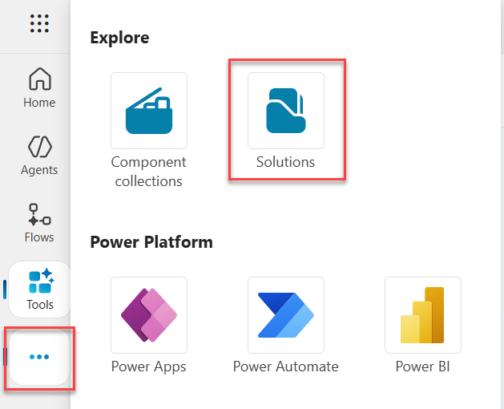

# Application Lifecycle Management (ALM) in Copilot Studio

Master the complete lifecycle of your Microsoft Copilot Studio agents - from structuring solutions and managing configurations to deploying across environments with pipelines and source control.

---

## 🧭 Lab Details

| Level | Persona | Duration | Purpose |
| ----- | ------- | -------- | ------- |
| 300 | Maker/Admin | 45 minutes | After completing this lab, participants will be able to structure solutions with custom publishers, configure environment variables and connection references, deploy solutions across environments using Power Platform pipelines, and manage source control integration with Azure DevOps Git. |

---

## 📚 Table of Contents

- [Why This Matters](#-why-this-matters)
- [Introduction](#-introduction)
- [Core Concepts Overview](#-core-concepts-overview)
- [Documentation and Additional Training Links](#-documentation-and-additional-training-links)
- [Prerequisites](#-prerequisites)
- [Summary of Targets](#-summary-of-targets)
- [Use Cases Covered](#-use-cases-covered)
- [Instructions by Use Case](#️-instructions-by-use-case)
  - [Use Case #1: Create a Solution and Custom Publisher](#-use-case-1-create-a-solution-and-custom-publisher)
  - [Use Case #2: Create Environment Variables and Connection References](#-use-case-2-create-environment-variables-and-connection-references)
  - [Use Case #3: Create Power Platform Pipelines for Deployment](#-use-case-3-create-power-platform-pipelines-for-deployment)
  - [Extra Credit: Set Up Git Source Control and Understand Solution Structure](#-extra-credit-set-up-git-source-control-and-understand-solution-structure)

---

## 🤔 Why This Matters

**Makers and Admins** - You've built amazing agents in your development environment, but how do you move them safely to production? How do you track changes, collaborate with your team, and ensure consistent deployments?

Think of ALM as preparing your kitchen before cooking a complex meal:
- **Without ALM**: Ingredients scattered across counters, no recipe plan, manual exports, forgotten configurations, and "it worked in dev" syndrome
- **With ALM**: Everything organized, versioned, and automated - from structured solutions to governed deployment pipelines

**Common challenges solved by this lab:**
- "I built something great in dev, but can't easily move it to production"
- "Someone changed my agent and now it's broken - who did it and how do I fix it?"
- "My agent works perfectly in dev but breaks in production"
- "I forgot to configure the authentication settings after deployment"
- "I can't track what changed between versions"

**In 45 minutes, you'll set up a complete ALM foundation - from solution structure through automated deployment pipelines and source control.**

---

## 🌐 Introduction

Application Lifecycle Management (ALM) ensures that your solutions evolve safely and efficiently as they move from development to production. This lab walks you through the full ALM journey: structuring your solution with a custom publisher, configuring environment variables and connection references for portability, connecting to source control for versioning and collaboration, and deploying across environments using Power Platform pipelines.

**Real-world example:** Your customer service agent is ready for production. With a proper ALM setup, the deployment process becomes:
1. Structure your work in a solution with a custom publisher
2. Configure environment variables and connection references for portability
3. Track all changes in Git source control
4. Deploy through governed pipelines from DEV to PROD
5. Validate environment-specific settings post-deployment

Without ALM, each of these steps is manual, error-prone, and difficult to repeat. With ALM, it becomes an automated, auditable, and confident workflow.

---

## 🎓 Core Concepts Overview

| Concept | Why it matters |
|---------|----------------|
| **Solution** | A standard way in Microsoft Power Platform to package and ship components - including agents, topics, knowledge sources, tools, flows, and other solution-aware component types - across environments. |
| **Publisher** | A metadata element that identifies the creator of solution components. Using a custom publisher improves traceability and supports cleaner prefixes in naming conventions. |
| **Environment** | A workspace in Power Platform where agents, flows, and data reside. ALM best practices typically involve multiple environments (e.g., dev, test, prod) to manage lifecycle stages. |
| **Environment variable** | A reusable setting (like a URL, API key, or ID) that can vary between environments without modifying individual components. For secrets, use the Secret data type to retrieve values securely from Azure Key Vault. |
| **Connection reference** | An abstraction that links connectors (e.g., SharePoint, Dataverse, ServiceNow) to credentials and environment-specific settings, allowing reuse and cleaner ALM processes. |
| **Managed solution** | A read-only version of a solution used for deployment to downstream environments. Managed solutions support clean, controlled, and incremental updates and prevent direct modifications in the target environment. |
| **Unmanaged solution** | An editable solution used in development. Changes can be versioned and exported for deployment. Should not be used in test or production. |
| **Power Platform pipelines** | Democratized ALM automation that brings CI/CD capabilities into the service in a manner that's approachable for all makers, admins, and developers. |
| **Pipeline stages** | Sequential deployment environments (Development → Test → Production) that solutions must pass through in order, preventing bypass of QA processes. |
| **Source control** | The practice of tracking and managing changes to your assets over time. Git integration with Azure DevOps enables auditing, collaboration, and versioning. |

---

## 📄 Documentation and Additional Training Links

* [ALM overview - Microsoft Power Platform](https://learn.microsoft.com/en-us/power-platform/alm/)
* [Publish and deploy your agent](https://learn.microsoft.com/en-us/microsoft-copilot-studio/publication-fundamentals-publish-channels)
* [Webinar: Microsoft Copilot Studio ALM](https://aka.ms/MCSALMWebinar)
* [Environment variables in solutions](https://learn.microsoft.com/power-apps/maker/data-platform/environmentvariables)
* [Connection references in a solution](https://learn.microsoft.com/power-apps/maker/data-platform/create-connection-reference)
* [Overview of pipelines in Power Platform](https://learn.microsoft.com/power-platform/alm/pipelines)
* [Export and import agents using solutions](https://learn.microsoft.com/microsoft-copilot-studio/authoring-solutions-import-export)
* [Overview of Git integration in Power Platform](https://learn.microsoft.com/en-us/power-platform/alm/git-integration/overview)

---

## ✅ Prerequisites

- Access to Microsoft Copilot Studio
- A Microsoft Power Platform environment with at least an Environment Maker security role
- Access to multiple Power Platform environments (DEV, PROD) - provided in the lab setup
- Azure DevOps project with Git integration (for Extra Credit section only - set up during the lab)

---

## 🎯 Summary of Targets

In this lab, you'll configure a complete ALM foundation for working with Microsoft Copilot Studio. By the end of the lab, you will:

- Create and configure a structured solution with a custom publisher
- Set up environment variables and connection references for portability across environments
- Create and configure Power Platform pipelines for automated deployment
- Deploy solutions from DEV to PROD and understand post-deployment configuration
- (Extra Credit) Connect your solution to Azure DevOps Git for source control and understand the structure of unpacked solutions

---

## 🧩 Use Cases Covered

| Step | Use Case | Value added | Effort |
|------|----------|-------------|--------|
| 1 | [Create a Solution and Custom Publisher](#-use-case-1-create-a-solution-and-custom-publisher) | Structure your success - Group, manage, and deploy all your agent components with clarity and control | 15 min |
| 2 | [Create Environment Variables and Connection References](#-use-case-2-create-environment-variables-and-connection-references) | Adapt with flexibility - Future-proof your agents for seamless multi-environment deployments | 15 min |
| 3 | [Create Power Platform Pipelines for Deployment](#-use-case-3-create-power-platform-pipelines-for-deployment) | Automate with confidence - Set up governed, repeatable deployment workflows | 15 min |
| EC | [Extra Credit: Set Up Git Source Control](#-extra-credit-set-up-git-source-control-and-understand-solution-structure) | Track and evolve - Use Git to version, review, and understand solution structure (Optional) | ~15 min |

---

## 🛠️ Instructions by Use Case

---

## 🧱 Use Case #1: Create a Solution and Custom Publisher

Use a structured container to group all agent components for better lifecycle management.

| Use case | Value added | Estimated effort |
|----------|-------------|------------------|
| Create a Solution and Custom Publisher | Structure your success - Group, manage, and deploy all your agent components with clarity and control | 15 minutes |

**Summary of tasks**

In this section, you'll learn how to access the Solutions area of Copilot Studio, create a new solution with a custom publisher, and set it as your preferred solution.

**Scenario:** Properly set up your development environment so that you can later easily package and deploy your agents to other environments.

### Objective

Set up your development environment by creating a solution and custom publisher in Microsoft Copilot Studio.

---

### Step-by-step instructions

#### Open the Solutions Area

1. Go to [copilotstudio.microsoft.com](https://copilotstudio.microsoft.com/).

1. Confirm you are in the correct environment (top-right corner).

#### Create a Solution

1 In the left navigation (under the **...** menu), select **Solutions**.

    

1. Select **New solution**.

1. Enter a display name.

> [!TIP]
> - Avoid names like `DEV`, `TEST`, `PROD`, `POC`, `MVP` or anything tied to a project lifecycle phase.
> - Use a descriptive, project-based name.
> - For example, if this is specific to this training and lab, use `Training Workshop Agents`

#### Create a Publisher

1. If this is your first solution, Select **+ New publisher** to create one.

> [!TIP]
> - You may use your organization's name.
> - While the **Display name** may contain spaces, the **Name** can't contain special characters and spaces.
> - Define a short prefix for use in technical names.

    > [!IMPORTANT]
    > Avoid using the default publisher or the default solution. Custom publishers ensure cleaner component names and better ALM hygiene.

#### Set and Create

1. Check **Set as your preferred solution** (so any new component goes into it by default).

1. Select **Create**.


---

### 🏅 Congratulations! You've completed Use Case #1!

---

### Test your understanding

**Key takeaways:**

* **Solutions first** - Solutions help manage your agent and related components across environments.
* **Lifecycle readiness** - Structuring up front simplifies governance, updates, and deployment.
* **Naming matters** - Use clean, environment-agnostic names.

**Lessons learned & troubleshooting tips:**

* Avoid names like `Dev` or `Test` in your solution name - they're misleading when the solution moves to other environments.
* If save fails, ensure the publisher name is unique and valid.
* Keep solution names business-focused, not technical-phase focused.

---

---

## 🧩 Use Case #2: Create Environment Variables and Connection References

Use reusable variables and connection abstractions for seamless multi-environment deployments.

| Use case | Value added | Estimated effort |
|----------|-------------|------------------|
| Create Environment Variables and Connection References | Adapt with flexibility - Future-proof your agents for seamless multi-environment deployments | 15 minutes |

**Summary of tasks**

In this section, you'll learn how to create environment variables and connection references in your solution to ensure portability across environments.

**Scenario:** Configure your environment by anticipating future elements that will need to be updated as your solution moves from development to production.

### Objective

Create environment variables and connection references that enable your solution to adapt to different environments without modifying individual components.

---

### Step-by-step instructions

1. Open the solution you created in Use Case #1.

2. Select **+ New**, then select **More** and choose **Environment variable**.

    

3. In **Name**, enter: `Custom Knowledge Endpoint`

4. In **Data Type**, select **Text**.

5. Leave **Default Value** blank, but under **Current Value**, select **+ New Value**, and enter the Custom Knowledge endpoint URL found in the Lab Resources.

> [!IMPORTANT]
> For configuration, use the provided values in the **Lab Resources** (specific per training).

> [!TIP]
> Notice how, under **Advanced**, you can set whether the current value can follow through with your solution deployment, or if it should be reset each time the solution is deployed to a new environment.

6. Select **Save**.

> [!TIP]
> Environment variables can also be of type **Secret** to retrieve secure values like API keys from Azure Key Vault at runtime.

7. In the solution, select **New**, then select **More** and choose **Connection reference**.

8. Use the connector name, `ServiceNow`, as the name. Optionally, prefix with your project name.

> [!TIP]
> In other locales, the connector name may be localized.

9. Select the connector **ServiceNow**.

10. In the connection dropdown, choose **New connection** if none exists.

11. Log in through Power Apps in a new tab if needed, then return to Copilot Studio.

> [!IMPORTANT]
> - For **ServiceNow** configuration values, use the provided values in the **Lab Resources** (specific per training).
> - For **ServiceNow**'s `Instance` configuration, be sure to scroll down in the connection screen.

12. Above the **Connection** dropdown, select **Refresh** and choose the newly created connection.

> [!TIP]
> If the **Create** button is grayed out, it's because you pasted the display name. Type an extra character in the display name field and remove it to enable the button.

---

### 🏅 Congratulations! You've completed Use Case #2!

---

### Test your understanding

* Do you understand the value of using **environment variables** instead of hardcoding values like URLs, API keys, or record IDs?
* Do you see the importance of using **descriptive, well-scoped names** for environment variables (e.g., `Base API URL`, `Support Team Email`)?
* Have you identified **which variables should change across environments** (e.g., dev, test, prod)?

**Challenge: Apply this to your own use case**

* List the environment variables your agent needs (e.g., external API base URLs, system emails, etc.).
* Define clear naming conventions to help your team manage them consistently.
* Try creating a **Secret**-type environment variable that securely references a value in Azure Key Vault.

---

---

## 🚀 Use Case #3: Create Power Platform Pipelines for Deployment

Set up automated deployment pipelines that democratize ALM while maintaining proper governance and security through platform controls.

| Use case | Value added | Estimated effort |
|----------|-------------|------------------|
| Create Power Platform Pipelines for Deployment | Automate with confidence - Set up governed, repeatable deployment workflows | 15 minutes |

**Summary of tasks**

In this section, you'll learn how to request a PROD environment, create Power Platform pipelines, configure deployment stages, and deploy your solution from DEV to PROD.

**Scenario:** You have a solution ready in DEV and need to establish an automated process to deploy it to a PROD environment with minimal effort and maximum consistency.

### Objective

Create a deployment pipeline that automates solution deployment across environments with proper validation and governance controls.

---

### Step-by-step instructions

#### Get a PROD Environment

> [!TIP]
> If you haven't done so already, you need to request a PROD environment to be created for your user. This is a one-time setup step that will allow you to create pipelines for deployment.

1. Start by requesting a PROD environment to be created for your user. Use the **Workshop Agent** [aka.ms/MCSWorkshopAgent](https://aka.ms/MCSWorkshopAgent) to request this environment, which will be automatically created for you. This will take a couple of minutes to provision and show up.

    > [!IMPORTANT]
    > Access the workshop agent in the same location as when you created your training user account. You will need the workshop code and your training user's email address if you previously closed the agent. Tell the agent to "Provision a PROD environment". You are limited to a single PROD environment for the duration of the workshop.

#### Create an agent to deploy

1. Go to the Copilot Studio home page at https://copilotstudio.microsoft.com/

1. Enter the following to describe the agent you wish to create:

    ```
    Create a Microsoft Surface Guide agent that knows everything about the Surface devices and can help guide users to pick the one that would be best for how they work. It should use the information from https://www.microsoft.com/en-us/surface as an official knowledge source
    ```
1. After the agent is created do a quick test of the agent by asking something like **What are the different Surface devices?**.

1. In the left navigation select "..." and then **Solutions**

1. Select the solution you created previously in this lab to open it and see the list of components.

1. You should see **Microsoft Surface Guide** or something similar in the **Agents** category of components.

1. Your solution is now read yto deploy to the PROD environment.

#### Access Power Platform Pipelines

1. Go to the Copilot Studio home page at https://copilotstudio.microsoft.com/.

1. Go to the **Solutions** menu (located in the left-hand menu under the ellipsis **...**) of your DEV environment.

1. Select the solution you created in Use Case #1.

1. In the left navigation, select **Pipelines**.

1. Select **+ Create pipeline**.

#### Configure Pipeline Basics

1. Enter a **Name** for your pipeline, e.g., `<your user name> Pipeline`.

1. Set a **Description** to explain the pipeline's purpose (e.g., `Automated deployment of agents from DEV to PROD`).

#### Set Up Deployment Stage

1. Select the **PROD** environment as the **Target environment**.

1. **Save** the pipeline configuration.

    

#### Test Your Pipeline

1. In the PROD card, select **Deploy here**.

    > [!TIP]
    > - The wizard makes sure that each environment variable has a value set in the target environment, and that all connection references are valid. If any of these checks fail, you will be prompted to fix them before proceeding.
    > - If the deployment fails because of missing dependencies, go back to your solution explorer, select the **...** next to each agent > **Advanced** > **Add required objects** and try re-deploying the solution.

1. In Copilot Studio, **switch** to the PROD environment.

1. See what the agents look like in the PROD environment. When entering a topic, see how customizations are locked because the solution is managed.

---

### 🏅 Congratulations! You've completed Use Case #3!

---

### Test your understanding

**Key takeaways:**

* **Democratized ALM** - Pipelines make sophisticated deployment processes accessible to all makers without requiring deep ALM knowledge.
* **Automatic governance** - Solutions are automatically exported as managed for target environments, preventing unauthorized changes.
* **Sequential validation** - Solutions must pass through pipeline stages in order, ensuring proper testing and approval workflows.
* **Built-in safeguards** - Pipeline artifacts can't be tampered with, ensuring the same tested solution moves through all stages.

**Lessons learned & troubleshooting tips:**

* Target environments must be Managed Environments for governance enforcement.
* Pipelines are only visible from development environments, not target environments.

---

---

## 🧱 Extra Credit: Set Up Git Source Control and Understand Solution Structure

> [!NOTE]
> **Optional - Extra Credit (~15 minutes):** This section is optional and not included in the 45-minute lab time. Complete it if you have additional time or want to explore source control integration and solution structure.

Connect your solution to Azure DevOps Git to track changes, commit solution components, and understand the structure of unpacked Power Platform solutions.

| Use case | Value added | Estimated effort |
|----------|-------------|------------------|
| Set Up Git Source Control and Understand Solution Structure | Track and evolve - Use Git to version, review, and understand solution component organization (Optional) | ~15 minutes |

**Summary of tasks**

In this section, you'll learn how to create a new project in Azure DevOps, initialize the main branch, connect it to your development environment, commit your solution components, and explore how Power Platform solutions are structured in source control.

**Scenario:** You want to track changes to your Copilot Studio agents in source control, collaborate with your team, and understand how solution components are organized for professional CI/CD workflows.

### Objective

Set up Azure DevOps Git integration, commit your solution components, and understand the structure of unpacked Power Platform solutions in source control.

---

### Step-by-step instructions

#### Set Up Azure DevOps

1. Go to [my.visualstudio.com/subscriptions](https://my.visualstudio.com/subscriptions).

1. If not already signed in, log in with your provided user account.

1. On the **We need a few more details** screen review the information and select **Continue**

1. Select **Join Visual Studio Dev Essentials** on the right side of the screen.

1. Review the Welcome screen and then select **Confirm**.

1. Under **Subscription / Program**, select **Visual Studio Dev Essentials**.

    > [!IMPORTANT]
    > If you encounter a **Something went wrong!** error, follow these steps:
    > 1. Go to [aex.dev.azure.com](https://aex.dev.azure.com/).
    > 2. If prompted, create a new organization (you can leave the default name).
    > 3. Skip to the next step.

1. Select **Get started** in the **Azure DevOps**  featured benifit section to open the Azure DevOps portal.

1. When prompted to **Get started with Azure DevOps**, select **Continue**.

1. Name your organization (you can leave the default name) and select **Continue**.

1. If it says you need to create a new Azure subscription ,select **Create new Azure subscription**. Follow the prompts to complete.

1. Create a new project by setting a **project name**. For example, `Agents`.

1. Select **+ Create project**.

1. After project creation, go to **Repos** > **Branches**.

1. Select **Initialize** (at the bottom) to create the `main` branch with a README or .gitignore.

    

#### Connect Microsoft Copilot Studio to Git

1. Go back to [Microsoft Copilot Studio](https://copilotstudio.microsoft.com) and open the **Solutions** page (under the **...** menu).

1. In the menu, select **Connect to Git**.

1. Set **Connection type** to `Solution`.

1. Choose your **organization** and your newly created **project** and **repository**.

1. Set the **Root Git folder** to `Solutions`.

1. Select **Next**, then pick the solution you created in Use Case #1.

    

1. When prompted for the branch, select **Create new branch** and name it `dev`.

1. Select **Save** and then **Connect**.

#### Commit Your Solution to Source Control

1. Open the solution you created in Use Case #1.

1. In the left-hand navigation, go to **Source control**.

1. See how the various components you have added to your solution are now ready to be committed to source control. If you don't see them all, select **Refresh** as they get detected and added.

1. When ready, select **Commit**, and add a comment describing the changes (e.g., `New solution and environment variable`).

    

1. Once committed, go to your commit in Azure DevOps to see the introduced, updated, or deleted components.

#### Explore Solution Structure in Azure DevOps

1. Go to your Azure DevOps project and browse to **Repos**.

1. Explore the **Solutions** folder structure:

    ```
    Solutions/
    ├── [SolutionName]/
    │   ├── botcomponents/
    │   ├── bots/
    │   ├── connectionreferences/
    │   ├── environmentvariabledefinitions/
    │   ├── publishers/
    │   └── solutions/
    ```

#### Understand Component Organization

1. Examine key folders:
   - **ConnectionReferences/**: Contains connection reference definitions used by connectors, flows, and tools
   - **EnvironmentVariables/**: Contains environment variable definitions and values
   - **Workflows/**: Contains Power Automate flows (if any)
   - **Other/Copilot/**: Contains Copilot Studio agents and components
   - **SolutionPackage/**: Contains the overall solution metadata

1. Open a component file to see the XML, YAML, or JSON structure that defines these components.

1. Notice how this structure enables:
    - Granular tracking of changes to individual components
    - Easy integration with other CI/CD tools and processes
    - Professional development workflows for larger teams

#### Review Deployment History

1. Go to **Repos** > **Commits** to see your deployment history.

1. Compare commits to understand what changed between deployments.

1. Use the diff view to see exactly what components were modified.

---

### 🏅 Congratulations! You've completed the Extra Credit section!

---

### Test your understanding

**Key takeaways:**

* **Professional ALM made accessible** - Pipelines democratize sophisticated deployment processes while maintaining professional standards.
* **Source control enables extension** - Git integration provides the foundation for advanced CI/CD scenarios when needed.
* **Structured component organization** - Understanding the folder structure helps with troubleshooting and enables pipeline extensions.

**Challenge: Apply this to your own use case**

* Plan how you might extend pipelines with Power Platform CLI for advanced scenarios.
* Design branching strategies that work with pipeline deployment workflows.
* Consider how to integrate pipelines with existing organizational CI/CD processes.

---

## 🏆 Summary of learnings

True learning comes from doing, questioning, and reflecting - so let's put your skills to the test.

To maximize the impact of ALM in Copilot Studio:

* **Solutions first** - Keep all your components within a solution to simplify lifecycle management and ensure clean deployment.
* **Name wisely** - Adopt a consistent naming convention and always use a custom publisher to avoid default clutter.
* **Plan for portability** - Use environment variables and connection references to ensure your agent configurations adapt across dev, test, and production.
* **Leverage source control** - Use Git integration to track, audit, and collaborate - setting the stage for CI/CD without complex tooling.
* **Automate where it counts** - Use pipelines for streamlined, repeatable deployments with built-in governance.
* **Document post-deployment steps** - Track settings that aren't part of the solution so nothing is missed.

> [!IMPORTANT]
> **Critical reminder about non-solution-aware settings:**
>
> These Copilot Studio settings require manual post-deployment configuration:
> * **Azure Application Insights settings**
> * **Manual authentication settings**
> * **Direct Line / Web channel security settings**
> * **Deployed channels**
> * **Sharing (with other makers, or with end-users)**
>
> Always include these in your post-deployment checklist!

> [!NOTE]
> **Managed Environment governance in your lab:**
> Your PROD environment uses Managed Environment governance to enforce that solutions are managed and unmanaged customizations are blocked. This ensures deployment integrity and prevents unauthorized changes outside of the pipeline process.

---

### Conclusions and recommendations

**ALM golden rules:**

* Work in the context of solutions.
* Create separate solutions only if you need to deploy components independently.
* Use a custom publisher and prefix to maintain clarity and traceability.
* Use environment variables for settings and secrets that change across environments.
* Export and deploy solutions as managed, unless you're setting up a dev environment.
* Avoid customizing outside of dev.
* Consider automating ALM for source control and CI/CD pipelines.

By following these principles, you'll establish a robust, scalable foundation for managing Copilot agents and Power Platform assets across their full lifecycle - from development through deployment and beyond.

---
