# Using Multi-Agent in Copilot Studio

Help makers understand how to leverage multi-agent configurations including child and connected agents.

---

## 🧭 Lab Details

| Level | Persona | Duration | Purpose |
| ----- | ------- | -------- | ------- |
| 300 | Maker | 30 minutes | After completing this lab, participants will be able to leverage multi-agent configurations with Copilot Studio. This lab teaches the concepts of multi-agent and shows the difference of connected and child agent configurations. |

---

## 📚 Table of Contents

- [Why This Matters](#-why-this-matters)
- [Introduction](#-introduction)
- [Core Concepts Overview](#-core-concepts-overview)
- [Documentation and Additional Training Links](#-documentation-and-additional-training-links)
- [Prerequisites](#-prerequisites)
- [Summary of Targets](#-summary-of-targets)
- [Use Cases Covered](#-use-cases-covered)
- [Instructions by Use Case](#️-instructions-by-use-case)
  - [Use Case #1: Create Sales Assistant Agent](#-use-case-1-create-sales-assistant-agent)
  - [Use Case #2: Create Product Information Child Agents](#-use-case-2-create-product-information-child-agents)
  - [Use Case #3: Connect to Account and Contact Information Agent](#-use-case-3-connect-to-account-and-contact-information-agent)
  - [Use Case #4 (Optional): Connect a Fabric Data Agent](#-use-case-4-optional-connect-a-fabric-data-agent)

---

## 🤔 Why This Matters

**Makers and Architects** - Want to know how to appropriately leverage multi-agent configurations and when to use connected vs child agents to optimize how your agent orchestrates and is built for scale?

Think of a complex agent that might have many tools and knowledge sets that should only be used when appropriate:
- **Without Multi-Agent**: Makers are heavily limited in the number of orchestratable topics and tools they have at their disposal.
- **With Multi-Agent**: Makers are able to logically group their tools, topics, and knowledge into contextualized agents that allow for additional instructions and descriptions to be used to guide their orchestration on the best way to find the data it is looking to provide to the user.

**Common challenges solved by this lab:**
- "Abusing connected agents"
- "Not knowing if something should be a connected agent or child agent"
- "Don't understand the capabilities and rationale of child agents"
- "Not classifying their agents' capabilities and putting excessive instructions in the Overview instructions to compensate"

**Become a multi-agent expert** - no need to continue to wonder about how to work around limitations of tools and topics that can be orchestrated or have the wrong tool being called at the wrong time.


---

## 🌐 Introduction

Welcome to the Copilot Studio Multi‑Agent Lab.
In this hands‑on session, you’ll learn how to design, orchestrate, and extend intelligent copilots using multi‑agent patterns, including child agents, connected agents, and coordinated task delegation.
This lab is designed to help you understand how complex workflows can be broken into smaller, specialized agents that collaborate to solve problems—mirroring modern enterprise AI architectures. You’ll build and configure agents, define how they communicate, and connect them to real data and actions.
By the end, you’ll have a working multi‑agent copilot capable of distributing tasks, retrieving information from external systems, and chaining logic across multiple agent types.

**What You Will Learn**
- How multi‑agent patterns work in Copilot Studio
- Creating and configuring child agents to handle specialized tasks
- Chaining logic so a parent agent delegates tasks to child agents
- Building connected agents that access data sources and external systems
- Designing agent‑to‑agent communication flows
- Using dynamic chaining to route user intent to the right agent
- Implementing branching logic for conditional task routing
- Best practices for agent design, naming, and responsibility boundaries
- Testing multi‑agent scenarios end to end in Copilot Studio
- Troubleshooting common multi‑agent issues

---

## 🎓 Core Concepts Overview

| Concept | Why it matters |
|---------|----------------|
| **Child Agents** | Allows a maker to group a common set of tools and knowledge including instructions into a logical group |
| **Connected Agents** | Allows a maker to connect an external agent to another agent in Copilot Studio |
| **Orchestration** | Allows a maker to let the agent decide what tools and agents are best to solve the user's request |


---

## 📄 Documentation and Additional Training Links

* [Generative Orchestration](https://learn.microsoft.com/en-us/microsoft-copilot-studio/faqs-generative-orchestration)
* [Multi-Agent](https://learn.microsoft.com/en-us/microsoft-copilot-studio/authoring-add-other-agents)

---

## ✅ Prerequisites

- Access to Microsoft Copilot Studio
- Dataverse Search enabled in environment
- Access to Dataverse unbound action connector
- Sample Data loaded into Dataverse Tables
- Access to Account / Contact table in environment
- Access to modify views and create search indexes on Account / Contact table

---

## 🎯 Summary of Targets

In this lab, you'll build a parent agent that will leverage both connected agents and child agents. By the end of the lab, you will:

- Create a parent agent for a Sales Associate
- Configure a child agent that gets information about products
- Connect to a connected agent that gets information about Accounts and Contacts
- Use generative orchestration to select the correct agent and tools to execute the request

---

## 🧩 Use Cases Covered

| Step | Use Case | Value added | Effort |
|------|----------|-------------|--------|
| 1 | [Create Sales Assistant Agent](#-use-case-1-create-sales-assistant-agent) | Creates parent agent to help sales associate find information they need | 8 min |
| 2 | [Create Product Information Child Agents](#-use-case-2-create-product-information-child-agents) | Creates child agents to provide market-specific product information | 12 min |
| 3 | [Connect to Account and Contact Information Agent](#-use-case-3-connect-to-account-and-contact-information-agent) | Connect existing Copilot Studio agent that provides account and contact information | 10 min |
| 4 | [Connect a Fabric Data Agent (Optional)](#-use-case-4-optional-connect-a-fabric-data-agent) | Extend your multi-agent solution with Fabric Data Agent for e-commerce analytics | Optional |

---

## 🛠️ Instructions by Use Case

---

## 🧱 Use Case #1: Create Sales Assistant Agent

Creates parent agent to help sales associate find information they need

| Use case | Value added | Estimated effort |
|----------|-------------|------------------|
| Create Sales Assistant Agent | Creates parent agent to help sales associate find information they need | 8 minutes |

**Summary of tasks**

In this section, you'll learn how to create a parent agent to use as the base agent for a Sales Associate Assistant.

**Scenario:** Your Sales Team needs to quickly answer questions and help customers with information on your products and with finding account and contact information.

### Objective

Create the parent agent base that will be needed to host all your tools, agents, and knowledge for sales associates.

---

### Step-by-step instructions

#### Create Sales Associate Assistant

1. Go to the Copilot Studio home page at https://copilotstudio.microsoft.com.

1. Check the **Environment** in the upper right corner to make sure you are in your "DEV - user name" environment.

1. On the Home page in the description of the agent you want to build, enter the following but do not select enter yet: 

    ```text
    Agent that assists sales associates with getting product information and lookup account and contact information in the sales system.
    ```

    > [!IMPORTANT]
    > Do not Select Enter or submit this text yet as we need to do the agent settings before we do that.


1. Select the **Gear** on the description input area and edit the schema name to include `salesassistant` and then Select **Update**. 

    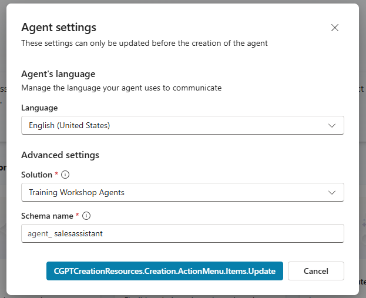

    > [!TIP]
    > Putting an agent into a dedicated solution and changing the schema name is always helpful for application lifecycle management in the future.

1. Select **Enter** or the **Arrow** button on the right side of the description field.

1. Once your agent is fully provisioned, review the instructions and tool or knowledge recommendations provided by the Copilot Studio provisioning process.

#### Prevent Hallucinations

1. To make sure that our agent doesn't use model knowledge, we want to turn off some features. Select **Settings** in the upper right corner.

1. Scroll to the bottom of the list of settings on the **Generative AI** settings screen and turn **Off** both **Use general knowledge** and **Use information from the Web**.

    

1. Select **Save** and then select the **X** in the upper right corner of the settings page to close it.

    > [!TIP]
    > Turning off model and web knowledge helps to keep your agent from hallucinating information that the model might know about our product catalog or other items that might confuse it. This is best practice if you want it to keep to just the content you provide.

#### Collect Sales Associate's Market

1. Select **Topics** in the top navigation menu.

1. Select **Add a Topic** and then select **From blank**

    

1. Select the box that says **The agent chooses** and then select the **Double Arrows** to show the Change Trigger menu, then select **It's redirected to**

    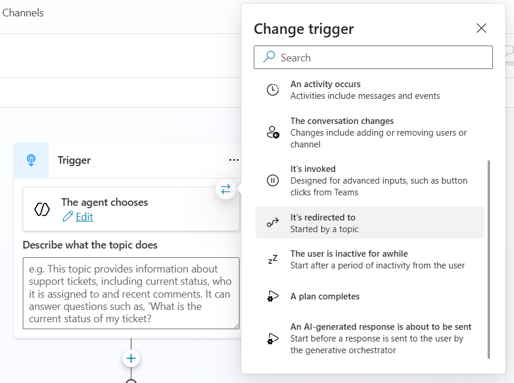

1. Change the name of the Topic to **Select Market** by selecting on the name in the upper left navigation.

    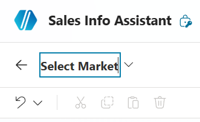

1. Add a node after the Trigger by selecting the **+** and select **Ask a question**

    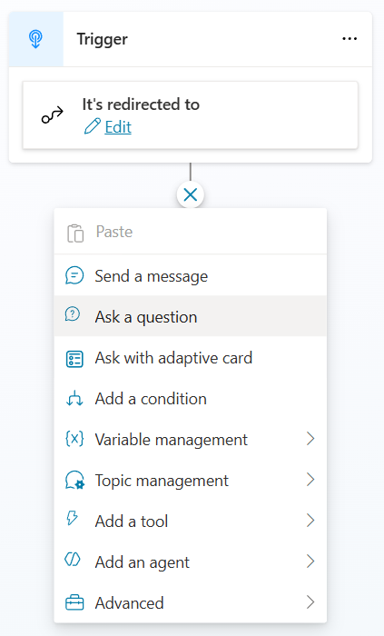

1. Enter **What market are you wanting information in?** in the message area.

1. Select **New option** and add **US** as the option, and then repeat to add **UK** as another option.

    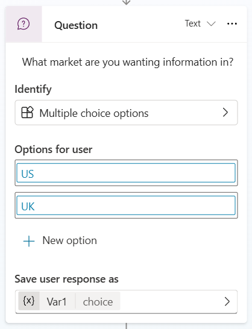

1. Under **Save user response as**, select **Var1** and change the Variable name to `Market`.

1. On the **Variable properties** pane, select **Global** as the Usage of the Variable and select **External sources can receive value**.

1. Enter **The market that the sales associate is requesting information about.** in the Variable description, near the bottom of the Variable properties.

    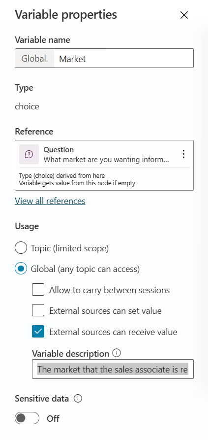

1. Delete all the **Condition** nodes that were automatically added below the Question node by selecting **...** and then selecting **Delete** on each

    

1. Select **Save** to save the topic

1. Select the **V** next to the name of the topic "Select Market" and select **Conversation Start** to go to the Conversation Start Topic

    

1. Add a new node at the end of the topic by selecting the **+** and then selecting **Topic Management > Go to another topic > Select Market**


1. Select **Save**

1. Open the Test chat by Selecting **Test** in the upper right corner.

1. Select the **+** in the Test chat to start a new test session and verify that you now are asked which market at the beginning of each new chat.

    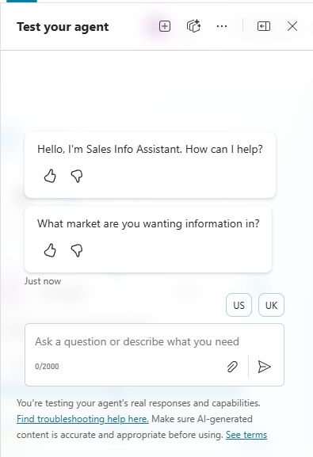

---

###  🏅 Congratulations! You've completed Use Case #1!

---

### Test your understanding

**Key takeaways:**

* **Schema naming matters** – Using a descriptive schema name helps with application lifecycle management and finding your agent later.
* **Disable model knowledge early** – Turning off general knowledge and web search prevents hallucinations and ensures the agent only uses content you provide.
* **Global variables enable cross-agent context** – By making the Market variable global with external send capability, child agents can use it for conditional logic.

**Lessons learned & troubleshooting tips:**

* If the Market question doesn't appear, verify the Conversation Start topic redirects to your Select Market topic.
* If the variable isn't available in child agents, confirm it is set to Global with External sources can receive value enabled.

---

---

## 🔄 Use Case #2: Create Product Information Child Agents

Create child agents that allow the user, based on their market, to get the right product information.

| Use case | Value added | Estimated effort |
|----------|-------------|------------------|
| Create Product Information Child Agents | Group common tools and knowledge into logical groups for orchestration optimization | 12 minutes |

**Summary of tasks**

In this section, you'll learn how to create child agents to logically group knowledge and tools allowing them to be orchestrated based on a condition.

**Scenario:** You want to orchestrate to knowledge about your products based upon the market that the user selects.

### Create Child Agent for US product information

1. In the Sales Associate Assistant, select **Agents** on the top navigation menu.

1. Select **Add** on the Agents page.

1. Select **New child agent**.

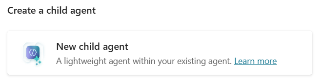

1. Set Agent Name to **US Product Information Agent**.

1. Set the Description to **This agent provides details about the Surface products offered in the United States**

1. Expand **Advanced** and set the Condition to the **Global.Market** variable **is equal to** `US`

    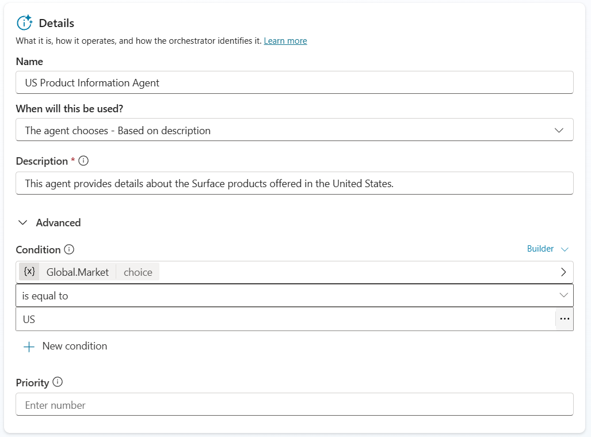

    > [!TIP]
    > You can use a formula or variables to make conditions for when this agent should be available. If you don't see the Global.Market variable that probably means you didn't mark it Global in the topic.

1. Enter the following in the **Instructions**

    ```text
    This agent should only answer questions about Microsoft Surface products in regards to the US-based products.  It should never provide details or stats on any products not offered or details about models offered outside of the United States.  You should only talk about Microsoft Surface products and not discuss any products that are not Microsoft Surface products even if they are made by Microsoft.
    ```

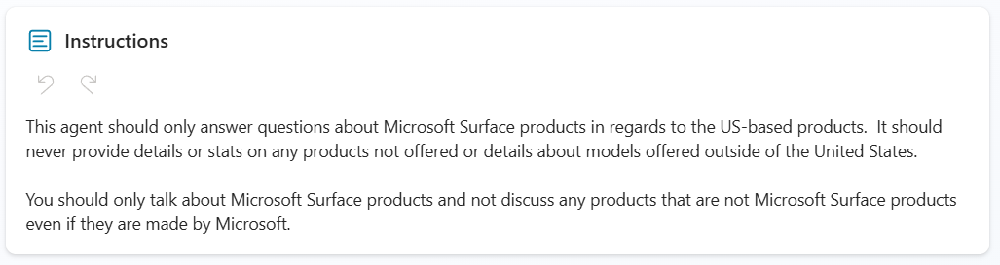

1. Add Knowledge to the Child Agent by Selecting **Add** in the Knowledge section of the Child Agent configuration

1. Select **Public Websites**

1. Enter `microsoft.com` in Public website link and Select **Add**

1. Select **Add to agent**

1. Select **Save** to save your child agent

#### Create Child Agent for UK product information

1. In the Sales Associate Assistant, select **Agents** on the top navigation menu

1. Select **Add** on the Agents page

1. Select **New child agent** 


1. Set Agent Name to `UK Product Information Agent`

1. Set the Description to `This agent provides details about the Surface products offered in the United Kingdom`

1. Expand **Advanced** and set the Condition to the **Global.Market** variable **is equal to** `UK`


    > [!TIP]
    > You can use a formula or variables to make conditions for when this agent should be available.

1. Enter the following in the **Instructions**:

    ```text
    This agent should only answer questions about Microsoft Surface products in regards to the UK-based products.  It should never provide details or stats on any products not offered or details about models offered outside of the United Kingdom.  You should only talk about Microsoft Surface products and not discuss any products that are not Microsoft Surface products even if they are made by Microsoft.`
    ```


1. Add Knowledge to the Child Agent by Selecting **Add** in the Knowledge section of the Child Agent configuration

1. Select **Public Websites**

1. Enter `microsoft.com/en-gb` in Public website link and Select **Add**

1. Select **Add to agent**

1. Select **Save** to save your child agent

1. Open the Test chat by Selecting **Test** in the upper right-hand corner

1. Select the **+** in the Test chat to start a new test session 

1. Select **UK**

1. Enter `What are the starting prices for the Surface laptop?`

1. Verify that the correct child agent was triggered and that your answer is appropriate for the UK market

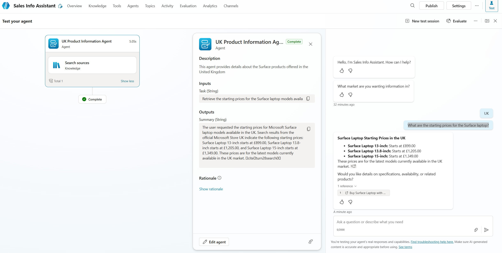

1. Reset the conversation and do again for the US market

---

###  🏅 Congratulations! You've completed Use Case #2!

---

### Test your understanding

**Key takeaways:**

* **Child agents group related capabilities** – Grouping knowledge and tools into a child agent with its own instructions improves orchestration accuracy.
* **Conditions control availability** – Using a variable condition on a child agent means the orchestrator only considers it when the condition is met, preventing irrelevant responses.
* **Instructions scope the agent's domain** – Specific instructions telling the agent what NOT to answer are just as important as telling it what to answer.

**Lessons learned & troubleshooting tips:**

* If the wrong child agent responds, verify the condition on the Advanced section matches the correct Market variable value.
* If knowledge doesn't return results, confirm the Public Website knowledge source status shows a green check mark.

---

---

## 🧱 Use Case #3: Connect to Account and Contact Information Agent

Connect the Account and Contact Information agent to our parent Sales Associate Agent. Will need to ensure indexing is working in the environment ahead of testing.

| Use case | Value added | Estimated effort |
|----------|-------------|------------------|
| Connect to Account and Contact Information Agent | Connect to an Account and Contact Information agent | 10 minutes |

**Summary of tasks**

In this section, you'll learn how to connect an existing Copilot Studio agent to your parent agent using the connected agents feature.

**Scenario:** Your Sales Team needs to quickly answer questions and help customers with information on your products and with finding account and contact information.

### Objective

Connect existing agent to our Sales Associate Assistant agent to add ability to find account and contact information from the sales system.

---

### Step-by-step instructions

#### Make sure that Dataverse Search is set to on

1. In the upper right-hand corner of Copilot Studio, Select the **Gear** icon

1. Select **Go to Power Platform admin center**

1. In the left navigation, select **Manage** then select **Environments**

1. Select your environment from the list

1. Select **Settings** in the top menu

1. Expand **Product** and select **Features**

1. In the Search section, ensure **Dataverse search** is turned **On**

1. Select **Save** if you made any changes

#### Ensure that indexes are in place for our connected agent

    > [!IMPORTANT]
    > This is not required for a connected agent to work, but to make sure that the one we have pre-loaded for you will return results we must index a few tables in your environment.

1. Go to the Power Apps maker portal [https://make.powerapps.com](https://make.powerapps.com)

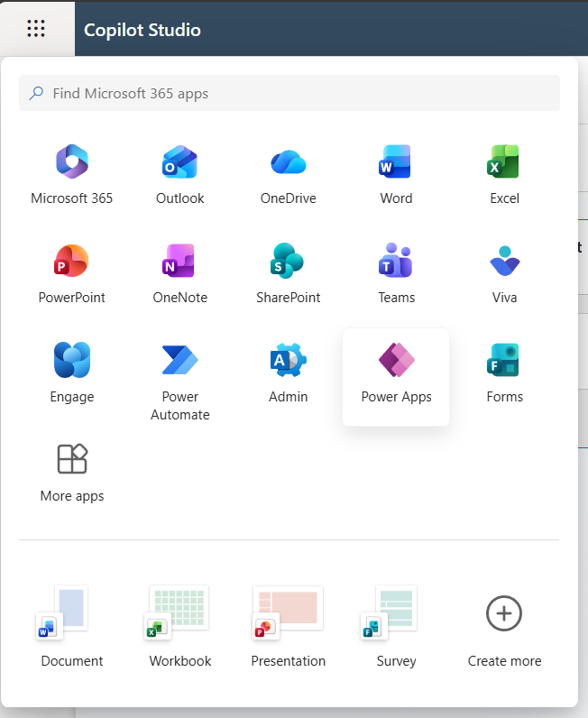

1 In the left menu select **Tables**

1. Select the **Account** table from the list

1. Select **Views** from the Data experiences section

1. Select **Quick Find Active Accounts** option from the list of Views

1. Select **View Column** to verify the following list of columns are in the view:
   - Address1: State or Providence
   - Address1: Postal Code
   - Address1
   - Annual Revenue
   - Currency

1. To add any that are missing select **+ View column** and then select the column from the list.


1. Add the ability to search on certain fields by making sure that the following items are in the **Find by** on the bottom right. Select the **Edit find table columns** option to check:
   - Address1: State or Providence
   - Address1: Postal Code
   - Address1: City


1. Select **Edit find table columns** to add any missing columns.

1. Select **Save and publish** to update the index

    > [!IMPORTANT]
    > DO NOT navigate away until the save and publish is completed!

1. Select **Back** in the upper left corner to go back to the Views list

1. Select on **Tables** in the Views screen to go back to the list of Tables


1. Select **Contact** table from the list

1. Select **Views** from the Data experiences section

1. Select **Quick Find Active Contacts** option from the list of Views

1. Select **View Column** to verify the following columns are in the view:
    - Anniversary
    - Birthday
    - Job Title
    - Marital Status

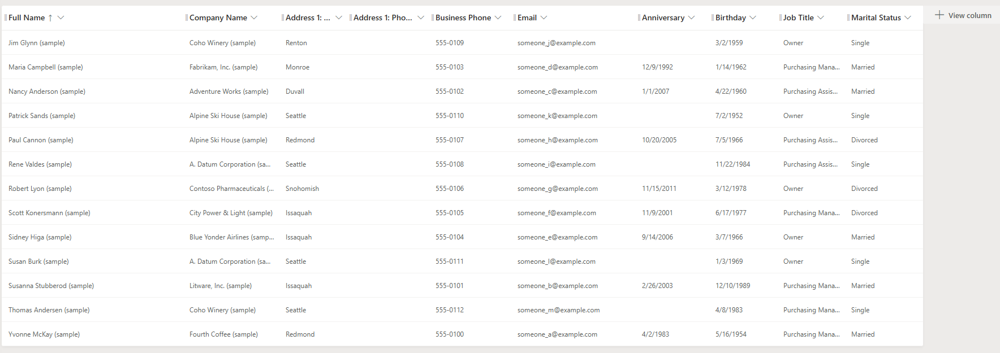

1. Select **+ View column** to add any that are missing.

1. Select **Save and publish** to update the index

> [!IMPORTANT]
> DO NOT navigate away until the save and publish is completed!

#### Test and Publish the Account and Contact Information Agent

1. In the Copilot Studio tab in your browser, go to the **Account Data Lookup Agent**

1. Open the Test chat by Selecting **Test** in the upper right-hand corner

1. Enter `What are the accounts in Texas?`

1. Verify that you get a response showing that the agent is working and the data is indexed


1. Select **Settings** in the upper right-hand menu

1. Make sure that the setting in the Generative AI menu in the Connected Agents section for **Let other agents connect to and use this one** is set to **On**

1. Close the Settings menu by Selecting the **X** in the upper right-hand corner

1. Select **Publish** and make sure that your agent publishes

> [!IMPORTANT]
> You can't connect to an agent unless it is published

#### Connect the Account and Contact Information Agent

1. In the Copilot Studio tab in your browser, go to the parent agent (Sales Associate Assistant)

1. Go to the **Agents** menu on the top navigation bar

1. Select **Add an agent**

1. Select **Account Data Lookup Agent** from the menu


1. Notice that the Description provides details on when to use this agent

1. Make sure that the **Pass conversation history to this agent** is **Checked**


1. Select **Add and configure**

1. Open the Test chat by Selecting **Test** in the upper right-hand corner

1. Select **US** in the test canvas to select that geography

1. Enter `What are all of the details of accounts in Texas?` and send to agent

1. See that the agent orchestrated to the connected agent which then called its child agent that then called numerous tools to answer the question.

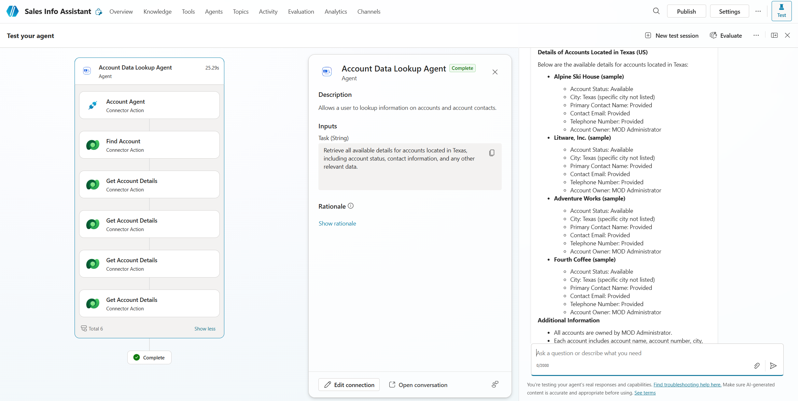

---

###  🏅 Congratulations! You've completed Use Case #3!

---

### Test your understanding

**Key takeaways:**

* **Connected agents extend reach** – Unlike child agents that live inside your agent, connected agents are independently published agents that your agent delegates to.
* **Publishing is required** – A connected agent must be published and have "Let other agents connect to and use this one" enabled before it can be connected.
* **Conversation history improves context** – Passing conversation history to the connected agent helps it understand the full context of the user's request.

**Lessons learned & troubleshooting tips:**

* If the connected agent doesn't appear in the list, ensure it is published and the sharing setting is turned on.
* If Dataverse search returns no results, verify the Quick Find views have the correct columns added and the view is saved and published.
* If the agent can't find account data, check that Dataverse Search is enabled in the Power Platform admin center for your environment.

**Challenge: Apply this to your own use case**

* What agents in your organization could benefit from being connected to a parent orchestrator?
* How would you decide whether something should be a child agent or a connected agent?
* Consider building a connected agent for a different data source (e.g., ServiceNow, Salesforce) and adding it to this same parent agent.

---

---

## 🔄 Use Case #4 (Optional): Connect a Fabric Data Agent

Extend your multi-agent Sales Associate Assistant by connecting a Microsoft Fabric Data Agent to provide e-commerce analytics capabilities through agent-to-agent communication.

| Use case | Value added | Estimated effort |
|----------|-------------|------------------|
| Connect a Fabric Data Agent | Add Fabric data intelligence to your multi-agent solution for e-commerce analytics | Optional (20 minutes) |

> [!NOTE]
> This use case is optional and does not count toward the 30-minute lab duration. It requires access to a Microsoft Fabric capacity and the Workshop Demo Workspace. Complete this if you finish the core lab early or want to explore advanced multi-agent patterns.

**Summary of tasks**

In this section, you'll learn how to create a Fabric Data Agent, optimize it with meta-prompts, and connect it as an additional agent to your Sales Associate Assistant.

**Scenario:** Your Sales Team wants to ask natural language questions about e-commerce performance data stored in Microsoft Fabric — such as revenue trends, top products, and customer segments — directly through the Sales Associate Assistant without needing SQL expertise.

### Objective

Create a Fabric Data Agent connected to an e-commerce semantic model and add it as a connected agent to your Sales Associate Assistant, demonstrating how multi-agent architectures can span across Copilot Studio and Microsoft Fabric.

---

### Step-by-step instructions

#### Create the Fabric Data Agent

1. Go to [fabric.microsoft.com](https://fabric.microsoft.com) and sign in with your credentials.

2. In the left navigation, select **Workspaces** and then select **Workshop Demo Workspace**.

3. Within the workspace, locate the **e-commerce** folder and open the **E-commerce Dataset Report** to familiarize yourself with the data. Keep this tab open for reference.

4. Create a personal folder in the workspace by selecting **New** > **Folder** and naming it with your username.

5. In your personal folder, Select **New Item**, search for `data agent`, and select **Data Agent (Preview)**.

   

6. Name your agent using the pattern `[YourUsername]_DataAgent` and select **Create**.

#### Connect the Data Source

7. In the agent setup, select **+ Data source** in the Explorer panel.

   

8. Select **ecommerce-order-dataset** (Type: Semantic Model) and select **Add**.

   

9. After validation, select all available tables: Customers, Order_Items, Orders, Payments, Products.

10. Test baseline functionality in the **Test** pane:

    ```
    What is our total revenue?
    Show me the top 5 products by sales
    How many customers do we have?
    ```

#### Optimize with Meta-Prompts

11. Generate agent-level instructions by entering this meta-prompt in the **Test** pane:

    ```
    Meta-Prompt: Generate Agent-Level Instructions:
    Analyze your available data sources and create agent-level instructions for yourself (max 15000 chars).

    Objective: E-commerce analytics agent for business intelligence
    Users: Business analysts and sales teams

    Examine your data sources: list all sources, types, and primary use. Analyze domain, time coverage, and main themes.

    Generate instructions with:
    ## Objective
    ## Data Sources (list with priority)
    ## Key Terminology (infer from columns/measures)
    ## Response Guidelines
    Style: Clear summaries with data citations and trend analysis
    ## Handling Common Topics (3-5 based on available data)
    ```

12. Copy the generated response, review it, and paste it into the **Agent Instructions** field in the **Setup** section.

> [!TIP]
> Always review generated instructions for accuracy. Meta-prompts provide a strong foundation but may need minor adjustments for your specific use case.

#### Publish and Connect to Copilot Studio

13. Generate a description using this meta-prompt in the Test pane:

    ```
    Create a 1-2 sentence description of yourself as a Fabric Data Agent (max 200 chars).
    Analyze your data sources and describe: what data domain you cover and what questions you answer.
    Output plain text only.
    ```

14. Select **Publish** and paste the generated description in the purpose and capabilities field.

> [!IMPORTANT]
> Save this description — you'll need it when connecting to Copilot Studio.

15. Go to your **Sales Associate Assistant** in Copilot Studio.

16. Select **Agents** tab on the top navigation bar.

17. Select **Add an agent**.

18. Select **Connect to an external agent** and choose **Microsoft Fabric (preview)**.

19. If it shows **Not connected**, Select the dropdown, select **Create new connection**, and sign in.

    

20. Select your Fabric Data Agent from the list (look for your username) and Select **Next**.

21. Configure the connected agent:
    - **Name**: Your data agent name
    - **Description**: Paste the description from step 13

22. Verify the connection shows a green checkmark and Select **Add agent**.

> [!NOTE]
> If you see "An unexpected server error occurred", try selecting **Add agent** again. If that doesn't work, select **Back**, reselect the agent, and try again.

#### Test the Integrated Solution

23. Open the **Test** pane in Copilot Studio.

24. Select your market (US or UK) when prompted.

25. Test the Fabric Data Agent connection with progressive queries:

    ```
    What products do we sell in our e-commerce store?
    ```

    ```
    Show me our top customers by total purchase value
    ```

    ```
    Analyze our quarterly sales performance and identify which product categories are trending up or down
    ```

26. See in the test pane that data queries are delegated to the Fabric Data Agent, indicated by handoff messages in the execution trace.

> [!TIP]
> Your Sales Associate Assistant now has three types of agents working together: child agents for market-specific product info, a connected agent for account/contact data, and a Fabric Data Agent for e-commerce analytics. This demonstrates real-world multi-agent orchestration at scale.

---

###  🏅 Congratulations! You've completed Use Case #4!

---

### Test your understanding

* Can you identify when the Fabric Data Agent is being triggered versus the Account Data Lookup Agent in the test pane?
* How does the agent description influence when the Fabric agent is consulted versus the child agents?
* What types of queries benefit most from the Fabric Data Agent versus native Copilot Studio capabilities?

---

---

## 🏆 Summary of learnings

True learning comes from doing, questioning, and reflecting—so let's put your skills to the test.

To maximize the impact of multi-agent configurations:

* **Child agents group related capabilities** — Use them to logically organize tools and knowledge with dedicated instructions and conditions for orchestration.
* **Connected agents extend your reach** — Use them to integrate independently published agents, including agents from other teams or platforms like Fabric.
* **Conditions and variables drive orchestration** — Global variables and conditional availability ensure the right agent handles the right request.
* **Descriptions are critical for orchestration** — Clear, specific descriptions help the orchestrator decide which agent to delegate to.
* **Test incrementally** — Start with simple queries and progressively increase complexity to validate that orchestration routes correctly.

---

### Conclusions and recommendations

**Multi-Agent golden rules:**

* Always turn off model knowledge and web search on parent agents when you want strict control over information sources.
* Use child agents when you need to group tools and knowledge with conditional availability inside a single agent.
* Use connected agents when you need to integrate an independently managed and published agent.
* Write clear descriptions for every agent — the orchestrator relies on them to make delegation decisions.
* Set global variables early in the conversation to establish context that child agents can use for conditions.
* Test each agent independently before testing the full multi-agent orchestration.

By following these principles, you'll build scalable multi-agent architectures that distribute work effectively across specialized agents, giving users accurate, contextual answers from the right source every time.

---
