# Using Multi-Agent in Copilot Studio

Help makers understand how to leverage multi-agent configurations including child and connected agents.

---

## 🧭 Lab Details

| Level | Persona | Duration | Purpose |
| ----- | ------- | -------- | ------- |
| 300 | Maker | [30 minutes] | After completing this lab, participants will be able to leverage multi-agent configurations with Copilot Studio. This lab teaches the concepts of multi-agent and shows the difference of connected and child agent configurations. |

---

## 📚 Table of Contents

- [Why This Matters](#-why-this-matters)
- [Introduction](#-introduction)
- [Core Concepts Overview](#-core-concepts-overview)
- [Documentation and Additional Training Links](#-documentation-and-additional-training-links)
- [Prerequisites](#-prerequisites)
- [Summary of Targets](#-summary-of-targets)
- [Use Cases Covered](#-use-cases-covered)
- [Instructions by Use Case](#️-instructions-by-use-case)

---

## 🤔 Why This Matters

**Makers and Architects** - Want to know how to appropriately leverage mutli-agent configurations and when to use connected vs child agents to optimize how your agent orchestrates and is built for scale?

Think of a complex agent that might have many tools and knowledge sets that should only be used when appropriate:
- **Without Multi-Agent**: Makers are heavily limited in the number of orchestratable topics and tools they have at their disposal.
- **With Multi-Agent**: Makers are able to logically group their tools, topics, and knowledge into contextualized agents that allows for additional instructions and descriptions to be used to guide their orchestration on the best way to find the data it is looking to provide to the user.

**Common challenges solved by this lab:**
- "Abusing connected agents"
- "Not knowing if something should be a connected agent or child agent"
- "Don't understand the capabilities and rationale of child agents"
- "Not classifying their agents capabilities and putting excessive instructions in the Overiew instructions to compensate"

**Become a multij-agent master** - no need to continue to wonder about how to work around limitations of tools and topics that can be orchestrated or have the wrong tool being called at the wrong time.

---

## 🌐 Introduction

Welcome to the Copilot Studio Multi‑Agent Lab.
In this hands‑on session, you’ll learn how to design, orchestrate, and extend intelligent copilots using multi‑agent patterns, including child agents, connected agents, and coordinated task delegation.
This lab is designed to help you understand how complex workflows can be broken into smaller, specialized agents that collaborate to solve problems—mirroring modern enterprise AI architectures. You’ll build and configure agents, define how they communicate, and connect them to real data and actions.
By the end, you’ll have a working multi‑agent copilot capable of distributing tasks, retrieving information from external systems, and chaining logic across multiple agent types.

**What You Will Learn**
- How multi‑agent patterns work in Copilot Studio
- Creating and configuring child agents to handle specialized tasks
- Chaining logic so a parent agent delegates tasks to child agents
- Building connected agents that access data sources and external systems
- Designing agent‑to‑agent communication flows
- Using dynamic chaining to route user intent to the right agent
- Implementing branching logic for conditional task routing
- Best practices for agent design, naming, and responsibility boundaries
- Testing multi‑agent scenarios end to end in Copilot Studio
- Troubleshooting common multi‑agent issues

---

## 🎓 Core Concepts Overview

| Concept | Why it matters |
|---------|----------------|
| **Child Agents** | Allows a maker to group common set of tools and knowledge including instructions into a logical group |
| **Connected Agents** | Allows a maker to connect an external agent to another agent in Copilot Studio |
| **Orchestration** | Allows a maker to let the agent decide what tools and agents are best to solve the user's request |

---

## 📄 Documentation and Additional Training Links

* [Generative Orchestration](https://learn.microsoft.com/en-us/microsoft-copilot-studio/faqs-generative-orchestration)
* [Multi-Agent](https://learn.microsoft.com/en-us/microsoft-copilot-studio/authoring-add-other-agents)

---

## ✅ Prerequisites

- Access to Microsoft Copilot Studio
- Dataverse Search Enable in Environment
- Access to Dataverse unbound action connector
- Sample Data loaded into Dataverse Tables
- Access to Account / Contact table in environment
- Access to modify views and create search indexes on Account / Contact table

---

## 🎯 Summary of Targets

In this lab, you'll build a parent agent that will leverage both connected agents and child agents. By the end of the lab, you will:

- Create a parent agent for a Sales Associate
- Configure a child agent that gets information about products
* Connect to a connected agent that gets information about Accounts and Contacts
* Use generative orchestration to select the correct agent and tools to execute the request 

---

## 🧩 Use Cases Covered

| Step | Use Case | Value added | Effort |
|------|----------|-------------|--------|
| 1 | [Create Sales Assistant Agent](#-use-case-1-use-case-1-title) | Creates parent agent to help sales associate find information they need | [X min] |
| 2 | [Create Product Information Child Agents](#-use-case-2-use-case-2-title) | Creates child aget to provide product information | [X min] |
| 3 | [Connect to Account and Contact Information Agent](#-use-case-3-use-case-3-title) | Connect existing Copilot Studio agent that provides account and contact information | [X min] |

---

## 🛠️ Instructions by Use Case

---

## 🧱 Use Case #1: Create Sales Assistant Agent

Creates parent agent to help sales associate find information they need

| Use case | Value added | Estimated effort |
|----------|-------------|------------------|
| Create Sales Assistant Agent | Creates parent agent to help sales associate find information they need | [X minutes] |

**Summary of tasks**

In this section, you'll learn how to create a parent agent to use as the base agent for a Sales Associate Assistant.

**Scenario:** Your Sales Team needs to be able to quickly be able to answer questions and help customers with information on your products and help with finding account and account contact information.

### Objective

Create the parent agent base that will be needed to host all your tools / agents / knowledge for sales associates.

---

### Step-by-step instructions

#### Create Sales Associate Assistant

1. Navigate to the Copilot Studio home page at https://copilotstudio.microsoft.com.

2. On Home page in the description of the agent your want to build enter: `Agent that assists sales associates with getting product information and lookup account and contact information in the sales system.`

> [!IMPORTANT]
> Do not click Enter or submit this text yet as we need to do the agent settings before we do that.

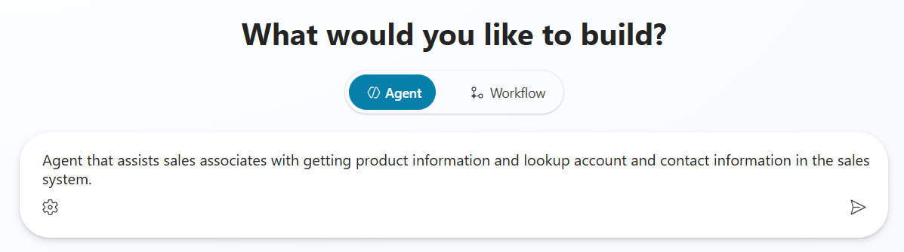

3. Click the **Gear** on the description input area and edit schema name to include `salesassistant` and then click **Update**

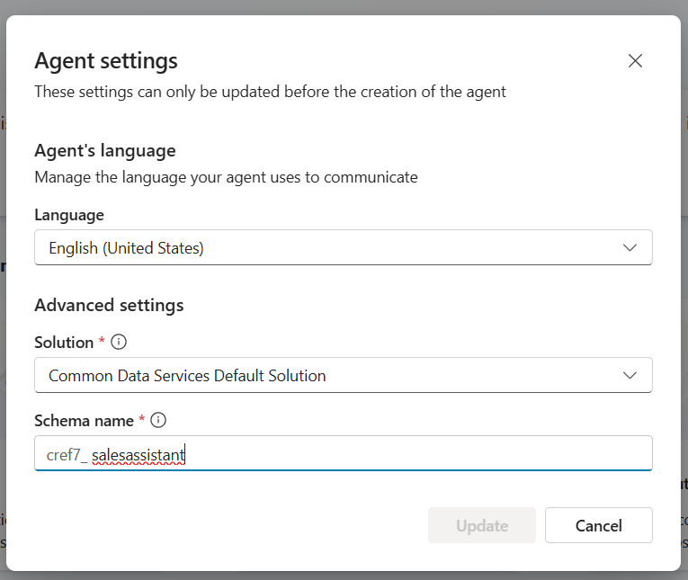

> [!TIP]
> [Putting an agent into a dedicated solution and changing the schema name is always helpful for helping with application lifecycle management in the future]

4. Click **Enter** or the **Arrow** button on the description field

5. Once your agent is fully provisioned, review the instructions and tool or knowledge reccomendations provided by the Copilot Studio provisioning process.

#### Prevent Hallucinations

6. To ensure that our agent doesn't use model knowledge, we want to turn off some features. So select **Settings** (In the upper right hand corner)

7. Scroll to the bottom of the list of settings on the **Generative AI** settings screen and turn **Off** both **Use general knowledge** and **Use information from the Web**

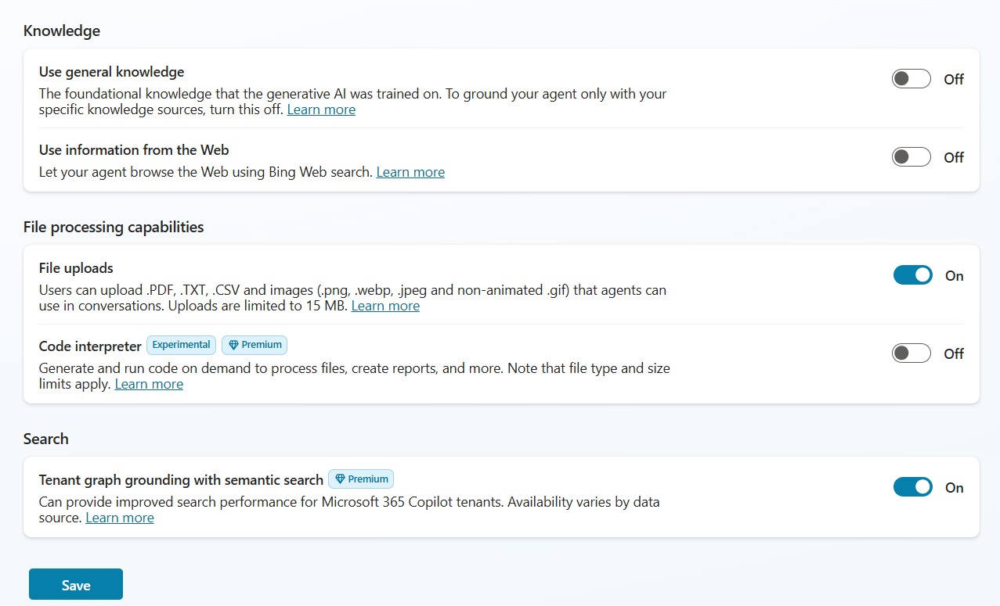

8. Click **Save** and then **Close** the settings page

> [!TIP]
> [Turning off model and web knowledge helps to keep your agent from hallucinating information that the model might know about our product catalog or other items that might confuse it.  This is best practice if you want it to keep to just the content you provide.]

#### Collect Sales Associate's Market

9. Click **Topics** in the top navigation menu

10. Click **Add a Topic** and select **From blank**

11. Hover your mouse over the box that says **The agent chooses** and click the **Double Arrows** to show the Change Trigger menu then select **It's redirected to**

12. Change the name of the Topic to `Select Market` by clicking on the name in the upper left hand navigation

13. Add a node after the Trigger by clicking the **+** and select **Ask a question**

14. Enter `What market are you wanting information in?` and add to Options for user both `US` and `UK` by selecting **New option**

15. Under **Save user response as** click on **Var1** and set the Variable name to `Market`

16. Select **Global** as the Usage of the Variable and select **External sources can recieve value**

17. Enter `The market that the sales associate is requesting information about.` in the Variable description

18. Delete all the **Condition** nodes by selecting **...** and then selecting **Delete** on each

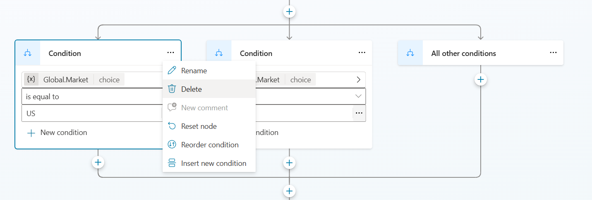

19. Click **Save** to save the topic

20. Click the **V** next to the name of the topic "Select Market" and select **Conversation Start** to go to the Conversation Start Topic

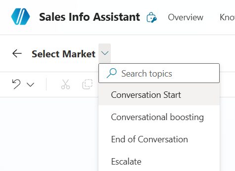

21. Add a new node at the end of the topic by selecting the **+** and the selecting **Topic Management > Go to another topic > Select Market**

22. Click **Save**

23. Open the Test chat by click **Test** in the upper right hand corner

24. Click the **+** in the Test chat to start a new test session and verify that you now are asked which market at the beginning of each new chat.

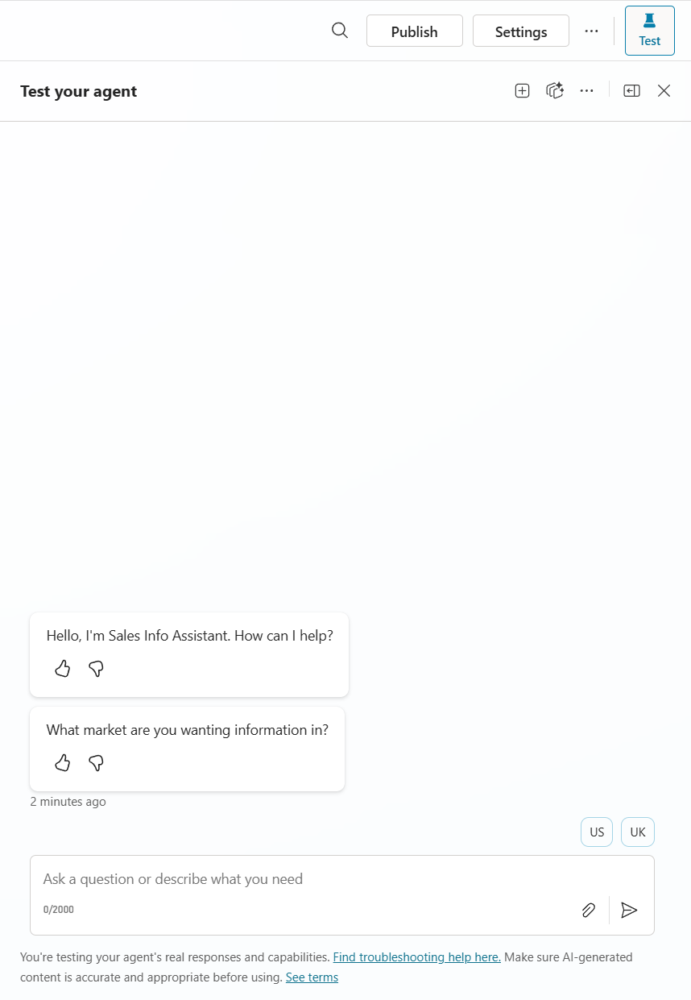

---

###  🏅 Congratulations! You've completed Use Case #1!

---

## 🔄 Use Case #2: Create Product Information Child Agents

Create child agents that allow the user based on their market get the right product market information.

| Use case | Value added | Estimated effort |
|----------|-------------|------------------|
| Create Product Information Child Agents | Group common tools and knowledge into logical groups for orchestration optimization | [X minutes] |

**Summary of tasks**

In this section, you'll learn how to create child agents to logically group knowledge and tools allowing them to be orchestrated based on a condition.

**Scenario:** You want to orchestrate to knowledge about your products based upon the market that the user selects.

#### Create Child Agent for US product information

1. In the Sales Associate Assistant, select **Agents** on the top navigation menu

2. Click **Add** on the Agents page

3. Select **New child agent** 

4. Set Agent Name to `US Product Information Agent`

5. Set the Description to `This agent provides details about the Surface products offered in the United States`

6. Expand **Advanced** and set the Condition to the **Global.Market** variable **is equal to** `US`

> [!TIP]
> You can use a formula or variables to make conditions for when this agent should be available.

7. In Instructions add `This agent should only answer questions about Microsoft Surface products in regards to the US-based products.  It should never provide details or stats on any products not offered or details about models offered outside of the United States.  You should only talk about Microsoft Surface products and not discuss any products that are not Microsoft Surface products even if they are made by Microsoft.`

8. Add Knowledge to the Child Agent by click **Add** in the Knowledge section of the Child Agent configuration

9. Select **Public Websites**

10. Enter `microsoft.com` in Public website link and click **Add**

11. Click **Add to agent**

12. Click **Save** to save your child agent

#### Create Child Agent for UK product information

1. In the Sales Associate Assistant, select **Agents** on the top navigation menu

2. Click **Add** on the Agents page

3. Select **New child agent** 

4. Set Agent Name to `UK Product Information Agent`

5. Set the Description to `This agent provides details about the Surface products offered in the United Kingdom`

6. Expand **Advanced** and set the Condition to the **Global.Market** variable **is equal to** `UK`

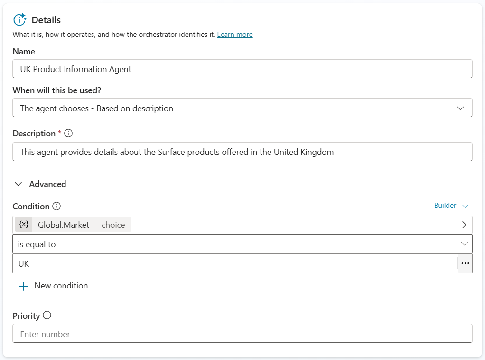

> [!TIP]
> You can use a formula or variables to make conditions for when this agent should be available.

7. In Instructions add `This agent should only answer questions about Microsoft Surface products in regards to the UK-based products.  It should never provide details or stats on any products not offered or details about models offered outside of the United Kingdom.  You should only talk about Microsoft Surface products and not discuss any products that are not Microsoft Surface products even if they are made by Microsoft.`

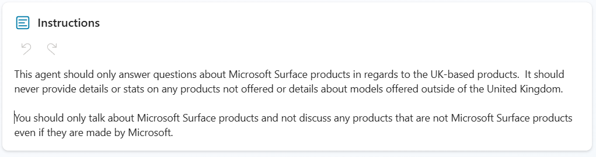

8. Add Knowledge to the Child Agent by click **Add** in the Knowledge section of the Child Agent configuration

9. Select **Public Websites**

10. Enter `microsoft.com/en-gb` in Public website link and click **Add**

11. Click **Add to agent**

12. Click **Save** to save your child agent

13. Open the Test chat by click **Test** in the upper right hand corner

14. Click the **+** in the Test chat to start a new test session 

15. Select **UK**

16. Enter `What are the starting prices for the Surface laptop?`

17. Verfiy that the correct Child agent was triggered and that your answer is appropriate for the UK market

18. Reset the conversation and do again for US market

---

###  🏅 Congratulations! You've completed [USE CASE 2]!

---

## 🧱 Use Case #3: Connect to Account and Contact Information Agent

Connect Account and Contact Information agent to our parent Sales Associate Agent.  Will need to ensure indexing is working in environment ahead of testing.

| Use case | Value added | Estimated effort |
|----------|-------------|------------------|
| Connect to Account and Contact Information Agent | Connect to Account and Contact Information agent | [X minutes] |

**Summary of tasks**

In this section, you'll learn how to connect a Copilot Studio agent to another Copilot Studio connected agent using connected agents.

**Scenario:** Your Sales Team needs to be able to quickly be able to answer questions and help customers with information on your products and help with finding account and account contact information.

### Objective

Connect existing agent to our Sales Associate Assitant agent to add ability to find account and contact information from the sales system.

---

### Step-by-step instructions

#### Ensure that indexes are in place for our connected agent

> [!IMPORTANT]
> This is not required for a connected agent to work, but to make sure that the one we have pre-loaded for you will return results we must index a few tables in your environment.

1. In top left click the menu button with 9 dots in the shape of a box and select **Power Apps**

2. In the left hand menu select **Tables**

3. Select the **Account** table from the list

4. Select **Views** from the Data experiences section

5. Select **Quick Find Active Accounts** option from the list of Views

6. Select **View Column** to add the following list of columns to the view
- Address1: State or Providence
- Address1: postal code
- Address1
- Annual Revenue
- Currency

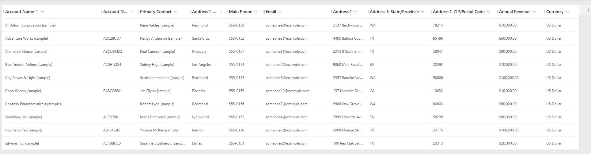

7. Add the ability to search on certain fields by adding the following items to the **Find by** on the bottom right clickin on **Edit find table columns** option
- Address1: State or Providence
- Address1: postal code
- Address1: City

8. Click **Save and publish** to update the index
> [!IMPORTANT]
> DO NOT navigate away until the save and publish is completed!

9. Click **Back** in the upper left corner to go back to the Views list

10. Click on Tables in the Views screen to go back to the list of Tables

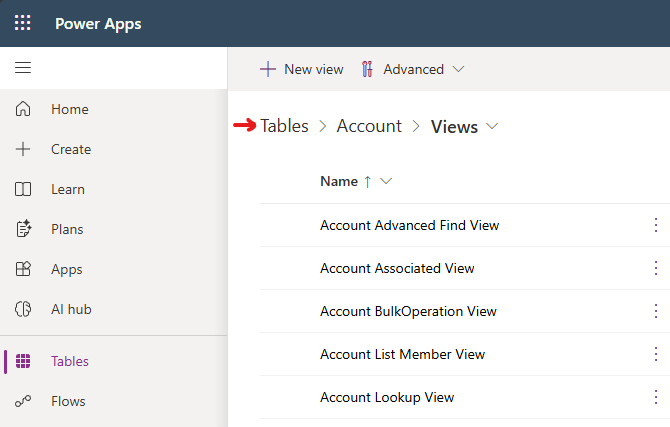

11. Select **Contact** table from the list

12. Select **Views** from the Data experiences section

13. Select **Quick Find Active Contacts** option from the list of Views

14. Select **View Column** to add the following list of columns to the view
- Anniversary
- Birthday
- Job Title
- Marital Status

15. Click **Save and publish** to update the index
> [!IMPORTANT]
> DO NOT navigate away until the save and publish is completed!

#### Test and Publish the Account and Contact Information Agent

16. In the Copilot Studio tab in your browser open the **Account Data Lookup Agent**

17. Open the Test chat by click **Test** in the upper right hand corner

18. Enter `What are the accounts in Texas?`

19. Verify that you get a response showing that the agent is working and the data is indexed

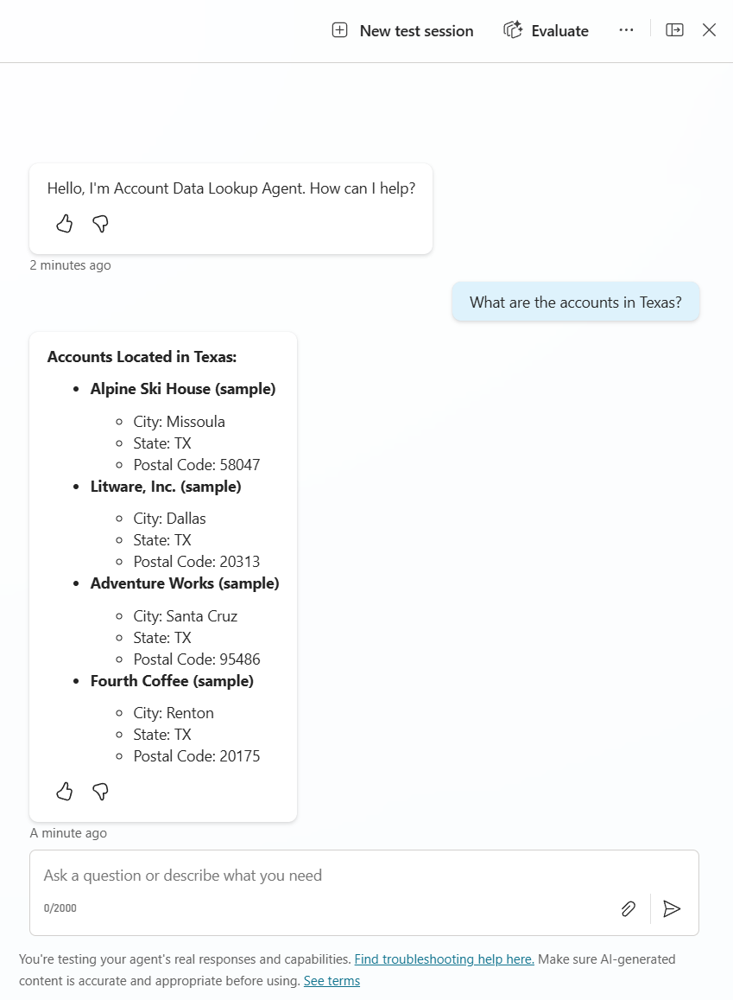

20. Click **Settings** in the upper right hand menu

21. Make sure that the setting in the Generative AI menu in the Connected Agents section for **Let other agents connect to and use this one** is set to **On**

22. Close the Settings menu by clicking the **X** in the upper right hand corner

23. Click **Publish** and make sure that your agent publishes
> [!IMPORTANT]
> You can't connect to an agent unless it is published

#### Connect the Account and Contact Information Agent

24. In the Copilot Studio tab in your browser open your parent agent (Sales Associate Assistant)

25. Navigate to the **Agents** menu on the top navigation bar

26. Click **Add an agent**

27. Select **Account Data Lookup Agent** out of the menu

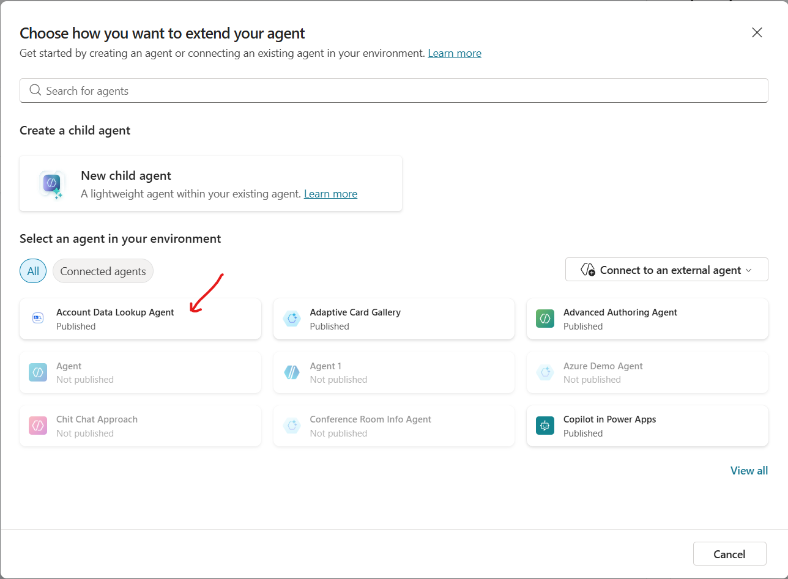

28. Notice that the Description provides details on when to use this agent

29. Make sure that the **Pass conversation history to this agent** is **Checked**

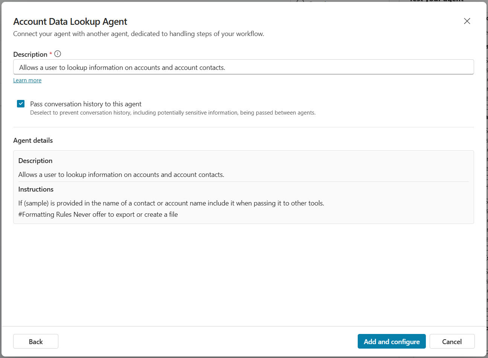

30. Click **Add and configure**

31. Open the Test chat by click **Test** in the upper right hand corner

32. Select **US** in the test canvas to select that geography

33. Enter `What are all of the details of accounts in Texas?` and send to agent

34. Notice that the agent orchestrated to the connected agent which then called it's child agent that then called numerous tools to answer the question.

---

###  🏅 Congratulations! You've completed [USE CASE 3]!

---
