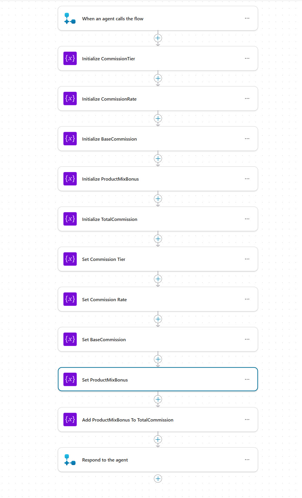
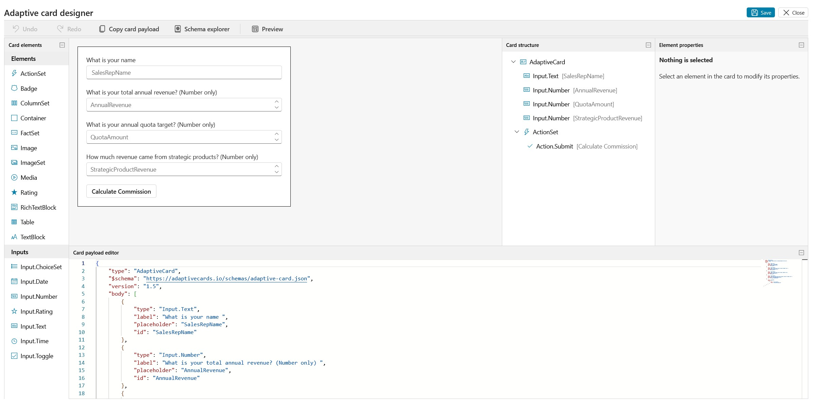
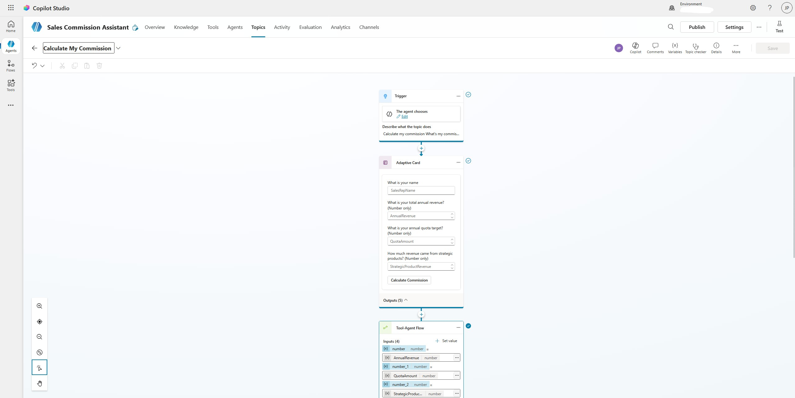

# Copilot Studio Tools

Learn how to extend your agents with powerful tools including connectors, agent flows, MCP servers, and custom prompts in Microsoft Copilot Studio.

---

## 🧭 Lab Details

| Level | Persona | Duration | Purpose |
| ----- | ------- | -------- | ------- |
| 300 | Maker | 60 minutes | After completing this lab, participants will be able to use connectors to integrate external services, build deterministic business logic with agent flows, connect MCP servers for live data access, and create custom prompts for structured responses. An optional extra credit section covers Computer Using Agents (CUA) for legacy system automation. |

---

## 📚 Table of Contents

- [Why This Matters](#-why-this-matters)
- [Introduction](#-introduction)
- [Core Concepts Overview](#-core-concepts-overview)
- [Documentation and Additional Training Links](#-documentation-and-additional-training-links)
- [Prerequisites](#-prerequisites)
- [Summary of Targets](#-summary-of-targets)
- [Use Cases Covered](#-use-cases-covered)
- [Instructions by Use Case](#️-instructions-by-use-case)
  - [Use Case #1: Extend Your Agent with Connectors](#-use-case-1-extend-your-agent-with-connectors)
  - [Use Case #2: Build Deterministic Logic with Agent Flows](#-use-case-2-build-deterministic-logic-with-agent-flows)
  - [Use Case #3: Connect an MCP Server for Live Data Access](#-use-case-3-connect-an-mcp-server-for-live-data-access)
  - [Use Case #4: Create Custom Prompts for Structured Responses](#-use-case-4-create-custom-prompts-for-structured-responses)
  - [Extra Credit: Automate Legacy Systems with Computer Using Agents (CUA)](#-extra-credit-automate-legacy-systems-with-computer-using-agents-cua)

---

## 🤔 Why This Matters

**Makers and Developers** - Want to know how to go beyond basic agent capabilities and connect your agents to real data, business logic, and external systems?

Think of tools as the hands and feet of your agent:
- **Without Tools**: Your agent can only respond based on its knowledge sources and instructions - it can't take action, access live data, or execute business logic
- **With Tools**: Your agent becomes a true assistant that can query databases, run calculations, call APIs, interact with legacy systems, and deliver structured, actionable responses

**Common challenges solved by this lab:**
- "My agent can answer questions but can't actually do anything"
- "I need my agent to access live data from Dataverse and other systems"
- "I have business rules that must always produce the same result - AI alone isn't deterministic enough"
- "I need to connect to legacy systems that don't have APIs"

**In 60 minutes, you'll learn four different ways to extend your agents with tools - giving you the skills to build agents that don't just talk, but take action.**

---

## 🌐 Introduction

Tools are what transform a conversational agent into a powerful business assistant. Microsoft Copilot Studio offers multiple types of tools, each designed for different integration scenarios. Connectors provide pre-built integrations with hundreds of services. Agent flows enable deterministic, rule-based business logic using Power Fx. MCP (Model Context Protocol) servers provide real-time access to data sources like Dataverse. Custom prompts structure agent responses for consistent, business-relevant outputs. And for systems without APIs, Computer Using Agents (CUA) can simulate human interaction with graphical interfaces.

**Real-world example:** A sales organization needs an agent that can calculate commissions based on fixed business rules (agent flow), look up account details from Dataverse in real time (MCP server), send notifications through Teams or email (connectors), present data in a consistent format (custom prompts), and even pull data from a legacy portfolio system with no API (CUA). Each tool type addresses a different integration need, and together they create a comprehensive, capable agent.

This lab teaches you how to use each tool type through hands-on scenarios.

---

## 🎓 Core Concepts Overview

| Concept | Why it matters |
|---------|----------------|
| **Connectors** | Pre-built integrations with hundreds of Microsoft and third-party services, enabling agents to take actions like sending emails, creating records, or querying external APIs |
| **Agent Flows** | Deterministic, rule-based workflows that process inputs and produce predictable outputs using Power Fx - essential for business logic that must always be consistent |
| **MCP Servers** | Model Context Protocol servers that provide real-time, dynamic access to data sources like Dataverse, enabling natural language queries against live business data |
| **Custom Prompts** | Structured prompt templates that standardize agent responses by pulling specific fields from data sources, ensuring consistent and relevant output formats |
| **Computer Using Agents (CUA)** | Agents that simulate human interaction with graphical user interfaces, enabling automation of legacy systems that lack API connectivity |

---

## 📄 Documentation and Additional Training Links

* [Tools overview in Copilot Studio](https://learn.microsoft.com/en-us/microsoft-copilot-studio/add-tools-custom-agent)
* [Agent Flows in Microsoft Copilot Studio](https://learn.microsoft.com/en-us/microsoft-copilot-studio/advanced-flow)
* [Connect to Dataverse with Model Context Protocol (MCP)](https://learn.microsoft.com/en-us/power-apps/maker/data-platform/data-platform-mcp)
* [Use prompts to make your agent perform specific tasks](https://learn.microsoft.com/en-us/microsoft-copilot-studio/nlu-prompt-node)
* [Use connectors in Copilot Studio](https://learn.microsoft.com/microsoft-copilot-studio/advanced-connectors)
* [Create a custom connector from scratch](https://learn.microsoft.com/en-us/connectors/custom-connectors/define-blank)
* [Free Dictionary API](https://dictionaryapi.dev/)
* [Automate web and desktop apps with Computer use](https://learn.microsoft.com/microsoft-copilot-studio/computer-use)

---

## ✅ Prerequisites

- Access to Microsoft Copilot Studio with appropriate licensing
- Power Platform environment enabled for Copilot Studio
- Basic familiarity with the Copilot Studio interface
- Office 365 environment with Outlook integration enabled (for CUA extra credit)

---

## 🎯 Summary of Targets

In this lab, you'll extend agents with multiple tool types to address different integration scenarios. By the end of the lab, you will:

- Use connectors to integrate external services with your agent
- Build an agent flow with deterministic business logic for commission calculations
- Connect a Dataverse MCP server for real-time natural language data access
- Create custom prompts that structure agent responses with specific data fields
- (Extra Credit) Configure a Computer Using Agent to automate a legacy system without API access

---

## 🧩 Use Cases Covered

| Step | Use Case | Value added | Effort |
|------|----------|-------------|--------|
| 1 | [Extend Your Agent with Connectors](#-use-case-1-extend-your-agent-with-connectors) | Integrate external services and take actions through pre-built connectors | 15 min |
| 2 | [Build Deterministic Logic with Agent Flows](#-use-case-2-build-deterministic-logic-with-agent-flows) | Implement business rules that always produce consistent, predictable results | 15 min |
| 3 | [Connect an MCP Server for Live Data Access](#-use-case-3-connect-an-mcp-server-for-live-data-access) | Enable natural language queries against live Dataverse business data | 20 min |
| 4 | [Create Custom Prompts for Structured Responses](#-use-case-4-create-custom-prompts-for-structured-responses) | Standardize agent outputs for consistent, business-relevant responses | 10 min |
| EC | [Extra Credit: Automate Legacy Systems with CUA](#-extra-credit-automate-legacy-systems-with-computer-using-agents-cua) | Automate systems that lack API connectivity using desktop simulation (Optional) | ~20 min |

---

## 🛠️ Instructions by Use Case

---

## 🧱 Use Case #1: Extend Your Agent with Connectors

Create a custom connector for the Free Dictionary API and use it as a tool in your agent to look up word definitions.

| Use case | Value added | Estimated effort |
|----------|-------------|------------------|
| Extend Your Agent with Connectors | Build a custom connector and use it as a tool to integrate an external API | 15 minutes |

**Summary of tasks**

In this section, you'll learn how to create a custom connector from a public API, define its actions and response schema, add it as a tool in your agent, and test natural language queries against it.

**Scenario:** Your organization needs a Dictionary Agent that can look up word definitions, origins, and pronunciations on demand. The Free Dictionary API provides this data, but there's no pre-built connector for it. You'll create a custom connector and wire it into your agent as a tool.

### Objective

Create a custom connector for the Free Dictionary API, add it as a tool in your agent, and test word lookups through natural language conversation.

---

### Step-by-step instructions

#### Create the Dictionary Agent

1. Go to [Microsoft Copilot Studio](https://copilotstudio.microsoft.com) and make sure you are in your development environment.

1. Select **Agents** on the left navigation.

1. Select **Create blank agent** in the upper right corner.

1. Once the agent is provisioned, rename it to `Dictionary Agent` by selecting  **Edit** in the **Details** section on **Overview**.

1. Enter the following as the **Description:**

    ```
    This agent allows a user to lookup the definition of a word
    ```

1. Select **Save**.

#### Create the Custom Connector

1. Select **Tools** in the top navigation.

1. Select **Add Tool**.

1. Under **Create new**, Select **See all**.

1. Select **Custom connector**.

1. In the top navigation, Select **New custom connector**.

1. Select **Create from blank**.

1. Enter **Lookup Word in Dictionary** into the **Connector name** field

1. Select **Continue**.

1. In the **Host** field, enter **api.dictionaryapi.dev**

1. In the **Base URL** field, enter **/api/v2/**

1. Select **Security** at the bottom.

    > [!NOTE]
    > This API doesn't require authentication, but this is where you would select the authentication type for APIs that do.

1. Make sure the authentication type is set to **No authentication** and Select **Definition**.

#### Define the API Action

1. Select **+ New action** in the **Actions** section.

1. In the **Summary** field, enter **Word Lookup**

1. In the **Description** field, enter:
    ```
    Lookup a word in the dictionary
    ```

    > [!TIP]
    > The description will later be used as the tool description, which allows the orchestrator to know when to use this tool. Make sure you are descriptive here to allow the best conversation routing.

1. In the **Operation ID** field, enter **WordLookup**

1. Under **Request**, Select **Import from sample**.

1. Select **Get** as the **Verb**.

1. In the **URL** field, enter:

    ```
    https://api.dictionaryapi.dev/api/v2/entries/en/{word}
    ```

1. Select **Import**.

1. Select the down arrow next to **word** and Select **Edit**.

1. In the **Description** field, enter:

    ```
    The word that you want to lookup the definition of
    ```

1. Select **Back** at the top of the form.

#### Define the Response Schema

1. Select **default** in the **Response** section.

1. Select **Import from sample**.

1. This JSON is an array containing a dictionary entry for the word “hello,” including its spelling, pronunciation (text and audio), origin, and its meanings broken down by part of speech (exclamation, noun, and verb) with definitions and examples.  It helps give the agent the needed context. In the **Body** field, copy and paste the following JSON sample:

    ```json
    [
        {
          "word": "hello",
          "phonetic": "həˈləʊ",
          "phonetics": [
            {
              "text": "həˈləʊ",
              "audio": "//ssl.gstatic.com/dictionary/static/sounds/20200429/hello--_gb_1.mp3"
            },
            {
              "text": "hɛˈləʊ"
            }
          ],
          "origin": "early 19th century: variant of earlier hollo ; related to holla.",
          "meanings": [
            {
              "partOfSpeech": "exclamation",
              "definitions": [
                {
                  "definition": "used as a greeting or to begin a phone conversation.",
                  "example": "hello there, Katie!",
                  "synonyms": [],
                  "antonyms": []
                }
              ]
            },
            {
              "partOfSpeech": "noun",
              "definitions": [
                {
                  "definition": "an utterance of 'hello'; a greeting.",
                  "example": "she was getting polite nods and hellos from people",
                  "synonyms": [],
                  "antonyms": []
                }
              ]
            },
            {
              "partOfSpeech": "verb",
              "definitions": [
                {
                  "definition": "say or shout 'hello'.",
                  "example": "I pressed the phone button and helloed",
                  "synonyms": [],
                  "antonyms": []
                }
              ]
            }
          ]
        }
      ]
    ```

1. Select **Import**.

1. Update the following body items by selecting the down arrow on each and selecting **Edit**, change the data and then select **back**:

- **origin**
  - **Title:** `origin`
  - **Description:** `Where the word originated from including data such as the definition, part of speech, example of its use, synonyms, antonyms. It includes all potential uses of the word in part of speech such as if it is used as a verb, noun, or an exclamation what the meaning is when used in that way.`

- **phonetic**
  - **Title:** `phonetic`
  - **Description:** `How to pronounce the word including the audio file of it being spoken.`

- **word**
  - **Title:** `word`
  - **Description:** `The word that was looked up`

1. Select **Create connector** on the top menu.


#### Add the Custom Connector as a Tool

1. Go back to the browser tab with Copilot Studio.

1. Refresh the page.

1. In the **Add tool** screen, enter the following into the search box and press **Enter**:

    ```
    Lookup a word in the dictionary
    ```

    > [!NOTE]
    > It can sometimes take a few minutes for a new connector to sync to Copilot Studio. If you don't see it, try clearing your browser cache by refreshing the page.

1. Select the **Word Lookup** connector from the search results.

1. Select the down arrow next to the **Connection** and select **Create new connection**.

1. Select **Create**.

1. You should see the connection with a green check mark. Select **Add and configure**.

1. Select **Additional details** and set **Credentials to use** to **Maker-provided credentials**.

    > [!TIP]
    > For unauthenticated APIs, it is best to use Maker-provided credentials so you don't require users to create a connection for anonymous connectors.

1. In the **Inputs** section, Select **Customize** next to **word**.

1. Notice that all your inputs have been populated from your connector definition - this is why it is important to provide detailed descriptions when building your connector.

1. Select **Save** to save the tool configuration.

#### Test Your Dictionary Agent

1. Select **Settings** in the upper right corner.

1. Scroll to the bottom of the **Generative AI** list of settings.

1. Turn off **Use general knowledge**.

    > [!NOTE]
    > Disabling general knowledge make sure that only your custom connector API provides answers, not the underlying language model.

1. Select **Save**.

1. Close **Settings** using the **X** in the upper right-hand corner.

1. In the test pane, try the following queries:

    ```
    What is the meaning of the word copilot?
    ```

    ```
    Where does it come from?
    ```

    ```
    How about the word amazing?
    ```

1. Verify that the agent uses your custom connector tool to retrieve definitions, origins, and phonetic information from the Free Dictionary API.

---

### 🏅 Congratulations! You've completed Use Case #1!

---

### Test your understanding

**Key takeaways:**

* **Custom Connectors** - You can create connectors from any REST API, giving your agent access to virtually any external service
* **Descriptive Metadata** - Detailed descriptions on actions, parameters, and response fields help the orchestrator route conversations correctly and improve tool selection
* **Maker-Provided Credentials** - For unauthenticated APIs, use maker-provided credentials so end users don't need to create connections

**Lessons learned & troubleshooting tips:**

* New custom connectors may take a few minutes to sync to Copilot Studio - refresh your browser if the connector doesn't appear immediately
* Disabling general knowledge forces the agent to rely solely on your tools, which is useful for validating that the connector works correctly
* Always define response schemas with descriptive titles and descriptions so the agent can present results meaningfully

---

---

## 🔄 Use Case #2: Build Deterministic Logic with Agent Flows

Build a Sales Commission Calculator using agent flows to implement deterministic business logic that always produces consistent, predictable results.

| Use case | Value added | Estimated effort |
|----------|-------------|------------------|
| Build Deterministic Logic with Agent Flows | Implement business rules that always produce consistent, predictable results | 15 minutes |

**Summary of tasks**

In this section, you'll learn how to create an agent flow with deterministic business logic, implement tier-based commission calculations using Power Fx, build a conversational topic that collects inputs and calls the flow, and test multiple scenarios to validate business rules.

**Scenario:** Contoso Electronics has a sales team that needs instant visibility into their commission earnings. Commission calculations involve performance tiers with different percentage rates and product mix bonuses - rules that must always produce the same result for the same inputs. Agent flows are the ideal tool because they provide deterministic, rule-based processing rather than AI-generated responses.

### Objective

Create an agent flow that calculates sales commissions using deterministic business rules, build a conversational topic to collect inputs, and test the complete workflow.

---

### Step-by-step instructions

#### Create a New Agent

1. Go to **Microsoft Copilot Studio** at https://copilotstudio.microsoft.com.

1. Select **Agents** on left navigation.

1. Select **Create blank agent** in the upper right corner.

1. Select **Edit** in the **Details** section.

1. Enter the following details:
   - **Name:** `Sales Commission Assistant`
   - **Description:** `Calculates sales commissions based on performance data`

1. Select **Save** in the upper right corner of the **Details** section.

    > [!TIP]
    > The agent creation may take 30-60 seconds. You'll see a loading indicator while your agent is being provisioned.

#### Create the Agent Flow

1. In the top navigation panel, Select **Tools**.

1. Select **+ Add a tool**.

1. In the **Create new** section, select **Agent flow**.

1. Select **Publish**.

1. Select **Stay in flow** when the publish completes.

1. Select **Overview** tab in the top navigation.

1. Select **Edit** in the upper right corner of the **Details** section.

1. Enter **Calculate Sales Commission** for the Flow name.

1. Enter the following for the description:

    ```
    Deterministic commission calculation with tiers, bonuses, and accelerators
    ```

1. Change **Express mode** at the bottom of that right panel to **Enabled**.

1. Select **Save**.


#### Define Input Parameters

1. In the top navigation select the **Designer** tab.

1. Select **When an agent calls the inputs** at the top.

1. Select **+ Add input** for each parameter below:

  | Parameter Name | Type | 
  |----------------|------|
  | `SalesRepName` | Text| 
  | `AnnualRevenue` | Number | 
  | `QuotaAmount` | Number | 
  | `StrategicProductRevenue` | Number | 

1. Select **Save draft** in the upper right corner after adding all inputs.

    > [!IMPORTANT]
    > Make sure parameter names match exactly (case-sensitive) as they'll be referenced in formulas.

#### Initialize Variables

1. Select **+ Add node** in the flow canvas before the last node **Respond to the agent**.

1. Select **Variable** > **Initialize variable**, Enter the name and select the type based on the list in the next step. You will repeat this for each of the 5 variables.

1. Initialize the following variables:

    | Variable name | Type | Value |
    |---------------|------|---------------|
    | `CommissionTier` | String | (leave empty) |
    | `CommissionRate` | Float | `0` |
    | `BaseCommission` | Float | `0` |
    | `ProductMixBonus` | Float | `0` |
    | `TotalCommission` | Float | `0` |

1. Optionally, select "..." on each Initialize node and select **Rename*" and change them from generic Initialize variable 1 to Initialize and the name of the variable they are initializing.  This step is not required, however, it is a best practice.

1. Select **Save draft** to save your progress.

#### Determine Commission Tier

1. Select **+ Add node** just before the last node **Respond to the agent**.

1. Select **Variable** and then Select **Set variable**.

1. Select **CommissionTier** in the list of variable names.

1. Select **fx** on the right side of the value field to open the Insert expression pane.

1. Select **Create an expression with Copilot**.

1. Enter the following in the input area for Copilot to create an expression:

      ```
    Create a calculated field called “Tier” based on the value of the Number field. If Number is greater than 500,000, set Tier to “Tier 3”. If Number is greater than 250,000 but less than or equal to 500,000, set Tier to “Tier 2”. If Number is greater than 100,000 but less than or equal to 250,000, set Tier to “Tier 1”. Otherwise, set Tier to “Tier 0”.
      ```
1. Select **Create Expression** and then select **OK** 

1. Review the expression it should look like the following if not update it from here:

    ```
    if(greater(triggerBody()?['number'], 500000), 'Tier 3', if(greater(triggerBody()?['number'], 250000), 'Tier 2', if(greater(triggerBody()?['number'], 100000), 'Tier 1', 'Tier 0')) )
    ```

1. Select **Add**.

1. Optionally, select **...** and then select **Rename** to change the step name to **Set CommissionTier**.


#### Determine Commission Rate

1. Select **+ Add node** just before the last node **Respond to the agent**.

1. Select **Variable** and then Select **Set variable**.

1. Select **CommissionRate** in the list of variable names.

1. Select **fx** on the right side of the value field to open the Insert expression pane.

1. Select **Create an expression with Copilot**.

1. Enter the following in the input area for Copilot to create an expression:

      ```
    Create a calculated field called “Rate” based on the value of the Number field. If Number is greater than 500,000, set Rate to 0.12. If Number is greater than 250,000 but less than or equal to 500,000, set Rate to 0.10. If Number is greater than 100,000 but less than or equal to 250,000, set Rate to 0.05. Otherwise, set Rate to 0.00.
      ```
1. Select **Create Expression** and then select **OK** 

1. Review the expression it should look like the following if not update it from here:

      ```
      if(greater(triggerBody()?['number'], 500000), 0.12, if(greater(triggerBody()?['number'], 250000), 0.10, if(greater(triggerBody()?['number'], 100000), 0.05, 0.00)))
      ```

1. Select **Add**.

1. Optionally, select **...** and then select **Rename** to change the step name to **Set CommissionRate**.


#### Calculate Base Commission

1. Select **+ Add node** just before the last node **Respond to the agent**.

1. Select **Variable** and then Select **Set variable**.

1. Select **BaseCommission** in the list of variable names.

1. Select **fx** on the right side of the value field to open the Insert expression pane.

1. Select **Create an expression with Copilot**.

1. Enter the following in the input area for Copilot to create an expression:

    ```
    Multiply AnnualRevenue times CommissionRate
    ```
1. Select **Create Expression** and then select **OK** 

1. Review the expression it should look like the following if not update it from here:

    ```
    mul(triggerBody()?['number'], variables('CommissionRate'))
    ```

1. Select **Add**.

1. Optionally, select **...** and then select **Rename** to change the step name to **Set CommissionBase**.

1. Select **+ Add node** just before the last node **Respond to the agent**.

1. Select **Variable** and then select **Increment variable**.

1. Select **TotalCommission** from the list of variable names.

1. Select the lightening bolt next to the Value field to bring up the available dynamic data fields.

1. Select **BaseCommission**.

1. Optionally, select **...** and then select **Rename** to change the step name to **Add BaseCommission To TotalCommission**.

#### Calculate Product Mix Bonus

1. Select **Variable** and then select **Set variable**.

1. Select **ProductMixBonus** in the list of variable names.

1. Select **fx** on the right side of the value field to open the Insert expression pane.

1. Select **Create an expression with Copilot**.

1. Enter the following in the input area for Copilot to create an expression:

    ```
    If you Divide StrategicProductRevenue by AnnualRevenue and it is >= 0.30 then ProductMixBonus is 3000 otherwise it is 0. Make sure you convert the two values to Float before dividing.
    ```
1. Select **Create Expression** and then select **OK** 

1. Review the expression it should look like the following if not update it from here:

    ```
    if(greaterOrEquals(div(float(triggerBody()?['number_2']), float(triggerBody()?['number'])), 0.3), 3000, 0)
    ```

1. Select **Add**.

1. Optionally, select **...** and then select **Rename** to change the step name to **Set ProductMixBonus**.

1. Select **+ Add node** just before the last node **Respond to the agent**.

1. Select **Variable** and then Select **Increment variable**.

1. Select **TotalCommission** from the list of variable names.

1. Select the lightening bolt next to the Value field to bring up the available dynamic data fields.

1. Select **ProductMixBonus**.

1. Optionally, select **...** and then select **Rename** to change the step name to **Add ProductMixBonus To TotalCommission**.

#### Create the Response Message

1. Select the **Respond to the agent** node at the bottom of the flow.

1. Select **Add an output** and Select **Text**.

1. Map **CommissionReport** in the name.

1. Enter the following in the description:

    ```
    Report of the results of the commission calculation
    ```
1. Select **fx** to the right of the **Enter a value to respond with** field.

1. Next we need to define the report details based on the variables we initiated and set. Enter the following in the formula input area:

    ```
    concat('COMMISSION CALCULATION REPORT
    ===================================

    SALES REPRESENTATIVE: ', triggerBody()?['text'], '

    PERFORMANCE SUMMARY
    -----------------------------------
    Annual Revenue: $', formatNumber(triggerBody()?['number'], '#,##0.00'), '
    Annual Quota: $', formatNumber(triggerBody()?['number_1'], '#,##0.00'), '
    Strategic Product Revenue: $', formatNumber(triggerBody()?['number_2'], '#,##0.00'), '

    COMMISSION BREAKDOWN
    -----------------------------------
    Commission Tier: ', variables('CommissionTier'), '
    Commission Rate: ', formatNumber(mul(variables('CommissionRate'), 100), '#,##0.0'), '%
    Base Commission: $', formatNumber(variables('BaseCommission'), '#,##0.00'), '

    BONUS
    -----------------------------------
    ', if(greater(variables('ProductMixBonus'), 0), concat('Product Mix Bonus: $', formatNumber(variables('ProductMixBonus'), '#,##0.00'), ' (Strategic products >=30%)'), 'Product Mix Bonus: $0.00 (Strategic products <30%)'), '

    TOTAL COMMISSION
    -----------------------------------
    $', formatNumber(variables('TotalCommission'), '#,##0.00'), '

    ===================================
    Calculation Date: ', formatDateTime(utcNow(), 'MMM dd, yyyy'))
    ```
1. Select **Add** to add the formula

1. Select **Save Draft** in upper right corner of the screen.

1. Select **Publish** to make your changes available for the agent to use.



#### Build the Conversation Topic

1. Select **Agents** in the left side navigation.

1. Select **Sales Commission Assistant** in the list of agents.

1. In the top agent navigation, Select **Topics**.

1. Select **+ Add a Topic** > **From blank**.

1. Enter **Calculate My Commission** for the Name by selecting **Untitled** in the upper left corner of the screen.

1. Enter the following in the **Describe what the topic does** input area:

    ```
    Calculate my commission
    What's my commission
    How much commission did I earn
    Check commission
    Commission calculator
    Show my earnings
    Calculate earnings
    ```

1. Select **Save**.

1. Under the **Trigger** node, add an **Ask with adaptive card** node. 

1. Select **"..."** in the upper right corner of the node you just added and select **Properties**.

1. Select **Edit adaptive card**.  We need to tell the card what to display to the user, and then what to do with the responses. Enter the following into the **Card payload editor** replacing the existing text:

    ```json
    {
        "type": "AdaptiveCard",
        "$schema": "https://adaptivecards.io/schemas/adaptive-card.json",
        "version": "1.5",
        "body": [
            {
                "type": "Input.Text",
                "label": "What is your name",
                "placeholder": "SalesRepName",
                "id": "SalesRepName"
            },
            {
                "type": "Input.Number",
                "label": "What is your total annual revenue? (Number only)",
                "placeholder": "AnnualRevenue",
                "id": "AnnualRevenue"
            },
            {
                "type": "Input.Number",
                "label": "What is your annual quota target? (Number only)",
                "placeholder": "QuotaAmount",
                "id": "QuotaAmount"
            },
            {
                "type": "Input.Number",
                "label": "How much revenue came from strategic products? (Number only)",
                "placeholder": "StrategicProductRevenue",
                "id": "StrategicProductRevenue"
            },
            {
                "type": "ActionSet",
                "actions": [
                    {
                        "type": "Action.Submit",
                        "title": "Calculate Commission"
                    }
                ]
            }
        ]
    }
    ```

    

1. Select **Save** and then Select **Close** in upper right corner to exit the editor.

1. After the Adaptive card node, Select **+ Add node** > **Add a tool** and select the **Calculate Sales Commission**.

1. Select your flow: **Calculate Sales Commission** and map the inputs:
    - `SalesRepName` > Select variable `SalesRepName`
    - `AnnualRevenue` > Select variable `AnnualRevenue`
    - `QuotaAmount` > Select variable `QuotaAmount`
    - `StrategicProductRevenue` > Select variable `StrategicProductRevenue`

1. After the Calculate Sales Commission node,  Select **+ Add node** > **Send a message**.

1. Enter **Here is your report:** in the message area.

1. Select **+Add** and select **Basic Card**.

1. In the **Basic Card properties**, Enter **Commission Report** in the Title field.

1. Select **CommissionReport** for the Text field.

1. Select **Save**.



#### Test Your Commission Calculator

1. Select **Test** in the upper right-hand corner of Copilot Studio.

1. Type `Calculate my commission` and fill in the adaptive card with the following test data:
    - **Name:** `Jennifer Rodriguez`
    - **Annual Revenue:** `675000`
    - **Annual Quota:** `400000`
    - **Strategic Product Revenue:** `250000`

1. Verify the results:
    - Commission Tier: Tier 3 (12% rate)
    - Base Commission: $81,000.00
    - Product Mix Bonus: $3,000.00 (250K/675K = 37%, above 30%)
    - **Total Commission: $84,000.00**

    

1. Reset the conversation and test with a below-quota scenario:
    - **Name:** `David Park`
    - **Annual Revenue:** `75000`
    - **Annual Quota:** `100000`
    - **Strategic Product Revenue:** `10000`

1. Verify: Commission Tier: Tier 0 (0% rate), Total Commission: $0.00

---

### 🏅 Congratulations! You've completed Use Case #2!

---

### Test your understanding

**Key takeaways:**

* **Deterministic Logic** - Same inputs always produce the same commission outputs with no AI variability, which is critical for financial calculations
* **Power Fx Formulas** - Used to calculate percentages, apply rates, and aggregate totals within the flow
* **Agent Flows vs. AI** - Use agent flows for business rules that must be predictable and auditable; use AI for open-ended, conversational responses

**Lessons learned & troubleshooting tips:**

* Parameter names in agent flows are case-sensitive - make sure they match exactly between the flow and topic
* Use the Express mode for simpler flows that don't require complex error handling
* Test with edge cases (zero revenue, exactly at tier boundaries) to validate business rules

---

---

## 🧱 Use Case #3: Connect an MCP Server for Live Data Access

Create a Copilot Agent that connects to the Dataverse MCP Server for real-time natural language access to business data.

| Use case | Value added | Estimated effort |
|----------|-------------|------------------|
| Connect an MCP Server for Live Data Access | Enable natural language queries against live Dataverse business data | 20 minutes |

**Summary of tasks**

In this section, you'll learn how to create a Copilot Agent, configure it with proper instructions and suggested prompts, integrate the Dataverse MCP Server as a tool, and test natural language queries against live Account and Contact data.

**Scenario:** A sales team at Contoso needs to quickly access and update account and contact information without leaving their Teams environment. The Dataverse MCP Server enables natural language access to critical business data stored in Dataverse.

### Objective

Create and configure a Copilot Agent with Dataverse MCP Server integration that can read and query account and contact information using natural language.

---

### Step-by-step instructions

#### Create and Configure the Agent

1. Go to [Copilot Studio](https://copilotstudio.microsoft.com/). Make sure you are logged in using the credentials for the lab and are in the correct environment.

1. Select **Agents** in the left navigation then select **Create blank agent** in the upper right corner.

1. Select **Edit** and fill in the Name and Description:

   **Name:** `Contoso Agent`

   **Description:** `This agent will help Contoso sales reps update their accounts and contacts using the Dataverse MCP Server.`

1. Select **Save**.

1. Select **Edit** in the upper right corner of the Instructions section and enter the following instructions:
  
    ```
    This agent will:
    Read accounts and contact information from the Account and Contact Tables in Dataverse using the Dataverse MCP Server.
    Update accounts and contact information from the Account and Contact Tables in Dataverse using the Dataverse MCP Server.
    Create new accounts and contact information in the Account and Opportunity Tables in Dataverse using the Dataverse MCP Server.
    Do not use outside knowledge. Only use the Dataverse MCP Tool to create, read, update and delete.
    ```
1. Select **Save**

1. Scroll down in the **Overview** tab to the **Suggested prompts** section and select **Add suggested prompts**.

1. Add the following prompts, then Select **Save**:
   - **Title:** Account Search | **Prompt:** `List all accounts in Redmond`
   - **Title:** Contact Search | **Prompt:** `List all contacts from Coho Winery`

      

    > [!TIP]
    > You can configure up to six suggested prompts that customers can choose from to start a conversation. In Teams and in Copilot Chat, suggested prompts appear on the agent's welcome page before you start a new chat. You can't see or use them when you test your agent in Copilot Studio.


#### Add the Dataverse MCP Server as a Tool

1. In the  **Tools** section on the **Overview** tab, Select **+ Add tool**.

   

1. Search for **Dataverse** and select **Dataverse MCP Server** from the results. If there are multiple do not select the deprecated one and do not select the one that has preview in its description.

   

1. In the **Connection** list if it says **Not connected**, select it and then select **Create new connection**.

   

1. Review **Authentication Type** it should already be set to **Oauth**, no changes are required, Select **Create**.  If prompted, confirm your student credentials.

    > [!IMPORTANT]
    > The Dataverse MCP Server will allow you natural language access to your tables in Dataverse. We have sample data in the Accounts and Contacts tables that we will use. The tools available are: list tables, describe table, read data, create record, update record, list prompts, execute prompt, list knowledge sources, and retrieve knowledge.

1. Select **Add and configure**.

9. Review the tools available for the Dataverse MCP Server. You can select and deselect which tools are available to the agent. When the tool is executed, the list is dynamically updated from the MCP Server.

    

  > [!NOTE]
  > You cannot call an MCP Server from a Topic. MCP tools are invoked by the agent's orchestrator during natural language conversations.

#### Test Your Agent

1. In the testing panel, ask the following question: **List the accounts in the state of WA**.

1. For the first run, you will get a consent dialog as by default the tool is configured to use "End user credentials". Select **Allow** to continue.

      

    > [!NOTE]
    > If you are using Service Principals or Client Certification Auth to connect to Dataverse, you may need to use "Maker-provided credentials". To change this, go to the Details section > Additional details section > Credentials to use.

      

      > [!TIP]
      > Select the **Activity Map** at the top of the agent testing panel to track what topics or tools the agent is using. You can see that the Dataverse MCP server is initiated and then which tools are being used - list_tables, describe_tables, read_query.

      

1. If you select the tool that was used, you will see the **Inputs** and **Outputs** of the tool.

    

1. If no accounts are found, try running the following prompt to create some test data. and then retry your previous prompt:

    ```
    Create 10 account rows with test data for the common fields, include some accounts with a State of WA
    ```

1. Use the following prompt to add some contacts to each account:
   
    ```
    for each account create a test contact associated with the account
    ```

1. Continue testing by asking: **Who are the contacts for each account**

    

---

### 🏅 Congratulations! You've completed Use Case #3!

---

### Test your understanding

**Key takeaways:**

* **MCP Server Integration** - The Dataverse MCP Server provides dynamic, real-time access to business data through natural language queries
* **Activity Tracking** - The Activity Map helps troubleshoot agent behavior by showing which tools are executed and their inputs/outputs
* **Agent Configuration** - Proper instructions and descriptions help the agent understand its role and limitations, ensuring it uses only the specified tools

**Lessons learned & troubleshooting tips:**

* You must create your agent before adding MCP Servers as tools
* Use Activity Map to debug and understand tool execution flow
* Suggested prompts help guide users but don't appear in Copilot Studio testing

---

---

## 🔄 Use Case #4: Create Custom Prompts for Structured Responses

Create a custom prompt tool that controls how your agent responds to conversations, including selecting which AI model to use.

| Use case | Value added | Estimated effort |
|----------|-------------|------------------|
| Create Custom Prompts for Structured Responses | Control agent response behavior with prompt-based tools and model selection | 10 minutes |

**Summary of tasks**

In this section, you'll learn how to create a custom prompt tool with specific response instructions, configure text inputs and sample data, select and compare different AI models, and wire the prompt into your agent using system variables.

**Scenario:** Your organization wants an agent that handles casual chit chat conversations in a friendly and professional manner, while staying focused on appropriate topics. A custom prompt tool gives you fine-grained control over exactly how the agent responds, including the ability to select which AI model powers the responses.

### Objective

Create a Chit Chat Agent with a custom prompt tool that controls response behavior, test with different AI models, and validate that the agent stays within defined boundaries.

---

### Step-by-step instructions

#### Create the Chit Chat Agent

1. Go to [Copilot Studio](https://copilotstudio.microsoft.com/). Make sure you are logged in using the credentials for the lab and are in the correct environment.

1. Select **Agents** in the left navigation then select **Create blank agent** in the upper right corner.

1. Once the agent is provisioned, rename it to **Chit Chat Agent** by selecting **Edit** in the **Details** section.

1. Enter the following as the **Description:**

    ```
    This agent allows a user to chit chat and have general conversation
    ```
1. Select **Save**.

#### Create the Chit Chat Prompt Tool
1. Select **Tools** in the top navigation.

1. Select **Add a tool**.

1. Select **Prompt** under **Create new**.

1. Select the prompt name (it will show "Custom prompt" followed by the date) and change it to **Chit Chat Prompt**.

1. In the **Instructions** field, paste the following text:

    ```
    Respond to this (Replace this text) with an appropriate chit chat response. Do not leverage any information within the model to provide details outside of a simple chit chat response to the question. You should make the response be friendly and professional. It should never talk about politics, religion, or anything that is not just simple chit chat type discussion such as "Hello", "How are you?", or "How old are you?". Do not ask follow up questions as part of your response.
    ```

1. Select **(Replace this text)** with your mouse and replace it with a text input by Selecting **Add content** and selecting **Text**.

1. Select the **Text input** in your instructions and set the **Name** to **Query**

1. In the **Sample data** field, enter the following text:

    ```
    Hey there. I like cats do you?
    ```

1. Select **Close**.

    > [!NOTE]
    > The sample data is used for testing within the Prompt Builder interface. It simulates what a user might say so you can preview how the prompt responds.

#### Test and Select an AI Model

1. Select **Test** to test your prompt.

1. Review the response in the **Model response** section.

1. Select the down arrow next to **GPT-4.1 mini** to see the list of available model options.

1. Select a different model and Select **Test** again.

1. Notice how the response style changes depending on the model selected.

    > [!NOTE]
    > You can also add additional models from Foundry if needed. Different models may produce different response styles and levels of detail.

1. Change the model back to **GPT-4.1 mini** as it is the most cost-effective and fastest option.

1. Select **Save**.

1. Select **Add and configure**.

#### Configure the Prompt Tool

1. Change the **Description** to the following text:

    ```
    This tool provides capabilities to allow the user to do chit chat with this agent. It should stay focused to only handle simple chit chat scenarios like "Hello" or "How old are you?" type of things but stay away from any non-chit chat related topics. Do not use this topic for things like "Goodbye".
    ```

1. In the **Inputs** section, change the **Query** input's **Fill Using** setting to **Custom value**.

1. In the **Value** field, Select the **...** button, then Select **System** and select **Activity.Text**.

    > [!TIP]
    > System.Activity.Text stores the last thing the user said to the agent. This automatically passes the user's message into your custom prompt.

1. Select **Save** on your Chit Chat Prompt tool.

#### Disable General Knowledge

1. Select **Settings** in the upper right-hand corner.

1. Scroll to the bottom of the **Generative AI** menu and turn off **Use general knowledge**.

    > [!TIP]
    > To limit hallucinations, it is common practice to turn off the model's general knowledge. This restricts the agent to only the tools and knowledge you have provided.

1. Select **Save**.

1. Close the **Settings** menu using the **X** in the upper right corner.

#### Test Your Chit Chat Agent

1. In the test pane, try the following chit chat queries:

      ```
      Hey do you like cats? I have a tabby
      ```

      ```
      How old are you?
      ```

      ```
      What time is it?
      ```

1. Verify that the agent responds with friendly, professional chit chat responses.

1. Now test that the agent stays within its defined boundaries by asking non-chit-chat questions:

  ```
  How tall is the Empire State Building?
  ```

  ```
  Who is the president of the United States?
  ```

1. Verify that the agent does not answer these factual questions and instead keeps the conversation within chit chat boundaries.

---

### 🏅 Congratulations! You've completed Use Case #4!

---

### Test your understanding

**Key takeaways:**

* **Custom Prompts as Tools** - Prompts give you fine-grained control over how your agent responds, allowing you to define tone, boundaries, and behavior
* **Model Selection** - You can choose and compare different AI models for your prompt, balancing cost, speed, and response quality
* **System Variables** - Using System.Activity.Text automatically passes the user's latest message into your prompt, eliminating the need for manual input mapping

**Lessons learned & troubleshooting tips:**

* Use detailed prompt instructions to define both what the agent should and should not do
* Test with boundary cases to make sure the agent stays within its defined scope
* GPT-4.1 mini is typically the most cost-effective choice for simple conversational scenarios
* Disabling general knowledge helps validate that your prompt tool is handling responses correctly

---

---

## 🧱 Extra Credit: Automate Legacy Systems with Computer Using Agents (CUA)

> [!NOTE]
> **Optional - Extra Credit (~20 minutes):** This use case is optional and not included in the 60-minute lab time. Complete it if you have additional time or want to explore advanced autonomous agent capabilities.

Build an autonomous agent that retrieves financial portfolio data from a legacy system without API connectivity using Computer Using Agents (CUA).

| Use case | Value added | Estimated effort |
|----------|-------------|------------------|
| Automate Legacy Systems with CUA | Automate systems that lack API connectivity using desktop simulation | ~20 minutes |

**Summary of tasks**

In this section, you'll learn how to create an autonomous agent with email triggers, configure the Computer use tool to simulate GUI-based data retrieval, set up email response capabilities, and test the complete workflow.

**Scenario:** A financial advisor needs quick access to portfolio details - such as client name, portfolio value, and assigned manager - but the data resides in a legacy system that lacks an API. Traditional RPA tools rely on fragile screen-scraping and require constant maintenance. Computer Using Agents provide a smarter, more resilient approach to automating legacy system access.

### Objective

Create an autonomous agent that uses the Computer use tool to retrieve portfolio data from a legacy web interface and responds via email.

---

### Step-by-step instructions

#### Create the Agent and Configure Email Trigger

1. Go to [copilotstudio.microsoft.com](https://copilotstudio.microsoft.com).

1. Select **Agents** in the left navigation and then select **Create from blank** in the upper right corner.

1. In the **Details** section select **Edit** and change the name to **Portfolio Lookup Agent**.

1. Select **Save**.

#### Configure Email Triggers

1. Scroll down to the triggers section and Select **+ Add trigger**.

1. Search and select `When a new email arrives (V3) (Office 365 Outlook)`.

1. Select **Next**.

1. Rename the trigger to **When a portfolio lookup email arrives**.

1. Select **Next**.

1. In the **Subject Filter (Optional)** field, enter **Portfolio** to filter emails that contain the word "Portfolio" in the subject line.

1. Select **Create trigger**.

1. Select **Close**.

#### Configure the Computer Use Tool

1. Go to **Tools** in the top-level menu.

1. Select **+ Add a tool**.

1. Select **+ New tool**.

1. Select **Computer use**.

1. Enter the following into the **Instructions**:

    ```
    1. Go to https://computerusedemos.blob.core.windows.net/web/Portfolio/index.html.
    2. Enter the Portfolio ID in the "Enter Portfolio ID" search field and Select the "Search" button.
    3. Retrieve the "Client Name", "Portfolio Value" and "Manager" values exactly as shown.
    4. Return those three values as the final output.

    If no portfolio data is found, reply that you couldn't find a portfolio with the specified ID.
    ```

1. Keep **Use hosted browser** enabled to create a connection to the hosted browser.

1. Update the **Name** of the Computer use tool to `Look up portfolio data`.

1. Update the **Description** to `Search and retrieve financial portfolio data`.

1. In the **Inputs** section, select **+ Add input**.

1. Enter name `Portfolio ID` and description `The ID of the portfolio` and select **Done**.

1. Select **Save**.

  > [!TIP]
  > During execution, Computer use combines your instructions with the input values to complete the task.


#### Test the Computer Use Tool

1. In the **Instructions** section, select the **Test** button on the right.

1. Add the sample value `44123BCD` and select **Test now**.

1. Observe the Computer use tool logging into the computer and performing the requested actions:
    - The left panel shows your instructions and a step-by-step log of the tool's reasoning and actions
    - The right panel shows a preview of the actions on the machine

    

1. Select **Finish testing**.

    > [!TIP]
    > If the result isn't what you expect, refine your instructions with more details and test again. Allow sufficient time between tests to make sure the previous Computer use task has been fully completed before starting a new one.

#### Set Up Email Response

1. Return to the **Tools** tab and select **+ Add a tool**.

1. Search for `Send an email (V2) (Office 365 Outlook)` and select it.

1. Select **Add and configure**.

1. Update the name to `Reply to email`.

1. Update the description to: `Use this operation to reply to the email received`

1. Under **Additional details**, set **Credentials to use** to **Maker-provided credentials**.

1. Customize the input descriptions:
    - **To:** `Use the "from" email of the triggering received email.`
    - **Subject:** `Write the email subject.`
    - **Body:** `Write the email body using HTML and highlight the requested data.`

1. Select **Save**.

#### Configure Agent Instructions

1. Go to the **Overview** tab and Select **Edit** on the **Instructions**.

1. Enter the following instructions:

    ```
    When a financial portfolio related request is received, identify the Portfolio ID and search for the requested data using (replace this text). Once you have gathered the financial portfolio information, use the (replace this text) tool to reply to the original email you received. Do not respond with data beyond what was requested.
    ```

1. For each `(replace this text)` placeholder in the instructions, select the placeholder, type `/` to open the dropdown menu, and select the corresponding tool:
    - First placeholder: Select **Look up portfolio data**
    - Second placeholder: Select **Reply to email**

    > [!IMPORTANT]
    > Using the `/` reference technique creates a direct link between your instructions and the configured tools, ensuring the agent knows exactly which tools to invoke.

    

1. **Save** the instructions.

1. Go to the agent's **Settings**, and in the Knowledge section **disable** the **Use general knowledge** option to ground agent responses only to data retrieved from CUA.

1. **Save** the settings.

#### Test the Complete Workflow

1. Send a test email from an email address of your preference to your training user's email account with:
    - **Subject:** `Portfolio data request`
    - **Body:**

    ```
    Hi!

    I hope you're doing well!
    I'm looking for the portfolio manager and value of portfolio #44123BCD.

    Much appreciated.
    Thanks!
    ```

1. Make sure you receive the email in your training user's inbox at outlook.office.com.

1. In the **Overview** tab, go to the **Triggers** section and select **Test trigger**.

1. Select the trigger instance and then **Start testing**.

      

1. Check your emails for the agent's reply.

    > [!TIP]
    > - Monitor the Computer use tool's actions in the Test chat window or through the agent's **Activity** page.
    > - In the **Activity** page, select the current run and switch from **Activity map** to **Transcript** for a real-time view of all Computer use tool steps with screenshots.

---

### 🏅 Congratulations! You've completed the Extra Credit section!

---

## 🏆 Summary of learnings

True learning comes from doing, questioning, and reflecting - so let's put your skills to the test.

To maximize the impact of tools in Copilot Studio:

* **Choose the Right Tool Type** - Connectors for pre-built service integrations, agent flows for deterministic business logic, MCP servers for live data access, custom prompts for structured responses, and CUA for legacy system automation
* **Use Agent Flows for Predictable Logic** - Financial calculations, compliance rules, and other business logic that must be auditable and consistent should use deterministic flows, not AI
* **Leverage MCP for Real-Time Data** - The Dataverse MCP Server provides natural language access to live business data without building custom APIs or connectors
* **Standardize with Custom Prompts** - Use structured prompts to make sure all users get consistent, relevant responses with the specific data fields they need
* **Test Thoroughly** - Use the Activity Map to understand tool execution flow, validate calculations with edge cases, and verify end-to-end workflows

---

### Conclusions and recommendations

**Copilot Studio tools golden rules:**

* Match the tool type to the integration need - don't force one approach for all scenarios
* Use agent flows for any business logic that must produce the same result every time
* Always configure proper agent instructions that specify which tools to use and when
* Use Activity Map to debug and optimize tool execution
* Test with realistic data and edge cases before deploying
* Structure agent responses with custom prompts when consistency matters for business decisions

By following these principles, you'll build agents that go beyond conversation - they take action, access live data, execute business logic, and integrate with the systems your organization relies on.

---
