# Workflows

Build an **autonomous agent** in Microsoft Copilot Studio using **Workflows** — an agent that runs on a trigger instead of waiting for a chat, and hands real work to a non-deterministic inline agent.

---

## 🧭 Lab Details

| Level | Persona | Duration | Purpose |
| ----- | ------- | -------- | ------- |
| 300 | Maker | 60 minutes | After completing this lab, participants will be able to create a Workflow in Copilot Studio, fire it from an event-driven **trigger**, and embed a non-deterministic **inline agent** that reasons over the trigger's data and acts through tools (Outlook calendar, Microsoft To Do, and web search) — going beyond the classic, deterministic autonomous-agent model. |

---

## 📚 Table of Contents

- [Why This Matters](#-why-this-matters)
- [Introduction](#-introduction)
- [Core Concepts Overview](#-core-concepts-overview)
- [Documentation and Additional Training Links](#-documentation-and-additional-training-links)
- [Prerequisites](#-prerequisites)
- [Summary of Targets](#-summary-of-targets)
- [Use Cases Covered](#-use-cases-covered)
- [Instructions by Use Case](#️-instructions-by-use-case)
  - [Use Case #1: Automate Task Time-Blocking with a Workflow and an Inline Agent](#-use-case-1-automate-task-time-blocking-with-a-workflow-and-an-inline-agent)
  - [Use Case #2: Setting Up the Order Management Workflow](#-use-case-2-setting-up-the-order-management-workflow)
  - [Use Case #3: Use M365 Copilot and Add a Human-in-the-Loop in Order Management](#-use-case-3-use-m365-copilot-and-add-a-human-in-the-loop-in-order-management)
  - [Use Case #4: Build an Inline Agent for Inventory Management](#-use-case-4-build-an-inline-agent-for-inventory-management)
  - [Use Case #5 (Bonus): Call a Price Quote Specialist Agent from a Workflow](#-use-case-5-bonus-call-a-price-quote-specialist-agent-from-a-workflow)
- [Summary of Learnings](#-summary-of-learnings)
- [Conclusions & Recommendations](#-conclusions--recommendations)

---

## 🤔 Why This Matters

**Makers and Developers** — want your agents to *do work on their own*, in the background, the moment something happens — instead of only answering when a user types a message?

Think of Workflows as the autonomous side of Copilot Studio:
- **Classic agents** are conversational — they wait for a user turn, then respond.
- **Workflows** are event-driven — they start from a **trigger** (a schedule, or a change in an external system) and run to completion with no one watching.
- **The new agent node** lets a Workflow hand a step to a *reasoning* agent rather than a fixed, deterministic action — so the automation can decide *how* to accomplish a goal, not just replay hard-coded steps.

**Common challenges solved by this lab:**
- "I want automation that kicks off when a record changes, not when someone opens a chat."
- "My flows are rigid — I need a step that can reason about messy, real-world inputs and choose what to do."
- "I want an agent that can read my calendar, book time, and update a task — on its own."

**In 60 minutes, you'll build autonomous Workflows that act on their own when something happens — an inline agent that blocks focus time and enriches a task, a multi-branch order-management workflow with human-in-the-loop approval, an MCP-powered inventory agent that checks stock and creates Dataverse tasks, and a workflow that calls a published price-quote specialist agent.**

---

## 🌐 Introduction

Workflows are the next generation of autonomous agents in Microsoft Copilot Studio. Where a classic agent waits to be asked, a Workflow listens for a **trigger** and then executes — making it ideal for "when X happens, do Y" automation across Microsoft 365 and hundreds of connectors. What makes the new experience powerful is the **agent node**: a Workflow can now delegate a step to an inline, *non-deterministic* agent that reasons over the trigger's data and calls tools to get work done, rather than following a fixed script.

**Real-world example:** You keep a running list of things you need to do, but you never actually block time to do them. In this lab you'll build a Workflow that watches a Microsoft To Do list. The moment you add a task, the Workflow's inline agent reads the task, checks your Outlook calendar for an appropriate slot within your working hours, books a focus block, and then updates the to-do with a due date, a reminder, helpful notes, and a category — all autonomously. You add one task; the agent does the planning.

This example is covered in **Use Case 1** of this lab. It establishes the foundation — trigger plus inline agent plus tools — that the later use cases build on.

---

## 🎓 Core Concepts Overview

| Concept | Why it matters |
|---------|----------------|
| **Workflow** | The autonomous unit in Copilot Studio. It runs on a trigger instead of a chat turn, so work happens in the background without a user present. |
| **Trigger** | What starts a Workflow. Triggers can be manual, scheduled (recurrence), or **connector-based** (an event in an external service, like a new Microsoft To Do task). |
| **Inline agent (agent node)** | A *non-deterministic* agent embedded directly in a Workflow step. Instead of a fixed action, it reasons over the input and decides how to achieve the goal. |
| **Dynamic content / `/` token** | A reference to data produced earlier in the Workflow (e.g., the trigger's to-do **Title**), inserted into the agent's instructions so it acts on the *actual* item at run time. |
| **Tools** | The capabilities you grant the agent so it can take action — here the **Work IQ Calendar** MCP (Outlook calendar), the **Update to-do** action, and **Web search**. |

---

## 📄 Documentation and Additional Training Links

* [Workflows in Microsoft Copilot Studio](https://learn.microsoft.com/en-us/microsoft-copilot-studio/flows-overview)
* [Add an agent to a workflow](https://learn.microsoft.com/en-us/microsoft-copilot-studio/flows-action-agent)
* [Triggers for workflows](https://learn.microsoft.com/en-us/microsoft-copilot-studio/flows-triggers)
* [Add tools to an agent](https://learn.microsoft.com/en-us/microsoft-copilot-studio/add-tools-custom-agent)
* [Model Context Protocol (MCP) in Copilot Studio](https://learn.microsoft.com/en-us/microsoft-copilot-studio/agent-extend-action-mcp)
* [Microsoft To Do](https://to-do.office.com/) · [Outlook Calendar](https://outlook.office.com/calendar/)

---

## ✅ Prerequisites

- Access to Microsoft Copilot Studio with appropriate licensing, in an environment where **Workflows** are enabled.
- A work or school **Microsoft 365 account** with **Outlook (calendar)** and **Microsoft To Do** provisioned — the inline agent reads and writes *this* account's calendar and tasks.
- A **Power Platform environment** where you can edit Dataverse table data and toggle environment settings (System Administrator or System Customizer).
- **Sample data pre-loaded** into the Dataverse tables used by the order-management use cases ("Tasks" table).
- Permission to create connections for the services used across the lab: **Microsoft To-Do (Business)**, **Work IQ Calendar / Work IQ**, **Office 365 Outlook**, **Microsoft Dataverse / Dataverse MCP**, Human Review, and **Microsoft 365 Copilot**.
- Basic familiarity with the Copilot Studio interface.

> [!IMPORTANT]
> Use the **same work account** for Copilot Studio and every connected service in this lab (Microsoft To Do, Outlook, Dataverse, M365 Copilot, and approvals). The triggers, inline agents, and tools all act on one identity — if they don't match, a workflow can't see your data or write back to your calendar, tasks, or Dataverse records.

---

## 🎯 Summary of Targets

In this lab, you'll build several autonomous Workflows that act on event-driven triggers and hand real work to inline and published agents. By the end, you will be able to:

- Create a **Workflow** and configure **manual, scheduled, and connector-based triggers**.
- Embed a **non-deterministic inline agent** in a workflow, give it goal-oriented instructions, and reference earlier data with the **`/` dynamic-content token**.
- Equip agents with **tools** across Microsoft 365 and Dataverse (Work IQ Calendar, Update to-do, **Dataverse MCP**, web search) and use **M365 Copilot** inside a workflow.
- Add a **human-in-the-loop approval** step so a person validates an AI-drafted action before the workflow continues.
- **Publish, run, and monitor** workflows end-to-end — including calling a separate **published agent** from a workflow branch.

---

## 🧩 Use Cases Covered

| Step | Use Case | Value added | Effort |
|------|----------|-------------|--------|
| 1 | [Automate Task Time-Blocking with a Workflow and an Inline Agent](#-use-case-1-automate-task-time-blocking-with-a-workflow-and-an-inline-agent) | Build an autonomous, trigger-driven Workflow whose inline agent reasons over a task and acts across your calendar and to-do list | 15 min |
| 2 | [Setting Up the Order Management Workflow](#-use-case-2-setting-up-the-order-management-workflow) | Configure connections, ownership, and publish a pre-built multi-branch classification workflow | 15 min |
| 3 | [Use M365 Copilot and Add a Human-in-the-Loop in Order Management](#-use-case-3-use-m365-copilot-and-add-a-human-in-the-loop-in-order-management) | Validate the Customer Inquiry path: M365 Copilot drafts a response, human approves, workflow replies | 15 min |
| 4 | [Build an Inline Agent for Inventory Management](#-use-case-4-build-an-inline-agent-for-inventory-management) | Add an MCP-powered inline agent that checks warehouse stock and creates Dataverse tasks | 15 min |
| 5 | [Call a Price Quote Specialist Agent from a Workflow (Bonus)](#-use-case-5-bonus-call-a-price-quote-specialist-agent-from-a-workflow) | Wire a published agent into a workflow branch to generate and send price quotes | 10 min (extra) |

---

## 🛠️ Instructions by Use Case

---

## 🤖 Use Case #1: Automate Task Time-Blocking with a Workflow and an Inline Agent

Build a Workflow that watches a Microsoft To Do list and, whenever a task is added, lets an inline agent autonomously block focus time on your calendar and enrich the task.

**Summary of tasks**

In this section, you'll create a To Do list to watch, build a Workflow with a To Do trigger, add a non-deterministic inline agent with goal-oriented instructions and tools, publish it, and then trigger it with a real task and verify the results.

**Scenario:** You capture work in Microsoft To Do but never actually reserve time to do it. You want an assistant that, the moment you jot down a task, finds an appropriate slot in your workday, books a calendar block, and updates the task with a due date, reminder, notes, and category — without you lifting a finger beyond adding the task.

### Objective

Create and publish the **To Do Time Block** Workflow: a To Do trigger feeds a new task to an inline agent that schedules a calendar block within your working hours and updates the to-do — then run it end-to-end and confirm the calendar event and the enriched task.

---

### Step-by-step instructions

#### Create the To-Do list that drives the workflow

1. In **Microsoft To Do** ([to-do.office.com](https://to-do.office.com)), select **New list** in the left sidebar, name it **Time Block**, and press **Enter** to create it. This is the list the workflow will watch — adding a task here is what triggers the automation.

   > [!TIP]
   > Sign in to To Do with the **same account** you use for Copilot Studio. The workflow's trigger connects to *your* To Do, so the list and the workflow must live under one identity.

   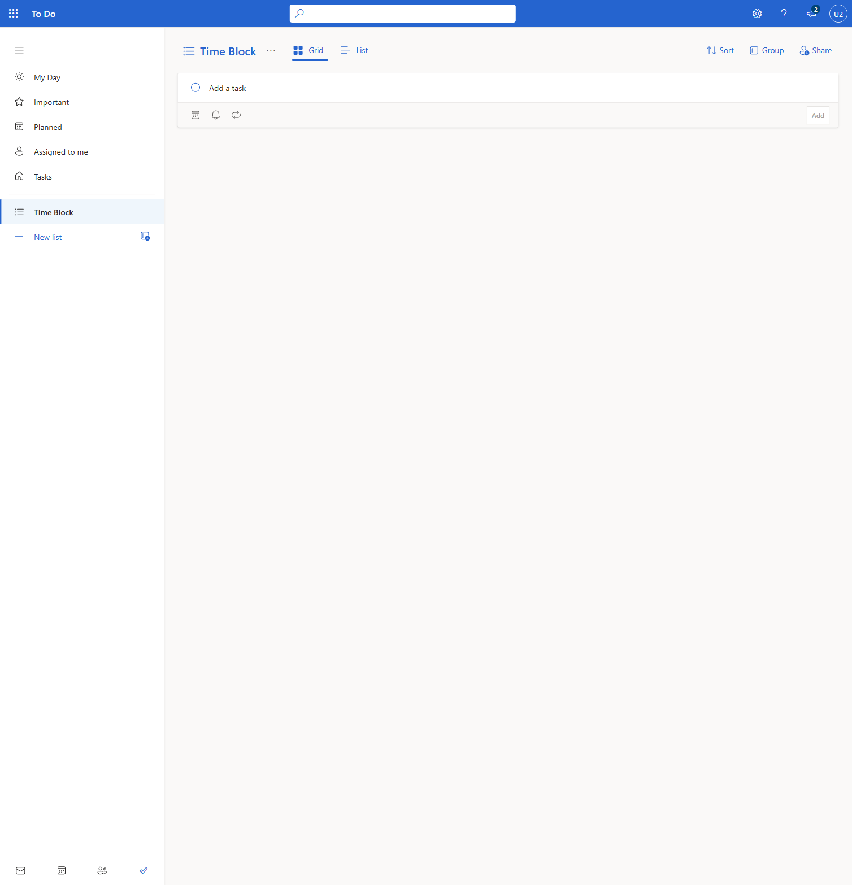

#### Create the workflow and configure its trigger

2. In **Copilot Studio**, make sure you're in the right environment, then on the **Home** page select **Workflow** (*Automate business processes with agents and actions*). Rename the workflow from **Untitled Workflow** to **To Do Time Block** by selecting the title at the top of the designer.

   > [!TIP]
   > Workflows are the autonomous side of Copilot Studio — they run on a trigger instead of waiting for a user to chat. You'll find them in the left navigation next to **Agents**.

   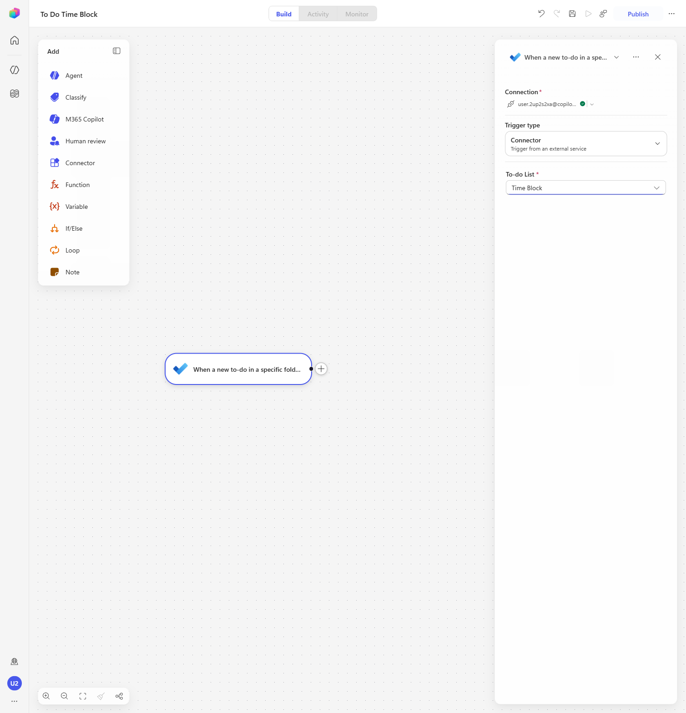

3. Select the **Start** trigger node. In the configuration panel, change **Trigger type** from **Manual** to **Connector**, then choose **Select trigger...** and search for **To Do**. Under **Microsoft To-Do (Business)**, choose **When a new to-do in a specific folder is created**. This makes the workflow fire automatically whenever a task lands in the list you specify.

   > [!IMPORTANT]
   > Pick the **(Business)** connector, not **(Consumer)** — the lab uses your work/school To Do account, which is where Copilot Studio and the calendar tools also run.

4. When prompted, select **Create new connection** and, in the account picker, sign in with the **same work account** you're using for this lab. Once the connection shows your account, set **To-do List** to **Time Block** from the dropdown.

   > [!WARNING]
   > In the connection account picker, double-check you pick *your lab account* — not a personal or other work account. The workflow will read and write *that* account's To Do and calendar.

#### Add and configure the inline agent

5. Select the **+** after the trigger and choose **Agent** to add an agent node. (Copilot Studio automatically wraps it in an **Apply to each** loop so the agent runs once per new to-do.) When prompted, **Create new connection** with your lab account. Leave the **Agent** dropdown on **New agent for this workflow** — this creates a brand-new, *non-deterministic* agent dedicated to this workflow rather than reusing an existing one.

   > [!TIP]
   > This is the heart of the lab: instead of hard-coded actions, the workflow hands the task to an agent that *reasons* about how to schedule it. The default model is **Claude Sonnet 4.6**.

   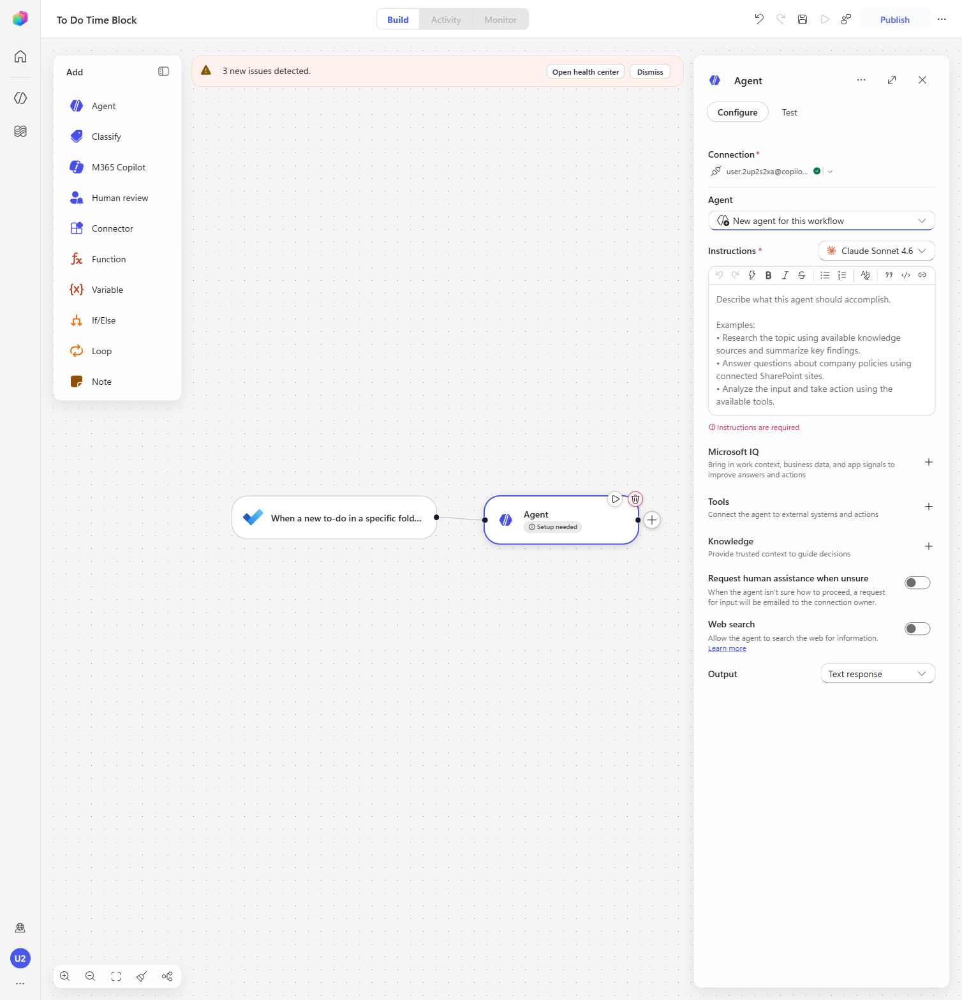

6. In the **Instructions** box, give the agent its goal. Enter it in three parts so the agent receives the *actual* to-do title at run time:

   1. Type the first line of text:

      ```
      Find a time that is appropriate for this task 
      ```

   2. Type **`/`** to open the dynamic-content picker, then select **Title** (under *When a new to-do in a specific folder is created*). This inserts the to-do's title as a token.

   3. Continue typing the rest of the instruction right after the token:

      ```
      on my calendar in the next couple of business days and block that time on my calendar to work on this task. Then update the to-do with a due date a week out from the time block we created. Add appropriate notes and suggestions in the notes on key things I might want to consider and categorize it as blue. Also set a reminder 2 days before the due date. Make sure that the format of the Calendar notes and To-Do are formatted properly for the user to be able to read them well. Only schedule the time block within my normal working hours of 8:00 AM to 5:00 PM.
      ```

   > [!IMPORTANT]
   > The **`/Title`** token is what makes this dynamic — the agent receives each new task's real title, so its scheduling decision is grounded in the actual to-do rather than a fixed string. The final sentence constrains *when* the agent books focus time; without it, the agent may pick the first technically-free slot (even very early morning).

   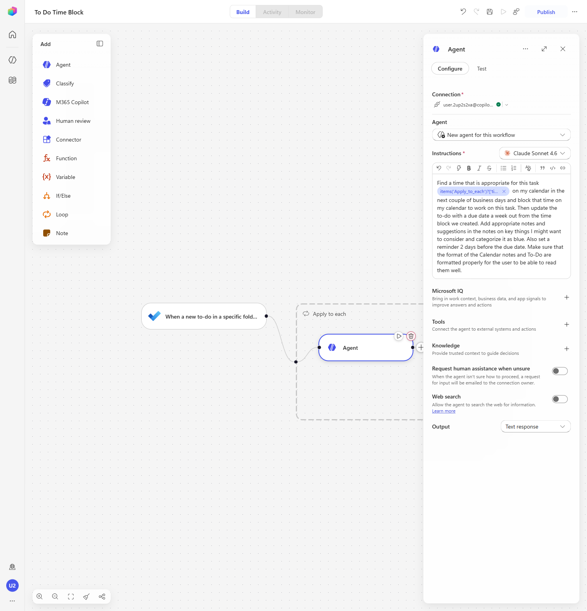

7. Give the agent the tools it needs to act. In the agent panel:

   - Under **Tools**, select **+** (Add tool), search for **Work IQ Calendar**, choose **Work IQ Calendar (Preview)** — the MCP server for Outlook calendar operations — and **Create new connection** with your lab account, then **Add**.
   - Add a second tool: **+** → search **Update to-do** → under **Microsoft To-Do (Business)** choose **Update to-do** → **Add** (it reuses your To Do connection).
   - Turn on the **Web search** toggle so the agent can look things up (e.g., venue or location details referenced in a task).

   > [!TIP]
   > The **Work IQ Calendar** tool lets the agent read your free/busy and create calendar events; **Update to-do** lets it write the due date, notes, category, and reminder back onto the task.

   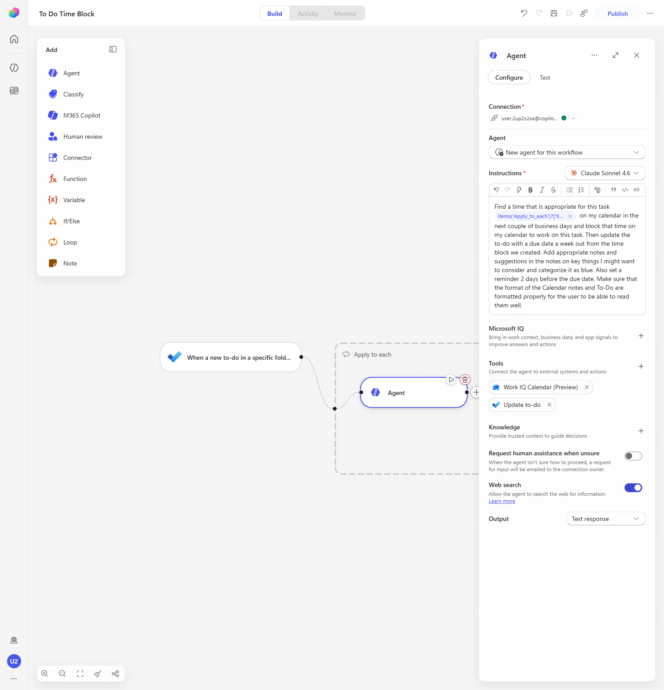

#### Publish, then trigger the workflow

8. Select **Save**, then **Publish**.

   > [!WARNING]
   > **Publishing is required.** A workflow only listens for its trigger once it has been published — so it will **not** run from a new to-do until you publish it. If you add the to-do before publishing, nothing happens. After publishing, the **Activity** and **Monitor** tabs become available.

   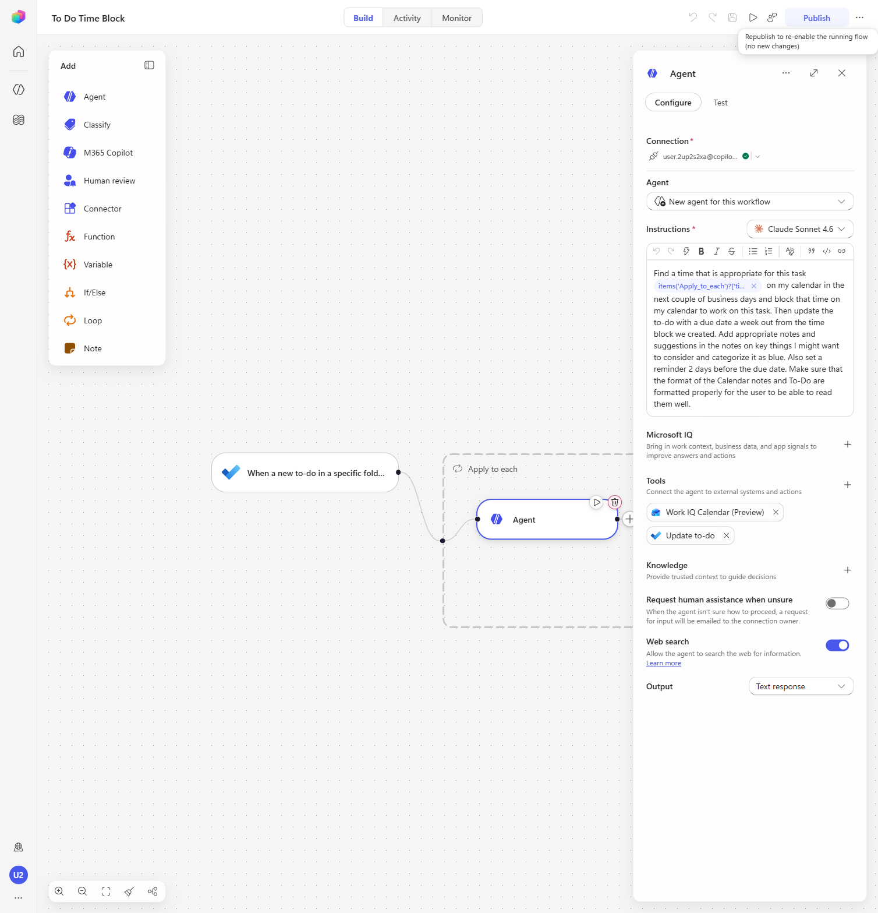

9. Open **Microsoft To Do**, go to the **Time Block** list, and add a new task: **Book Skull's Rainbow Room in Nashville for Next Friday**. Creating this task in the watched list is what fires the workflow's trigger.

   > [!TIP]
   > Use a task whose title implies a real-world commitment with a time and place — it gives the agent something concrete to reason about (find a slot, block the calendar, look up the venue).

   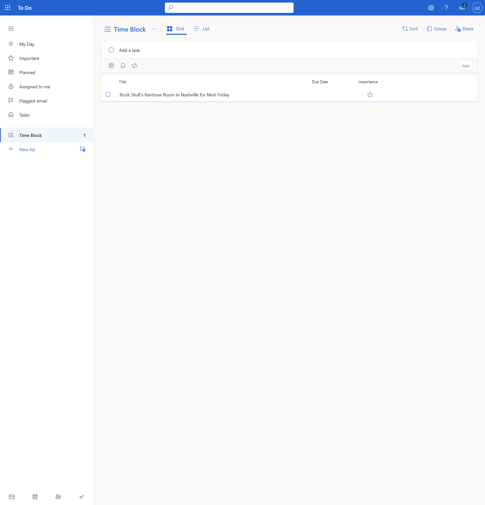

#### Watch the workflow run

10. Back in the workflow, open the **Activity** tab and select **Refresh** to look for the run. When the new run appears (status **Running**), select it to open the run details and watch the workflow execute node-by-node (trigger → **Apply to each** → **Agent**).

    > [!IMPORTANT]
    > Be patient — the To Do trigger polls on a schedule, so the run can take a **few minutes** to appear. Press **Refresh** in the Activity list a few times until it shows up.

    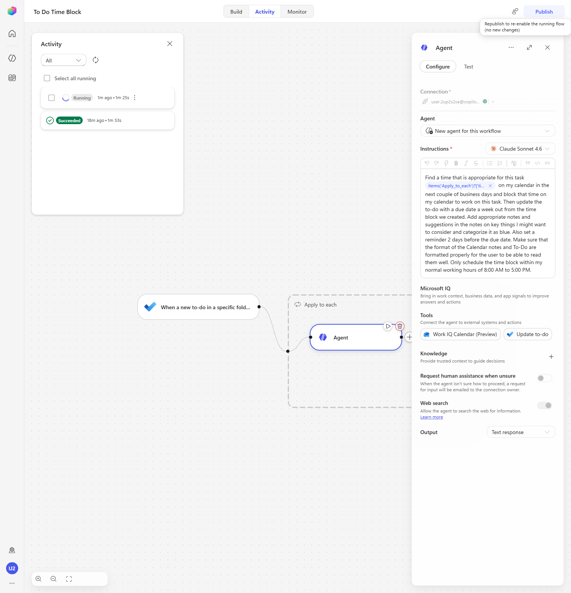

    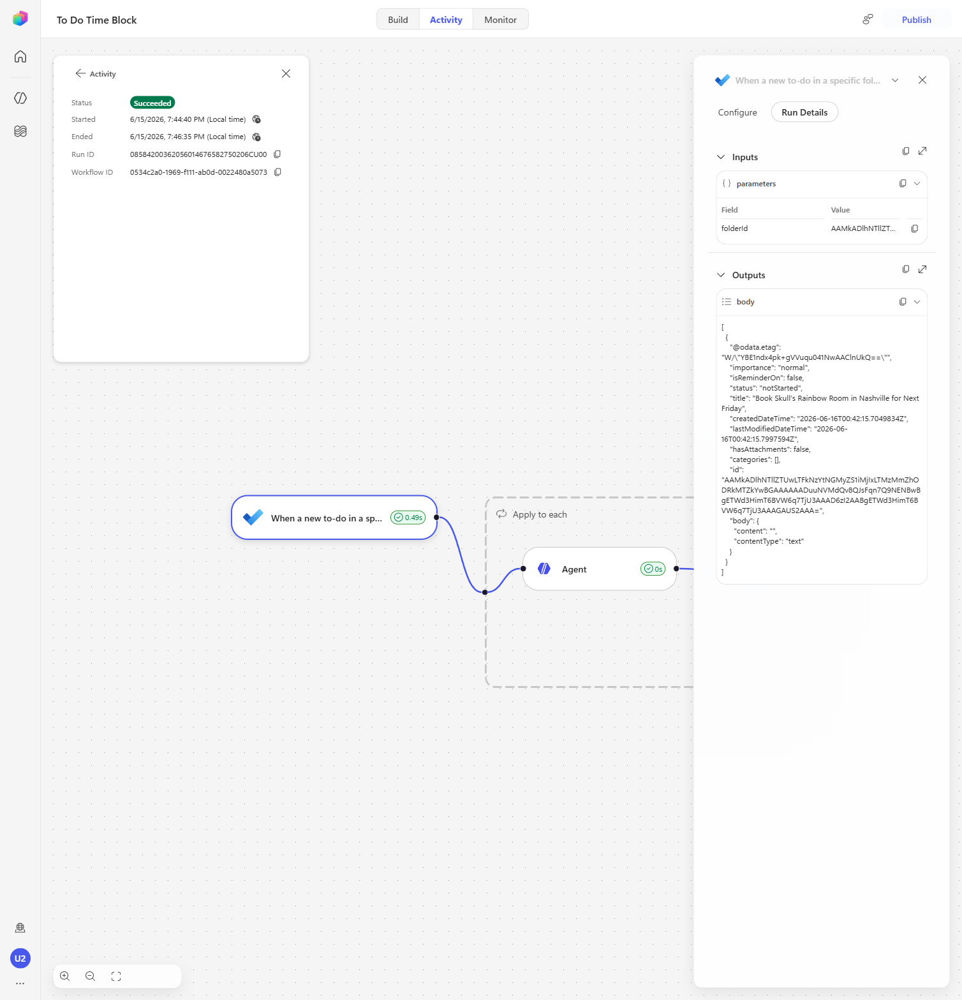

11. In the run details, select the **Agent** node to expand its details. You'll see the agent's own narration of what it did — checking your free/busy, choosing a time block *inside your working hours*, creating the calendar event, finding the to-do, and updating it. This is the *non-deterministic* part: the agent decided the specifics, they aren't hard-coded in the workflow.

    > [!TIP]
    > The Agent's **Outputs / Response** is a great teaching moment — it shows the model reasoning step-by-step and calling the Work IQ Calendar and Update to-do tools on its own.

    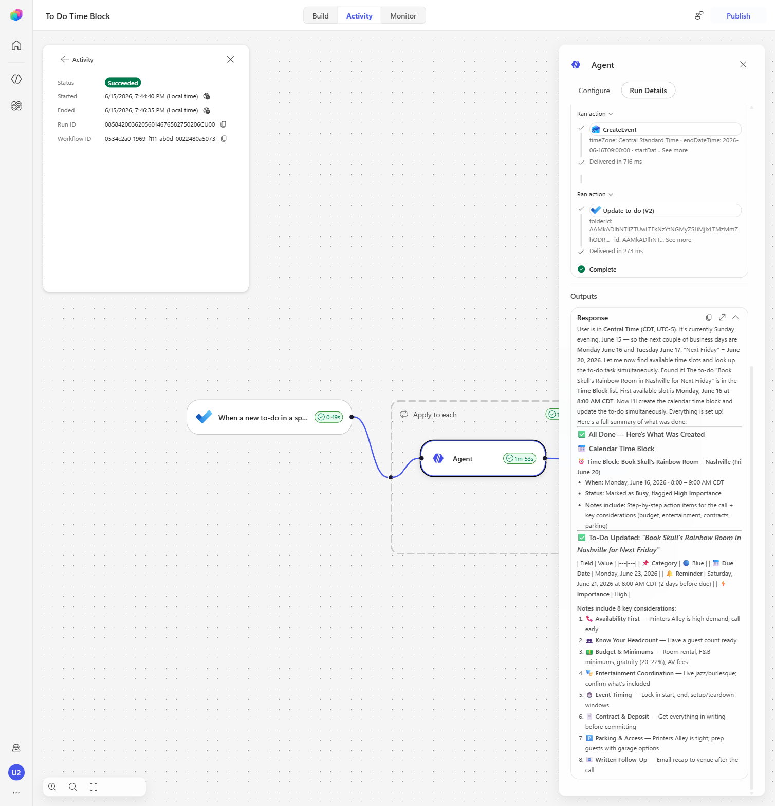

#### Verify the results

12. Go back to **Microsoft To Do** and refresh the **Time Block** list. Open your task — it has been updated by the agent: a **due date** (a week out), a **reminder** set 2 days before the due date, a **blue** category, and richly formatted **notes** (target date, the scheduled work block, and an action checklist).

    > [!TIP]
    > Switch the list to **List** view and open the task to see the full notes the agent wrote — it even researched the venue with web search.

    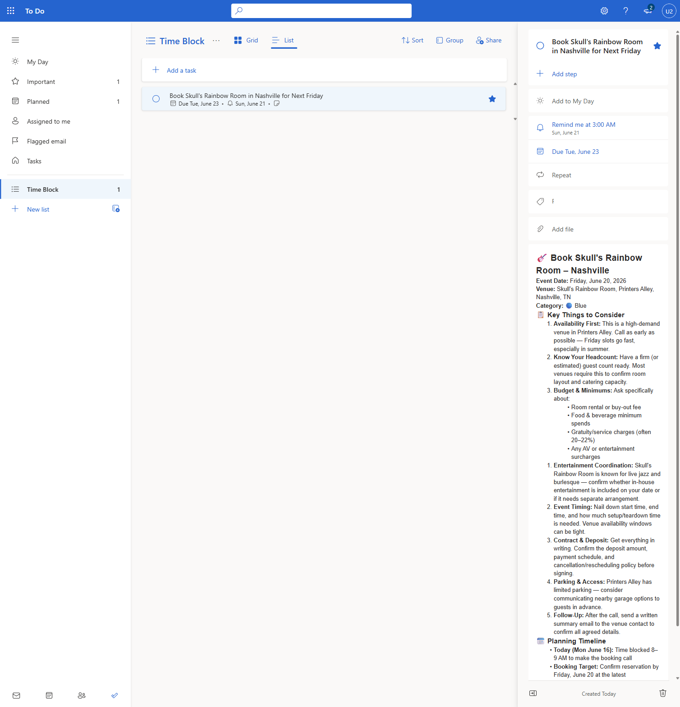

13. Open **Outlook → Calendar**. The agent has added a **time block** event to reserve time to work on the task — on the next business day it found free and **within your 8:00 AM–5:00 PM working hours** — with a body summarizing the target date and venue. The workflow ran end-to-end with no further input from you.

    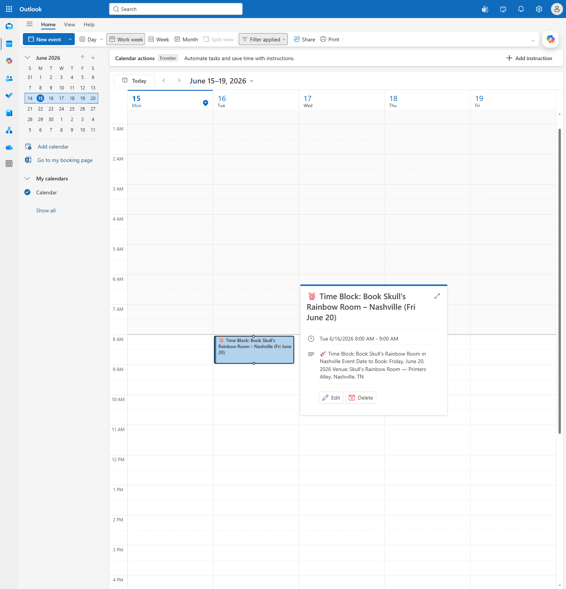

---

### 🏅 Congratulations! You've built an autonomous Workflow with a reasoning inline agent.

---

## 📧 Use Case #2: Setting Up the Order Management Workflow

Configure and publish a pre-built **Order Management Workflow** that classifies incoming emails and routes them through different processing paths — then verify the setup end-to-end by testing the "Other" classification path.

**Summary of tasks**

In this section, you'll configure connection references in the Power Apps solution, transfer workflow ownership, open the workflow to verify canvas-level connections, explore the email classification categories, publish, and verify everything works by sending a test email that triggers the "Other" classification path.

**Scenario:** Your environment contains a pre-built Order Management Workflow that automatically classifies incoming emails with "Order Management" in the subject. It routes emails into one of four categories — **Quote Request**, **Supplier Delay**, **Customer Inquiry**, or **Other** — and takes different automated actions for each. Before the workflow can run, you need to configure all its connections and link them in the solution.

### Objective

Complete the setup of the **Order Management Workflow**: configure all solution connection references, transfer ownership, verify canvas-level connections, explore the classification categories, publish, and validate end-to-end by sending a test email through the "Other" path.

> [!IMPORTANT]
> This use case is the **foundation for all subsequent use cases** in this module. The connections, ownership, and publishing you complete here are required for the Customer Inquiry, Quote Request, and Supplier Delay paths covered later. Take extra care during setup — if a connection reference is missed or ownership isn't transferred correctly, later use cases will fail silently or with hard-to-diagnose errors.

---

### Step-by-step instructions

#### Take ownership and configure the solution

> [!IMPORTANT]
> **Complete the solution-level setup first.** The steps below configure the node connections, link the connection references in the Power Apps solution, and transfer ownership — all of which **must** be done before the workflow can be published or tested. Skipping or rushing through these steps is the most common cause of "publish failed" errors later. Read each note carefully.

1. In **Copilot Studio**, navigate to **Workflows** and open the **Order Management Workflow**.

   > [!NOTE]
   > The workflow has been pre-built for your lab environment. You'll see a **trigger** node ("When a new email arrives"), a **Classify** node, and several branch paths — one for each email category.

   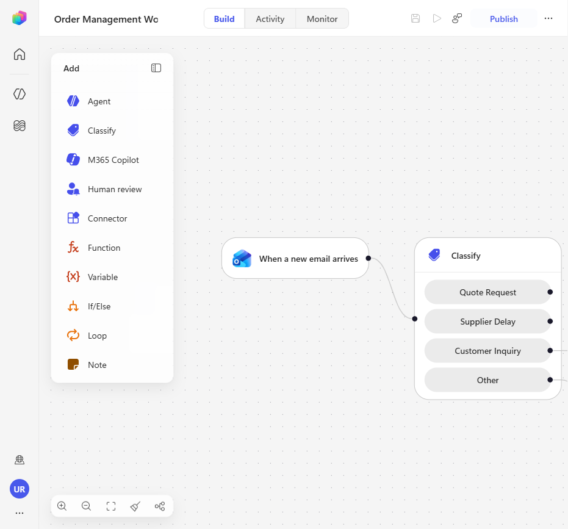

2. Open each node on the canvas by clicking on it so its connection can resolve. Start with the trigger: click **When a new email arrives** and, under **Connections**, wait for the connection to load — it should update automatically to your lab user. Most other nodes resolve the same way. Two nodes need a connection created manually:

   - **M365 Copilot** node — open the node and, under **Connections**, select **Create new connection** > **Create**, then sign in with your lab account.
   - **Human review** node — open the node and, under **Connections**, select **Create new connection** > **Create**, then sign in with your lab account.

3. Open **Power Apps** ([make.powerapps.com](https://make.powerapps.com)), ensure you are in the correct environment, navigate to **Solutions**, and open the **LAB: Order Management** solution. In the left pane, select **Objects**, then open **Connection References**. For **each** connection reference, select **Edit** and choose the connection you just created from the dropdown (it should now appear).

   - You should see **five** connection references. If a **sixth** one is present whose connection id starts with `crc3b_draft_bRURqJ.cr.shared_a365outlookmailmcp`, it is not needed for the workflow to run and can be **safely removed** from the solution.
   - For all others, select the connection and click **Save**, then confirm with **Save changes**.

   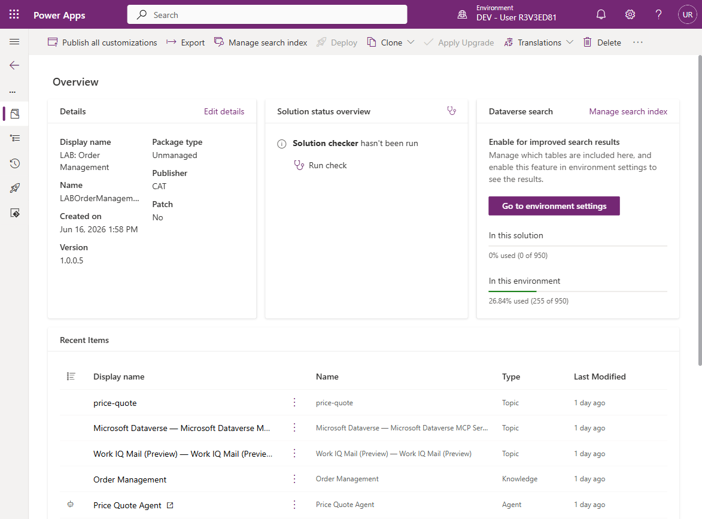

   > [!WARNING]
   > Always sign in with your **lab account** when creating connections — not a personal or different work account. All connections in this workflow must use the same identity, or the workflow will fail at runtime with permissions errors.

4. Navigate to the **Cloud Flow** object (the Order Management Workflow) inside the solution and select the flow. Choose **Set primary owner**, **remove the existing owner**, set yourself (your lab user) as the new owner, and select **Save**. A **green bar** should appear confirming the owner was successfully changed.

   > [!IMPORTANT]
   > Without the ownership change, publishing is **disabled by default**, so the workflow cannot be triggered end-to-end — you can still test individual nodes inside it, but no real incoming email will start a run. Once you own the workflow, the **Publish** button becomes available. Ownership must be transferred **after** the connection references are configured.

5. Go back to the workflow, select **Save**, and **Publish**. Verify the workflow was successfully published after changing the ownership — publishing only succeeds once you own the flow.

#### Open and explore the Order Management Workflow

6. Select the **trigger** node ("When a new email arrives"). Next to **Subject filter**, select the code symbol **`</>`** (**Switch to expression mode**) to reveal the expression `@{string('Order Management')}`. This means the workflow only fires for emails whose subject contains "Order Management" — all other emails are ignored.

   > [!IMPORTANT]
   > Keep this filter in mind when testing: every test email you send **must include "Order Management" in the subject line**, or the workflow will not trigger. This is a common source of confusion when tests "don't seem to work."

   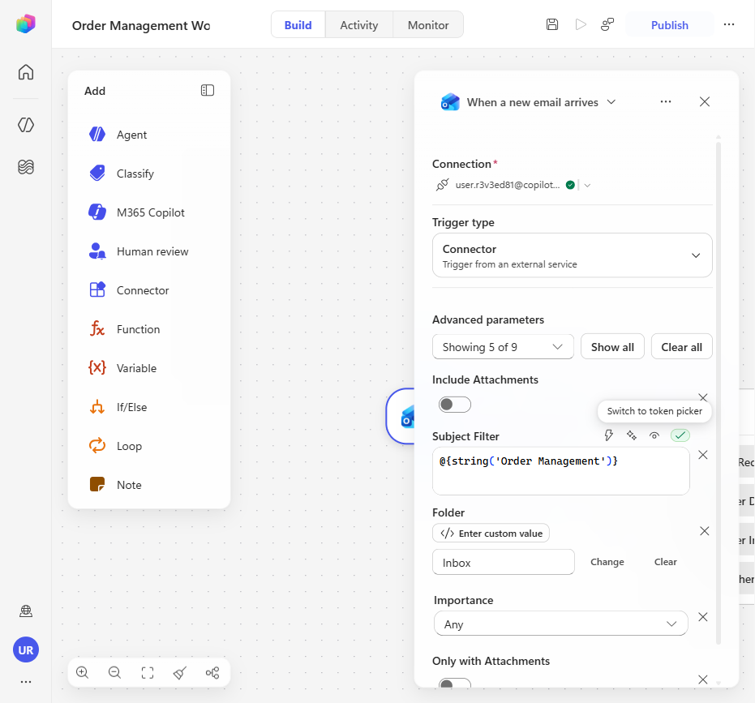

7. Select the **Classify** node. Review the four classification categories configured in the node. Each category has a name and example text that the AI model uses to determine where an incoming email should be routed:

   - **Quote Request** — emails requesting pricing or quotes for products/services
   - **Supplier Delay** — notifications about delays from suppliers
   - **Customer Inquiry** — general questions from customers about orders, shipping, etc.
   - **Other** — anything that doesn't fit the above categories (spam, promotions, irrelevant)

   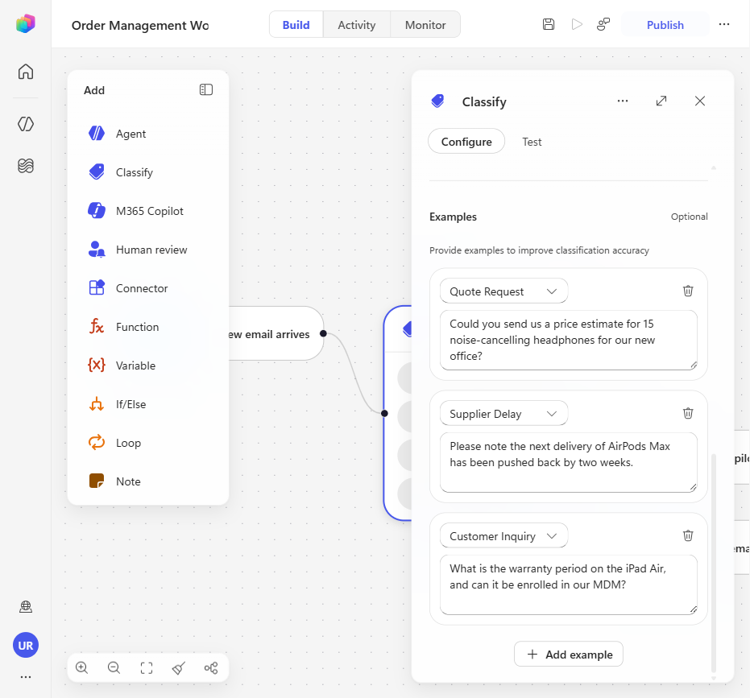

   > [!TIP]
   > **Improving classification accuracy:** You can add multiple examples to each category to handle different phrasings and edge cases. For instance, a "Quote Request" might come as *"Can you send me pricing for 500 units?"* or *"We'd like a formal quotation for the attached spec."* Adding diverse examples helps the model generalize better. A good testing exercise is to try common cases **and** edge cases using the **Test** tab in the Classify node, observe how categories get assigned, and refine the category descriptions accordingly.

#### Test the classification

8. Test the classification before sending a real email. In the **When a new email arrives** section, find **Body** (*The body of the message*), click into the box, and paste:

   ```
   Hi, I would like to request a quote for 500 units of Product A.
   ```

   Select **Run test** and observe the predicted category — it should classify as **Quote Request**.

   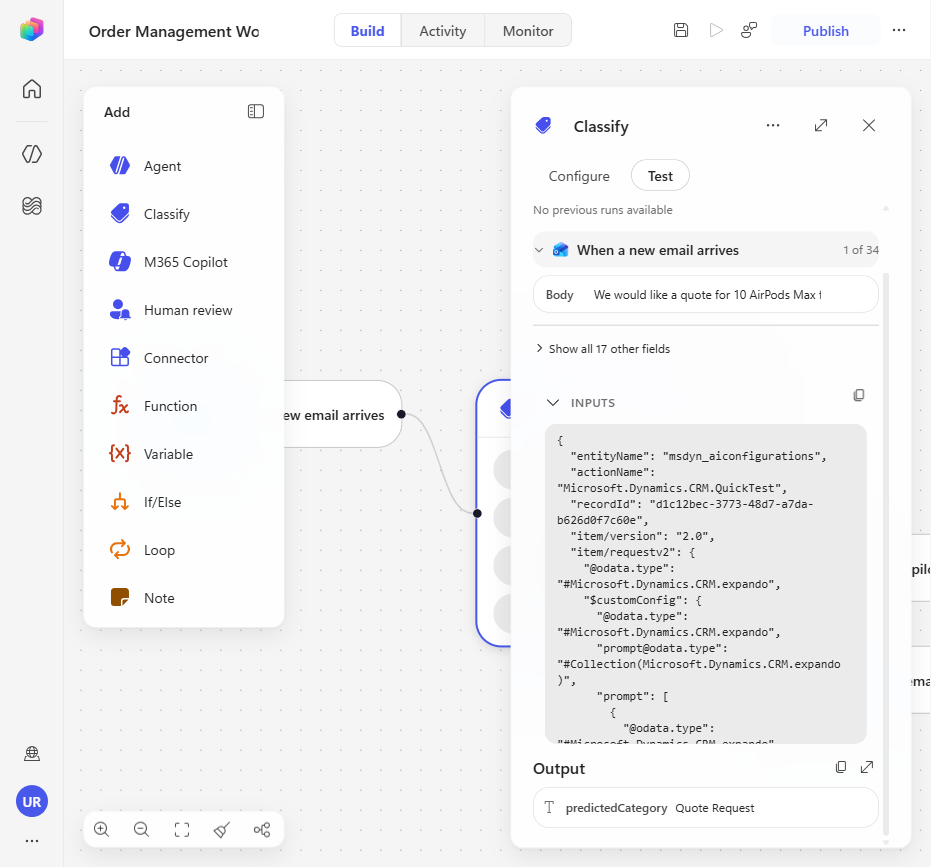

#### Test the "Other" classification path end-to-end

9. Open **Outlook** ([outlook.office.com](https://outlook.office.com)) and compose a new email **to your lab user account** with the following:

   - **Subject:** `Order Management - Congratulations! Your order desk has been selected`
   - **Body:**

     ```
     Dear Order Manager,

     Congratulations! Your order management team has been selected in our monthly
     business draw and is entitled to claim an exclusive cash reward.

     To release your reward, please reply with your full name and contact details,
     and a small processing fee may apply.

     Act soon, as unclaimed rewards expire.

     Regards,
     Promotions Team
     MegaDraw Rewards
     ```

   Send the email. This spam/scam email should be classified as **Other** by the workflow.

   > [!NOTE]
   > The subject must contain **"Order Management"** to match the trigger's subject filter. The body content is intentionally irrelevant to quotes, suppliers, or customer inquiries — it should fall through to the "Other" category.

   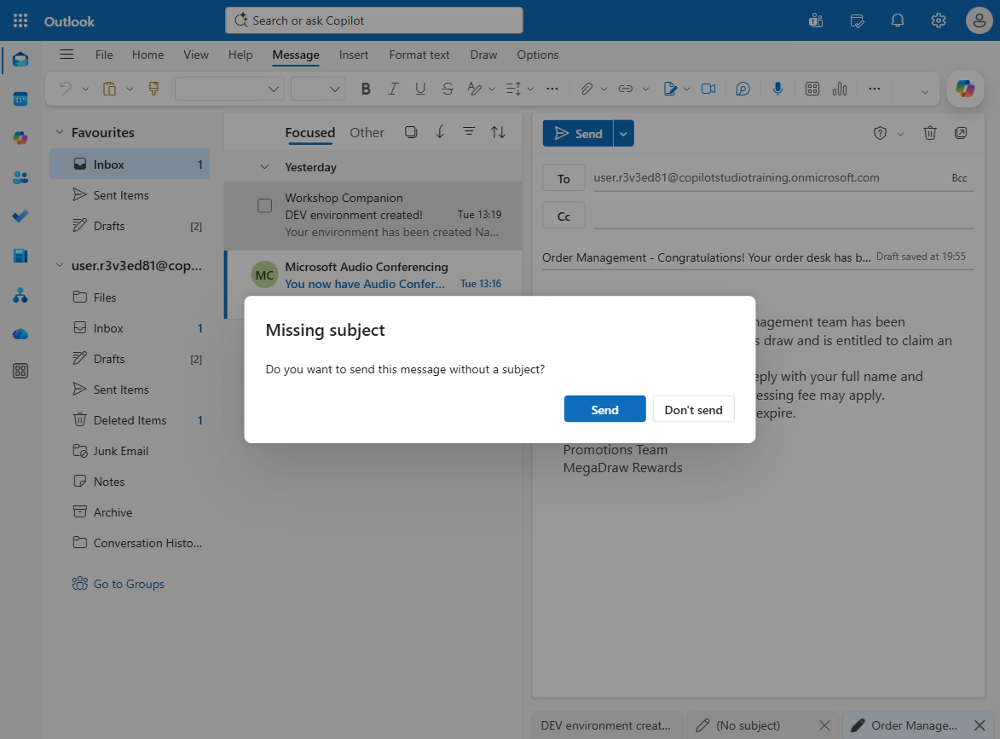

10. Wait a **few seconds** for the workflow to trigger and process the email. Then navigate to your **Archive** folder in Outlook. You should see the test email has been automatically moved there — confirming the "Other" classification path is working correctly.

   > [!TIP]
   > If the email doesn't appear in the Archive folder, check the **Activity** tab in the workflow in Copilot Studio to see if the run triggered. If no run appears, verify the workflow is **Published** (not Draft) and that the email subject includes "Order Management."

   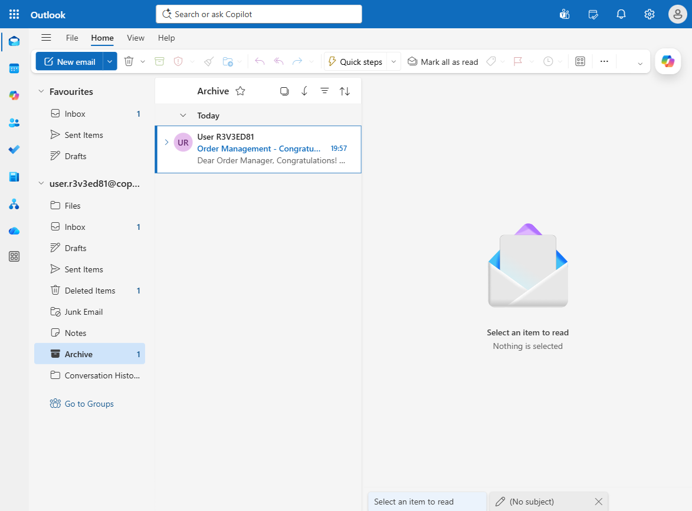

---

### 🏅 Congratulations! The Order Management Workflow is now fully configured and operational.

You've completed the foundation that all subsequent use cases build on — the workflow is published, connections are linked, and you've verified the "Other" classification path works end-to-end.

---

## 💬 Use Case #3: Use M365 Copilot and Add a Human-in-the-Loop in Order Management

Configure and validate the **Customer Inquiry** branch so the workflow drafts a response with **M365 Copilot**, pauses for a **Human review**, and only replies to the customer after approval.

**Summary of tasks**

In this section, you'll inspect the Customer Inquiry routing branch, review how the M365 Copilot and Human review nodes are configured, publish any updates if needed, and run an end-to-end test with an approval email.

**Scenario:** A customer sends a product question to the order desk. Instead of crafting the answer manually every time, the workflow uses M365 Copilot to prepare a grounded draft response, sends that draft to a human reviewer for approval, and then either replies to the customer or flags the message for follow-up depending on the approver's decision.

### Objective

Validate the **Customer Inquiry** path of the **Order Management Workflow**: confirm the M365 Copilot draft prompt, inspect the Human review approval experience, test the path with a sample customer email, approve the proposed reply, and verify the customer response lands in your inbox.

---

### Step-by-step instructions

#### Inspect the Customer Inquiry branch

1. In **Copilot Studio**, open the published **Order Management Workflow** and select the **Classify** node. Observe the **Customer Inquiry** branch that leaves the classification node and note how it routes customer questions into a draft-and-review sequence.

2. Select the **M365 Copilot** node in that branch. Review the prompt and confirm it uses the **Customer question** input based on the incoming email body. This is the grounded draft-generation step that prepares the proposed response for the reviewer. The prompt asks M365 Copilot to read the customer's question, search the existing email threads of the user that owns the node connection (you) for any prior context or earlier reply on the same topic, and then draft a complete, ready-to-send reply — answering clearly when it finds an answer, or writing a brief holding response when it can't (without inventing product facts), always addressed "Dear Customer," and signed off as "Contoso Electronics Order Management".

   > [!NOTE]
   > **M365 Copilot node scope:** The M365 Copilot node excels at addressing questions that leverage Microsoft Graph (emails, Teams chats, etc.) — think of it as prompts you would send in M365 Copilot chat. Note that the operations this node performs are **read-only** — it can search and retrieve information from emails, chats, and files, but it **cannot send emails or Teams messages**. If you need those write operations, use an **Agent** node with access to the relevant Work IQ tools instead.

   > [!NOTE]
   > **Fresh lab accounts have no history to ground on:** Because this lab uses a freshly provisioned account with no prior emails or Teams messages, the M365 Copilot node won't find real substance to build its answer from — so expect a generic holding reply. This step is illustrative: in a real mailbox with genuine history, M365 Copilot would ground the draft in actual prior threads and context.

   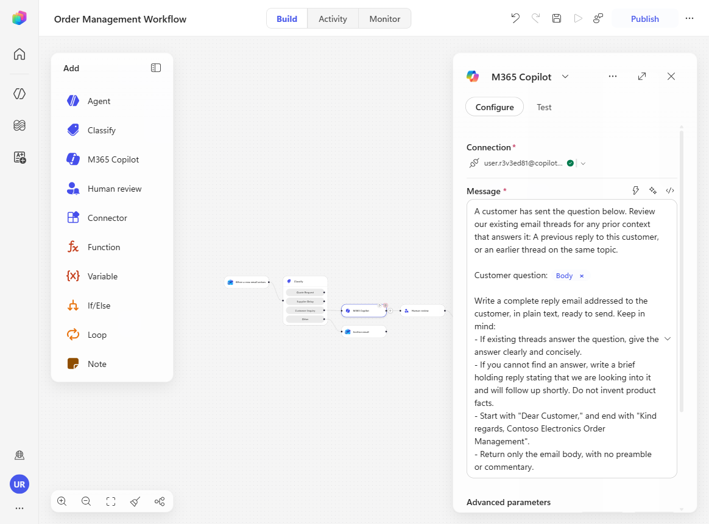

3. Select the **Human review** node and inspect its configuration carefully:

   - In the message, confirm the proposed reply drafted by **M365 Copilot** is inserted for the reviewer to read.
   - Notice that the review request is delivered over **Outlook** — observe how we use an Outlook email to ask a person to approve before the workflow continues.
   - The reviewer responds through a single **Yes/No** input (**Send proposed reply from M365?**). Select **+** to expand and see the other input types available — text, email, number, date, and more. You don't need to add any here, but it's worth understanding the variety of formatted inputs you can request and then reuse cleanly in downstream nodes.

   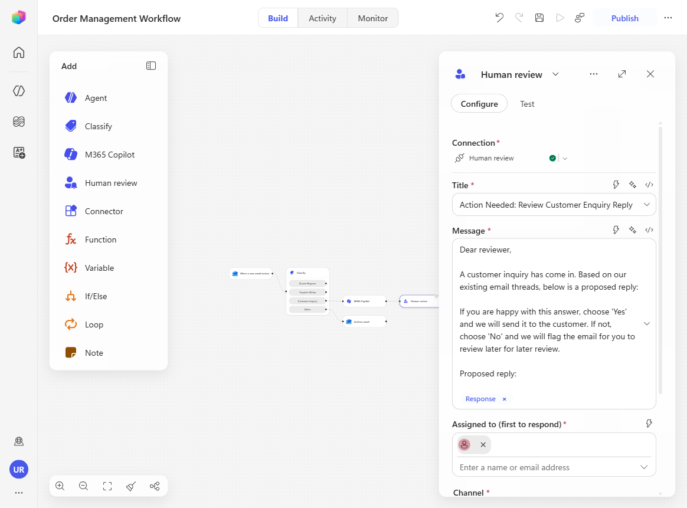

4. Select the **If/Else** node after Human review and observe the decision logic. When the reviewer answers **Yes**, the workflow sends the proposed reply to the customer; otherwise, the original email is flagged in the inbox for manual follow-up.

   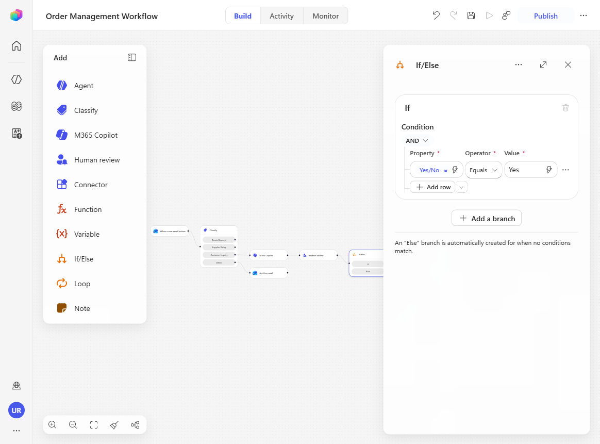

#### Run an end-to-end Customer Inquiry test

5. Open **Outlook** ([outlook.office.com](https://outlook.office.com)) and send the following email **to your lab user account**:

   - **Subject:** `Order Management - Question about iPad Air warranty and MDM`
   - **Body:**

     ```
     Hi team,

     Quick question before we expand our last order. What is the standard warranty
     period on the iPad Air (M2), and can the devices be enrolled in our mobile device
     management (MDM)? I think we asked something similar a few months back but I can't
     find the reply.

     Thanks,
     Jordan Kim
     IT, Alpine Ski House
     ```

   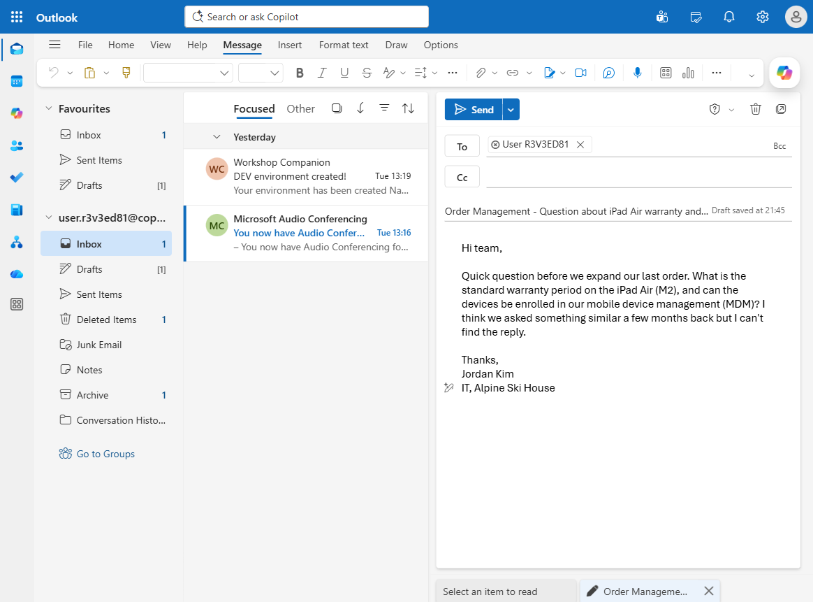

6. Return to the workflow and open the **Activity** panel. Refresh until the new run appears, then open it and observe the path: **Classify → Customer Inquiry**.

   > [!IMPORTANT]
   > This path pauses at the approval step. If the run seems to stop, that is expected — the workflow is waiting for the **Human review** action to be completed from Outlook.

   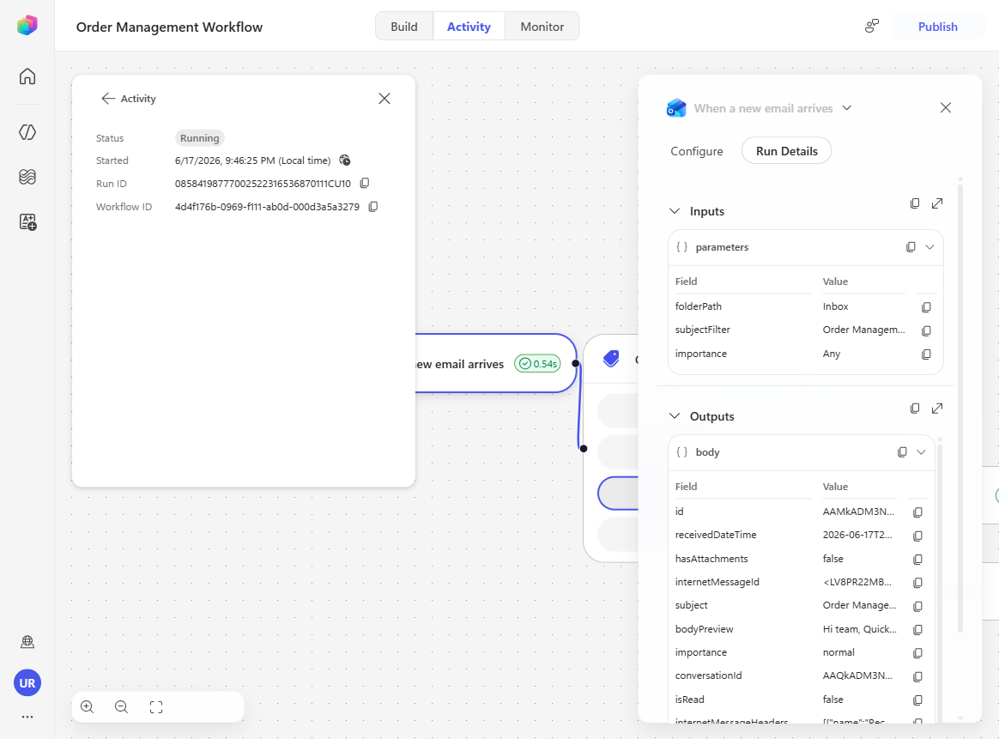

7. Wait until the run reaches the **Human Request** node. Once M365 Copilot finishes exploring your emails and drafting an appropriate response, a **green check** appears on the node and you should be notified of an incoming review email within a matter of seconds.

   

8. Go to **Outlook** and open the incoming approval email. Review the proposed M365 Copilot reply, then select **Yes** to approve sending it.

   > [!TIP]
   > If you don't see the approval email, try **refreshing** Outlook. If it still doesn't land, go back to the workflow, open the **Build** tab, re-establish the connection on the **Human review** node by creating a new one, then select **Save** > **Publish** and run the test again.

   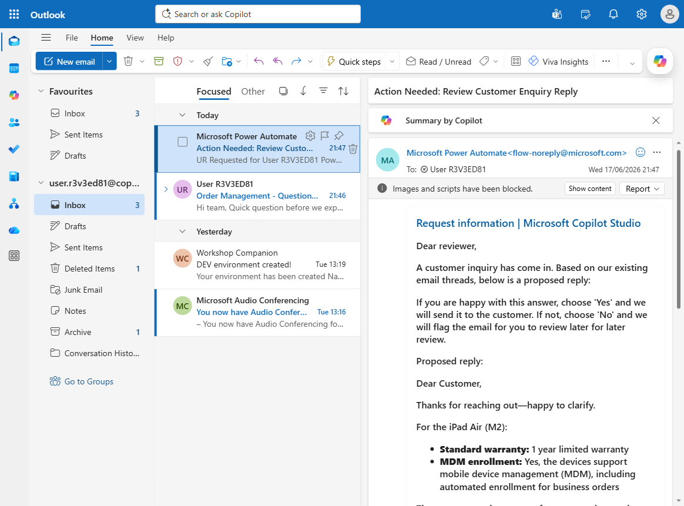

9. Return to your inbox and verify that the approved reply email lands there. This confirms the workflow resumed after human approval and sent the response automatically.

   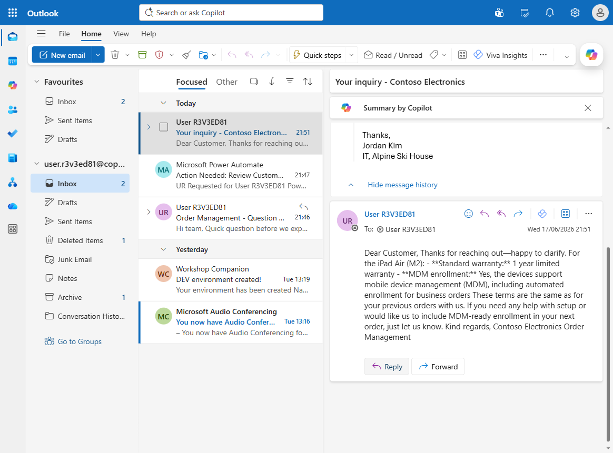

---

### 🏅 Congratulations! The Customer Inquiry path is now drafting, reviewing, and replying successfully.

You've confirmed that the workflow can generate a grounded response with M365 Copilot, pause for human approval, and then continue automatically based on the reviewer's decision.

---

## 📦 Use Case #4: Build an Inline Agent for Inventory Management

Extend the **Supplier Delay** branch with an inline **Agent** that uses **MCP servers** to reason over the delay notice, check current stock, and create a follow-up **Dataverse Task**.

**Summary of tasks**

In this section, you'll add a new agent node to the Supplier Delay branch, connect the Warehouse and Dataverse MCP servers, define the agent's instructions and structured output, publish the workflow, and test the scenario with a supplier delay email.

**Scenario:** A supplier warns that an incoming shipment is delayed. The workflow shouldn't just forward the email — it should reason about the impact by checking current inventory, determine urgency, and create a structured Dataverse task so the replenishment team can act immediately.

### Objective

Build and validate the **Supplier Delay** path of the **Order Management Workflow** by adding the **Inventory Task Agent**, equipping it with MCP tools, generating structured output, and verifying that it creates the expected Dataverse task after a test email is received.

---

### Step-by-step instructions

#### Add and configure the Supplier Delay agent

1. In the **Classify** node, locate the **Supplier Delay** category. Select the **+** next to that branch and choose **Agent** to add a new agent step for this path.

   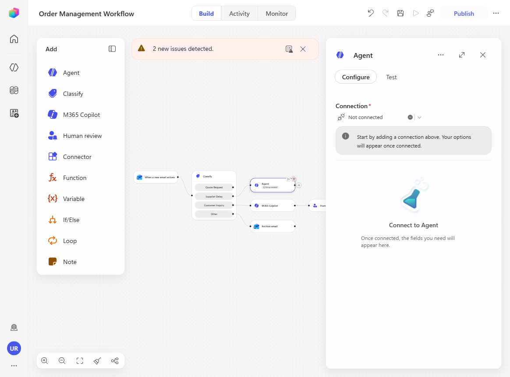

2. In the new node, leave **Agent** set to **New agent in this workflow**. This creates an inline agent dedicated to this workflow path. Keep the default AI model.

   > [!TIP]
   > A strength of AI-native nodes in Workflows is that you can choose a **different model per node**. This inline agent runs on **Claude Sonnet 4.6** for its reasoning, while the **Classify** node uses the lighter **GPT-4.1 mini** — a cost-optimized choice for that lightweight classification step. Matching the model to the work each node does keeps the workflow both capable and economical.

3. Select **Expand** (the two arrows next to **...**) so you can edit the full agent configuration, then rename the node title from **Agent** to **Inventory Task Agent**.

   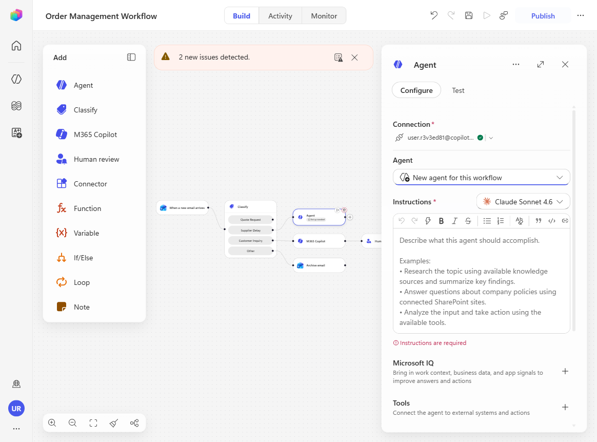

4. Under **Tools**, navigate to **Model Context Protocol** (**MCP servers**), then add and connect both of these tools:

   - **Microsoft Dataverse MCP Server**
   - **Warehouse MCP**

   Sign in or connect as prompted so both tools show as available in the agent.

   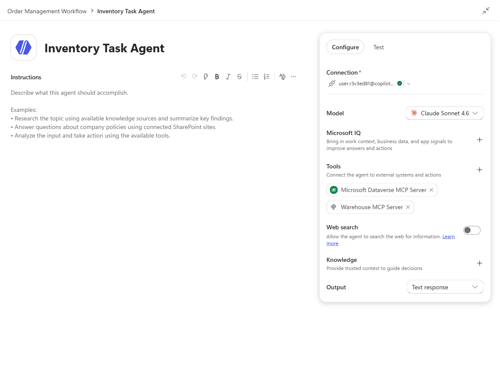

5. In the **Instructions** box, paste the following agent instructions:

   ```
   Purpose
   You triage supplier shipment-delay notices into restock tasks for Contoso Electronics. A delay notice names a delayed product but does not include stock levels, so you use the Warehouse tool to find the current stock and judge how urgent the delay is, then record a task in Dataverse.

   Inputs
   Delay notice: [email body]
   Review by (Due Date): [due date]

   Guidelines
   Take the current stock and all restock details from the Warehouse tool; the email does not contain them.
   Judge urgency from the current on-hand quantity: zero on-hand means the delay causes a stockout and is urgent; low but above zero means the buffer is at risk; healthy stock means the delay is tolerable.

   Steps
   Read the product or SKU named in the delay notice.
   Call the Warehouse restock-date lookup once, passing the exact SKU from the notice (no extra spaces). It returns the current quantity, next shipment date, expected quantity, and supplier. Do not call the stock-check tool.
   Decide the urgency of the delay from the current on-hand quantity.
   Use Dataverse to create one row in the Task table in the current environment, setting only these columns:
   Subject: Restock delay - [product] ([SKU]).
   Description: the current on-hand quantity and warehouse; the delayed next shipment date, the expected quantity, and the supplier; the urgency judgement; and a one-line action for the replenishment team.
   Priority: High if the on-hand quantity is zero, otherwise Normal.

   Rules
   Create exactly one Task row and set only the columns listed above.
   If the product is not found in the Warehouse, record it as unrecognised for a person to check.
   ```

   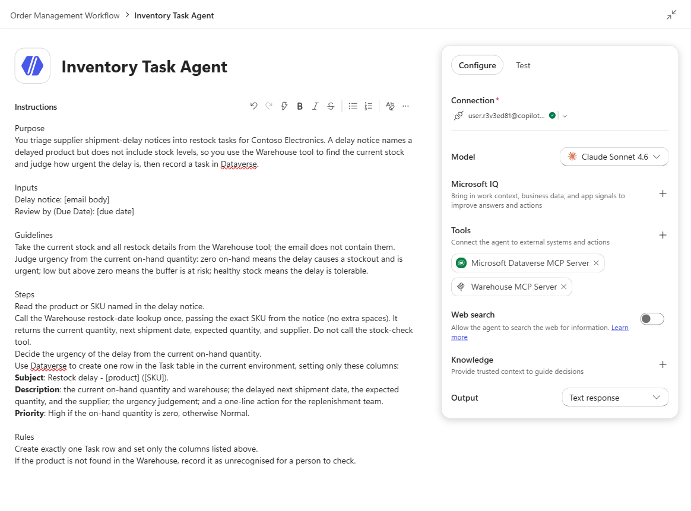

6. Replace the placeholders in the instructions with dynamic content:

   1. Select **`[email body]`**, choose the **lightning** icon, search for **body**, and insert **Body** from **When a new email arrives**.
   2. Select **`[due date]`**, choose the **lightning** icon, then look above the search bar for the **diamonds** icon — **Ask Copilot to generate an expression**.
   3. Enter: **Add 3 days to the date and time of arrival of the trigger email**
   4. Confirm Copilot returns:

      ```
      addDays(triggerOutputs()?['body/receivedDateTime'], 3)
      ```

      Select **Insert**.

   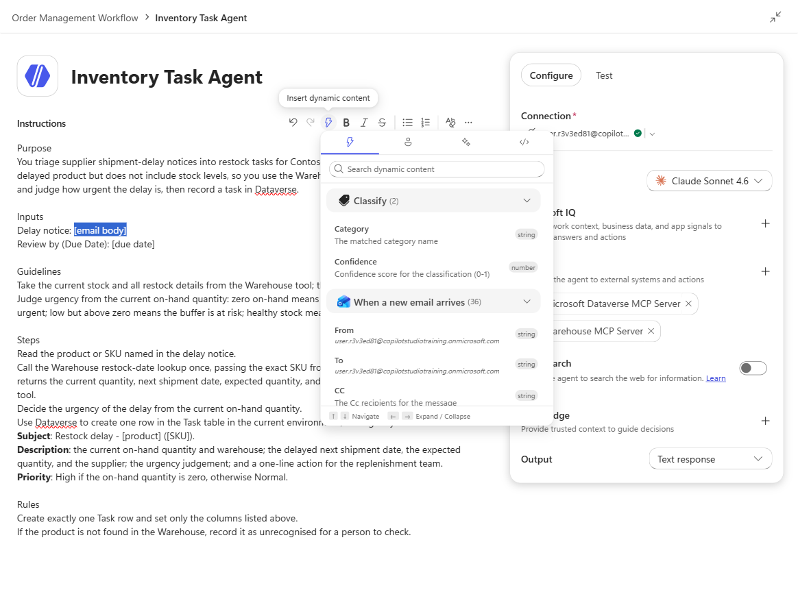

7. Scroll to the **Output** section and change the dropdown to **Structured output**. Add these three properties:

   - `sku` (**string**) — *The SKU named in the delay notice*
   - `stock` (**number**) — *Current stock quantity from the warehouse for the SKU named*
   - `risk` (**boolean**) — *True if current stock is zero*

   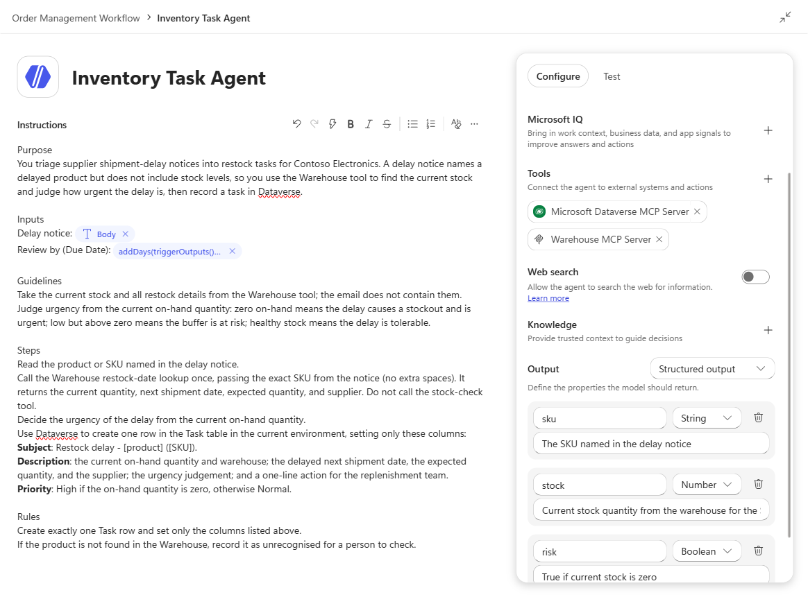

   > [!TIP]
   > **"Request human assistance when unsure":** Notice the button in the agent configuration panel. This feature sends a structured message to the connection owner when the agent encounters ambiguity or conflicting information — it dynamically generates questions based on the problem at hand, allowing human judgment for edge cases while keeping the automation running.

8. Minimize the view, then select **Save** and **Publish** so the Supplier Delay branch is live with the new agent configuration.

   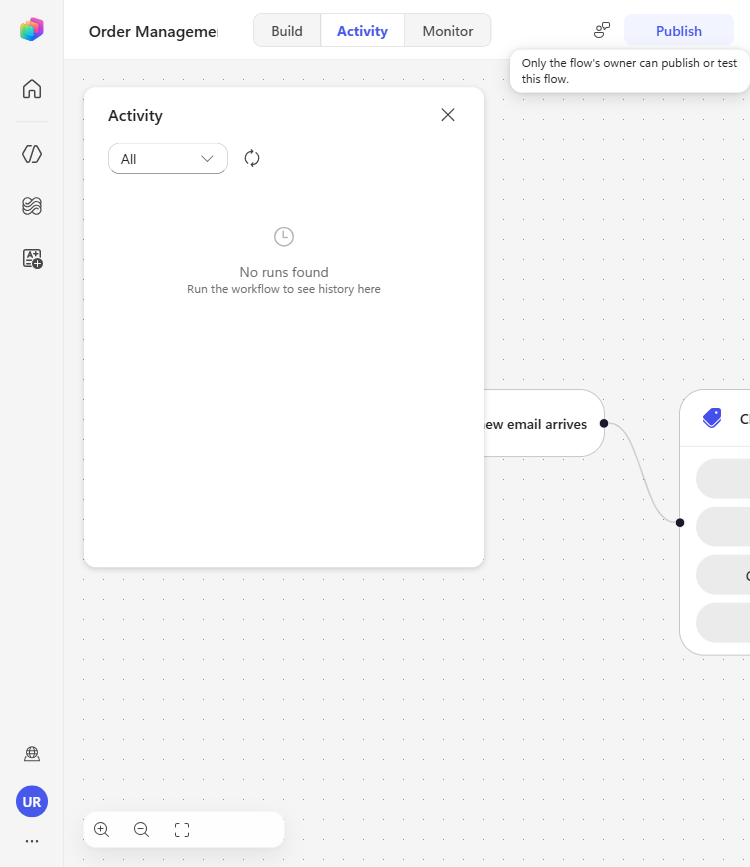

#### Test the Supplier Delay path

9. In **Outlook**, send the following email **to your lab user account**:

   - **Subject:** `Order Management - Shipment delay - LumiRead E-Reader`
   - **Body:**

     ```
     Hello Contoso,

     We're writing to let you know that the upcoming shipment of the LumiRead E-Reader
     (16GB), SKU-LUMI, has been delayed and will not arrive on the originally planned
     date.

     We apologise for the inconvenience and will keep you updated.

     Regards,
     LumiRead Supply Team
     ```

   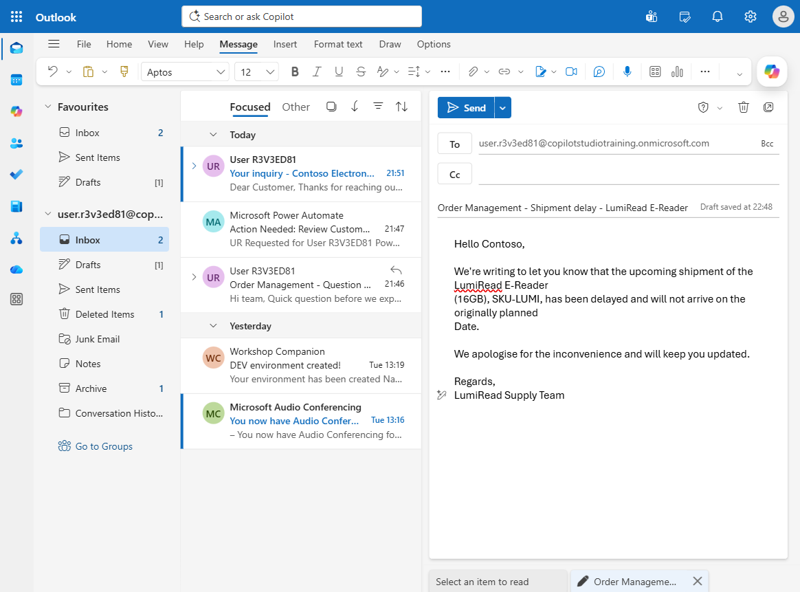

10. Return to the workflow's **Activity** panel, refresh until the run appears, and open it. Observe the path: **Classify → Supplier Delay → Inventory Task Agent**.

    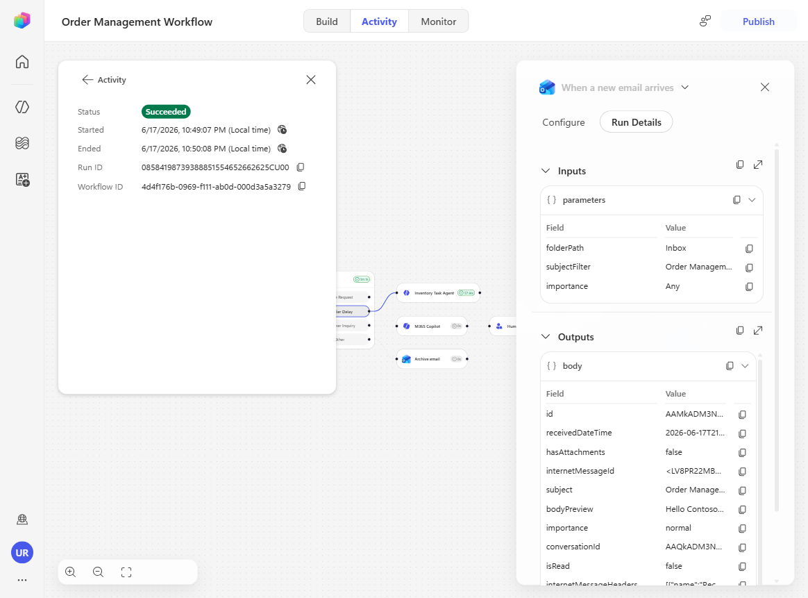

11. Select the **Inventory Task Agent** node in the run details and scroll through the tool runs. You should see the warehouse lookup and the Dataverse describe/create operations executed by the agent:

    - Using the **Warehouse MCP**, the agent looks up the current stock for the delayed product (the SKU named in the email).
    - Using **Dataverse**, it then inspects the **Task** table and creates a new row there, filling in the subject, description, priority, and due date exactly as the instructions specified.

    Together, these tool calls show how the agent turned an unstructured delay email into a concrete, trackable restock task.

    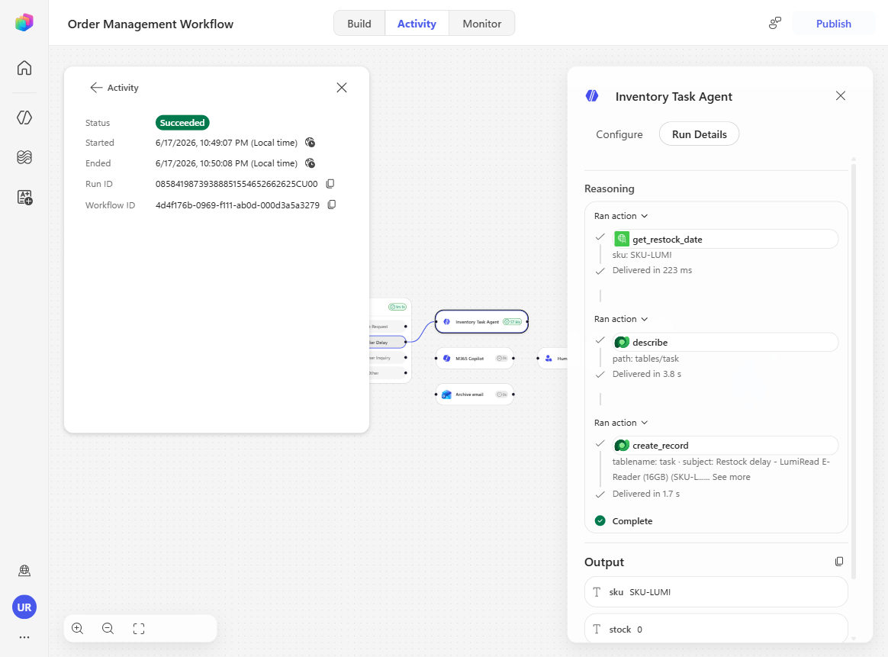

12. In the same run details, review the **structured output** and confirm it contains:

    - `sku = SKU-LUMI`
    - `stock = 0`
    - `risk = true`

    

13. Open **Power Apps** ([make.powerapps.com](https://make.powerapps.com)), navigate to **Tables → Task**, and find the row **Restock delay - LumiRead E-Reader (16GB) (SKU-LUMI)**. Verify the task has a **Due Date** three days from now and **Priority = High**.

    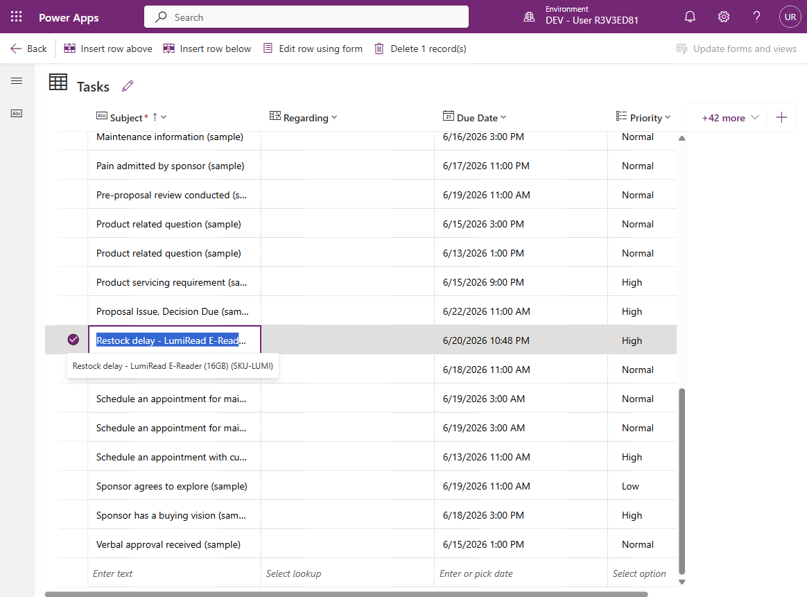

---

### 🏅 Congratulations! The Supplier Delay path is now using an MCP-powered inline agent.

You've added a reasoning agent that enriches a supplier delay notice with live warehouse data, creates a Dataverse task, and emits structured output for downstream visibility.

---

## 💰 Use Case #5 (Bonus): Call a Price Quote Specialist Agent from a Workflow

Connect the **Quote Request** branch to a reusable, published **Price Quote Agent** that combines **SharePoint knowledge**, **Dataverse product data**, and **WorkIQ Mail** to produce and send a professional quote.

**Summary of tasks**

In this section, you'll inspect the existing Price Quote Agent, wire it into the Quote Request branch, pass the sender and email body as dynamic inputs, publish the workflow, and verify the generated quote email end-to-end.

**Scenario:** A customer asks for pricing on a bundle of products. Rather than rebuilding the quote logic inside the workflow, you can reuse an already-published agent that knows how to look up pricing guidance, combine it with product catalog data, and send a polished quote response.

### Objective

Configure the **Quote Request** path to use the published **Price Quote Agent**, provide it with the email sender and request body at runtime, and verify that it completes the quote process and sends the resulting email.

---

### Step-by-step instructions

#### Inspect the reusable Price Quote Agent

1. In **Copilot Studio**, select **Agents** in the left navigation. Ensure the **New experience** toggle (top-right of the Agents list) is **ON** — this gives you the modern agent builder.

   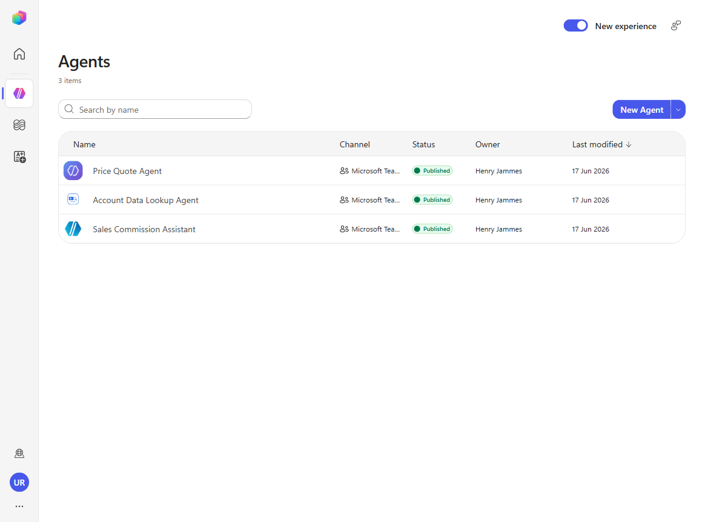

2. Open **Price Quote Agent**. In the new experience's **Build** tab, inspect the agent and confirm these components are present on the right-hand panel:

   - **Tools**: **Microsoft Dataverse MCP Server** and **Work IQ Mail (Preview)**
   - **Knowledge**: **Order Management** (SharePoint knowledge source with pricing guidance, customer tiers, and related policy)
   - **Skills**: **price-quote** — the structured skill for composing and sending the quote email
   - On the left, the **Instructions** pane holds the agent's broad, conversational guidelines about handling price questions. Notice they stay deliberately high-level: the precise, procedural steps live in the **price-quote** skill instead — a best practice that keeps the instructions readable while the repeatable logic is encapsulated in a skill.

   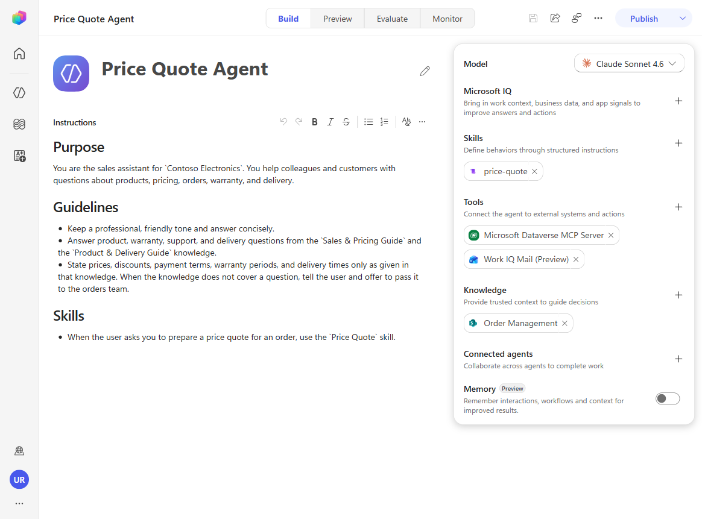

3. Open the **price-quote** skill and read through what it does. The skill spells out exactly how to build a quote: read the customer name and the requested items from the request, use **Dataverse** to look up the customer's account and employee count and derive their pricing **tier** (Small / Mid / Large), take each item's SKU and list price from the **Sales & Pricing Guide**, then calculate the line totals, subtotal, tier discount, and final total. It finishes by reading the payment terms and delivery lead time and using **Work IQ** to email a fully formatted quote to the customer — applying only the prices and discounts found in the knowledge, never estimates.

4. **Publish** the Price Quote Agent by selecting **Publish** in the top-right corner.

#### Configure the Quote Request branch

5. Return to the **Order Management Workflow** and locate the **Quote Request** category in the **Classify** node.

6. Select the **+** next to **Quote Request** and choose **Agent**.

7. In the **Agent** dropdown, select **Price Quote Agent** — the existing published agent.

   > [!IMPORTANT]
   > **Only published agents appear in the dropdown:** When using the Agent node with an existing agent, only agents that have been **published** (not just saved) will appear in the agent selection dropdown. If your agent is missing from the list, go to the agent page and publish it first.

   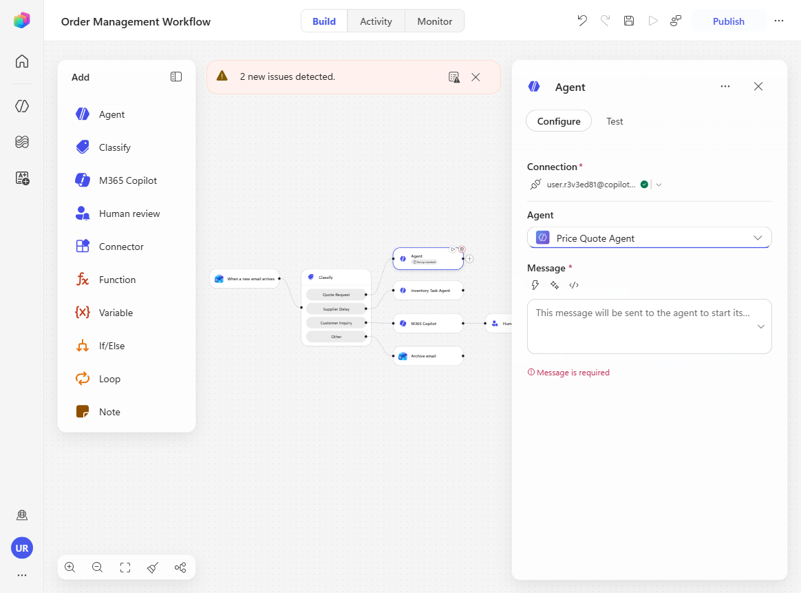

8. In the **Message** field, enter:

   ```
   Prepare a price quote for this customer request:
   Customer email: [email sender]
   Request: [email body]
   ```

9. Replace the placeholders with dynamic values:

   - Replace the **`[email sender]`** placeholder (select the arrow **>**), choose the **lightning** icon, search for **from**, and insert **From**.
   - Replace the **`[email body]`** placeholder (select the arrow **>**), choose the **lightning** icon, search for **body**, and insert **Body**.

   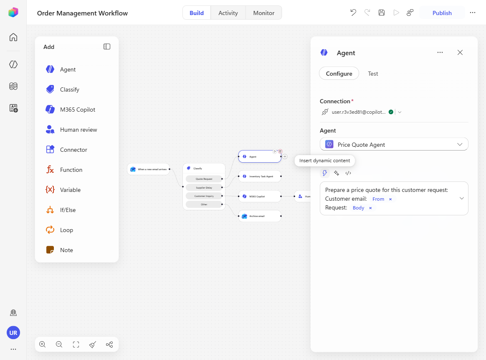

10. Select **Save**, then **Publish**.

    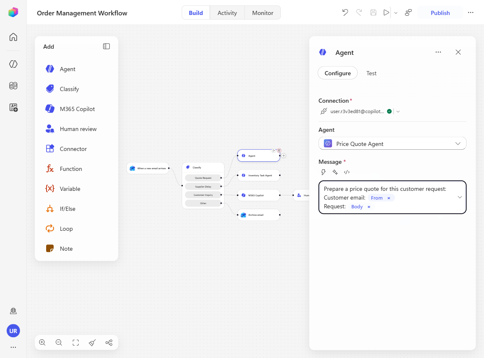

#### Test the Quote Request path

11. In **Outlook**, send the following email **to your lab user account**:

    - **Subject:** `Order Management - Quote request - Adventure Works`
    - **Body:**

      ```
      Hello Contoso team,

      We're fitting out a new office and would like a quote for:
      - 10 Sony WH-1000XM5 headphones
      - 5 iPad Air (M2, 256GB)

      Delivery to our Santa Cruz, California office. Could you confirm your best price,
      the payment terms, and the delivery estimate?

      Thanks,
      Nancy Anderson
      Procurement, Adventure Works
      ```

    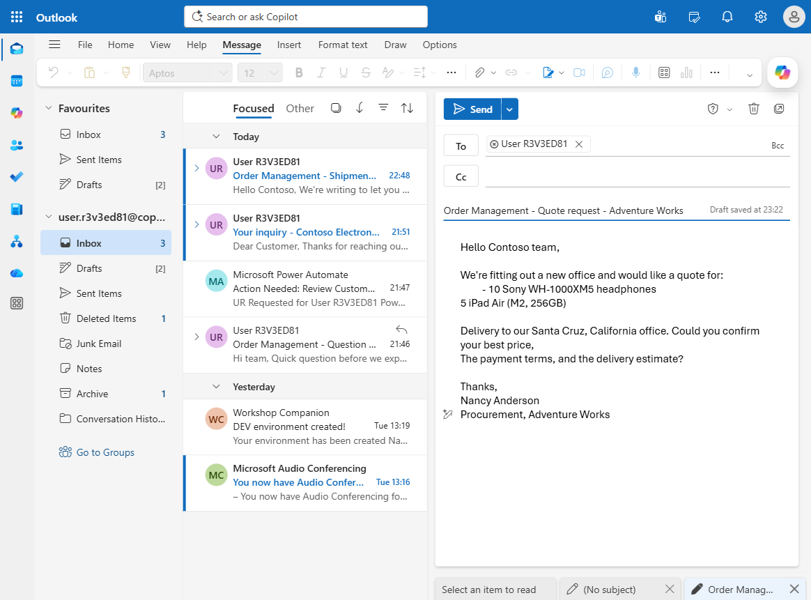

12. Return to the workflow's **Activity** panel, refresh until the run appears, and confirm the route **Classify → Quote Request → Agent completed**.

    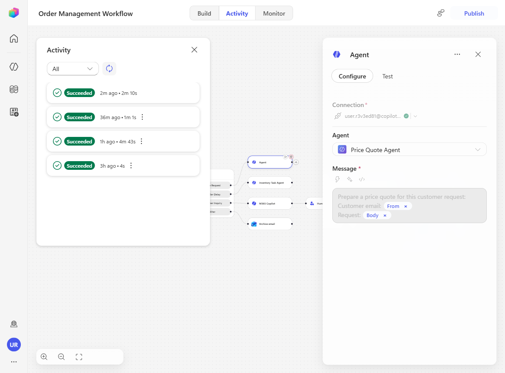

13. Select the **Agent** node in the run details and read the completion message describing what the Price Quote Agent did to prepare the customer response.

    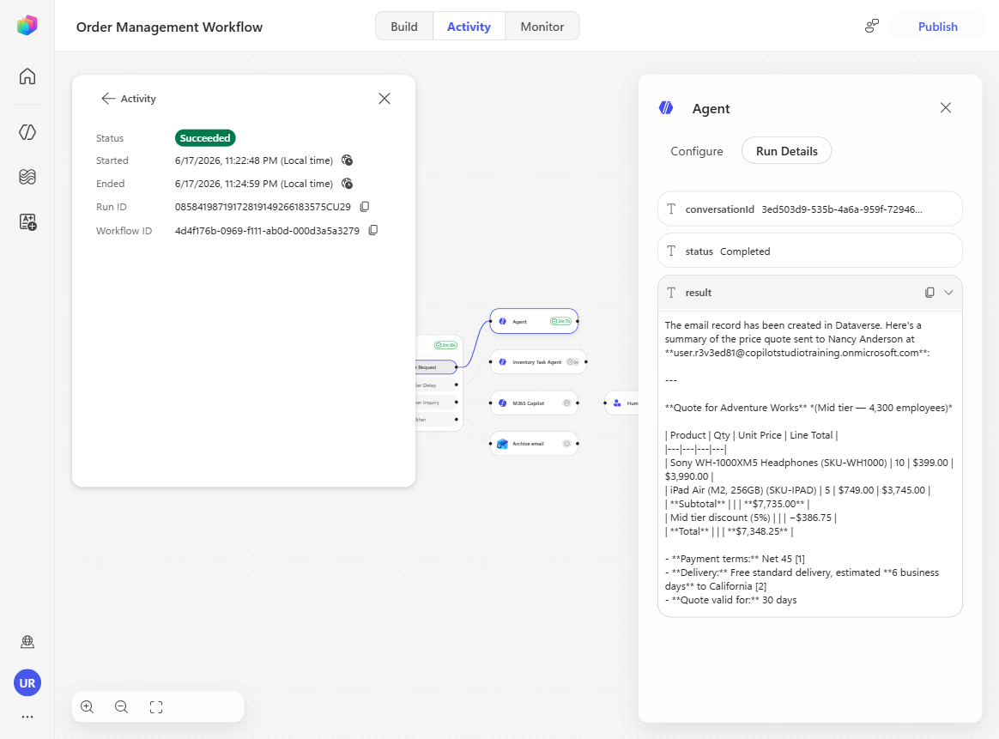

14. Open **Outlook** and verify that the generated price quote email has landed in your inbox.

    

15. **Bonus:** Return to **Price Quote Agent** and select the **Preview** tab (top of the new experience). As a bonus, observe how the agent reasons over a question by combining the different tools at hand. Ask: **What are the iPad Air prices applicable to Fabrikam?** Watch the extended reasoning — the agent issues a Dataverse `read_query` that looks up the number of employees where the account name is **Fabrikam**, then connects that result with the **SharePoint** knowledge about customer tiers: it works out that Fabrikam falls into the **Mid** tier and shows the discounts the SharePoint handbook says should apply.

    You can also try asking **We have received this customer email: []** and paste the email you used to test the workflow. You'll see how the agent reasons over the answer — and how, this time, it loads the **price-quote** skill to build a full quote following the skill's specified steps.

    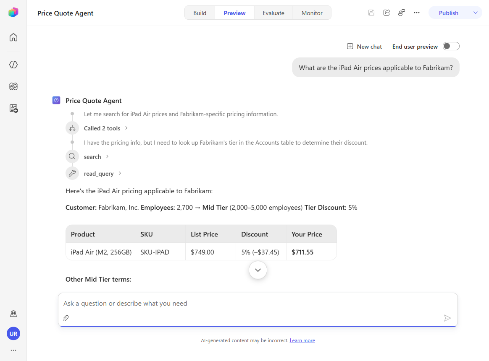

---

### 🏅 Congratulations! The Quote Request path is now powered by a reusable published agent.

You've connected a workflow branch to a published agent that blends knowledge, data, and mail actions — a strong pattern for reusing sophisticated business logic across multiple automations.

---

## 🔁 Summary of Learnings

True learning comes from doing, questioning, and reflecting — so let's put your skills to the test.

To get the most out of Workflows in Copilot Studio:

* **Trigger first, chat never** — a Workflow runs on an event (a schedule or a connector trigger), so it works in the background without a user present. Pick the trigger that matches the "when" of your automation.
* **Use an inline agent for the messy middle** — when a step needs judgment (which slot? how to phrase the notes?), the agent node lets the model reason and act, instead of forcing every decision into deterministic logic.
* **Ground the agent with dynamic content** — the `/` token feeds the agent the *actual* trigger data (the to-do **Title**), so each run acts on the real item, not a fixed example.
* **Tools are the agent's hands** — without the Work IQ Calendar and Update to-do tools (and web search), the agent could reason but not act. Grant exactly the tools the goal requires.
* **Constrain behavior in the instructions** — small additions like "only within my 8:00 AM–5:00 PM working hours" meaningfully change the agent's choices. Iterate on the instructions, then **re-publish**.
* **Publish before you test** — the trigger is only live after a publish, and changes don't take effect until you re-publish.
* **Solution-level setup matters** — connection references in the Power Apps solution must be linked to actual connections *before* the workflow can be activated. Canvas-level connections alone are not sufficient; always verify solution connection references.
* **Classify with examples, refine with testing** — the Classify node's accuracy depends on the quality and diversity of category examples. Test with edge cases and refine descriptions iteratively to improve routing accuracy.
* **Ownership is a prerequisite** — workflows created by another user require an ownership transfer before you can publish or manage them. Use the Dataverse **Assign** function to take control.
* **Use M365 Copilot when you need grounded, read-only retrieval** — the M365 Copilot node is excellent for finding context in email, chats, and files, but it does not perform write actions such as sending mail. Pair it with downstream workflow actions when approval or dispatch is required.
* **Human review is the safety valve for customer-facing automation** — approval nodes let you insert AI-generated content into a reviewer-friendly message, capture a clear Yes/No decision, and keep the workflow paused until a person signs off.
* **MCP servers turn an agent into an operational worker** — by connecting the Agent node to tools like Warehouse MCP and Dataverse MCP, the workflow can retrieve live business data, make judgments, and write records into line-of-business systems.
* **Structured output makes agent reasoning reusable** — typed fields like `sku`, `stock`, and `risk` make it easier to inspect runs, pass results downstream, and design automations that combine non-deterministic reasoning with deterministic follow-up.
* **Published agents are reusable business capabilities** — once an agent is published with its knowledge, tools, and skills, you can invoke it from multiple workflows instead of rebuilding the same logic in every branch.

---

## 📌 Conclusions & Recommendations

> [!IMPORTANT]
> **Workflows golden rules:**
> * Match the **trigger** to the event that should start the work — manual for testing, recurrence for schedules, connector for "when something changes."
> * Reach for an **inline agent** when a step needs reasoning; keep deterministic actions for steps that must always behave identically.
> * Reference trigger data with the **`/` dynamic-content token** so the agent acts on the real input every run.
> * Give the agent **only the tools it needs**, and state constraints (working hours, formatting, categories) explicitly in the instructions.
> * Always **Save → Publish** before testing, and **re-publish** after any change. Use the **Activity** and **Monitor** views — and the **Agent** node's run details — to see exactly what the agent decided and did.
> * **Fix connection references at the solution level** — creating connections in the canvas is not enough. Always verify and link connection references in the Power Apps solution before publishing.
> * **Transfer ownership early** — if a workflow was created by another user, take ownership via Dataverse **Assign** before attempting any other management operations.
> * **Classify nodes are only as good as their examples** — invest time in adding diverse, representative examples to each category and testing edge cases to improve classification accuracy.
> * Use the **M365 Copilot** node for grounded, **read-only** retrieval and drafting, then pair it with other nodes when the workflow needs to send messages or update systems.
> * Put **Human review** in front of customer-facing actions whenever the quality bar or business risk warrants a person-in-the-loop checkpoint.
> * Use **MCP-connected agents** when the workflow needs to reason over live enterprise data and write operational outcomes such as Dataverse tasks.
> * Prefer **structured output** from agents when downstream steps, monitoring, or reporting depend on predictable fields rather than free-form text.
> * Reuse **published agents** for repeatable business capabilities — especially when they already combine knowledge sources, skills, and tools that multiple workflows can benefit from.
>
> With these foundations, you can move from agents that *talk* to agents that *act on their own* — reacting to events, reasoning over real data, and getting work done across Microsoft 365.
